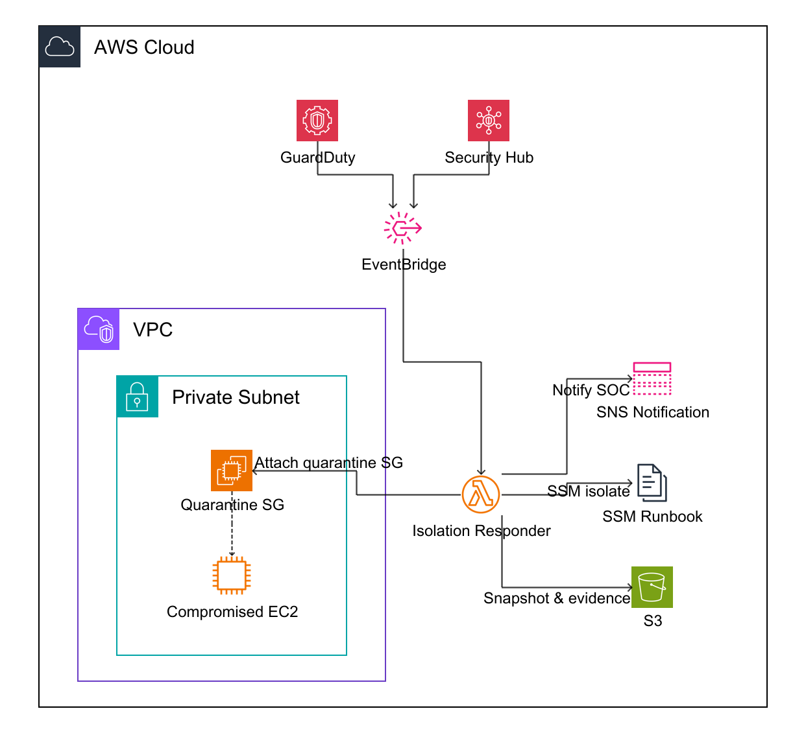

# Automated EC2 Isolation on GuardDuty and Security Hub Findings

If an EC2 instance is compromised, the fastest way is to stop lateral movement.



## 1. Detection Layer
Before we can isolate anything, we need to establish a reliable signal. We will focus on two primary detection sources that is GuardDuty and Security Hub.

### 1.1 GuardDuty
GuardDuty produces findings for suspicious behavior on EC2, such as credential exfiltration, crypto mining, or port sweeps. In this lab, we will configure our system to listen for EC2-related findings that exceed a specific severity threshold.

### 1.2 Security Hub
Security Hub aggregates findings across multiple AWS services and third party tools. This is useful when you want a single response pipeline for multiple detectors.

## 2. Automation
We want deterministic routing from findings → remediation.

### 2.1 EventBridge trigger pattern
We will only filter out those HIGH and CRITICAL severities.

```json
{
  "source": ["aws.securityhub"],
  "detail-type": ["Security Hub Findings"],
  "detail": {
    "findings": {
      "Resources": {
        "Type": ["AwsEc2Instance"]
      },
      "Severity": {
        "Label": ["HIGH", "CRITICAL"]
      },
      "Workflow": {
        "Status": ["NEW"]
      }
    }
  }
}
```

## 3. Remediation
We will isolate the instance when the instance is breached

### 3.1 Quarantine Security Group
The fastest containment method for a single instance is to replace its security groups with a Quarantine SG.

Set the Security group's inbound and outbound DENY ALL.

### 3.2 NACL?
Potentially we can block the ip address of the attacker who breached the system until case solved by setting the deny rule to that ip address.

### 3.3 Incident Response Logic after finding
1. Snapshot the breached instance through EBS snapshot to investigate the incident later.
2. Optionally, use SSM to collect logs, processor list before quarantine and tag the instance.
2. Replace instance security groups with the quarantine Security Group
3. Notify SOC team


# References
- https://docs.aws.amazon.com/guardduty/latest/ug/guardduty_finding-types-ec2.html
- https://docs.aws.amazon.com/eventbridge/latest/userguide/eb-event-patterns.html
- https://docs.aws.amazon.com/securityhub/latest/userguide/securityhub-cloudwatch-events.html
- https://docs.aws.amazon.com/AWSEC2/latest/UserGuide/ec2-security-groups.html
