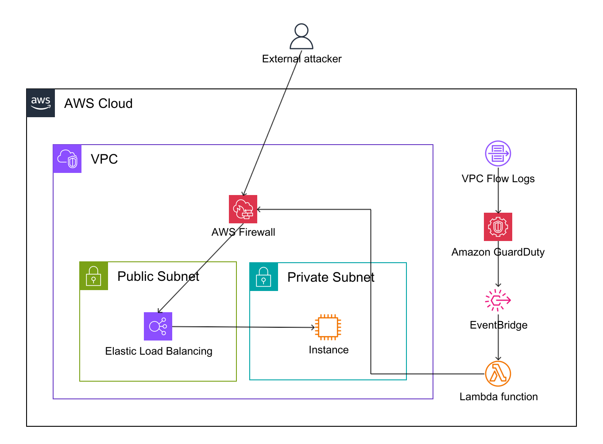

# Port Scan leads to Automated IP Ban System

Hacking starts from vulnerability scanning done through nmap. We can prevent this from the start by blocking network bruteforce scanning.



## 1 Detection Layer
We will first establish the detection mechanisms. An automated response is only as good as its triggers.

## 1.1 Amazon GuardDuty with VPC FlowLogs
For internal threats or compromised instances scanning outwards, we use GuardDuty. We are specifically looking for the Recon:EC2/Portscan or Recon:EC2 PortProbeUnprotectedPort finding type.

## 2 Automation
Next, we need to route these findings to our remediation logic. We use Amazon EventBridge to filter the noise and trigger our response workflow.

### 2.1 Eventbridge trigger pattern
```json
{
  "source": ["aws.guardduty"],
  "detail-type": ["GuardDuty Finding"],
  "detail": {
    "type": ["Recon:EC2/Portscan", "Recon:EC2 PortProbeUnprotectedPort"],
    "resource": {
      "resourceType": ["Instance"]
    },
    "severity": [
      {
        "numeric": [">=", 4]
      }
    ]
  }
}
```

## 3 Remediation
GuardDuty findings are routed through EventBridge to trigger AWS Lambda, which updates AWS Network Firewall rules to block the attacker's source IP.

### 3.1 Why not NACL?
NACLs have a hard limit on the number of rules of default 20! It's not scalable in large enterprise.

## 4 Conclusion
After writing this, I found this [aws security blog article](https://aws.amazon.com/blogs/security/automatically-block-suspicious-traffic-with-aws-network-firewall-and-amazon-guardduty/) which says the same thing....RIP

# References
- https://docs.aws.amazon.com/guardduty/latest/ug/guardduty_finding-types-ec2.html#impact-ec2-portsweep
- https://aws.amazon.com/blogs/security/automatically-detect-and-block-low-volume-network-floods/
- https://aws.amazon.com/blogs/security/automatically-block-suspicious-traffic-with-aws-network-firewall-and-amazon-guardduty/
- https://aws.plainenglish.io/aws-threat-detection-and-automated-remediation-8df09d9dc924