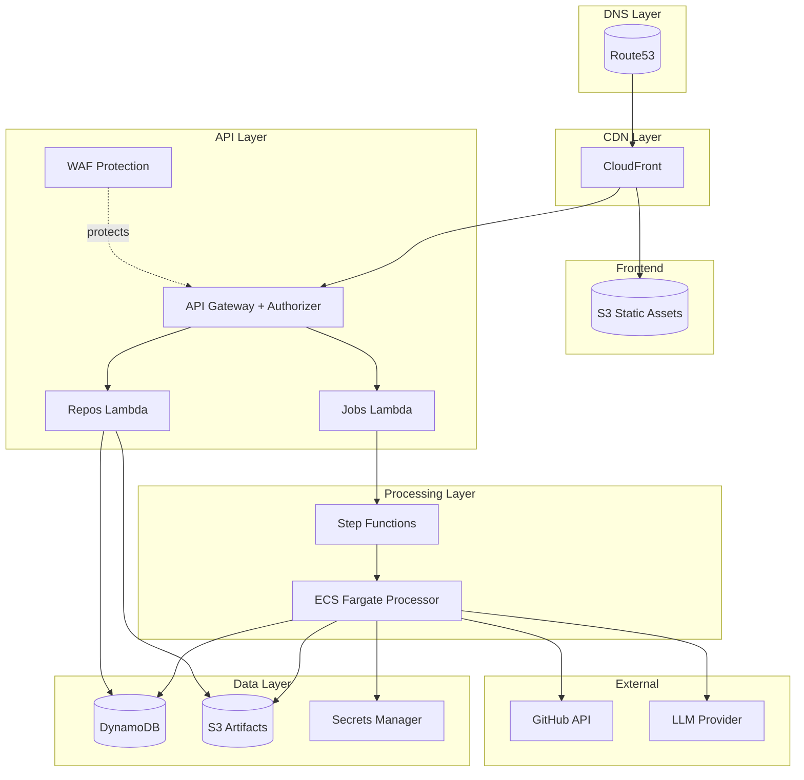
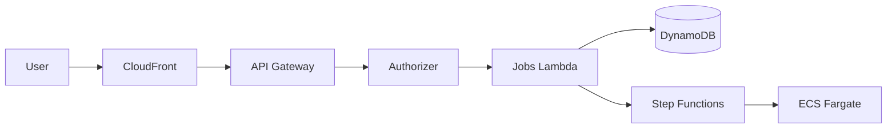
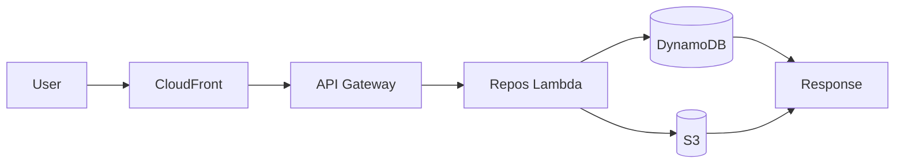
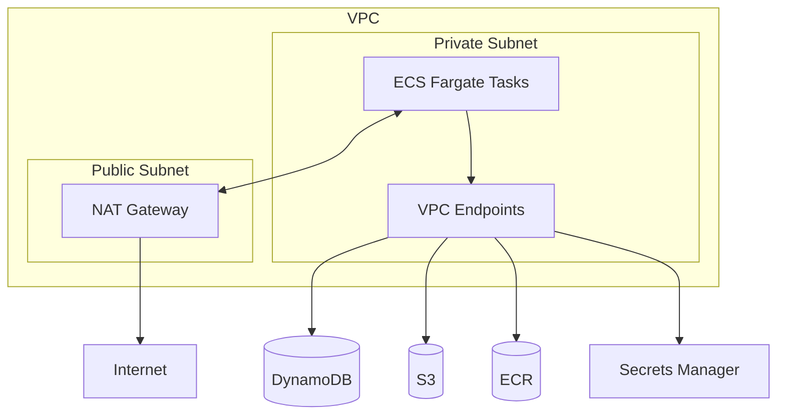
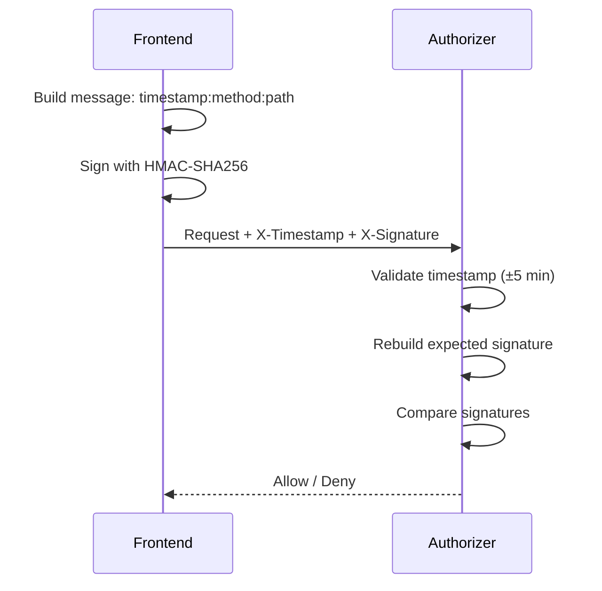

# OpenRepoWiki Security Architecture

## Overview

OpenRepoWiki is a fully serverless application that automatically generates wiki documentation for GitHub repositories using LLM-powered code analysis.



---

## Workflow

### 1. Frontend Layer

| Component | Purpose |
|-----------|---------|
| **Route53** | DNS management. Routes `openrepowiki.xyz` → CloudFront, `api.*` → API Gateway |
| **ACM** | SSL/TLS certificates for custom domains (auto-renewed) |
| **CloudFront** | Global CDN with SSL termination. Caches static assets and routes API requests |
| **S3 Frontend** | Hosts the React + Vite static build with public-read access |

### 2. API Layer

| Component | Purpose |
|-----------|---------|
| **API Gateway** | REST API with resource-based routing (`/jobs`, `/repos`) |
| **Lambda Authorizer** | Validates HMAC-signed requests for protected endpoints (POST) |
| **Jobs Handler** | Creates analysis jobs and returns status (`POST /jobs`, `GET /jobs/{id}`) |
| **Repos Handler** | Returns repository tree and page content (`GET /repos/{id}/tree`, `/page`) |

### 3. Processing Layer

| Component | Purpose |
|-----------|---------|
| **Step Functions** | Orchestrates the multi-stage processing workflow with retries and error handling |
| **ECS Fargate** | Runs the containerized processor that fetches code and generates summaries |
| **LLM Provider** | External API (DeepSeek, Gemini, etc.) for AI-powered code summarization |

### 4. Data Layer

| Component | Purpose |
|-----------|---------|
| **DynamoDB Main** | Stores repositories, branches, and tree nodes |
| **DynamoDB Jobs** | Tracks job status and progress for real-time updates |
| **S3 Artifacts** | Stores large summaries that exceed DynamoDB item limits |

---

## Request Flow

### Creating an Analysis Job



1. **User submits repository URL** via frontend
2. **Frontend signs the request** with HMAC-SHA256 (timestamp + method + path)
3. **Lambda Authorizer validates** the signature and timestamp
4. **Jobs Handler creates job** in DynamoDB with PENDING status
5. **Step Functions starts** the processing workflow
6. **ECS Fargate runs** the processor container


### Viewing Repository Wiki



1. **User requests tree** → Returns folder structure with summary refs
2. **User clicks item** → Fetches full summary from DynamoDB or S3


## Security Architecture

### Network Security



| Layer | Implementation |
|-------|----------------|
| **VPC Isolation** | ECS tasks run in private subnets with no public IPs |
| **NAT Gateway** | Allows outbound traffic to GitHub API and LLM providers |
| **VPC Endpoints** | Private connectivity to AWS services (no internet routing) |

### API Security

| Layer | Protection |
|-------|------------|
| **WAF** | Blocks malicious requests with AWS Managed Rules |
| **Rate Limiting** | 100 requests/5min for job creation, 2000/5min for reads |
| **HMAC Signing** | All POST requests require cryptographic signature |
| **CORS** | Restricted to `openrepowiki.xyz` origin only |

### WAF Rules

```
Priority 1: AWSManagedRulesCommonRuleSet     → Block common attacks (XSS, SQLi)
Priority 2: AWSManagedRulesKnownBadInputsRuleSet → Block known malicious patterns
Priority 3: RateLimitJobCreation             → 100 req/5min for POST /jobs
Priority 4: RateLimitGeneral                 → 2000 req/5min for all requests
```

### Request Authentication

Protected endpoints (POST /jobs) use HMAC-SHA256 signing:



### Data Security

| Layer | Implementation |
|-------|----------------|
| **Encryption at Rest** | DynamoDB uses server-side encryption, S3 uses AES-256 |
| **Secrets Management** | API keys stored in AWS Secrets Manager, not environment variables |
| **S3 Block Public Access** | All public access blocked. Access via signed URLs only |
| **Point in Time Recovery** | DynamoDB PITR enabled for data protection |

### IAM Permissions

Each component has least-privilege access:

| Component | Permissions |
|-----------|-------------|
| **Jobs Lambda** | DynamoDB (read/write jobs), Step Functions (start execution) |
| **Repos Lambda** | DynamoDB (read main table), S3 (read artifacts) |
| **ECS Task** | DynamoDB (full access), S3 (read/write), Secrets Manager (read) |
| **Authorizer Lambda** | Secrets Manager (read signing key only) |


## Monitoring

| Service | Logs |
|---------|------|
| **Lambda** | `/aws/lambda/{function-name}` |
| **ECS** | `/ecs/{cluster}-processor` |
| **API Gateway** | Access logs + execution logs |
| **WAF** | Blocked requests, rate limit hits |