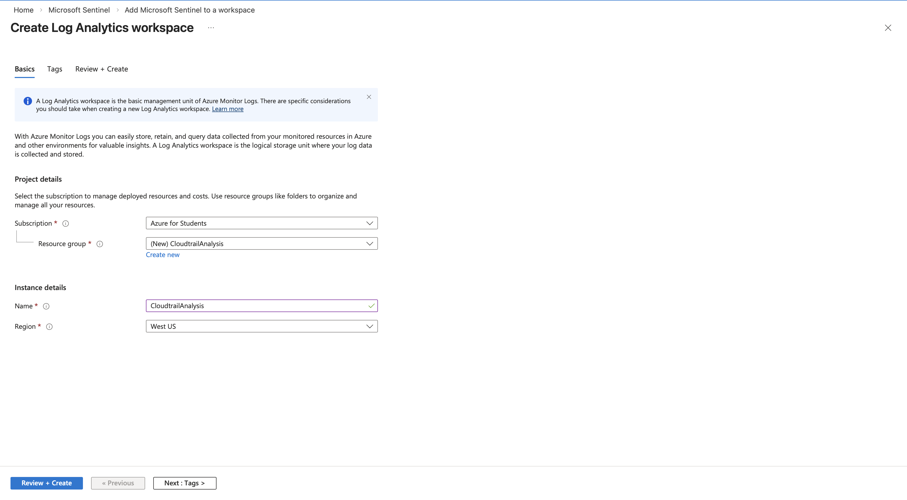
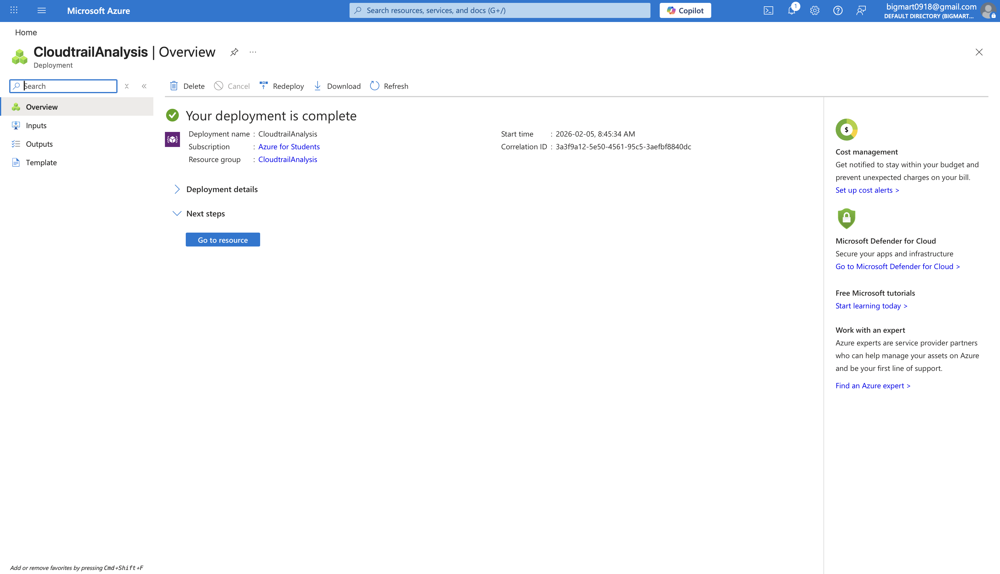
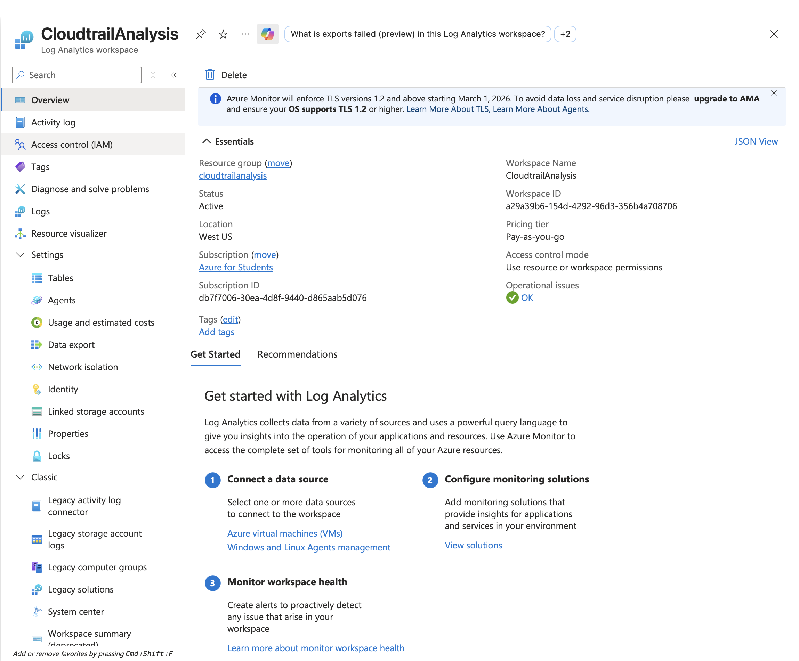
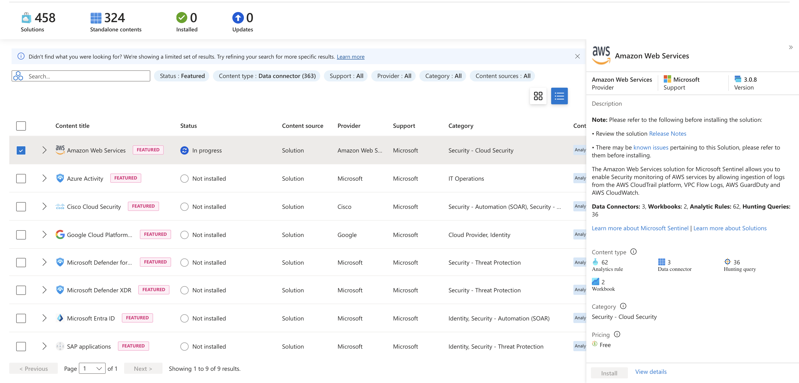
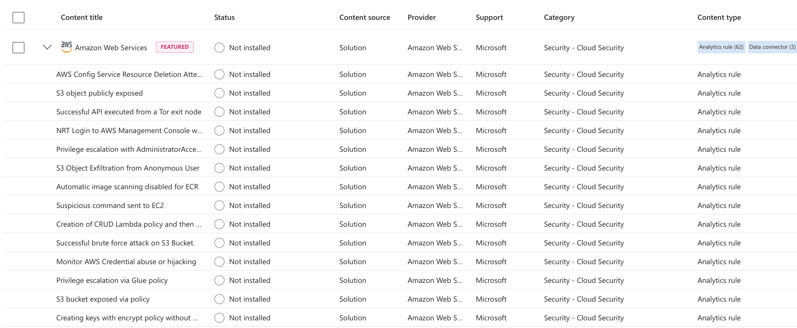
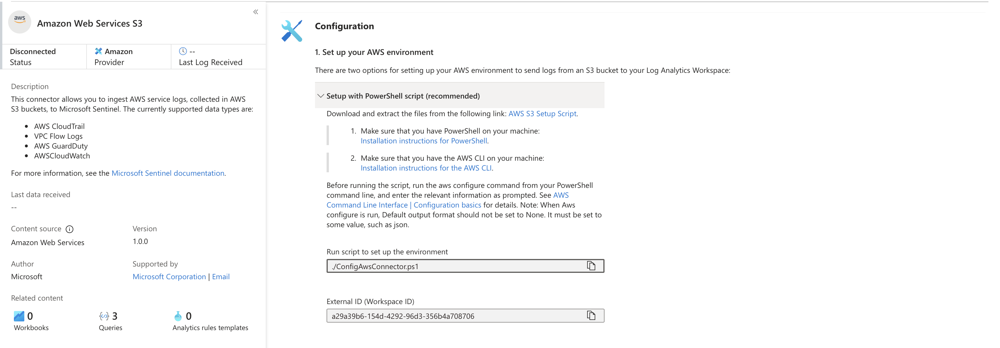
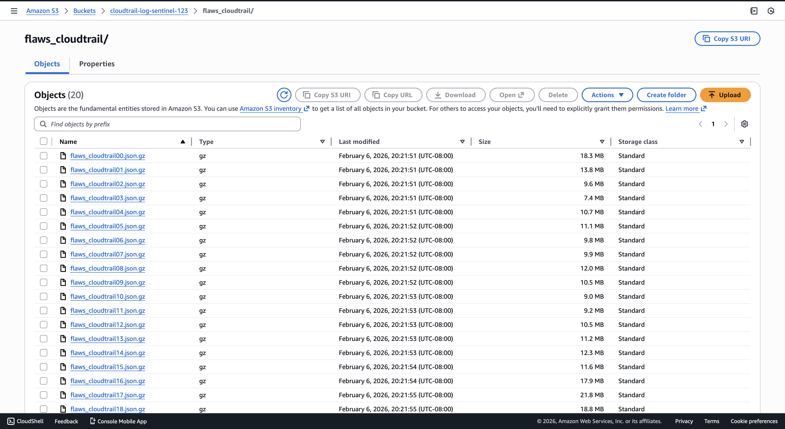
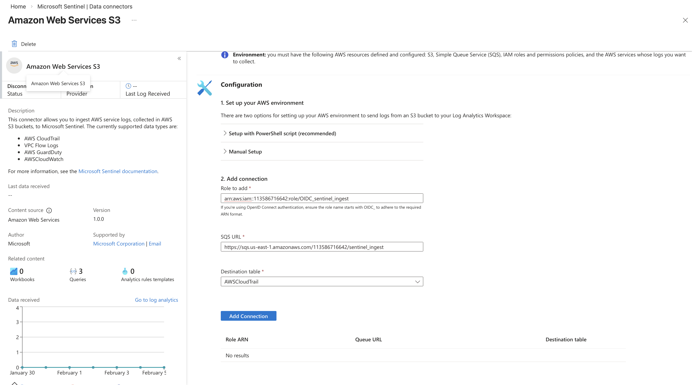
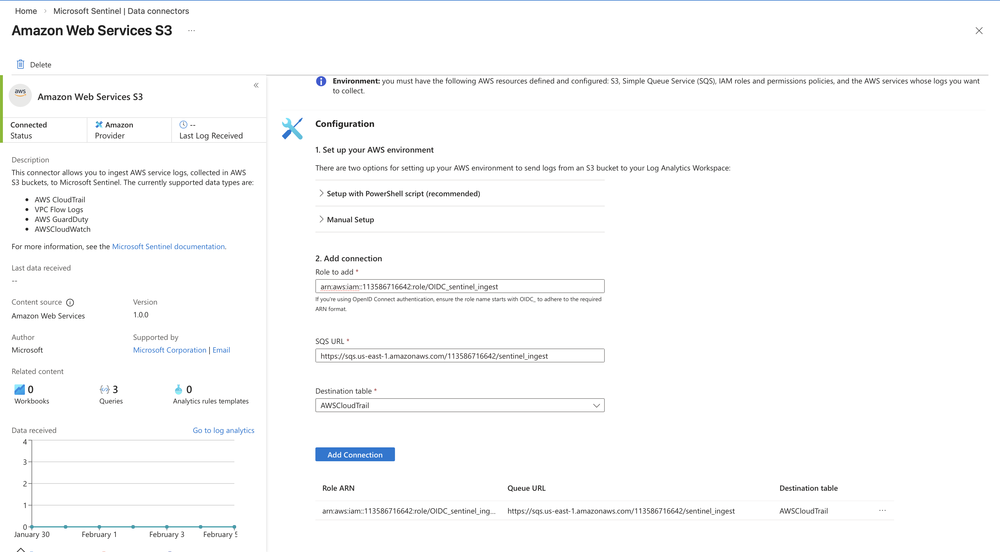
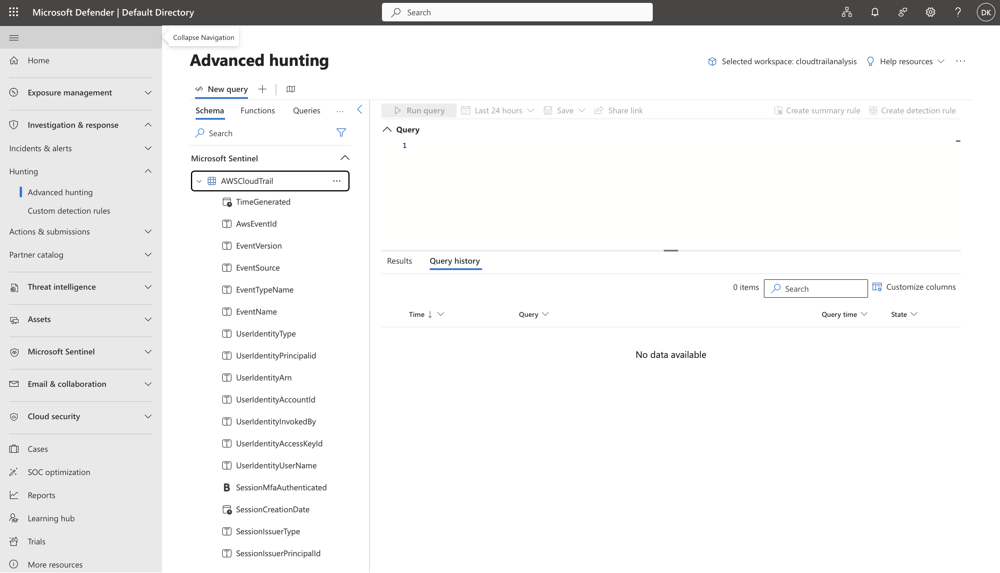

# flaw.cloud CloudTrail Analysis

[This dataset](https://summitroute.com/blog/2020/10/09/public_dataset_of_cloudtrail_logs_from_flaws_cloud/) provides AWS attack techniques across various levels. Good for testing my knowledge!


We will ingest these logs into Microsoft Sentinel and learn what is Sentinel and how to use it

## 1. Getting started with Microsoft Sentinel

### 1.1 Creating the workspace
Microsoft Sentinel requires a Log Analytics workspace to store and query ingested data. So create the workspace. Quite shitty that Azure need to do everything manually.... I miss AWS!!!


Create a new Log Analytics workspace


The deployment completes successfully. Let's begin configuring Sentinel.



### 1.1 Install AWS Solution from Content Hub

Sentinel Data connector provides pre built solutions with data connectors, analytics rules, and hunting queries. We need the Amazon Web Services solution to parse CloudTrail log format.


Select it and click install.



#### 1.1.1 Configure AWS S3 Data Connector


Open the Amazon Web Services S3 data connector. This connector ingests AWS CloudTrail, VPC Flow Logs, GuardDuty, and CloudWatch logs from S3 buckets.

Let's use the given powershell script to ingest our data.... Sadly we need to be using S3 to feed the data to SIEM

#### 1.1.2 Store Logs in AWS S3

The connector expects CloudTrail logs in an S3 bucket. Upload the flaw.cloud dataset files to an S3 bucket accessible by the connector role.


Create an S3 bucket and upload all log files shown.


```
pwsh ./ConfigAwsConnector.ps1                                                                                                                                                            ─╯


Starting ConfigAwsConnector at: 02/06/2026 19:12:54
  Log created: /Users/daehyung/Downloads/ConfigAwsS3DataConnectorScripts/ConfigAwsComToAzureCom/Logs/AwsS3-02061912.csv


To begin you will choose the AWS logs to configure.

Please enter the AWS log type to configure (VPC, CloudTrail, GuardDuty, CloudWatch, CustomLog): CloudTrail

Checking AWS CLI configuration...

...

Please enter role name. If you have already configured an assume role for Azure Sentinel, use the same role name: OIDC_sentinel_ingest

...

S3 bucket definition.

Please enter S3 bucket name (between 3 and 63 characters long): cloudtrail-log-sentinel-123
  Using S3 Bucket name: cloudtrail-log-sentinel-123

...

Creating SQS queue:

Please enter Sqs Name: sentinel_ingest
  Using Sqs name: sentinel_ingest

...


Please enter the event notifications name: ingest
  Using event notification name: ingest
Event notificaion prefix definition, to Limit the notifications to objects with key starting with specified characters.

The default prefix is 'AWSLogs/113586716642/CloudTrail/'.
  Do you want to override the event notification prefix? [y/n]: y

Please enter the event notifications prefix: flaws_cloudtrail
  Using event notification prefix: flaws_cloudtrail


CloudTrail definition

Please enter CloudTrail name: flaws_cloudtrail
  Using CloudTrail name: flaws_cloudtrail

Trail 'flaws_cloudtrail' is already configured. Do you want to override the bucket destination? [y/n]: y


Do you want to enable the CloudTrail data events? [y/n]: y

Do you want the Trail to be multi-region? [y/n]: n


Use the values below to configure the Amazon Web Service S3 data connector in the Azure Sentinel portal.

Role Arn: arn:aws:iam::<>:role/OIDC_sentinel_ingest
Sqs Url: https://sqs.us-east-1.amazonaws.com/<>/sentinel_ingest
Destination Table: AWSCloudTrail


Press any key to continue...
 ```


Copy the role arn, sqs url and paste it



Done!



## 1.2 Validate

Check the table exists by typing here



```kql
AWSCloudTrail
| count
```
if the row is around 1.9M, then that's successful!